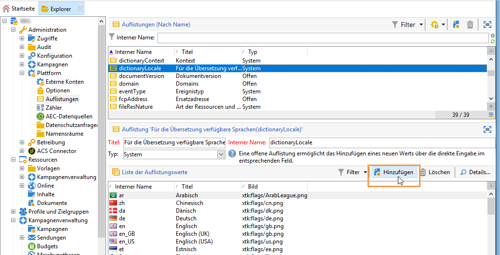

# Webformular übersetzen{#translating-a-web-form}

Sie können eine Webanwendung in mehrere Sprachen lokalisieren.

Übersetzungen können direkt in der Adobe Campaign-Konsole durchgeführt werden (siehe [Übersetzungen im Editor verwalten](#managing-translations-in-the-editor)). Andernfalls können auch Strings exportiert und wieder importiert werden, um die Übersetzung extern durchzuführen (siehe [Übersetzungen extern durchführen](#externalizing-translation)).

Die Liste der standardmäßig verfügbaren Übersetzungssprachen finden Sie in [Anzeigesprache in Formularen ändern](#changing-forms-display-language).

Die Webanwendung ist in einer Bearbeitungssprache erstellt: Dies ist die Referenzsprache für die Eingabe von Titeln und anderen zu übersetzenden Inhalten.

Die Standardsprache ist die Sprache, in der die Webanwendung dargestellt wird, wenn keine Spracheinstellung zu ihrer Zugriffs-URL hinzugefügt wird.

>[!NOTE]
>
>Standardmäßig entsprechen die Bearbeitungssprache und die Standardsprache der Konsolensprache.

## Sprachen wählen {#choosing-languages}

Um eine oder mehr Zielsprachen zu definieren, wählen Sie in der Webanwendung die Schaltfläche **[!UICONTROL Eigenschaften]** und dann den Tab **[!UICONTROL Lokalisierung]** aus. Wählen Sie dann die Schaltfläche **[!UICONTROL Hinzufügen]** aus, um eine neue Zielsprache für die Webanwendung zu definieren.

>[!NOTE]
>
>In diesem Fenster können Sie auch die Standardsprache und die Bearbeitungssprache ändern.


Wenn Sie zu einer Webanwendung Zielsprachen hinzufügen (oder wenn die Standardsprache oder die Bearbeitungssprache unterschiedlich sind), erscheint im Tab **[!UICONTROL Bearbeiten]** der Untertab **[!UICONTROL Übersetzungen]**, über den Übersetzungen verwaltet werden können.

Adobe Campaign besitzt ein Tool zur Übersetzung und Verwaltung mehrsprachiger Übersetzungen. Mit diesem Editor können Sie die zu übersetzenden oder zu validierenden Strings anzeigen, Übersetzungen direkt in die Benutzeroberfläche eingeben oder Zeichenfolgen importieren/exportieren, um Übersetzungen extern anfertigen zu lassen.

## Übersetzungen im Editor verwalten {#managing-translations-in-the-editor}

### Strings abrufen {#collecting-strings}

Im Tab **[!UICONTROL Übersetzungen]** können Sie die Übersetzungen der Zeichenfolgen der Webanwendung eingeben.

Wenn Sie diesen Tab das erste Mal öffnen, sind keine Daten vorhanden. Wählen Sie den Link **[!UICONTROL Zu übersetzende Strings abrufen]** aus, um die Strings in der Webanwendung zu aktualisieren.

Adobe Campaign ruft Titel von Feldern und Strings ab, die im Tab **[!UICONTROL Texte]** aller statischen Elemente definiert wurden: HTML-Bausteine, JavaScript usw. Statische Elemente werden in [Statische Elemente in einem Webformular](../../web/using/static-elements-in-a-web-form.md) detailliert erläutert.


>[!CAUTION]
>
>Dieser Vorgang kann je nach dem zu verarbeitenden Datenvolumen mehrere Minuten dauern.
> 
>Wenn eine Warnung mit dem Hinweis erscheint, dass einige Übersetzungen im System-Wörterbuch fehlen, lesen Sie [Systemstrings übersetzen](#translating-the-system-strings).

Immer wenn ein String übersetzt wurde, wird die Übersetzung zum Übersetzungswörterbuch hinzugefügt.

Wenn beim Abrufen festgestellt wird, dass eine Übersetzung bereits vorhanden ist, wird diese Übersetzung in der Spalte **[!UICONTROL Text]** des Strings angezeigt. Der Status des Strings ändert sich in **[!UICONTROL Übersetzt]**.

Bei noch nicht übersetzten Zeichenfolgen ist das Feld **[!UICONTROL Text]** leer und der Status lautet **[!UICONTROL Zu übersetzen]**.

### Strings filtern {#filtering-strings}

Standardmäßig wird jede Zielsprache der Webanwendung angezeigt. Es gibt zwei Standardfilter: Sprache und Status. Wählen Sie die Schaltfläche **[!UICONTROL Filter]** und dann die Option **[!UICONTROL Nach Sprache oder Status]** aus, um die jeweiligen Dropdown-Listen anzuzeigen. Sie können auch einen erweiterten Filter erstellen. Weiterführende Informationen dazu finden Sie auf [dieser Seite](../../platform/using/creating-filters.md#creating-an-advanced-filter).


Gehen Sie zur Dropdown-Liste **[!UICONTROL Sprache]**, um die Übersetzungssprache auszuwählen.

Wenn Sie nur unübersetzte Strings anzeigen möchten, wählen Sie in der Dropdown-Liste **[!UICONTROL Status]** die Option **[!UICONTROL Zu übersetzen]** aus. Sie können auch nur übersetzte oder validierte Strings anzeigen.

### Strings übersetzen {#translating-strings}

1. Um ein Wort zu übersetzen, führen Sie einen Doppelklick auf die entsprechende Zeile in der Liste der Strings aus.

   

   Im oberen Bereich des Fensters wird der Quellstring angezeigt.

1. Geben Sie im unteren Bereich die Übersetzung ein. Aktivieren Sie zur Validierung die Option **[!UICONTROL Validierte Übersetzung]**.

   >[!NOTE]
   >
   >Die Validierung von Übersetzungen ist optional und blockiert nicht den Vorgang.

   Nicht-validierte Übersetzungen werden als **[!UICONTROL Übersetzt]** angezeigt. Validierte Übersetzungen werden als **[!UICONTROL Validiert]** angezeigt.

## Übersetzungen extern durchführen {#externalizing-translation}

Zeichenfolgen können exportiert und dann wieder importiert werden, um sie mit einem anderen Tool als Adobe Campaign zu übersetzen.

>[!CAUTION]
>
>Verwenden Sie nach dem Export der Strings nicht mehr das integrierte Übersetzungs-Tool. Dies würde beim erneuten Import der Übersetzungen einen Konflikt hervorrufen, wodurch die Übersetzungen verloren gehen würden.

### Dateien exportieren {#exporting-files}

1. Wählen Sie die Webanwendung(en) aus, deren Strings Sie exportieren möchten. Führen Sie dann einen Rechtsklick darauf aus und wählen Sie **[!UICONTROL Aktionen > Strings zur Übersetzung exportieren...]** aus.

   

1. Wählen Sie eine **[!UICONTROL Exportstrategie]** aus :

   * **[!UICONTROL Eine Datei je Sprache]**: Beim Export wird für jede Übersetzungssprache eine Datei erstellt. Diese Datei wird für alle ausgewählten Webanwendungen verwendet.
   * **[!UICONTROL Eine Datei je Webanwendung (nur CSV)]**: Beim Export wird für jede ausgewählte Webanwendung eine Datei erstellt. In jeder Datei sind alle Übersetzungssprachen enthalten.

      >[!NOTE]
      >
      >Dieser Exporttyp ist nicht für XLIFF-Exporte verfügbar.

   * **[!UICONTROL Eine Datei je Sprache und Webanwendung]**: Beim Export werden mehrere Dateien erzeugt. Jede Datei enthält eine einzige Sprache und wird nur für eine Webanwendung verwendet.
   * **[!UICONTROL Eine Datei für alles (nur CSV)]**: Beim Export wird eine einzige mehrsprachige Datei für alle Webanwendungen erzeugt. Sie enthält alle Sprachen für alle ausgewählten Webanwendungen.

      >[!NOTE]
      >
      >Dieser Exporttyp ist nicht für XLIFF-Exporte verfügbar.

1. Wählen Sie dann den **[!UICONTROL Zielordner]**, in dem die Dateien gespeichert werden sollen.
1. Wählen Sie das Dateiformat (**[!UICONTROL CSV]** oder **[!UICONTROL XLIFF]**) und danach **[!UICONTROL Start]** aus.


>[!NOTE]
>
>Die Namen der Exportdateien werden automatisch erstellt. Wenn derselbe Export mehrmals durchgeführt wird, werden die vorhandenen Dateien durch die neuen ersetzt. Wenn Sie die vorherigen Dateien behalten möchten, ändern Sie den **[!UICONTROL Zielordner]** und wählen Sie erneut **[!UICONTROL Start]** aus, um den Export durchzuführen.

Wenn Sie Dateien im **CSV-Format** exportieren, wird jede Sprache mit einem Status und einem Validierungsstatus verknüpft. In der Spalte **Validieren?** können Sie eine Übersetzung validieren. Diese Spalte kann die Werte **Ja** oder **Nein** enthalten. Wie beim integrierten Editor (siehe [Übersetzungen im Editor verwalten](#managing-translations-in-the-editor)) ist das Validieren von Übersetzungen optional und blockiert den Fortschritt nicht.

### Dateien importieren {#importing-files}

Nach dem Abschluss der externen Übersetzung können Sie die übersetzten Dateien importieren.

1. Gehen Sie zur Liste der Webanwendungen, klicken Sie mit der rechten Maustaste und wählen Sie dann **[!UICONTROL Aktionen > Übersetzte Strings importieren...]** aus.

   >[!NOTE]
   >
   >Es ist nicht erforderlich, die von der Übersetzung betroffenen Webanwendungen auszuwählen. Platzieren Sie den Cursor an einer beliebigen Stelle in der Liste der Webanwendungen.

   

1. Wählen Sie die zu importierende Datei und dann **[!UICONTROL Upload]** aus.

   

>[!NOTE]
>
>Externe Übersetzungen haben immer Priorität gegenüber internen Übersetzungen. Im Fall eines Konflikts wird die interne Übersetzung mit der externen überschrieben.

## Anzeigesprache in Formularen ändern {#changing-forms-display-language}

Webformulare werden in der Standardsprache angezeigt, die in den Eigenschaften der Webanwendung im Tab **[!UICONTROL Lokalisierung]** spezifiziert sind. Um die Sprache zu ändern, fügen Sie die folgenden Zeichen an das Ende der URL hinzu (wobei **xx** das Symbol für die Sprache ist):

```
?lang=xx
```

Wenn die Sprache der erste oder einzige Parameter der URL ist. Beispiel: **https://myserver/webApp/APP34?lang=en**

```
&lang=xx
```

Wenn es vor der Sprache in der URL noch andere Parameter gibt. Beispiel: **https://myserver/webApp/APP34?status=1&amp;lang=en**

Die standardmäßig verfügbaren Übersetzungssprachen und Wörterbücher sind unten aufgeführt.

**Standard-System-Wörterbuch**: Einige Sprachen enthalten ein Standardwörterbuch, das die Übersetzung der Systemstrings enthält. Weitere Informationen finden Sie unter [Systemstrings übersetzen](#translating-the-system-strings).

**Kalenderverwaltung**: Die Seiten einer Webanwendung können einen Kalender zur Eingabe des Datums enthalten. Standardmäßig ist dieser Kalender in mehreren Sprachen verfügbar (Übersetzung von Tagen, Datumsformat).

<table> 
 <tbody> 
  <tr> 
   <td> <strong>Sprache (Symbole)</strong><br /> </td> 
   <td> <strong>Standard-System-Wörterbücher</strong><br /> </td> 
   <td> <strong>Kalenderverwaltung</strong><br /> </td> 
  </tr> 
  <tr> 
   <td> Deutsch (de)<br /> </td> 
   <td> ja<br /> </td> 
   <td> ja<br /> </td> 
  </tr> 
  <tr> 
   <td> Englisch (EN)<br /> </td> 
   <td> ja<br /> </td> 
   <td> ja<br /> </td> 
  </tr> 
  <tr> 
   <td> Englisch (USA) (en_US)<br /> </td> 
   <td> </td> 
   <td> </td> 
  </tr> 
  <tr> 
   <td> Englisch (UK) (en_GB)<br /> </td> 
   <td> </td> 
   <td> </td> 
  </tr> 
  <tr> 
   <td> Arabisch (ar)<br /> </td> 
   <td> </td> 
   <td> </td> 
  </tr> 
  <tr> 
   <td> Chinesisch (zh)<br /> </td> 
   <td> </td> 
   <td> </td> 
  </tr> 
  <tr> 
   <td> Koreanisch (ko)<br /> </td> 
   <td> </td> 
   <td> </td> 
  </tr> 
  <tr> 
   <td> Dänisch (da)<br /> </td> 
   <td> ja<br /> </td> 
   <td> ja<br /> </td> 
  </tr> 
  <tr> 
   <td> Spanisch (es)<br /> </td> 
   <td> ja<br /> </td> 
   <td> ja<br /> </td> 
  </tr> 
  <tr> 
   <td> Estnisch (et)<br /> </td> 
   <td> </td> 
   <td> </td> 
  </tr> 
  <tr> 
   <td> Finnisch (fi)<br /> </td> 
   <td> </td> 
   <td> ja<br /> </td> 
  </tr> 
  <tr> 
   <td> Französisch (fr)<br /> </td> 
   <td> ja<br /> </td> 
   <td> ja<br /> </td> 
  </tr> 
  <tr> 
   <td> Französisch (Belgien) (fr_BE)<br /> </td> 
   <td> </td> 
   <td> </td> 
  </tr> 
  <tr> 
   <td> Französisch (Frankreich) (fr_FR)<br /> </td> 
   <td> </td> 
   <td> </td> 
  </tr> 
  <tr> 
   <td> Griechisch (el)<br /> </td> 
   <td> </td> 
   <td> ja<br /> </td> 
  </tr> 
  <tr> 
   <td> Hebräisch (he)<br /> </td> 
   <td> </td> 
   <td> </td> 
  </tr> 
  <tr> 
   <td> Ungarisch (hu)<br /> </td> 
   <td> </td> 
   <td> ja<br /> </td> 
  </tr> 
  <tr> 
   <td> Indonesisch (id)<br /> </td> 
   <td> </td> 
   <td> </td> 
  </tr> 
  <tr> 
   <td> Irisch (ga)<br /> </td> 
   <td> </td> 
   <td> </td> 
  </tr> 
  <tr> 
   <td> Italienisch (it)<br /> </td> 
   <td> ja<br /> </td> 
   <td> ja<br /> </td> 
  </tr> 
  <tr> 
   <td> Italienisch (Italien) (it_IT)<br /> </td> 
   <td> </td> 
   <td> </td> 
  </tr> 
  <tr> 
   <td> Italienisch (Schweiz) (it_CH)<br /> </td> 
   <td> </td> 
   <td> </td> 
  </tr> 
  <tr> 
   <td> Japanisch (ja)<br /> </td> 
   <td> </td> 
   <td> </td> 
  </tr> 
  <tr> 
   <td> Lettisch (lv)<br /> </td> 
   <td> </td> 
   <td> ja<br /> </td> 
  </tr> 
  <tr> 
   <td> Litauisch (lt)<br /> </td> 
   <td> </td> 
   <td> </td> 
  </tr> 
  <tr> 
   <td> Maltesisch (mt)<br /> </td> 
   <td> </td> 
   <td> </td> 
  </tr> 
  <tr> 
   <td> Niederländisch (nl)<br /> </td> 
   <td> </td> 
   <td> ja<br /> </td> 
  </tr> 
  <tr> 
   <td> Niederländisch (Belgien) (nl_BE)<br /> </td> 
   <td> </td> 
   <td> </td> 
  </tr> 
  <tr> 
   <td> Niederländisch (Niederlande) (nl_NL)<br /> </td> 
   <td> </td> 
   <td> </td> 
  </tr> 
  <tr> 
   <td> Norwegisch (Norwegen) (no_NO)<br /> </td> 
   <td> </td> 
   <td> ja<br /> </td> 
  </tr> 
  <tr> 
   <td> Polnisch (pl)<br /> </td> 
   <td> </td> 
   <td> ja<br /> </td> 
  </tr> 
  <tr> 
   <td> Portugiesisch (pt)<br /> </td> 
   <td> </td> 
   <td> ja<br /> </td> 
  </tr> 
  <tr> 
   <td> Portugiesisch (Brasilien) (pt_BR)<br /> </td> 
   <td> </td> 
   <td> </td> 
  </tr> 
  <tr> 
   <td> Portugiesisch (Portugal) (pt_PT)<br /> </td> 
   <td> </td> 
   <td> </td> 
  </tr> 
  <tr> 
   <td> Russisch (ru)<br /> </td> 
   <td> </td> 
   <td> ja<br /> </td> 
  </tr> 
  <tr> 
   <td> Slowenisch (sl)<br /> </td> 
   <td> </td> 
   <td> </td> 
  </tr> 
  <tr> 
   <td> Slowakisch (sk)<br /> </td> 
   <td> </td> 
   <td> </td> 
  </tr> 
  <tr> 
   <td> Schwedisch (sv)<br /> </td> 
   <td> ja<br /> </td> 
   <td> ja<br /> </td> 
  </tr> 
  <tr> 
   <td> Schwedisch (Finnland) (sv_FI)<br /> </td> 
   <td> </td> 
   <td> </td> 
  </tr> 
  <tr> 
   <td> Schwedisch (Schweden) (sv_SE)<br /> </td> 
   <td> </td> 
   <td> </td> 
  </tr> 
  <tr> 
   <td> Tschechisch (cs)<br /> </td> 
   <td> </td> 
   <td> </td> 
  </tr> 
  <tr> 
   <td> Thailändisch (th)<br /> </td> 
   <td> </td> 
   <td> </td> 
  </tr> 
  <tr> 
   <td> Vietnamesisch (vi)<br /> </td> 
   <td> </td> 
   <td> </td> 
  </tr> 
  <tr> 
   <td> Wallonisch (wa)<br /> </td> 
   <td> </td> 
   <td> </td> 
  </tr> 
 </tbody> 
</table>

>[!NOTE]
>
>Weitere Informationen zum Hinzufügen anderer als standardmäßig angebotener Sprachen finden Sie unter [Sprache hinzufügen, in die übersetzt werden soll](#adding-a-translation-language).

## Beispiel: eine Webanwendung in mehreren Sprachen anzeigen {#example--displaying-a-web-application-in-several-languages}

Das folgende Webformular ist in vier Sprachen verfügbar: Englisch, Französisch, Deutsch und Spanisch. Die Zeichenfolgen wurden alle über den Tab **[!UICONTROL Übersetzung]** des Webformulars übersetzt. Da die Standardsprache Englisch ist, verwenden Sie bei der Publikation der Umfrage die Standard-URL, um den Inhalt auf Englisch anzuzeigen.


Fügen Sie **?lang=fr** an das Ende der URL hinzu, um den Inhalt auf Französisch anzuzeigen:

>[!NOTE]
>
>Die Liste der Symbole für jede Sprache finden Sie in [Anzeigesprache in Formularen ändern](#changing-forms-display-language).


Fügen Sie **?lang=es** oder **?lang=de** hinzu, um den Inhalt auf Spanisch oder Deutsch anzuzeigen.

>[!NOTE]
>
>Wenn für diese Webanwendung bereits andere Parameter verwendet werden, fügen Sie **&amp;lang=** hinzu.\
>Beispiel: **https://myserver/webApp/APP34?status=1&amp;lang=en**

## Erweiterte Übersetzungskonfiguration {#advanced-translation-configuration}

>[!CAUTION]
>
>Dieser Abschnitt ist nur für erfahrene Benutzer.

### Systemstrings übersetzen {#translating-the-system-strings}

Systemstrings sind native Zeichenfolgen, die von allen Webanwendungen verwendet werden. Beispiel: die Schaltflächen **[!UICONTROL Weiter]**, **[!UICONTROL Zurück]**, **[!UICONTROL Validieren]**, die Nachricht **[!UICONTROL Lädt...]** usw. Standardmäßig enthalten manche Sprachen ein Wörterbuch mit Übersetzungen für diese Strings. Die Liste der Sprachen finden Sie in [Anzeigesprache in Formularen ändern](#changing-forms-display-language).

Wenn Sie Ihre Webanwendung in eine Sprache übersetzen, für die es kein System-Wörterbuch gibt, erscheint ein Warnhinweis, der Ihnen mitteilt, dass manche Übersetzungen fehlen.


Gehen Sie wie folgt vor, um eine Sprache hinzuzufügen:

1. Gehen Sie zum Adobe Campaign-Baum und wählen Sie **[!UICONTROL Administration > Konfiguration > Allgemeines Wörterbuch > System-Wörterbuch]** aus .
1. Wählen Sie im oberen Bereich des Fensters den zu übersetzenden Systemstring und danach im unteren Bereich die Option **[!UICONTROL Hinzufügen]** aus.

   

1. Wählen Sie die Sprache aus, in die übersetzt werden soll, und geben Sie die Übersetzung für den String ein. Sie können die Übersetzung validieren, indem Sie die Option **[!UICONTROL Validierte Übersetzung]** aktivieren.

   

   >[!NOTE]
   >
   >Die Validierung von Übersetzungen ist optional und blockiert nicht den Vorgang.

>[!CAUTION]
>
>Löschen Sie nicht die nativen Systemstrings.

### Sprache hinzufügen, in die übersetzt werden soll {#adding-a-translation-language}

Um Webanwendungen in andere Sprachen als die Standardsprachen zu übersetzen (siehe [Anzeigesprache in Formularen ändern](#changing-forms-display-language)), müssen Sie eine neue Übersetzungssprache hinzufügen.

1. Wählen Sie den Knoten **[!UICONTROL Administration > Plattform > Auflistungen]** im Adobe Campaign-Baum und danach aus der Liste **[!UICONTROL Für die Übersetzung verfügbare Sprachen]** aus. Die Liste der verfügbaren Übersetzungen wird im unteren Bereich des Fensters angezeigt.

   

1. Wählen Sie die Schaltfläche **[!UICONTROL Hinzufügen]** aus und geben Sie dann den **[!UICONTROL internen Namen]**, den **[!UICONTROL Titel]** und die Kennung des Bildes (Kennzeichnung) ein. Wenn Sie ein neues Bild hinzufügen möchten, wenden Sie sich an Ihren Administrator.

   

