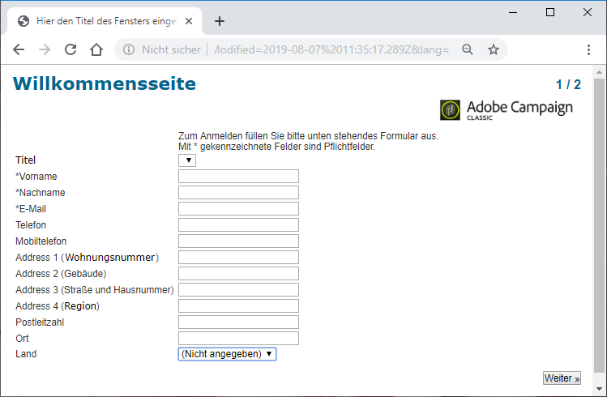

# Webformular übersetzen{#translating-a-web-form}

Sie können eine Webanwendung in mehrere Sprachen lokalisieren.

Übersetzungen können direkt in der Adobe Campaign-Konsole durchgeführt werden (siehe [Übersetzungen im Editor verwalten](#managing-translations-in-the-editor)). Andernfalls können auch Strings exportiert und wieder importiert werden, um die Übersetzung extern durchzuführen (siehe [Übersetzungen extern durchführen](#externalizing-translation)).

Die Liste der standardmäßig verfügbaren Übersetzungssprachen finden Sie in [Anzeigesprache in Formularen ändern](#changing-forms-display-language).

Die Webanwendung ist in einer Bearbeitungssprache erstellt: Dies ist die Referenzsprache für die Eingabe von Titeln und anderen zu übersetzenden Inhalten.

Die Standardsprache ist die Sprache, in der die Webanwendung dargestellt wird, wenn keine Spracheinstellung zu ihrer Zugriffs-URL hinzugefügt wird.

>[!NOTE]
>
>Standardmäßig entsprechen die Bearbeitungssprache und die Standardsprache der Konsolensprache.

## Sprachen wählen {#choosing-languages}

Um eine oder mehrere Übersetzungssprachen zu definieren, klicken Sie auf die **[!UICONTROL Properties]** Schaltfläche der Webanwendung und dann auf die **[!UICONTROL Localization]** Registerkarte. Klicken Sie auf die **[!UICONTROL Add]** Schaltfläche, um eine neue Übersetzungssprache für die Webanwendung zu definieren.

>[!NOTE]
>
>In diesem Fenster können Sie auch die Standardsprache und die Bearbeitungssprache ändern.


When you add translation languages for a Web application (or when the default language and the editing language are different), a **[!UICONTROL Translation]** sub-tab is added to the **[!UICONTROL Edit]** tab to manage translations.

Adobe Campaign besitzt ein Tool zur Übersetzung und Verwaltung mehrsprachiger Übersetzungen. Mit diesem Editor können Sie die zu übersetzenden oder zu validierenden Strings anzeigen, Übersetzungen direkt in die Benutzeroberfläche eingeben oder Zeichenfolgen importieren/exportieren, um Übersetzungen extern anfertigen zu lassen.

## Übersetzungen im Editor verwalten {#managing-translations-in-the-editor}

### Strings abrufen {#collecting-strings}

The **[!UICONTROL Translations]** tab lets you enter translations for the character strings that make up the Web application.

Wenn Sie diese Registerkarte zum ersten Mal öffnen, enthält sie keine Daten. Klicken Sie auf den **[!UICONTROL Collect the strings to translate]** Link, um die Zeichenfolgen in der Webanwendung zu aktualisieren.

Adobe Campaign collects labels of fields and strings defined in the **[!UICONTROL Texts]** tabs of all static elements: HTML blocks, Javascript, etc. Statische Elemente werden in [Statische Elemente in einem Webformular](../../web/using/static-elements-in-a-web-form.md) detailliert erläutert.


>[!CAUTION]
>
>Dieser Vorgang kann je nach dem zu verarbeitenden Datenvolumen mehrere Minuten dauern.
> 
>Wenn eine Warnung mit dem Hinweis erscheint, dass einige Übersetzungen im System-Wörterbuch fehlen, lesen Sie [Systemstrings übersetzen](#translating-the-system-strings).

Immer wenn ein String übersetzt wurde, wird die Übersetzung zum Übersetzungswörterbuch hinzugefügt.

Wenn der Erfassungsvorgang erkennt, dass bereits eine Übersetzung vorhanden ist, wird diese Übersetzung in der **[!UICONTROL Text]** Spalte der Zeichenfolge angezeigt. Der Status der Zeichenfolge wird auf **[!UICONTROL Translated]**.

For characters strings which have never been translated, the **[!UICONTROL Text]** field is empty and the status is **[!UICONTROL To translate]**.

### Strings filtern {#filtering-strings}

Standardmäßig wird jede Übersetzungssprache der Webanwendung angezeigt. Es gibt zwei Standardfilter: Sprache und Status. Klicken Sie auf die **[!UICONTROL Filters]** Schaltfläche und dann auf **[!UICONTROL By language or status]** , um die entsprechenden Dropdown-Felder anzuzeigen. Sie können auch einen erweiterten Filter erstellen. Weiterführende Informationen hierzu finden Sie auf dieser [Seite](../../platform/using/creating-filters.md#creating-an-advanced-filter).


Go to the **[!UICONTROL Language]** drop-down box to select the translation language.

Um nur nicht übersetzte Zeichenfolgen anzuzeigen, wählen Sie **[!UICONTROL To translate]** im **[!UICONTROL Status]** Dropdown-Feld aus. Sie können auch nur übersetzte oder genehmigte Zeichenfolgen anzeigen.

### Strings übersetzen {#translating-strings}

1. Um ein Wort zu übersetzen, führen Sie einen Doppelklick auf die entsprechende Zeile in der Liste der Strings aus.

   

   Im oberen Bereich des Fensters wird der Quellstring angezeigt.

1. Geben Sie die Übersetzung im unteren Abschnitt ein. Um ihn zu genehmigen, aktivieren Sie die **[!UICONTROL Translation approved]** Option.

   >[!NOTE]
   >
   >Die Validierung von Übersetzungen ist optional und blockiert nicht den Vorgang.

   Non-approved translations are displayed as **[!UICONTROL Translated]**. Approved translations are displayed as **[!UICONTROL Approved]**.

## Übersetzungen extern durchführen {#externalizing-translation}

Zeichenfolgen können exportiert und dann wieder importiert werden, um sie mit einem anderen Tool als Adobe Campaign zu übersetzen.

>[!CAUTION]
>
>Verwenden Sie nach dem Export der Strings nicht mehr das integrierte Übersetzungs-Tool. Dies würde beim erneuten Import der Übersetzungen einen Konflikt hervorrufen, wodurch die Übersetzungen verloren gehen würden.

### Dateien exportieren {#exporting-files}

1. Wählen Sie die Webanwendung(en) aus, deren Zeichenfolgen Sie importieren möchten, klicken Sie mit der rechten Maustaste und wählen Sie dann **[!UICONTROL Actions > Export strings for translation...]**

   

1. Select an **[!UICONTROL Export strategy]** :

   * **[!UICONTROL One file per language]**: Beim Export wird pro Übersetzungssprache eine Datei generiert. Jede Datei wird allen ausgewählten Webanwendungen gemein sein.
   * **[!UICONTROL One file per Web application]**: Beim Exportieren wird pro ausgewählte Webanwendung eine Datei generiert. Jede Datei enthält alle Übersetzungssprachen.

      >[!NOTE]
      >
      >Dieser Exporttyp ist nicht für XLIFF-Exporte verfügbar.

   * **[!UICONTROL One file per language and per Web application]**: der Export mehrere Dateien generiert. Jede Datei enthält eine Übersetzungssprache pro Webanwendung.
   * **[!UICONTROL One file for all]**: Beim Export wird eine einzelne mehrsprachige Datei für alle Webanwendungen generiert. Es enthält alle Übersetzungssprachen für alle ausgewählten Webanwendungen.

      >[!NOTE]
      >
      >Dieser Exporttyp ist nicht für XLIFF-Exporte verfügbar.

1. Then chose the **[!UICONTROL Target folder]** where files will be recorded.
1. Select the file format ( **[!UICONTROL CSV]** or **[!UICONTROL XLIFF]** ) and click **[!UICONTROL Start]**.


>[!NOTE]
>
>Die Namen der Exportdateien werden automatisch generiert. Wenn Sie denselben Export mehrmals ausführen, ersetzen Sie vorhandene Dateien durch die neuen. Wenn Sie die vorherigen Dateien beibehalten möchten, ändern Sie die **[!UICONTROL Target folder]** und klicken Sie dann erneut auf **[!UICONTROL Start]** , um den Export auszuführen.

Wenn Sie Dateien im **CSV-Format** exportieren, wird jede Sprache mit einem Status und einem Validierungsstatus verknüpft. In der Spalte **Validieren?** können Sie eine Übersetzung validieren. Diese Spalte kann die Werte **Ja** oder **Nein** enthalten. Wie beim integrierten Editor (siehe [Übersetzungen im Editor verwalten](#managing-translations-in-the-editor)) ist das Validieren von Übersetzungen optional und blockiert den Fortschritt nicht.

### Dateien importieren {#importing-files}

Nach dem Abschluss der externen Übersetzung können Sie die übersetzten Dateien importieren.

1. Rufen Sie die Liste der Webanwendungen auf, klicken Sie mit der rechten Maustaste und wählen Sie **[!UICONTROL Actions > Import translated strings...]**

   >[!NOTE]
   >
   >Es ist nicht erforderlich, die von der Übersetzung betroffenen Webanwendungen auszuwählen. Platzieren Sie den Cursor an einer beliebigen Stelle in der Liste der Webanwendungen.

   

1. Wählen Sie die zu importierende Datei und dann **[!UICONTROL Upload]** aus.

   

>[!NOTE]
>
>Externe Übersetzungen haben immer Priorität gegenüber internen Übersetzungen. Im Fall eines Konflikts wird die interne Übersetzung mit der externen überschrieben.

## Anzeigesprache in Formularen ändern {#changing-forms-display-language}

Webformulare werden in der Standardsprache angezeigt, die auf der **[!UICONTROL Localization]** Registerkarte der Webanwendungseigenschaften angegeben ist. Um Sprachen zu ändern, müssen Sie die folgenden Zeichen am Ende der URL hinzufügen (wobei **xx** das Sprachsymbol ist):

```
?lang=xx
```

Wenn die Sprache der erste oder einzige Parameter der URL ist. Beispiel: **https://myserver/webApp/APP34?lang=en**

```
&lang=xx
```

Wenn es vor der Sprache in der URL noch andere Parameter gibt. Beispiel: **https://myserver/webApp/APP34?status=1&amp;lang=en**

Die standardmäßig verfügbaren Übersetzungssprachen und Wörterbücher sind unten aufgeführt.

**Standard-System-Wörterbuch**: Einige Sprachen enthalten ein Standardwörterbuch, das die Übersetzung der Systemstrings enthält. Weitere Informationen finden Sie unter [Systemstrings übersetzen](#translating-the-system-strings).

**Kalenderverwaltung**: Die Seiten einer Webanwendung können einen Kalender zur Eingabe des Datums enthalten. Standardmäßig ist dieser Kalender in mehreren Sprachen verfügbar (Übersetzung von Tagen, Datumsformat).

<table> 
 <tbody> 
  <tr> 
   <td> <strong>Sprache (Symbole)</strong><br /> </td> 
   <td> <strong>Standard-System-Wörterbücher</strong><br /> </td> 
   <td> <strong>Kalenderverwaltung</strong><br /> </td> 
  </tr> 
  <tr> 
   <td> Deutsch (de)<br /> </td> 
   <td> ja<br /> </td> 
   <td> ja<br /> </td> 
  </tr> 
  <tr> 
   <td> Englisch (EN)<br /> </td> 
   <td> ja<br /> </td> 
   <td> ja<br /> </td> 
  </tr> 
  <tr> 
   <td> Englisch (USA) (en_US)<br /> </td> 
   <td> </td> 
   <td> </td> 
  </tr> 
  <tr> 
   <td> Englisch (UK) (en_GB)<br /> </td> 
   <td> </td> 
   <td> </td> 
  </tr> 
  <tr> 
   <td> Arabisch (ar)<br /> </td> 
   <td> </td> 
   <td> </td> 
  </tr> 
  <tr> 
   <td> Chinesisch (zh)<br /> </td> 
   <td> </td> 
   <td> </td> 
  </tr> 
  <tr> 
   <td> Koreanisch (ko)<br /> </td> 
   <td> </td> 
   <td> </td> 
  </tr> 
  <tr> 
   <td> Dänisch (da)<br /> </td> 
   <td> ja<br /> </td> 
   <td> ja<br /> </td> 
  </tr> 
  <tr> 
   <td> Spanisch (es)<br /> </td> 
   <td> ja<br /> </td> 
   <td> ja<br /> </td> 
  </tr> 
  <tr> 
   <td> Estnisch (et)<br /> </td> 
   <td> </td> 
   <td> </td> 
  </tr> 
  <tr> 
   <td> Finnisch (fi)<br /> </td> 
   <td> </td> 
   <td> ja<br /> </td> 
  </tr> 
  <tr> 
   <td> Französisch (fr)<br /> </td> 
   <td> ja<br /> </td> 
   <td> ja<br /> </td> 
  </tr> 
  <tr> 
   <td> Französisch (Belgien) (fr_BE)<br /> </td> 
   <td> </td> 
   <td> </td> 
  </tr> 
  <tr> 
   <td> Französisch (Frankreich) (fr_FR)<br /> </td> 
   <td> </td> 
   <td> </td> 
  </tr> 
  <tr> 
   <td> Griechisch (el)<br /> </td> 
   <td> </td> 
   <td> ja<br /> </td> 
  </tr> 
  <tr> 
   <td> Hebräisch (he)<br /> </td> 
   <td> </td> 
   <td> </td> 
  </tr> 
  <tr> 
   <td> Ungarisch (hu)<br /> </td> 
   <td> </td> 
   <td> ja<br /> </td> 
  </tr> 
  <tr> 
   <td> Indonesisch (id)<br /> </td> 
   <td> </td> 
   <td> </td> 
  </tr> 
  <tr> 
   <td> Irisch (ga)<br /> </td> 
   <td> </td> 
   <td> </td> 
  </tr> 
  <tr> 
   <td> Italienisch (it)<br /> </td> 
   <td> ja<br /> </td> 
   <td> ja<br /> </td> 
  </tr> 
  <tr> 
   <td> Italienisch (Italien) (it_IT)<br /> </td> 
   <td> </td> 
   <td> </td> 
  </tr> 
  <tr> 
   <td> Italienisch (Schweiz) (it_CH)<br /> </td> 
   <td> </td> 
   <td> </td> 
  </tr> 
  <tr> 
   <td> Japanisch (ja)<br /> </td> 
   <td> </td> 
   <td> </td> 
  </tr> 
  <tr> 
   <td> Lettisch (lv)<br /> </td> 
   <td> </td> 
   <td> ja<br /> </td> 
  </tr> 
  <tr> 
   <td> Litauisch (lt)<br /> </td> 
   <td> </td> 
   <td> </td> 
  </tr> 
  <tr> 
   <td> Maltesisch (mt)<br /> </td> 
   <td> </td> 
   <td> </td> 
  </tr> 
  <tr> 
   <td> Niederländisch (nl)<br /> </td> 
   <td> </td> 
   <td> ja<br /> </td> 
  </tr> 
  <tr> 
   <td> Niederländisch (Belgien) (nl_BE)<br /> </td> 
   <td> </td> 
   <td> </td> 
  </tr> 
  <tr> 
   <td> Niederländisch (Niederlande) (nl_NL)<br /> </td> 
   <td> </td> 
   <td> </td> 
  </tr> 
  <tr> 
   <td> Norwegisch (Norwegen) (no_NO)<br /> </td> 
   <td> </td> 
   <td> ja<br /> </td> 
  </tr> 
  <tr> 
   <td> Polnisch (pl)<br /> </td> 
   <td> </td> 
   <td> ja<br /> </td> 
  </tr> 
  <tr> 
   <td> Portugiesisch (pt)<br /> </td> 
   <td> </td> 
   <td> ja<br /> </td> 
  </tr> 
  <tr> 
   <td> Portugiesisch (Brasilien) (pt_BR)<br /> </td> 
   <td> </td> 
   <td> </td> 
  </tr> 
  <tr> 
   <td> Portugiesisch (Portugal) (pt_PT)<br /> </td> 
   <td> </td> 
   <td> </td> 
  </tr> 
  <tr> 
   <td> Russisch (ru)<br /> </td> 
   <td> </td> 
   <td> ja<br /> </td> 
  </tr> 
  <tr> 
   <td> Slowenisch (sl)<br /> </td> 
   <td> </td> 
   <td> </td> 
  </tr> 
  <tr> 
   <td> Slowakisch (sk)<br /> </td> 
   <td> </td> 
   <td> </td> 
  </tr> 
  <tr> 
   <td> Schwedisch (sv)<br /> </td> 
   <td> ja<br /> </td> 
   <td> ja<br /> </td> 
  </tr> 
  <tr> 
   <td> Schwedisch (Finnland) (sv_FI)<br /> </td> 
   <td> </td> 
   <td> </td> 
  </tr> 
  <tr> 
   <td> Schwedisch (Schweden) (sv_SE)<br /> </td> 
   <td> </td> 
   <td> </td> 
  </tr> 
  <tr> 
   <td> Tschechisch (cs)<br /> </td> 
   <td> </td> 
   <td> </td> 
  </tr> 
  <tr> 
   <td> Thailändisch (th)<br /> </td> 
   <td> </td> 
   <td> </td> 
  </tr> 
  <tr> 
   <td> Vietnamesisch (vi)<br /> </td> 
   <td> </td> 
   <td> </td> 
  </tr> 
  <tr> 
   <td> Wallonisch (wa)<br /> </td> 
   <td> </td> 
   <td> </td> 
  </tr> 
 </tbody> 
</table>

>[!NOTE]
>
>Weitere Informationen zum Hinzufügen anderer als standardmäßig angebotener Sprachen finden Sie unter [Sprache hinzufügen, in die übersetzt werden soll](#adding-a-translation-language).

## Beispiel: eine Webanwendung in mehreren Sprachen anzeigen {#example--displaying-a-web-application-in-several-languages}

Das folgende Webformular ist in vier Sprachen verfügbar: Englisch, Französisch, Deutsch und Spanisch. Die Zeichenfolgen wurden alle über die **[!UICONTROL Translation]** Registerkarte des Webformulars übersetzt. Da die Standardsprache Englisch ist, verwenden Sie beim Veröffentlichen der Umfrage die Standard-URL, um sie in Englisch anzuzeigen.



Fügen Sie **?lang=fr** an das Ende der URL hinzu, um den Inhalt auf Französisch anzuzeigen:

>[!NOTE]
>
>Die Liste der Symbole für jede Sprache finden Sie in [Anzeigesprache in Formularen ändern](#changing-forms-display-language).


Fügen Sie **?lang=es** oder **?lang=de** hinzu, um den Inhalt auf Spanisch oder Deutsch anzuzeigen.

>[!NOTE]
>
>Wenn für diese Webanwendung bereits andere Parameter verwendet werden, fügen Sie **&amp;lang=** hinzu.\
>Beispiel: **https://myserver/webApp/APP34?status=1&amp;lang=en**

## Erweiterte Übersetzungskonfiguration {#advanced-translation-configuration}

>[!CAUTION]
>
>Dieser Abschnitt ist nur für erfahrene Benutzer.

### Systemstrings übersetzen {#translating-the-system-strings}

Systemzeichenfolgen sind vordefinierte Zeichenfolgen, die von allen Webanwendungen verwendet werden. Beispiel: **[!UICONTROL Next]** , **[!UICONTROL Previous]**, **[!UICONTROL Approve]** Schaltflächen, **[!UICONTROL Loading]** Nachrichten usw. Einige Sprachen enthalten standardmäßig ein Wörterbuch mit Übersetzungen für diese Zeichenfolgen. Die Liste der Sprachen finden Sie in [Anzeigesprache in Formularen ändern](#changing-forms-display-language).

Wenn Sie Ihre Webanwendung in eine Sprache übersetzen, für die es kein System-Wörterbuch gibt, erscheint ein Warnhinweis, der Ihnen mitteilt, dass manche Übersetzungen fehlen.


Gehen Sie wie folgt vor, um eine Sprache hinzuzufügen:

1. Gehen Sie zur Adobe Campaign-Struktur und klicken Sie auf **[!UICONTROL Administration > Configuration > Global dictionary > System dictionary]** .
1. In the upper section of the window, select the system string to translate, then click **[!UICONTROL Add]** in the lower section.

   

1. Wählen Sie die Übersetzungssprache und geben Sie eine Übersetzung für die Zeichenfolge ein. Sie können die Übersetzung genehmigen, indem Sie die **[!UICONTROL Translation validated]** Option aktivieren.

   

   >[!NOTE]
   >
   >Die Validierung von Übersetzungen ist optional und blockiert nicht den Vorgang.

>[!CAUTION]
>
>Löschen Sie nicht die nativen Systemstrings.

### Sprache hinzufügen, in die übersetzt werden soll {#adding-a-translation-language}

Um Webanwendungen in andere Sprachen als die Standardsprachen zu übersetzen (siehe [Anzeigesprache in Formularen ändern](#changing-forms-display-language)), müssen Sie eine neue Übersetzungssprache hinzufügen.

1. Klicken Sie auf den **[!UICONTROL Administration > Platform > Itemized lists]** Knoten der Adobe-Kampagnenstruktur und wählen Sie in der Liste **[!UICONTROL Languages available for translation]** die Option aus. Die Liste der verfügbaren Übersetzungen wird im unteren Bereich des Fensters angezeigt.

   

1. Klicken Sie auf die **[!UICONTROL Add]** Schaltfläche und geben Sie die **[!UICONTROL Internal name]** ID **[!UICONTROL Label]** und den Bezeichner des Bilds (Flag) ein. Wenden Sie sich an Ihren Administrator, um ein neues Bild hinzuzufügen.

   

