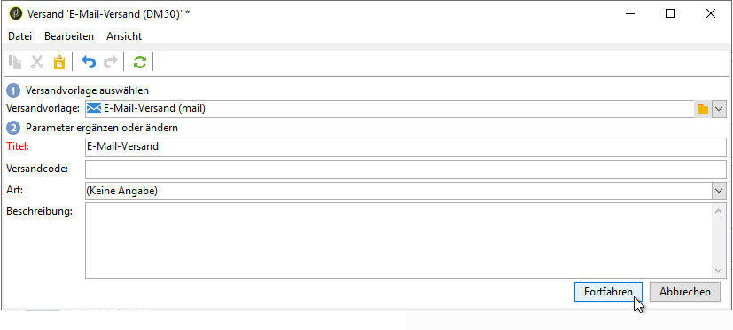

# Anwendungsfall: E-Mail-Versand erstellen{#use-case-creating-an-email-delivery}

In diesem Anwendungsbeispiel lernen Sie die Schritte zum Erstellen eines E-Mail-Versands mit Adobe Campaign Digital Content Editor (DCE) kennen.

Ein Versand soll mit einer personalisierten Vorlage erstellt werden, die Folgendes enthält:

* Eine direkte Adresse des Empfängers (unter Verwendung des Vor- und Nachnamens)
* Zwei Typen von Links auf eine externe URL
* Eine Mirrorseite
* Einen Link auf eine Webanwendung

>[!NOTE]
>
>Bevor Sie beginnen, muss mindestens eine **HTML-Vorlage** entsprechend dem Inhalt Ihrer künftigen Sendungen konfiguriert werden.
>
>Stellen Sie in den **[!UICONTROL Versandeigenschaften]** sicher, dass die **[!UICONTROL Inhaltserstellung]** (auf dem Tab **[!UICONTROL Erweitert]**) auf **[!UICONTROL DCE]** gesetzt ist. Um sicherzustellen, dass der Editor optimal funktioniert, lesen Sie die [Best Practices bei der Inhaltsbearbeitung](../../web/using/content-editing-best-practices.md).

## Schritt 1: Erstellen eines Versands {#step-1---creating-a-delivery}

Um einen neuen Versand zu erstellen, platzieren Sie den Cursor auf dem Tab **Kampagnen** und klicken Sie auf **Sendungen**. Klicken Sie dann über der Liste der vorhandenen Sendungen auf die Schaltfläche **Erstellen**. Weiterführende Informationen zur Erstellung eines Versands finden Sie auf [dieser Seite](../../delivery/using/about-email-channel.md).

## Schritt 2: Auswählen einer Vorlage {#step-2---selecting-a-template}

Wählen Sie eine Versandvorlage aus und geben Sie Ihrem Versand eine Bezeichnung. Diese Bezeichnung ist nur für Benutzer der Adobe Campaign-Konsole sichtbar, nicht aber für die Empfänger. Diese Bezeichnung wird in der Liste der Sendungen angezeigt. Bestätigen Sie die Angaben mit der Schaltfläche **[!UICONTROL Fortfahren]**.

## Schritt 3: Auswählen eines Inhalts {#step-3---selecting-a-content}

Der Digital Content Editor verfügt über verschiedene native Vorlagen mit unterschiedlichen Strukturen (Spalten, Textbereiche etc.).

Wählen Sie die Inhaltsvorlage aus, das Sie verwenden möchten, und verwenden Sie dann die Schaltfläche **[!UICONTROL Mit dem ausgewählten Inhalt beginnen]**, um die Vorlage im erstellten Versand anzuzeigen.

Darüber hinaus besteht die Möglichkeit, außerhalb von Adobe Campaign erstellte HTML-Inhalte zu importieren, indem Sie die Option **[!UICONTROL Aus einer Datei]** auswählen.

Sie können diesen Inhalt als Vorlage zur späteren Verwendung speichern. Nachdem eine personalisierte Inhaltsvorlage erstellt wurde, können Sie sich eine Vorschau davon in der Liste der Vorlagen ansehen. Konsultieren Sie diesbezüglich die [Vorlagenverwaltung](../../web/using/template-management.md).

>[!CAUTION]
>
>Wenn Sie die **Adobe Campaign-Webschnittstelle** verwenden, müssen Sie eine ZIP-Datei mit dem HTML-Inhalt und den entsprechenden Bildern importieren.

## Schritt 4: Gestalten der Nachricht {#step-4---designing-the-message}

* Vor- und Nachnamen der Empfänger anzeigen

   Um den Vor- und Nachnamen der Empfänger in ein Textfeld Ihres Versands einzufügen, klicken Sie auf das gewünschte Textfeld und platzieren Sie den Cursor an die Stelle, wo der Name angezeigt werden soll. Klicken Sie auf das erste Symbol in der Pop-up-Symbolleiste und danach auf **[!UICONTROL Gestaltungsbaustein]**. Wählen Sie **[!UICONTROL Grußformeln]** und danach **[!UICONTROL OK]** aus.

   

* Link in ein Bild einfügen

   Um Empfänger eines Versands über ein Bild zu einer externen Adresse weiterzuleiten, klicken Sie auf das jeweilige Bild, um die Symbolleiste zu öffnen, platzieren Sie den Cursor auf das erste Symbol und wählen Sie dann **[!UICONTROL Link auf eine externe URL]** aus. Weitere Informationen finden Sie unter [Link hinzufügen](../../web/using/editing-content.md#adding-a-link).

   

   Geben Sie die URL für den Link im Feld **URL** im Format **https://www.myURL.com** ein und bestätigen Sie dann Ihre Eingabe.

   Der Link kann jederzeit im rechten Fensterbereich geändert werden.

* Link in Text einfügen

   Um einen externen Link in den Text Ihres Versands einzufügen, wählen Sie Text aus und klicken Sie auf das erste Symbol der Pop-up-Symbolleiste. Wählen Sie **[!UICONTROL Link auf eine externe URL]** aus und geben Sie im Feld **[!UICONTROL URL]** die Adresse des Links ein. Weitere Informationen finden Sie unter [Link hinzufügen](../../web/using/editing-content.md#adding-a-link).

   Der Link kann jederzeit im rechten Fensterbereich geändert werden.

   >[!CAUTION]
   >
   >Der im Feld **[!UICONTROL Titel]** eingegebene Text ersetzt den ursprünglichen Text.

* Mirrorseite hinzufügen

   Um Empfängern zu ermöglichen, Ihren Versandinhalt in einem Webbrowser zu sehen, können Sie in Ihrem Versand einen Link zu einer Mirrorseiten integrieren.

   Klicken Sie auf das Textfeld, in dem der Link erscheinen soll. Klicken Sie auf das erste Symbol in der Pop-up-Symbolleiste und wählen Sie **[!UICONTROL Gestaltungsbaustein]** und danach **[!UICONTROL Mirrorseiten-Link (MirrorPage)]** aus. Wählen Sie zur Bestätigung **[!UICONTROL Speichern]** aus.

   

   >[!CAUTION]
   >
   >Der Titel des Gestaltungsbausteins ersetzt automatisch den Originaltext in Ihrem Versand.

* Einen Link auf eine Webanwendung integrieren

   Mit dem Digital Content Editor können Sie über die Adobe Campaign-Konsole Links auf Webanwendungen integrieren, z. B. auf eine Landingpage oder Formularseite. Weitere Informationen hierzu finden Sie unter [Link auf eine Webanwendung](../../web/using/editing-content.md#link-to-a-web-application).

   Wählen Sie ein Textfeld für Ihren Link auf eine Webanwendung aus und klicken Sie dann auf das erste Symbol. Wählen Sie **[!UICONTROL Link auf eine Webanwendung]** und danach die gewünschte Anwendung aus, indem Sie auf das Symbol am Ende des Feldes **Webanwendung** klicken.

   

   Klicken Sie zur Bestätigung auf **Speichern**.

   >[!NOTE]
   >
   >Für diesen Schritt müssen Sie zunächst mindestens eine Webanwendung speichern. Diese finden Sie auf dem Tab **[!UICONTROL Kampagnen > Webanwendungen]** Ihrer Konsole.

## Schritt 5: Speichern des Versands {#step-5---saving-the-delivery}

Nachdem der Inhalt integriert wurde, speichern Sie den Versand, indem Sie auf **Speichern** klicken. Er wird nun in Ihrer Liste der Sendungen angezeigt, die Sie auf dem Tab **[!UICONTROL Kampagnen > Sendungen]** finden.
