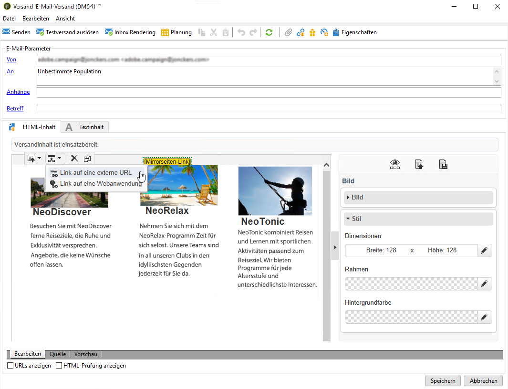

# Anwendungsfall: E-Mail-Versand erstellen{#use-case-creating-an-email-delivery}

In diesem Fall lernen Sie die Schritte zum Entwerfen einer E-Mail-Zustellung mit Adobe Campaign Digital Content Editor (DCE) kennen.

Ein Versand soll mit einer personalisierten Vorlage erstellt werden, die Folgendes enthält:

* Eine direkte Adresse des Empfängers (unter Verwendung des Vor- und Nachnamens)
* Zwei Typen von Links auf eine externe URL
* Eine Mirrorseite
* Einen Link auf eine Webanwendung

>[!NOTE]
>
>Bevor Sie beginnen, muss mindestens eine **HTML-Vorlage** entsprechend dem Inhalt Ihrer künftigen Sendungen konfiguriert werden.
>
>Stellen Sie in der Bereitstellung **[!UICONTROL Properties]** sicher, dass **[!UICONTROL Content editing mode]** (auf der **[!UICONTROL Advanced]** Registerkarte) auf **[!UICONTROL DCE]**. Um sicherzustellen, dass der Editor optimal funktioniert, lesen Sie die Best Practices zur [Inhaltsbearbeitung](../../web/using/content-editing-best-practices.md).

## Schritt 1: Erstellen eines Versands {#step-1---creating-a-delivery}

Um eine neue Bereitstellung zu erstellen, platzieren Sie den Cursor auf der Registerkarte &quot; **Kampagnen** &quot;und klicken Sie auf **Auslieferungen**. Klicken Sie dann auf die Schaltfläche **Erstellen** oberhalb der Liste der vorhandenen Auslieferungen. For more on creating deliveries, refer to [this page](../../delivery/using/about-email-channel.md).

## Schritt 2: Auswählen einer Vorlage {#step-2---selecting-a-template}

Select a delivery template, then name your delivery. This name will only be visible to users of the Adobe Campaign console and not by your recipients, however this heading will be displayed in your list of deliveries. Click **[!UICONTROL Continue]**.

## Schritt 3: Auswählen eines Inhalts {#step-3---selecting-a-content}

Der Digital Content Editor verfügt über verschiedene native Vorlagen mit unterschiedlichen Strukturen (Spalten, Textbereiche etc.).

Select the content template that you want to use, then click the **[!UICONTROL Start with the selected content]** button to display the template in the created delivery.

You can also import an HTML content created outside of Adobe Campaign by selecting **[!UICONTROL From a file]**.

Sie können diesen Inhalt als Vorlage für die künftige Verwendung speichern. Nachdem eine personalisierte Inhaltsvorlage erstellt wurde, können Sie sie in der Liste der Vorlagen in der Vorschau anzeigen. For more on this, refer to [Template management](../../web/using/template-management.md).

>[!CAUTION]
>
>Wenn Sie die **Adobe Campaign-Webschnittstelle** verwenden, müssen Sie eine ZIP-Datei mit dem HTML-Inhalt und den entsprechenden Bildern importieren.

## Schritt 4: Gestalten der Nachricht {#step-4---designing-the-message}

* Vor- und Nachnamen der Empfänger anzeigen

   To insert the first and second names of your recipients into a text field in your delivery, click your chosen text field, then place your cursor where you want to display them. Click the first icon in the pop-up toolbar, then click **[!UICONTROL Personalization block]**. Wählen Sie **[!UICONTROL Greetings]** aus und klicken Sie auf **[!UICONTROL OK]**.

   

* Link in ein Bild einfügen

   Um Empfänger über ein Bild an eine externe Adresse zu senden, klicken Sie auf das entsprechende Bild, um die Popup-Symbolleiste anzuzeigen, setzen Sie den Cursor auf das erste Symbol und klicken Sie dann auf **[!UICONTROL Link to an external URL]**. Weitere Informationen finden Sie unter [Hinzufügen eines Links](../../web/using/editing-content.md#adding-a-link).

   

   Geben Sie die URL für den Link im Feld **URL** im Format **https://www.myURL.com** ein und bestätigen Sie dann Ihre Eingabe.

   Der Link kann jederzeit im rechten Fensterbereich geändert werden.

* Link in Text einfügen

   Um einen externen Link in den Text in Ihrer Bereitstellung zu integrieren, wählen Sie Text oder Textblock aus und klicken Sie dann auf das erste Symbol in der Popup-Symbolleiste. Klicken Sie auf **[!UICONTROL Link to an external URL]**, geben Sie die Link-Adresse in das **[!UICONTROL URL]** Feld ein. Weitere Informationen finden Sie unter [Hinzufügen eines Links](../../web/using/editing-content.md#adding-a-link).

   Der Link kann jederzeit im rechten Fensterbereich geändert werden.

   >[!CAUTION]
   >
   >The text entered in the **[!UICONTROL Label]** field replaces the original text.

* Mirrorseite hinzufügen

   Um Empfängern zu ermöglichen, Ihren Versandinhalt in einem Webbrowser zu sehen, können Sie in Ihrem Versand einen Link zu einer Mirrorseiten integrieren.

   Klicken Sie auf das Textfeld, in dem Sie den Link sehen möchten. Klicken Sie auf das erste Symbol in der Popup-Symbolleiste und wählen Sie **[!UICONTROL Personalization block]** dann **[!UICONTROL Link to Mirror Page (MirrorPage)]**. Klicken Sie **[!UICONTROL Save]** zur Bestätigung.

   

   >[!CAUTION]
   >
   >Der Titel des Gestaltungsbausteins ersetzt automatisch den Originaltext in Ihrem Versand.

* Einen Link auf eine Webanwendung integrieren

   Mit dem Digital Content Editor können Sie Links zu Webanwendungen aus Ihrer Adobe Campaign-Konsole integrieren, z. B. eine Einstiegsseite oder eine Formularseite. Weitere Informationen finden Sie unter [Verknüpfen mit einer Webanwendung](../../web/using/editing-content.md#link-to-a-web-application).

   Wählen Sie ein Textfeld für den Link zu einer Webanwendung aus und klicken Sie dann auf das erste Symbol. Wählen Sie **[!UICONTROL Link to a Web application]** die gewünschte Anwendung aus, indem Sie auf das Symbol am Ende des Felds **Webanwendung** klicken.

   

   Klicken Sie zur Bestätigung auf **Speichern**.

   >[!NOTE]
   >
   >Für diesen Schritt müssen Sie zuvor mindestens eine Webanwendung speichern. Diese finden Sie auf der **[!UICONTROL Campaigns > Web applications]** Registerkarte Ihrer Konsole.

## Schritt 5: Speichern des Versands {#step-5---saving-the-delivery}

Nachdem der Inhalt integriert wurde, speichern Sie die Bereitstellung, indem Sie auf **Speichern** klicken. Es wird nun in Ihrer Liste der Auslieferungen angezeigt, die Sie auf der **[!UICONTROL Campaigns > Deliveries]** Registerkarte finden.
