# Anwendungsbeispiele: Webformulare{#use-cases-web-forms}

## Abonnement-Formular mit zweifacher Bestätigung erstellen {#create-a-subscription--form-with-double-opt-in}

Empfänger müssen sich für angebotene Informationsdienste anmelden, um alle damit verbundenen Nachrichten zu erhalten. Um unangemessene Sendungen zu vermeiden und um zu gewährleisten, dass sich Empfänger absichtlich angemeldet haben, empfehlen wir Ihnen, eine zweifache Abonnementbestätigung zu versenden (Double Opt-in). Damit ist die Anmeldung erst dann wirksam, wenn der Empfänger auf den Link der Bestätigungsnachricht klickt.

Es wird von folgendem Szenario ausgegangen:

1. Ein Newsletter-Abonnement soll auf einer Website erstellt werden, die eine Checkbox enthält, über die man sich für einen temporären Dienst anmelden kann. Mit diesem Dienst können Nachrichten zur Abonnementbestätigung versendet werden.
1. Der Versand einer Abonnementbestätigung soll mit einer Versandvorlage erstellt werden, die mit einem Webformular verknüpft ist. Das Webformular enthält den Bestätigungslink, mit dem das Formular zur Newsletter-Anmeldung aufgerufen und eine Validierungsnachricht für die Anmeldung angezeigt wird.

### Schritt 1: Erstellen von Informationsdiensten {#step-1---creating-information-services}

1. Erstellen Sie den Dienst für die Newsletter-Anmeldung für Ihre Empfänger. Weiterführende Informationen zur Erstellung eines Newsletters finden Sie in [diesem Abschnitt](../../delivery/using/about-services-and-subscriptions.md).

   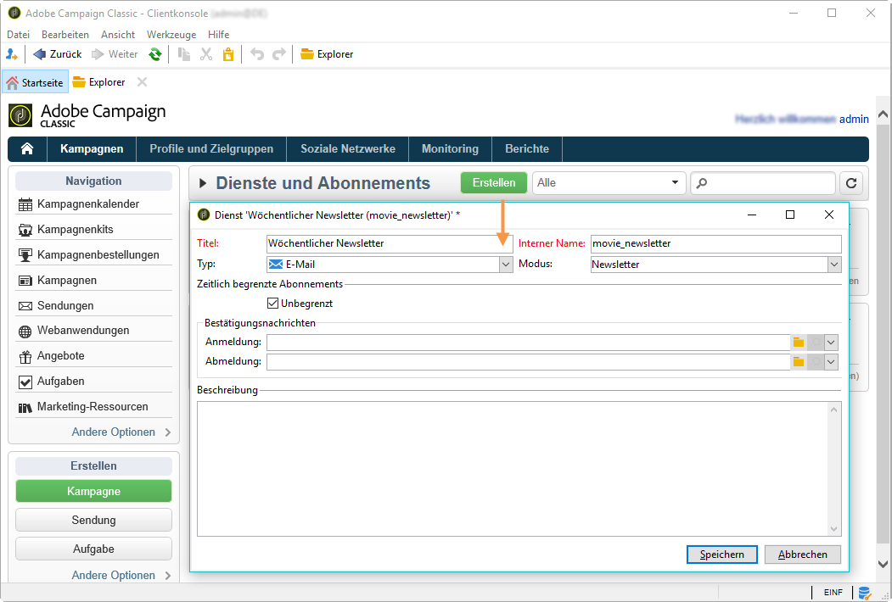

1. Erstellen Sie einen zweiten Informationsdienst, einen temporären Dienst, der mit einer Versandvorlage verknüpft ist, um Nachrichten zur Anmeldebestätigung zu versenden.

   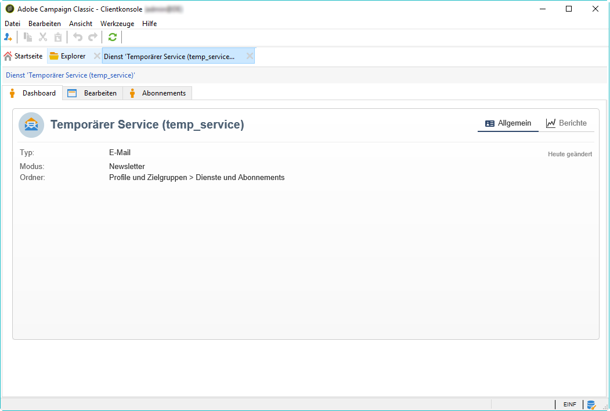

### Schritt 2: Erstellen von Bestätigungsnachrichten {#step-2---creating-confirmation-messages}

Bestätigungsnachrichten werden über eine spezielle Versandvorlage gesendet, die im temporären Dienst referenziert ist.

1. Wählen Sie im **[!UICONTROL Explorer]** die Option **[!UICONTROL Ressourcen > Vorlagen > Versandvorlagen]** aus.
1. Erstellen Sie eine Versandvorlage zum Senden der Anmeldebestätigung.
1. Wählen Sie in den **[!UICONTROL E-Mail-Parametern]** die Schaltfläche **[!UICONTROL An]** aus, um die Versandvorlage mit dem Abonnement-Zielgruppen-Mapping anstelle der Empfänger zu verbinden.

   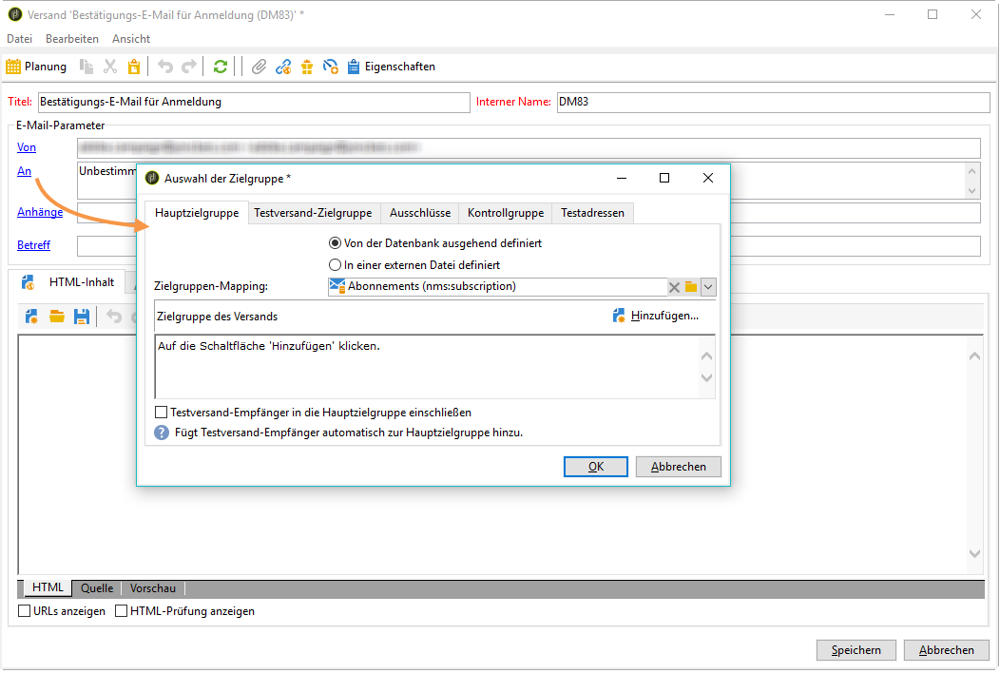

1. Da die Empfänger dieses Versands ihre Genehmigung nicht bestätigt haben, befinden sie sich immer noch auf der blockierungsliste. Damit sie diese Mitteilung erhalten, müssen Sie Versand, die auf dieser Vorlage basieren, für die Zielgruppe von Empfängern autorisieren, die sich auf der blockierungsliste befinden.

   Verwenden Sie dazu den Tab **[!UICONTROL Ausschlüsse]**.

1. Click the **[!UICONTROL Edit...]** link and uncheck the **[!UICONTROL Exclude recipients who no longer want to be contacted (blocklist)]** option.

   <!-- 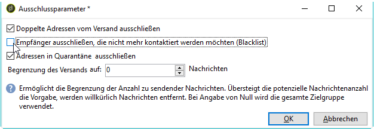-->

   >[!IMPORTANT]
   >
   >Diese Option darf nur in diesem Kontext deaktiviert werden.

1. Passen Sie Ihren Versand an und fügen Sie den Bestätigungslink in den Nachrichteninhalt ein. Mit diesem Link können Sie auf das Webformular zugreifen, um die Anmeldebestätigung zu speichern.

   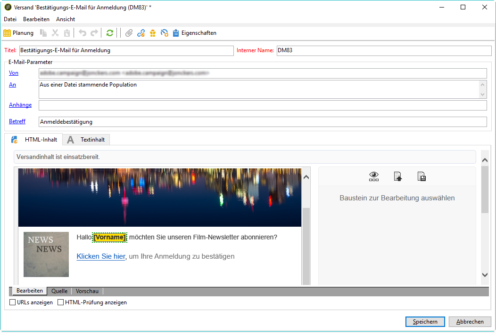

1. Verbinden Sie unter Verwendung des Digital Content Editors Ihre URL mit dem Webformular. Da das Webformular noch nicht erstellt wurde, ersetzen Sie den entsprechenden Wert unmittelbar bei seiner Erstellung.

   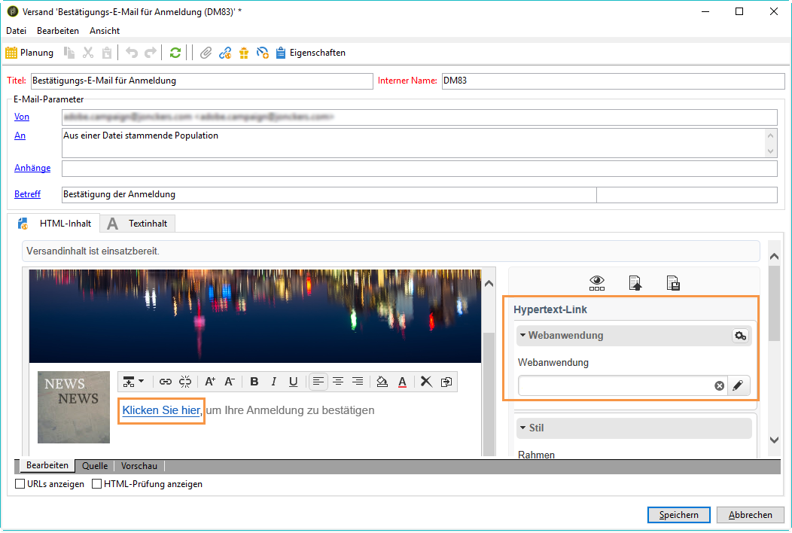

1. Verbinden Sie abschließend diese Vorlage mit dem zuvor erstellten temporären Dienst.

   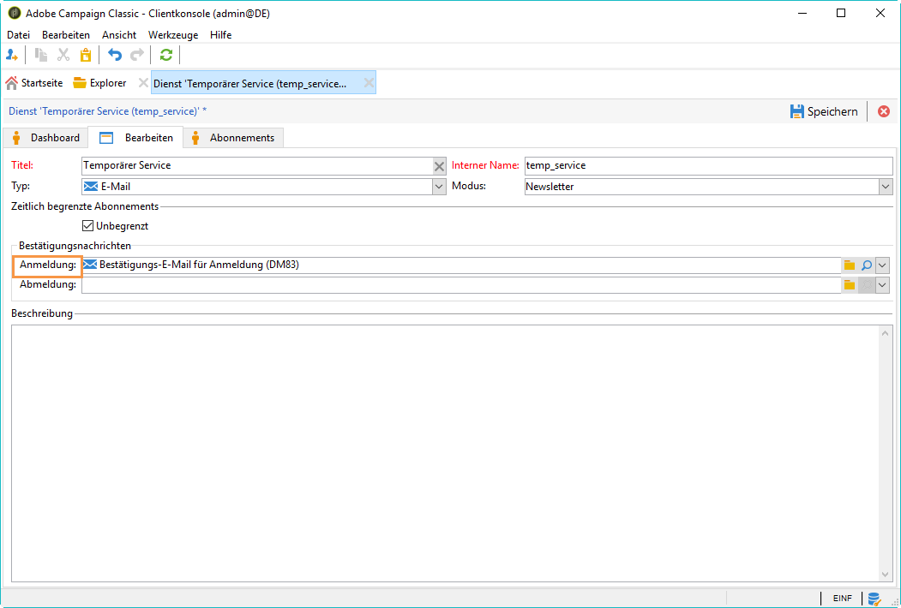

### 3. Schritt: Erstellung des Anmeldeformulars {#step-3---creating-the-subscription-form}

Das Webformular ermöglicht sowohl die Anmeldung der Empfänger als auch die Anmeldebestätigung.

Der Webformular-Workflow umfasst die folgenden Aktivitäten:

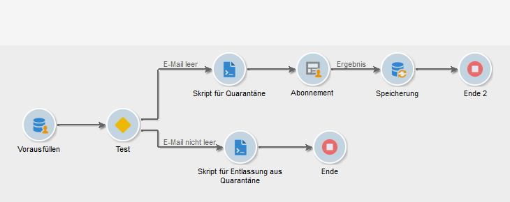

Gehen Sie dazu wie folgt vor:

1. Erstellen Sie ein Webformular und wählen Sie die Vorlage **[!UICONTROL Newsletter-Anmeldung (subNewsletter)]** aus.

   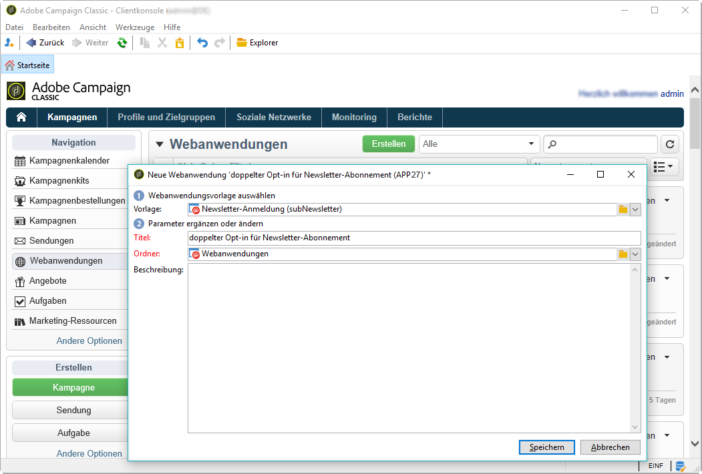

1. Im Tab **[!UICONTROL Bearbeiten]** muss der vorhandene Workflow konfiguriert werden, da eine Bestätigungsnachricht an die Empfänger, die sich anmelden möchten, hinzugefügt werden soll.

   Doppelklicken Sie dazu auf die Aktivität **[!UICONTROL Vorausfüllen]** und konfigurieren Sie sie wie folgt.

   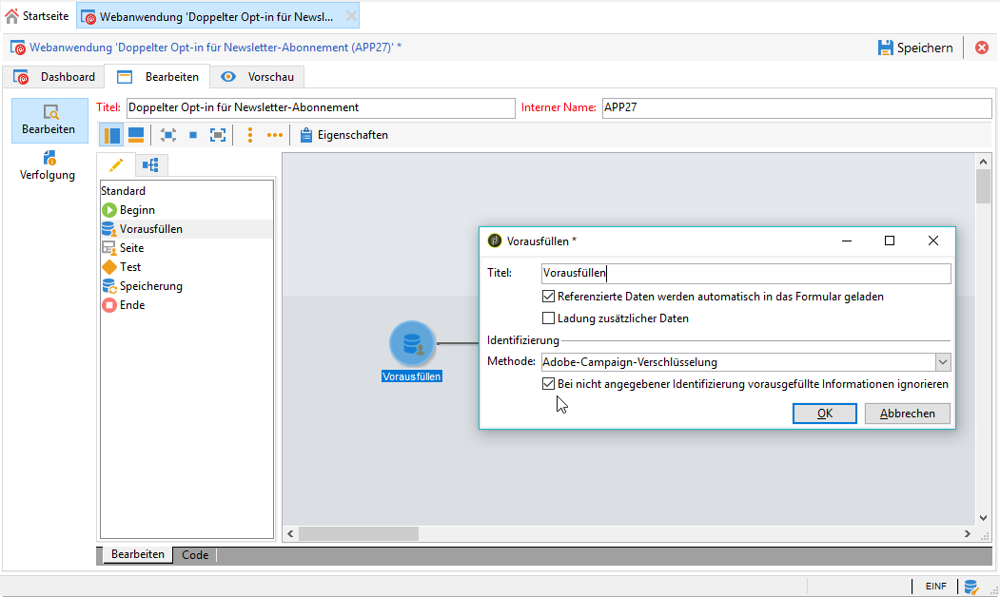

   Wenn der Benutzer jetzt auf dieses Formular über den Link in der Bestätigungsnachricht zugreift, werden seine Profilinformationen geladen. Wenn er auf das Webformular über eine Seite der Website zugreift, werden keine Informationen geladen.

1. Fügen Sie eine **[!UICONTROL Test]**-Aktivität zu Ihrem Workflow hinzu.

   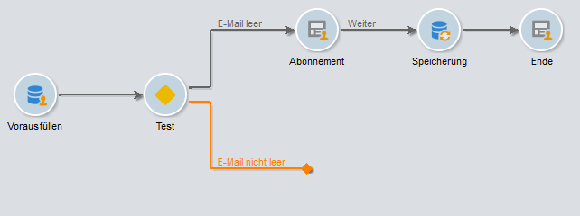

   Die **[!UICONTROL Test]**-Aktivität kann sich auf die Empfänger-E-Mail beziehen. Konfigurieren Sie sie in diesem Fall wie folgt:

   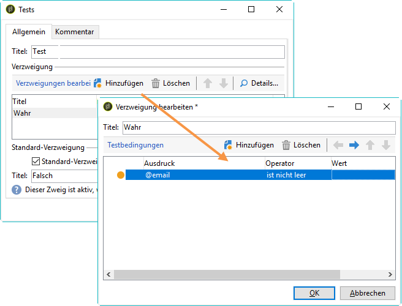

1. Fügen Sie zwei **[!UICONTROL Script]**-Aktivitäten zu Ihrem Workflow hinzu.

   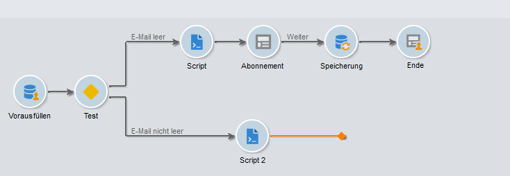

   Die erste **[!UICONTROL Script]** -Aktivität fügt Empfänger zur blockierungsliste hinzu, bis sie ihr Abonnement zum Newsletter bestätigt haben. Der Inhalt muss wie folgt lauten:

   ```
   ctx.recipient.@blockList=1
   ```

   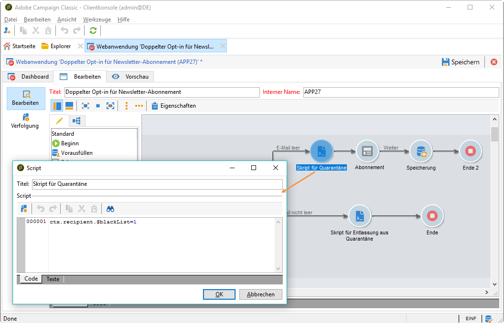

   Mit der zweiten **[!UICONTROL Script]**-Aktivität werden Sendungen an die Besucher genehmigt. Außerdem ermöglicht sie die Anmeldung zum Newsletter. Die letzten beiden Zeilen des Skripts ermöglichen Ihnen den Transfer Ihrer Empfänger vom temporären Ordner in einen anderen Ordner und die Abstimmung mit vorhandenen Profilen, sobald die Anmeldung bestätigt wurde.

   ```
   ctx.recipient.@blockList=0
   nms.subscription.Subscribe("INTERNAL_NAME_OF_THE_NEWSLETTER", ctx.recipient, false)
   ctx.recipient.folder = <folder name="nmsRootRecipient"/>
   nms.subscription.Unsubscribe("TEMP", ctx.recipient)
   ```

   >[!NOTE]
   >
   >Die Partition **[!UICONTROL Temp]** kann auch regelmäßig mit einem Workflow bereinigt werden.

   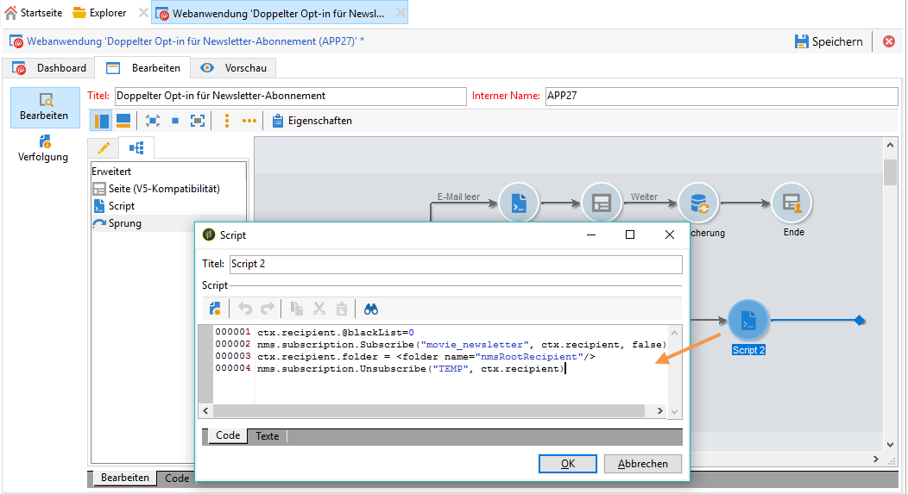

1. Doppelklicken Sie auf die **[!UICONTROL Abonnement]**-Aktivität, um das Anmeldeformular anzupassen und eine Checkbox mit dem zuvor erstellten temporären Dienst zu verbinden.

   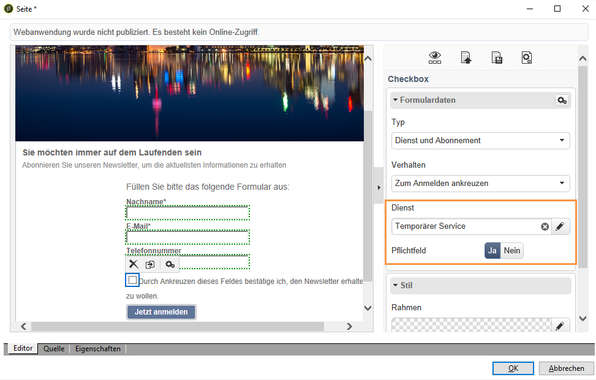

1. Konfigurieren Sie die Aktivität **[!UICONTROL Speicherung]**, um die auf der Formularseite eingegebenen Informationen zu speichern.

   Mit dieser Aktivität können Sie Empfängerprofile in einem speziellen temporären Ordner erstellen. Damit können Sie sie von den Profilen in der Datenbank trennen, denen Nachrichten gesendet werden können.

   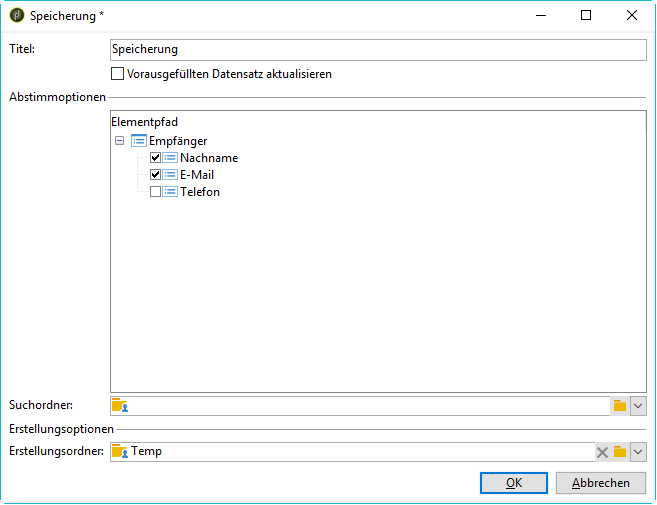

   >[!NOTE]
   >
   >Es dürfen keine Abstimmoptionen definiert werden.

1. Fügen Sie zwei **[!UICONTROL Ende]**-Aktivitäten hinzu, um dem Benutzer eine Nachricht anzuzeigen.

   Die zweite **[!UICONTROL Ende]**-Aktivität enthält die Bestätigungsnachricht, sobald die Anmeldung abgeschlossen ist.

   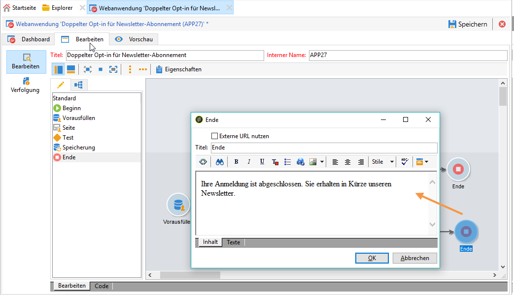

1. Nachdem das Webformular erstellt und konfiguriert wurde, können Sie es in der Versandvorlage referenzieren, um Bestätigungsnachrichten zu senden.

   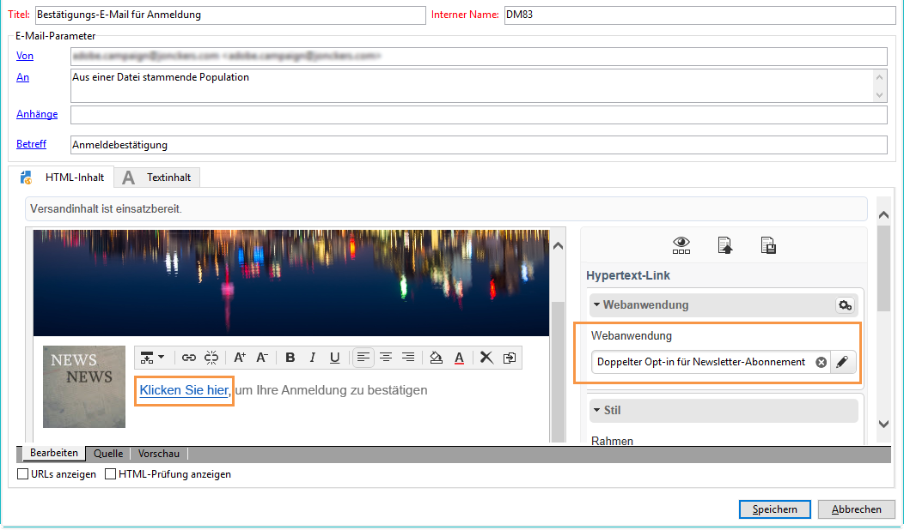

### Schritt 4: Publikation und Testen des Formulars {#step-4---publishing-and-testing-the-form}

Sie können jetzt das Formular publizieren, damit die Benutzer darauf zugreifen können.

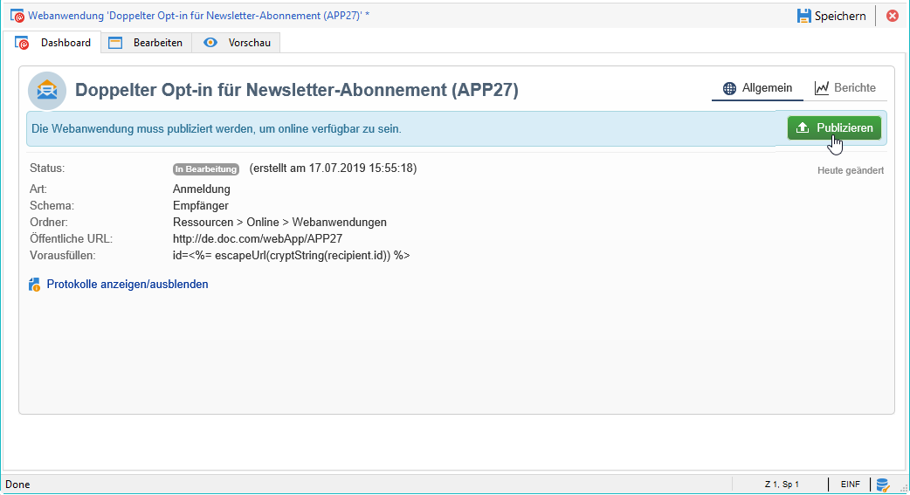

Die Anmeldung zum Newsletter beinhaltet die folgenden Schritte:

1. Der Benutzer der Website loggt sich in der Anmeldeseite ein und validiert das Formular.

   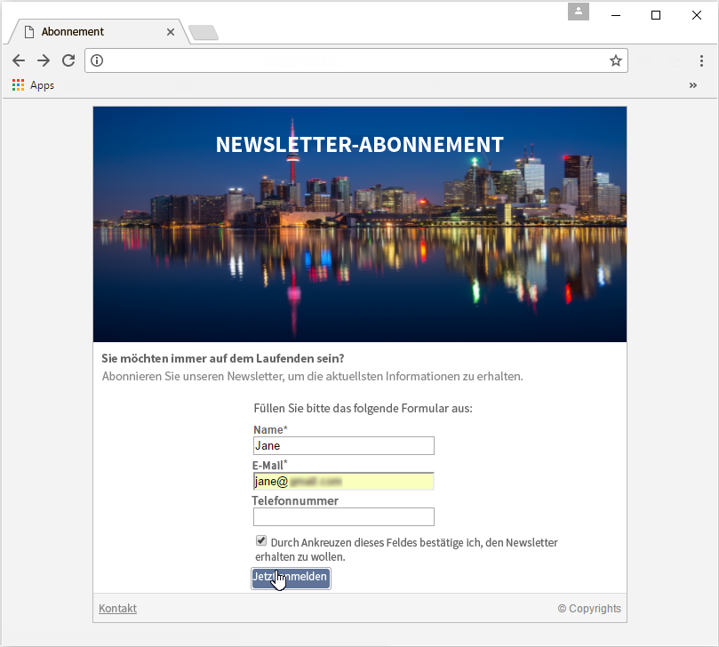

   Eine Nachricht in seinem Browser informiert ihn, dass seine Anfrage eingegangen ist.

   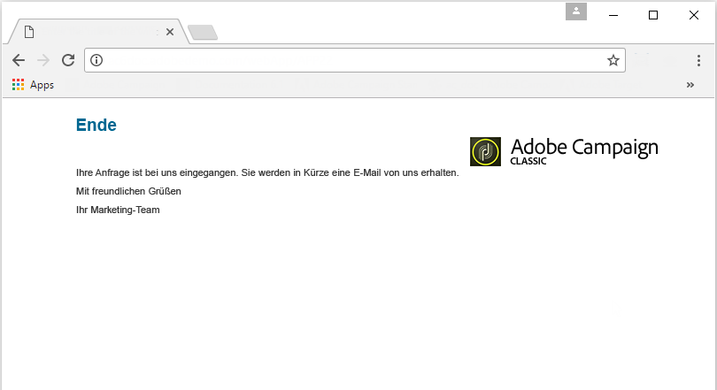

   The user is added to the Adobe Campaign database in the **[!UICONTROL Temp]** folder, and their profile is added to the block list until they confirm their subscription with the email.

   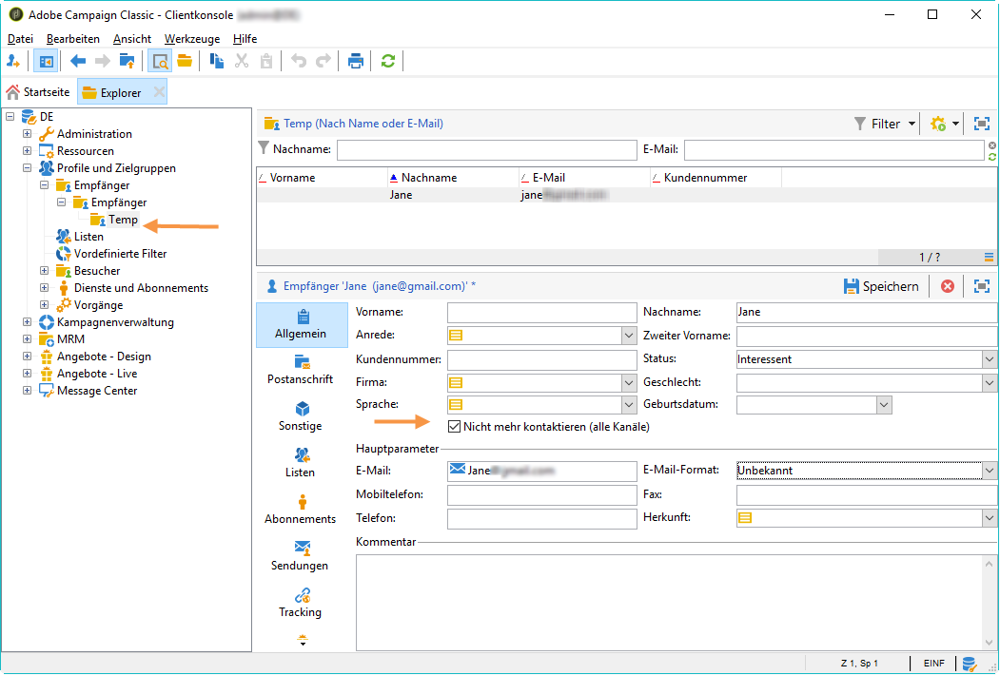

1. Er erhält eine Bestätigungsnachricht mit einem Link zur Abonnement-Bestätigung.

   

1. Wenn er auf diesen Link klickt, wird in seinem Browser die Bestätigungsseite angezeigt.

   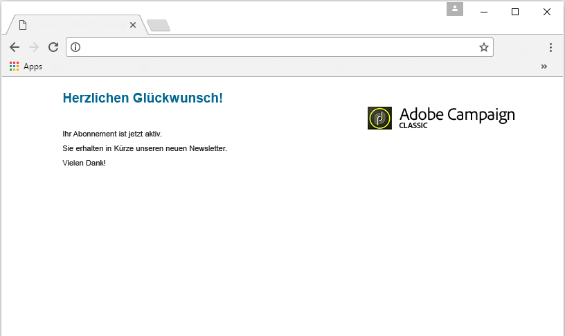

   Das Benutzerprofil wird in Adobe Campaign aktualisiert:

   * sie befinden sich nicht mehr auf der blockierungsliste,
   * und wurde zum Informationsdienst angemeldet.

      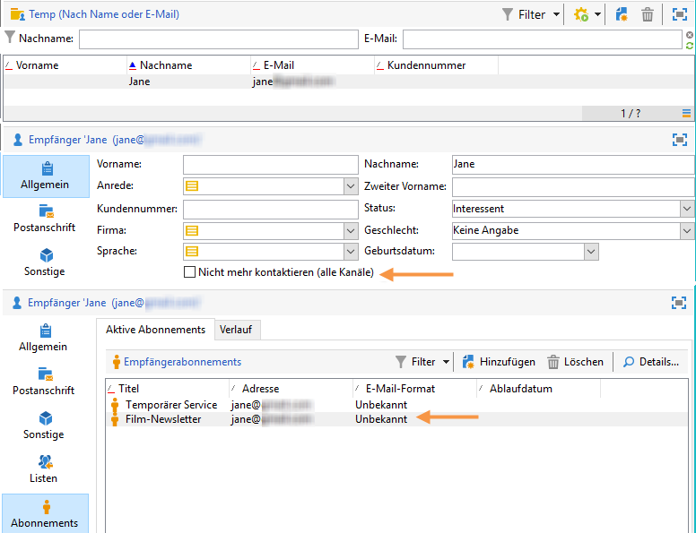

## Je nach den ausgewählten Werten unterschiedliche Optionen anzeigen {#displaying-different-options-depending-on-the-selected-values}

Im folgenden Beispiel wird der Benutzer gebeten, einen Fahrzeugtyp auszuwählen. Die verfügbaren Fahrzeugkategorien werden entsprechend dem ausgewählten Typ angezeigt. Das bedeutet, dass die Elemente in der rechten Spalte von der Auswahl durch den Benutzer abhängen.

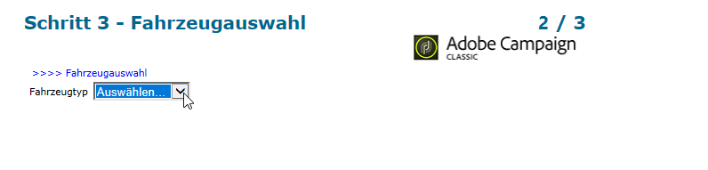

* Wenn der Benutzer &quot;Personenfahrzeug&quot; auswählt, werden die Kategorien &quot;Kompakt&quot; und &quot;Minivan&quot; angezeigt.

   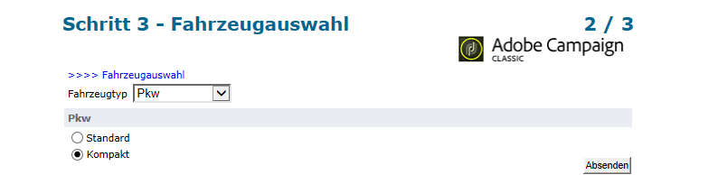

* Wenn der Benutzer &quot;Nutzfahrzeug&quot; auswählt, wird in einer Dropdown-Liste eine Auswahl angeboten.

   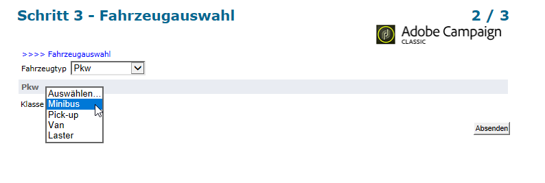

In diesem Beispiel wird der Fahrzeugtyp nicht in der Datenbank gespeichert. Die Dropdown-Liste wird wie folgt konfiguriert:

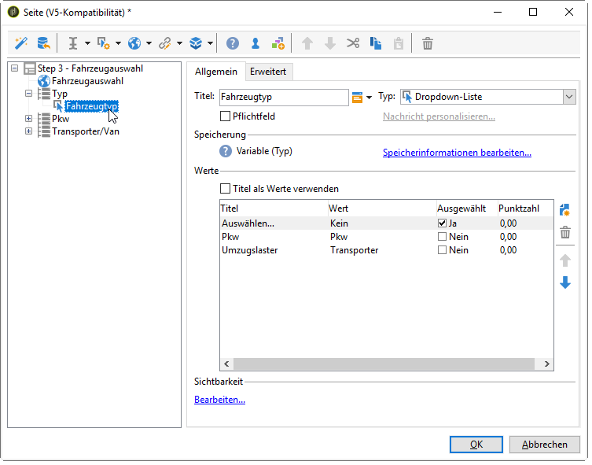

Diese Information wird in einer lokalen Variable gespeichert.

Die bedingte Anzeige in der rechten Spalte wird in Containern konfiguriert:

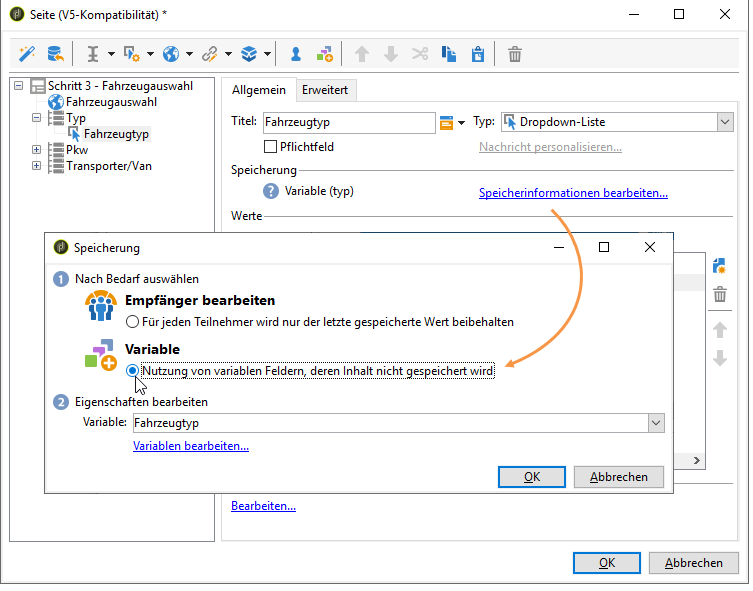

* Bedingte Sichtbarkeit der Felder für ein Personenfahrzeug:

   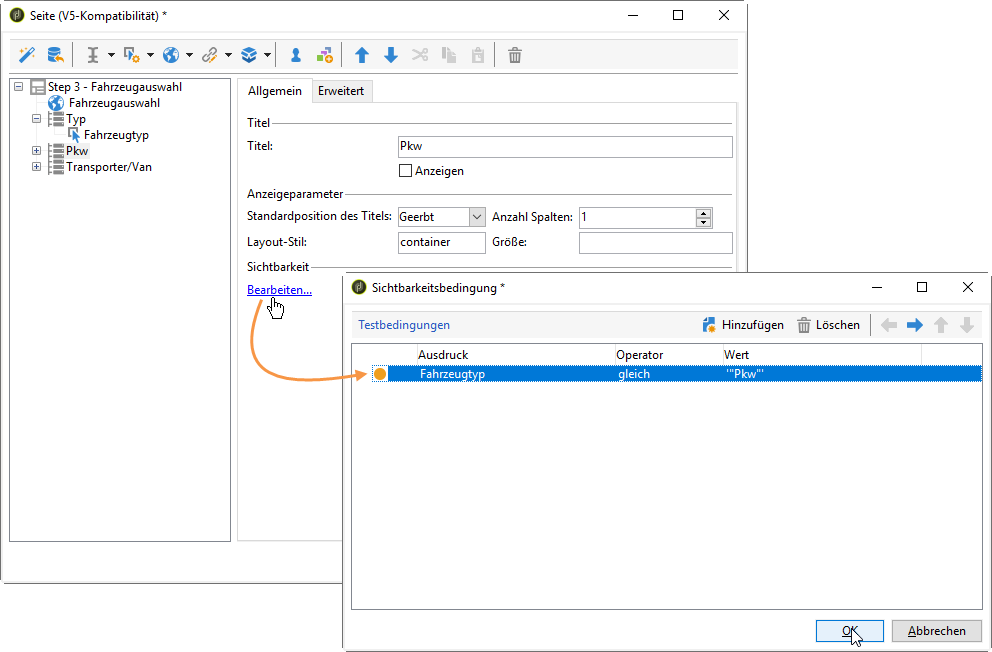

* Bedingte Sichtbarkeit der Felder für ein Nutzfahrzeug:

   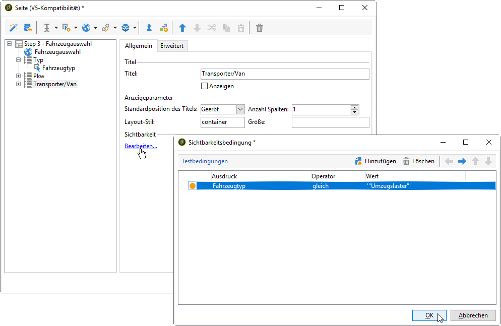

