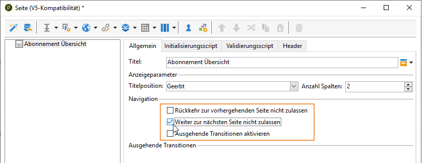
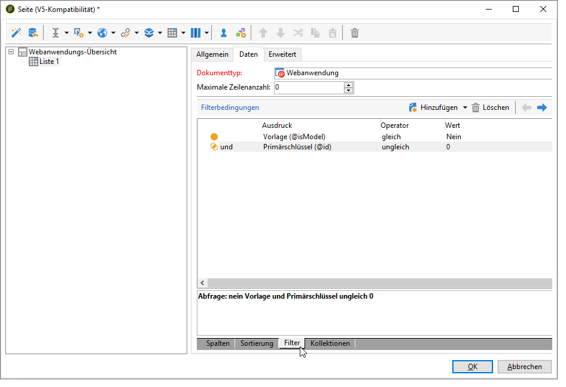
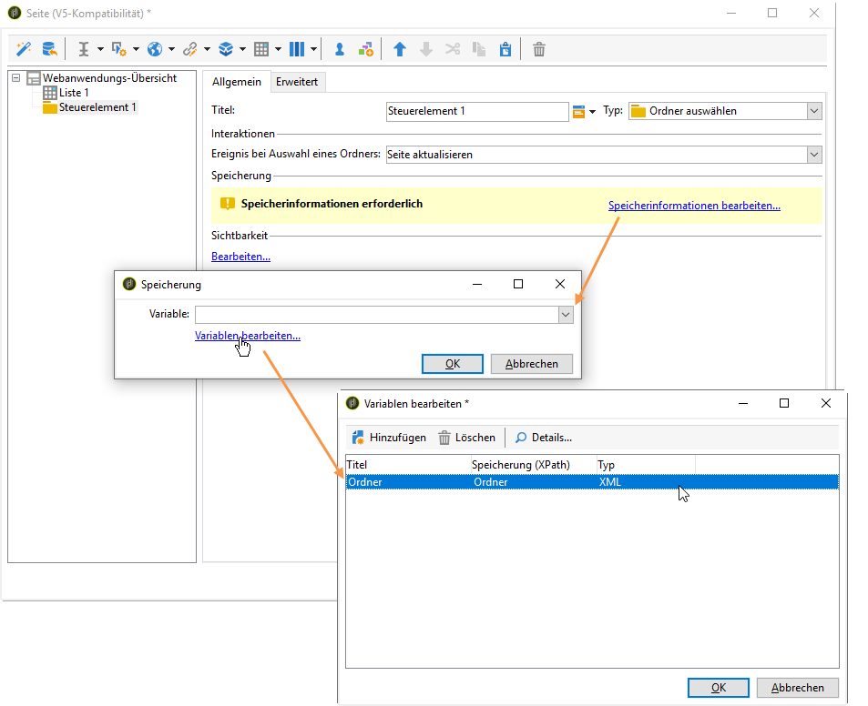
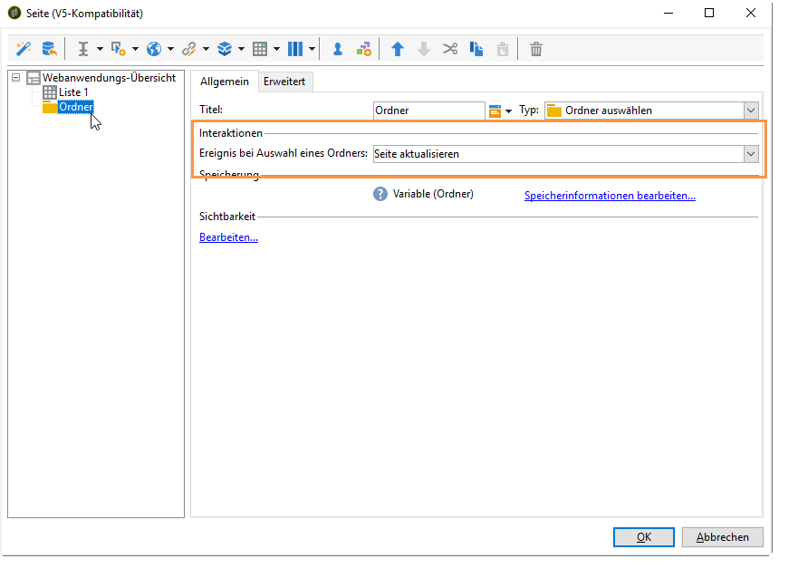
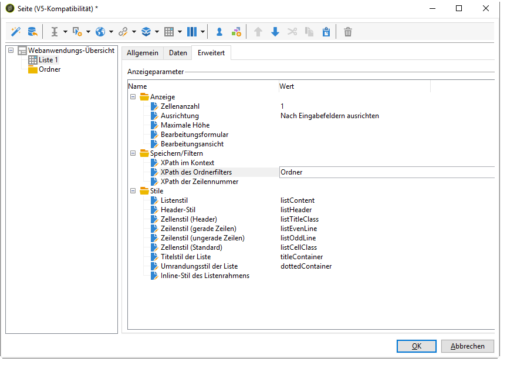
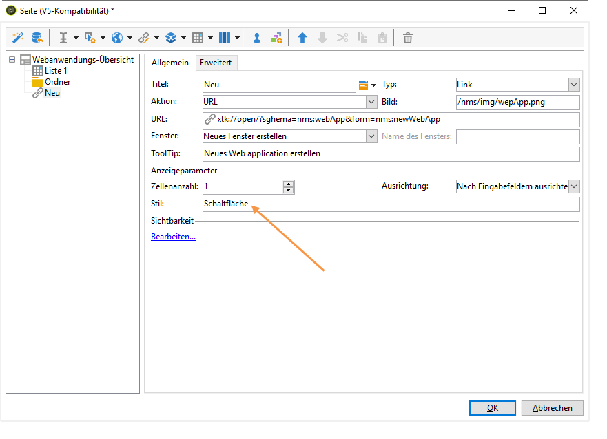
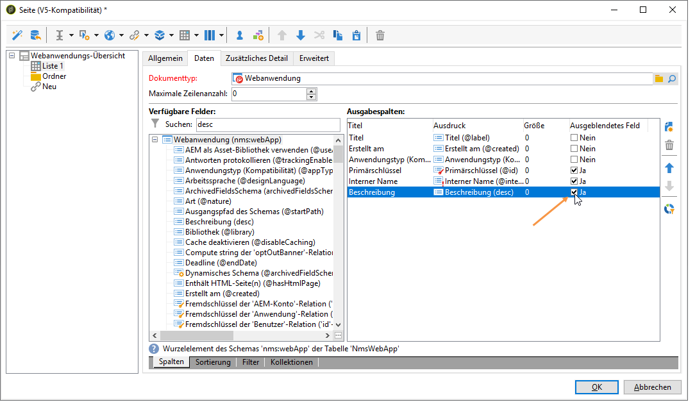
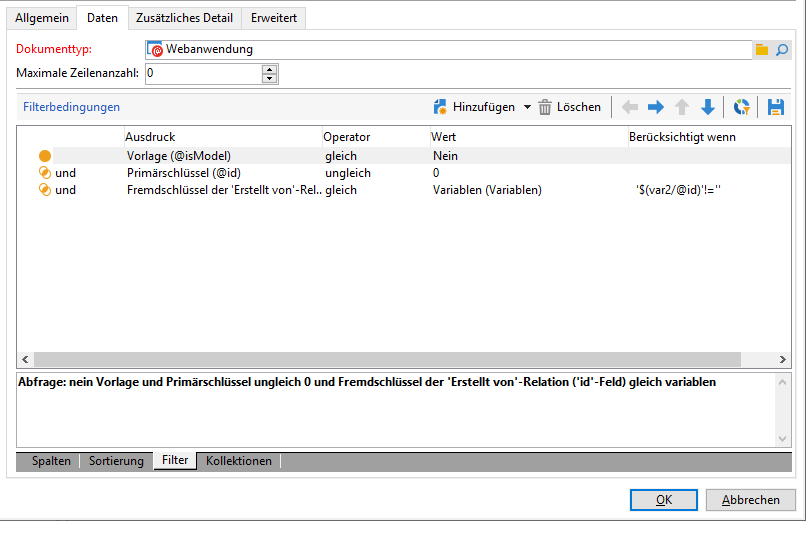

# Anwendungsbeispiele: Übersichten erstellen {#use-cases-creating-overviews}


Im folgenden Beispiel werden Webanwendungen vom Typ &quot;Übersicht&quot; erstellt, in denen alle Webanwendungen in Ihrer Datenbank angezeigt werden. Konfigurieren Sie dazu die folgenden Elemente:

* Einen Filter für den Ordner (siehe [Ordner-Filter hinzufügen](#adding-a-filter-on-a-folder)),
* Eine Schaltfläche zum Erstellen einer neuen Webanwendung (siehe [Schaltfläche hinzufügen, um eine neue Webanwendung zu konfigurieren](#adding-a-button-to-configure-a-new-web-application)),
* Detailanzeige für jeden Eintrag in der Liste (siehe [Detail zu einer Liste hinzufügen](#adding-detail-to-a-list)),
* Ein Filter pro Tool zur Bearbeitung von Links (siehe [Filter mit einem Link-Editor erstellen](#creating-a-filter-using-a-link-editor)),
* Einen Link zum Aktualisieren (siehe [Aktualisierungslink erstellen](#creating-a-refresh-link)).


## Einseitige Web-Anwendung erstellen {#creating-a-single-page-web-application}

1. Erstellen Sie eine **[!UICONTROL einseitige Webanwendung]** und deaktivieren Sie ausgehende Transitionen und Transitionen zur nächsten Seite.

   

1. Ändern Sie den Seitentitel.

   Dieser Titel wird im Header der Webanwendungs-Übersicht angezeigt.

1. Ändern Sie in den Eigenschaften der Webanwendung das Rendering der Anwendung, indem Sie die Vorlage **[!UICONTROL Einseitige Webanwendung]** auswählen.

   

1. Öffnen Sie die Aktivität **[!UICONTROL Seite]** Ihrer Webanwendung und danach eine Liste (**[!UICONTROL Statische Elemente > Liste]**).
1. Wählen Sie in der Liste im Tab **[!UICONTROL Daten]** den Typ der **[!UICONTROL Webanwendung]** sowie den **[!UICONTROL Titel]**, das **[!UICONTROL Erstellungsdatum]** und die Ausgabespalten des **[!UICONTROL Anwendungstyps]** aus.
1. Erstellen Sie im Untertab **[!UICONTROL Filter]** (wie unten dargestellt) den folgenden Filter, sodass nur Webanwendungen angezeigt und Vorlagen verborgen werden.

   

1. Schließen Sie das Konfigurationsfenster der Seite und wählen Sie **[!UICONTROL Vorschau]** aus.

   Daraufhin wird die Liste der in Ihrer Datenbank verfügbaren Webanwendungen angezeigt.

   

## Ordner-Filter hinzufügen {#adding-a-filter-on-a-folder}

In der Übersicht haben Sie die Möglichkeit, auf Daten abhängig von ihrem Speicherort im Adobe Campaign-Baum zuzugreifen. Dies wird durch einen Ordner-Filter ermöglicht. Gehen Sie folgendermaßen vor, um einen Ordner-Filter zu Ihrer Übersicht hinzuzufügen.

1. Platzieren Sie den Cursor auf den Knoten **[!UICONTROL Seite]** Ihrer Webanwendung und fügen Sie das Element **[!UICONTROL Ordner auswählen]** hinzu (**[!UICONTROL Erweiterte Steuerelemente > Ordner auswählen]**).
1. Wählen Sie im sich öffnenden Fenster **[!UICONTROL Speicherung]** den Link **[!UICONTROL Variablen bearbeiten...]** aus.
1. Ändern Sie den Titel der Variablen nach Bedarf.
1. Ändern Sie den Variablennamen in den Wert des Ordners **folder**.

   >[!NOTE]
   >
   >Der Name der Variablen muss mit dem Namen des Elements übereinstimmen, das mit dem (im Schema definierten) Ordner verknüpft ist, d. h. in diesem Fall mit dem **Ordner**. Sie müssen diesen Namen erneut verwenden, wenn Sie auf die Tabelle verweisen.

1. Wählen Sie für die Variable den Typ **[!UICONTROL XML]**.

   

1. Wählen Sie die Interaktion **[!UICONTROL Seite aktualisieren]** aus.

   

1. Platzieren Sie den Cursor in Ihrer Liste und verweisen Sie im Tab **[!UICONTROL Erweitert]** auf die Variable, die Sie zuvor im Tab **[!UICONTROL XPath des Ordnerfilters]** der Liste erstellt haben. Sie müssen den Namen des vom Ordner-Link betroffenen Elements verwenden, d. h. den **Ordner**.

   

   >[!NOTE]
   >
   >In dieser Phase befindet sich die Webanwendung nicht in ihrem Anwendungskontext. Der Filter kann daher nicht am Ordner getestet werden.

## Schaltfläche hinzufügen, um eine neue Web-Anwendung zu konfigurieren {#adding-a-button-to-configure-a-new-web-application}

1. Platzieren Sie den Cursor auf das Element **[!UICONTROL Seite]** und fügen Sie einen Link hinzu (**[!UICONTROL Statische Elemente > Link]**).
1. Ändern Sie den Link-Titel. Dieser wird auf der Schaltfläche in der Übersicht angezeigt.

   In unserem Beispiel lautet der Titel **Neu**.

1. Fügen Sie die folgende URL in das URL-Feld ein: **xtk://open/?schema=nms:webApp&amp;form=nms:newWebApp**.

   >[!NOTE]
   >
   >**nms:webApp** entspricht dem Schema der Webanwendung.
   >
   >**nms:newWebApp** entspricht dem Erstellungsassistenten für die neue Webanwendung.

1. Definieren Sie, dass die URL im selben Fenster erscheinen soll.
1. Fügen Sie das Webanwendungssymbol im Bildfeld hinzu: **/nms/img/webApp.png**.

   Dieses Symbol wird auf der Schaltfläche **[!UICONTROL Neu]** angezeigt.

1. Geben Sie **button** im Feld **[!UICONTROL Stil]** ein.

   Dieser Stil ist in der zuvor ausgewählten Vorlage **[!UICONTROL Einseitige Webanwendung]** definiert.

   

## Detail zu einer Liste hinzufügen {#adding-detail-to-a-list}

Wenn Sie in der Übersicht eine Liste konfigurieren, können Sie für jeden Eintrag auf der Liste zusätzliche Details anzeigen lassen.

1. Platzieren Sie den Cursor auf das zuvor erstellte Listenelement.
1. Wählen Sie im Tab **[!UICONTROL Allgemein]** in der Dropdown-Liste den Anzeigemodus **[!UICONTROL Spalten und zusätzliche Details]** aus.

   

1. Fügen Sie im Tab **[!UICONTROL Daten]** die Optionen **[!UICONTROL Primärschlüssel]**, **[!UICONTROL interner Name]** und **[!UICONTROL Beschreibung]** hinzu und wählen Sie für jede dieser Optionen **[!UICONTROL Ausgeblendetes Feld]** aus.

   

   Diese Informationen werden in der Folge nur in der Detailansicht eines jeden Eintrags sichtbar sein.

1. Fügen Sie im Tab **[!UICONTROL Zusätzliches Detail]** den folgenden Code hinzu:

   ```
   <div class="detailBox">
     <div class="actionBox">
       <span class="action"><a title="Open" class="linkAction" href="xtk://open/?schema=nms:webApp&form=nms:webApp&pk=
       <%=webApp.id%>">Open...</a></span>
       <% 
       if( webApp.@appType == 1 ) { //survey
       %>
       <span class="action"><a target="_blank" title="Reports" class="linkAction" href="/xtk/report.jssp?_context=selection&
         _schema=nms:webApp&_selection=<%=webApp.@id%>
         &__sessiontoken=<%=document.controller.getSessionToken()%>">Reports</a></span>
       <% 
       } 
       %>
     </div>
     <div>
       Internal name: <%= webApp.@internalName %>
     </div>
     <%
     if( webApp.desc != "" )
     {
     %>
     <div>
       Description: <%= webApp.desc %>
     </div>
     <% 
     } 
     %>
   </div>
   ```

>[!NOTE]
>
>Es dauert fünf Minuten, bis JavaScript-Bibliotheken auf dem Server aktualisiert werden. Sie können den Server auch neu starten, um diese Wartezeit zu verkürzen.

## Liste filtern und aktualisieren {#filtering-and-updating-the-list}

In diesem Abschnitt wird ein Filter zum Anzeigen der Webanwendungen erstellt, die von einem bestimmten Benutzer erzeugt wurden. Dieser Filter wird mit einem Link-Editor erstellt. Wählen Sie zuerst einen Benutzer aus und aktualisieren Sie danach die Liste, um den Filter anzuwenden. Dazu muss auch ein Aktualisieren-Link erstellt werden.

Diese beiden Elemente werden im selben Container abgelegt, damit sie in der Übersicht gemeinsam dargestellt werden.

1. Platzieren Sie den Cursor auf das Element **[!UICONTROL Seite]** und wählen Sie **[!UICONTROL Container > Standard]** aus.
1. Wählen Sie für die Anzahl der Spalten &quot;**2**&quot;, sodass der Link-Editor und der Link nebeneinander platziert werden.

   

   Weiterführende Informationen zum Layout von Elementen erfahren Sie in [diesem Abschnitt](about-web-forms.md).

1. Wenden Sie **dottedFilter** an.

   Dieser Stil ist in der zuvor ausgewählten Vorlage **[!UICONTROL Einseitige Webanwendung]** definiert.

   

### Filter mit einem Link-Editor erstellen {#creating-a-filter-using-a-link-editor}

1. Platzieren Sie den Cursor auf den im vorherigen Schritt erstellten Container und fügen Sie mithilfe des Menüs **[!UICONTROL Erweiterte Steuerelemente]** einen Link-Editor ein.
1. Wählen Sie im sich automatisch öffnenden Speicherfenster die Option **[!UICONTROL Variablen]** und danach den Link **[!UICONTROL Variablen bearbeiten...]** aus und erstellen Sie eine XML-Variable zum Filtern von Daten.

   

1. Passen Sie den Titel an.

   Dieser wird in der Übersicht neben dem Feld **[!UICONTROL Filter]** zu sehen sein.

1. Wählen Sie die Benutzer-Tabelle als Anwendungsschema aus.

   

1. Platzieren Sie den Cursor auf das Listenelement und erstellen Sie im Tab **[!UICONTROL Daten > Filter]** einen Filter:

   * **Ausdruck:** Fremdschlüssel des Links &quot;Erstellt von&quot;
   * **Benutzer:** gleich
   * **Wert:** Variablen (variables)
   * **Berücksichtigt wenn:** &#39;$(var2/@id)&#39;!=&#39;&#39;

   

>[!CAUTION]
>
>Der Benutzer der Webanwendung muss sich identifizieren und über die entsprechenden Adobe Campaign-Berechtigungen zum Zugriff auf diese Informationen verfügen.

### Aktualisierungs-Link erstellen {#creating-a-refresh-link}

1. Platzieren Sie den Cursor auf den Container und fügen Sie einen **[!UICONTROL Link]** über das Menü **[!UICONTROL Statische Elemente]** ein.
1. Passen Sie den Titel an.
1. Wählen Sie **[!UICONTROL Listendaten aktualisieren]** aus.
1. Fügen Sie die zuvor erstellte Liste hinzu.

   

1. Fügen Sie das Aktualisierungssymbol im Feld **[!UICONTROL Bild]** hinzu: **/xtk/img/refresh.png**.
1. Ordnen Sie mithilfe der Sortierpfeile die unterschiedlichen Elemente der Webanwendung wie unten dargestellt neu.

   

Die Webanwendung ist jetzt konfiguriert. Wählen Sie den Tab **[!UICONTROL Vorschau]** aus, um sie in der Vorschau anzuzeigen.


