# Anwendungsbeispiele: Web-Formulare{#use-cases-web-forms}


## Abonnement-Formular mit zweifacher Bestätigung erstellen {#create-a-subscription--form-with-double-opt-in}

Wenn Sie Informationsdienste anbieten, müssen sich Empfänger für den Empfang aller verknüpften Nachrichten anmelden. Um unsachgemäße Kommunikation zu vermeiden und sicherzustellen, dass der Empfänger sich absichtlich angemeldet hat, empfehlen wir, eine Anmeldebestätigungsanfrage zu senden, um ein doppeltes Opt-in zu erstellen. Das Abonnement wird erst wirksam, wenn der Benutzer auf den in der Bestätigungsnachricht enthaltenen Link klickt.

Es wird von folgendem Szenario ausgegangen:

1. Erstellen eines Newsletter-Abonnementformulars auf einer Website, das ein Kontrollkästchen zum Abonnieren eines temporären Services enthält. Dieser Service ermöglicht den Versand von Bestätigungsnachrichten zu Abonnements.
1. Erstellen des Abonnementbestätigungsversands mit einer mit dem Web-Formular verknüpften Versandvorlage Sie enthält den Bestätigungs-Link, über den das Formular für die Newsletter-Anmeldung aufgerufen wird, und zeigt eine Meldung zur Abonnementgenehmigung an.

### Schritt 1: Erstellen von Informationsdiensten {#step-1---creating-information-services}

1. Erstellen Sie den Newsletter-Abonnementdienst, der Ihren Empfängern angeboten werden soll. Weiterführende Informationen zur Erstellung eines Newsletters finden Sie in [diesem Abschnitt](../../delivery/using/about-services-and-subscriptions.md).

   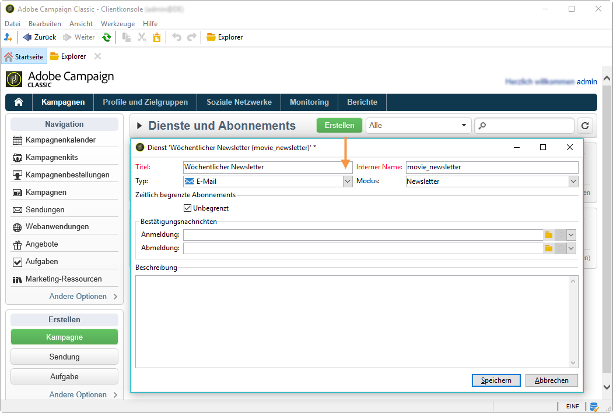

1. Erstellen Sie einen zweiten Informationsdienst, einen temporären Dienst, der mit einer Versandvorlage verknüpft ist, um Nachrichten zur Anmeldebestätigung zu versenden.

   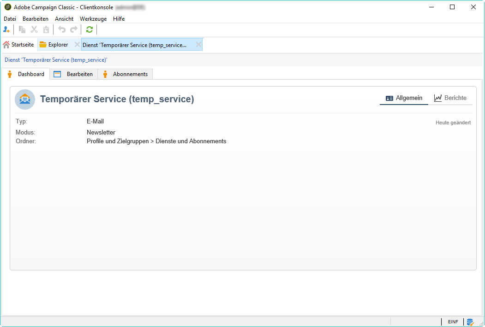

### Schritt 2: Erstellen von Bestätigungsnachrichten {#step-2---creating-confirmation-messages}

Bestätigungsnachrichten werden über eine spezielle Versandvorlage gesendet, die im temporären Dienst referenziert ist.

1. Wählen Sie im **[!UICONTROL Explorer]** die Option **[!UICONTROL Ressourcen > Vorlagen > Versandvorlagen]** aus.
1. Erstellen Sie eine Versandvorlage zum Senden der Anmeldebestätigung.
1. Wählen Sie in den **[!UICONTROL E-Mail-Parametern]** die Schaltfläche **[!UICONTROL An]** aus, um die Versandvorlage mit dem Abonnement-Zielgruppen-Mapping anstelle der Empfänger zu verbinden.

   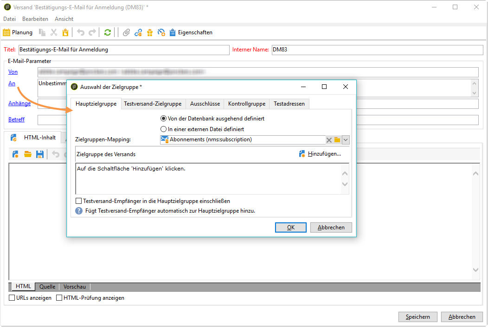

1. Da die Empfänger dieses Versands ihre Zustimmung nicht bestätigt haben, befinden sie sich immer noch auf der Blockierungsliste der Datenbank. Damit sie diese Mitteilung erhalten, müssen Sie Sendungen anhand dieser Vorlage für die gewünschten Empfänger autorisieren, die sich auf der Blockierungsliste befinden.

   Verwenden Sie dazu den Tab **[!UICONTROL Ausschlüsse]**.

1. Wählen Sie den Link **[!UICONTROL Bearbeiten...]** aus und deaktivieren Sie die Option **[!UICONTROL Empfänger ausschließen, die nicht mehr kontaktiert werden möchten]**.

   <!-- 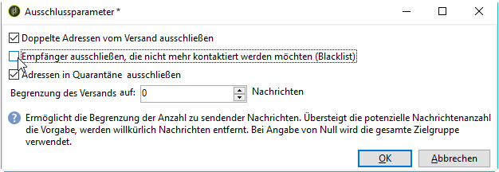-->

   >[!IMPORTANT]
   >
   >Diese Option darf nur in diesem Kontext deaktiviert werden.

1. Personalisieren Sie Ihren Versand und fügen Sie den Bestätigungs-Link in den Nachrichteninhalt ein. Über diesen Link können Sie auf das Web-Formular zugreifen, um Anmeldebestätigungen aufzuzeichnen.

   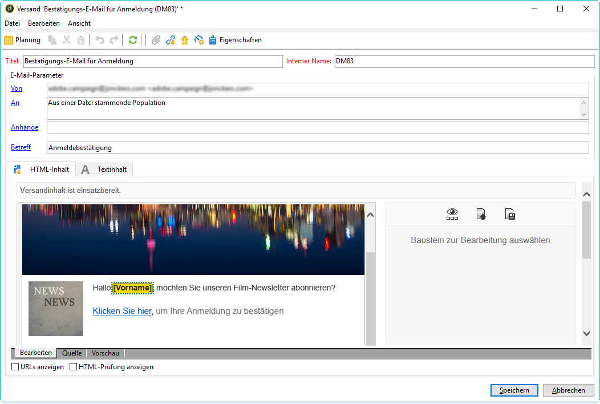

1. Verknüpfen Sie mit dem DCE Ihre URL mit dem Web-Formular. Da das Web-Formular noch nicht erstellt wurde, ersetzen Sie den Wert, sobald Sie ihn erstellen.

   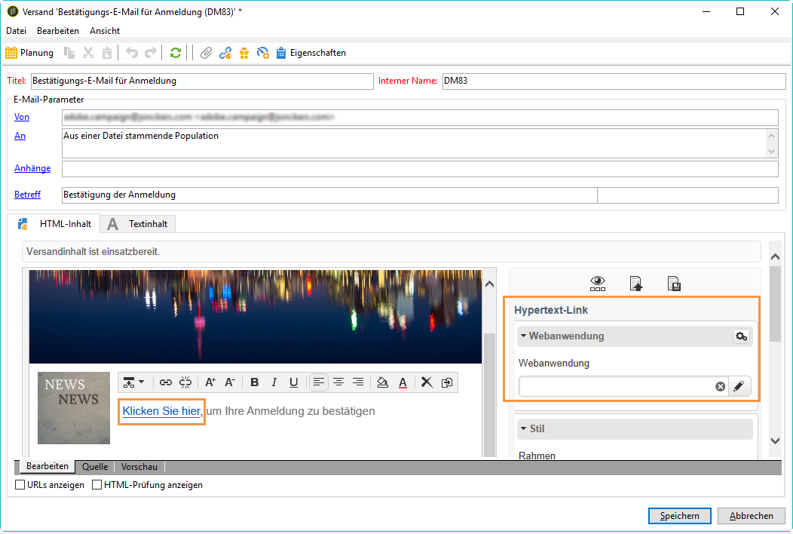

1. Verbinden Sie abschließend diese Vorlage mit dem zuvor erstellten temporären Dienst.

   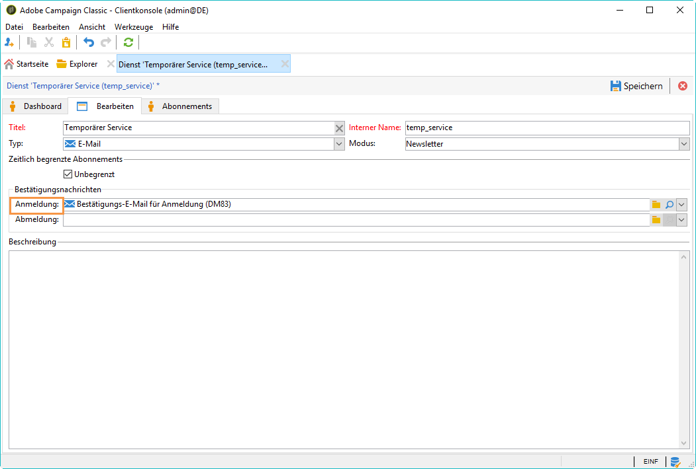

### &#x200B;3. Schritt: Erstellung des Anmeldeformulars {#step-3---creating-the-subscription-form}

Das Webformular ermöglicht sowohl die Anmeldung der Empfänger als auch die Anmeldebestätigung.

Der Webformular-Workflow umfasst die folgenden Aktivitäten:

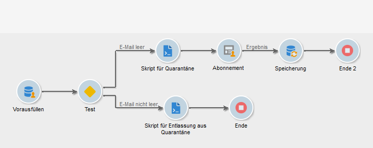

Gehen Sie dazu wie folgt vor:

1. Erstellen Sie ein Webformular und wählen Sie die Vorlage **[!UICONTROL Newsletter-Anmeldung (subNewsletter)]** aus.

   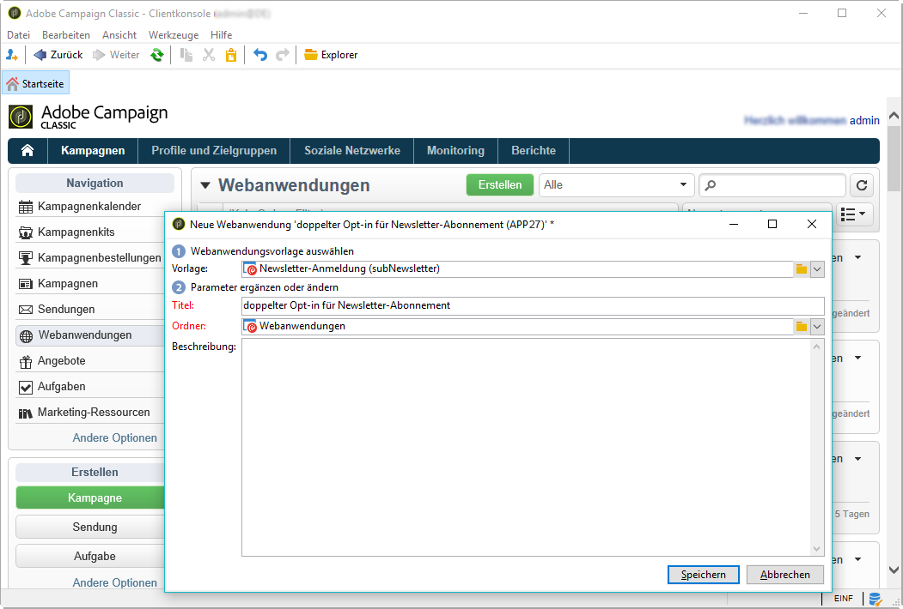

1. Im Tab **[!UICONTROL Bearbeiten]** muss der vorhandene Workflow konfiguriert werden, da eine Bestätigungsnachricht an die Empfänger, die sich anmelden möchten, hinzugefügt werden soll.

   Doppelklicken Sie dazu auf die Aktivität **[!UICONTROL Vorausfüllen]** und konfigurieren Sie sie wie folgt.

   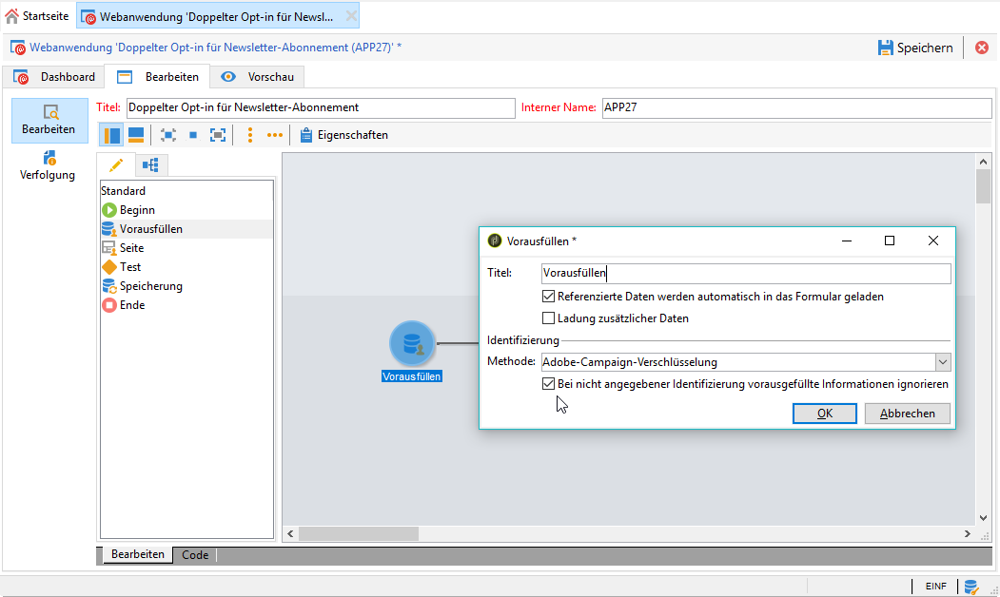

   Wenn der Benutzer also über den Link in der Bestätigungsnachricht auf dieses Formular zugreift, werden seine Profilinformationen geladen. Wenn sie über eine Seite der Website auf das Web-Formular zugreifen, werden keine Informationen geladen.

1. Fügen Sie eine **[!UICONTROL Test]**-Aktivität zu Ihrem Workflow hinzu.

   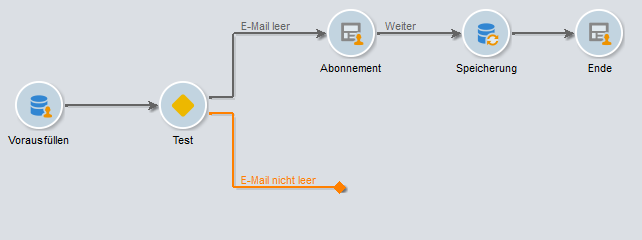

   Die **[!UICONTROL Test]**-Aktivität kann die Empfänger-E-Mail betreffen. Konfigurieren Sie ihn in diesem Fall wie folgt:

   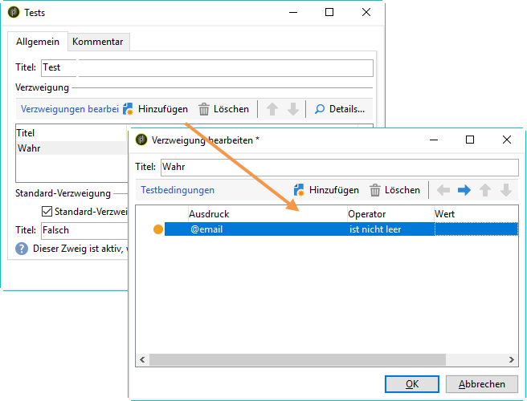

1. Fügen Sie zwei **[!UICONTROL Script]**-Aktivitäten zu Ihrem Workflow hinzu.

   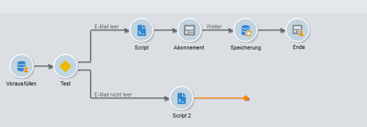

   Die erste **[!UICONTROL Script]**-Aktivität setzt Empfänger auf die Blockierungsliste, bis diese ihr Abonnement des Newsletters bestätigt haben. Der Inhalt muss wie folgt aussehen:

   ```
   ctx.recipient.@blackList=1
   ```

   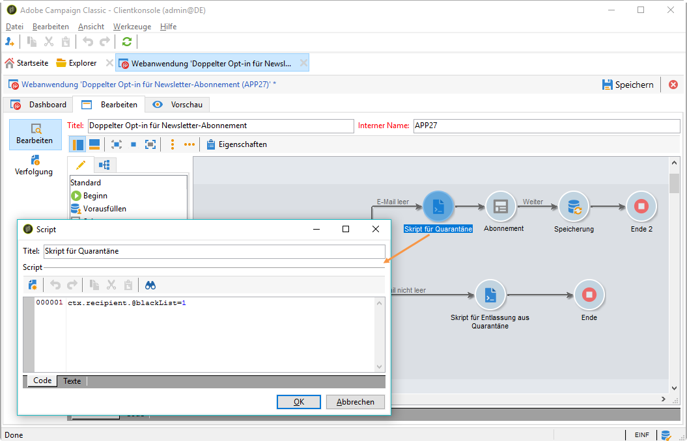

   Mit der zweiten **[!UICONTROL Script]**-Aktivität werden Sendungen an die Benutzer genehmigt. Außerdem werden diese zum Newsletter angemeldet. Die letzten beiden Zeilen des Skripts ermöglichen es Ihnen, Ihre Empfänger vom temporären Ordner in einen anderen Ordner zu übertragen und mit vorhandenen Profilen abzustimmen, sobald sie das Abonnement bestätigt haben.

   ```
   ctx.recipient.@blackList=0
   nms.subscription.Subscribe("INTERNAL_NAME_OF_THE_NEWSLETTER", ctx.recipient, false)
   ctx.recipient.folder = <folder name="nmsRootRecipient"/>
   nms.subscription.Unsubscribe("TEMP", ctx.recipient)
   ```

   >[!NOTE]
   >
   >Die Partition **[!UICONTROL Temp]** kann auch regelmäßig mit einem Workflow bereinigt werden.

   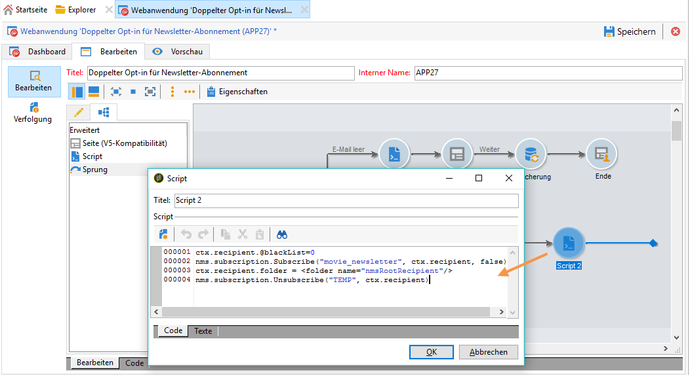

1. Doppelklicken Sie auf die **[!UICONTROL Abonnement]**-Aktivität, um das Anmeldeformular anzupassen und eine Checkbox mit dem zuvor erstellten temporären Dienst zu verbinden.

   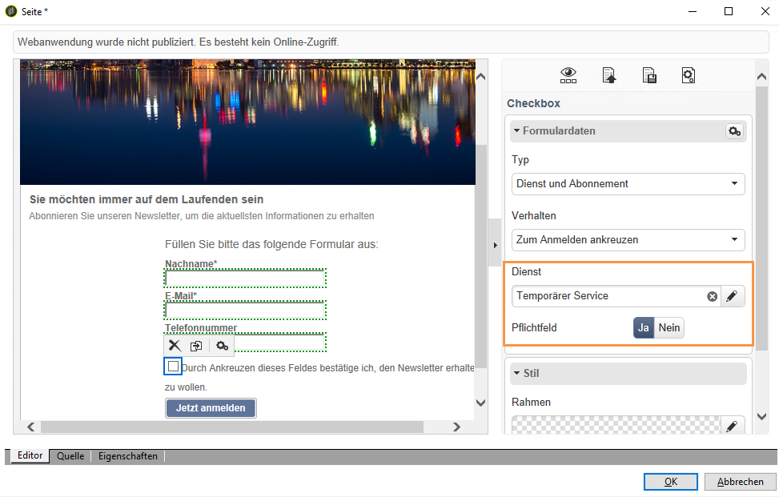

1. Konfigurieren Sie die Aktivität **[!UICONTROL Speicherung]**, um die auf der Formularseite eingegebenen Informationen zu speichern.

   Mit dieser Aktivität können Sie Empfängerprofile in einem speziellen temporären Ordner erstellen. Damit können Sie sie von den Profilen in der Datenbank trennen, denen Nachrichten gesendet werden können.

   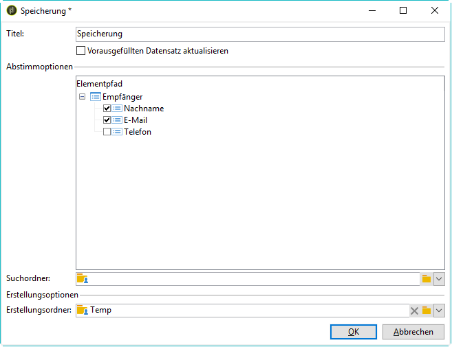

   >[!NOTE]
   >
   >Es dürfen keine Abstimmoptionen definiert werden.

1. Fügen Sie zwei **[!UICONTROL Ende]**-Aktivitäten hinzu, um dem Benutzer eine Nachricht anzuzeigen.

   Die zweite **[!UICONTROL Ende]**-Aktivität enthält die Bestätigungsnachricht, sobald die Anmeldung abgeschlossen ist.

   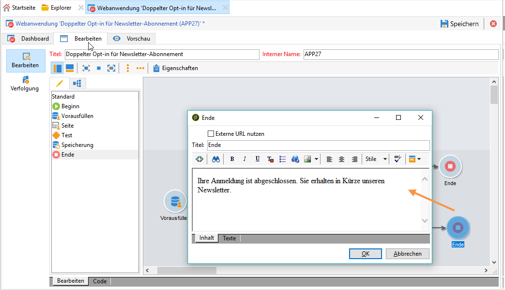

1. Nachdem das Webformular erstellt und konfiguriert wurde, können Sie es in der Versandvorlage referenzieren, um Bestätigungsnachrichten zu senden.

   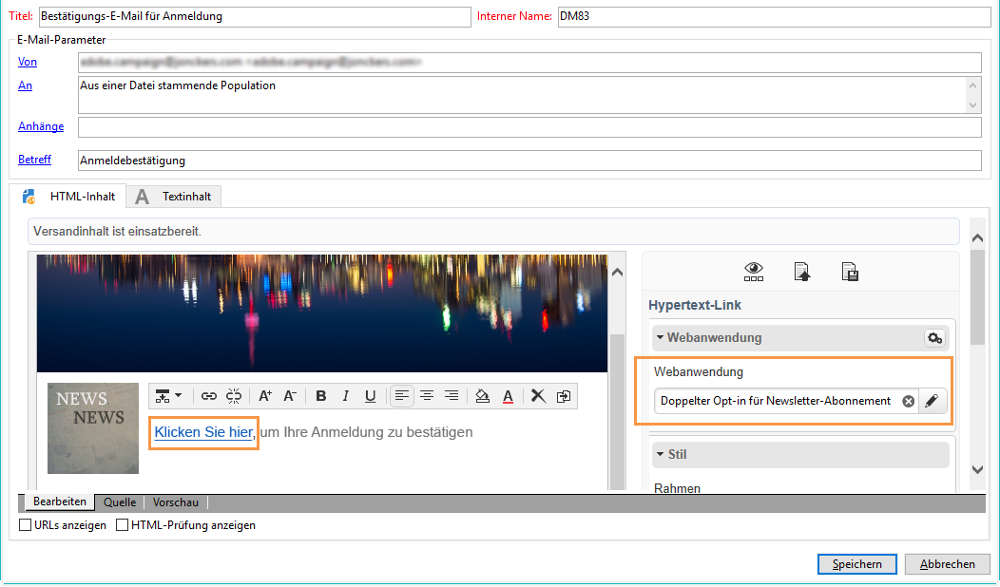

### Schritt 4: Veröffentlichung und Testen des Formulars {#step-4---publishing-and-testing-the-form}

Sie können jetzt das Formular veröffentlichen, damit die Benutzer darauf zugreifen können.

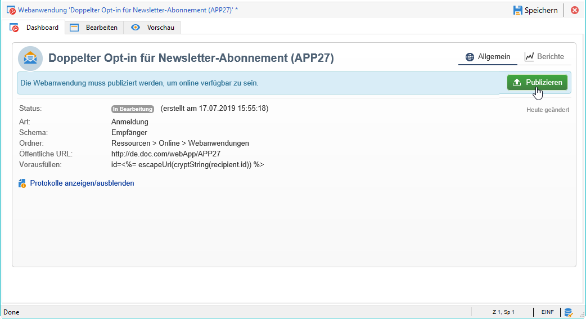

Die Anmeldung zum Newsletter beinhaltet die folgenden Schritte:

1. Der Benutzer der Website loggt sich in der Anmeldeseite ein und validiert das Formular.

   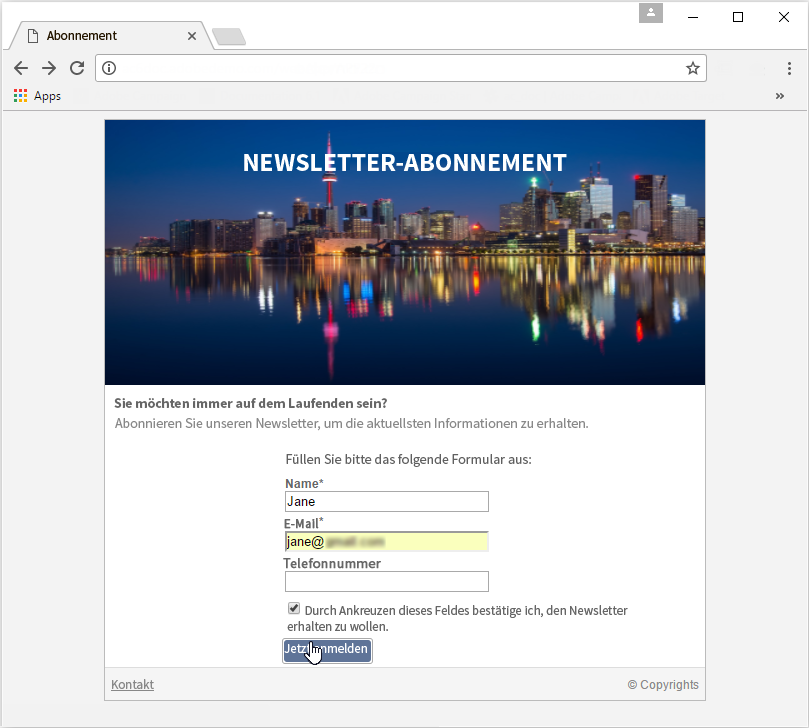

   Eine Nachricht in seinem Browser informiert ihn, dass seine Anfrage eingegangen ist.

   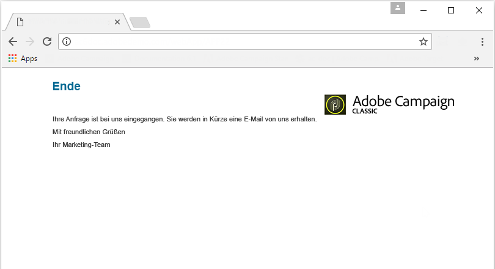

   Der Benutzer wird zum **[!UICONTROL Temp]**-Ordner der Adobe Campaign-Datenbank hinzugefügt; sein Profil wird auf die Blockierungsliste gesetzt, bis er seine Anmeldung über die E-Mail bestätigt.

   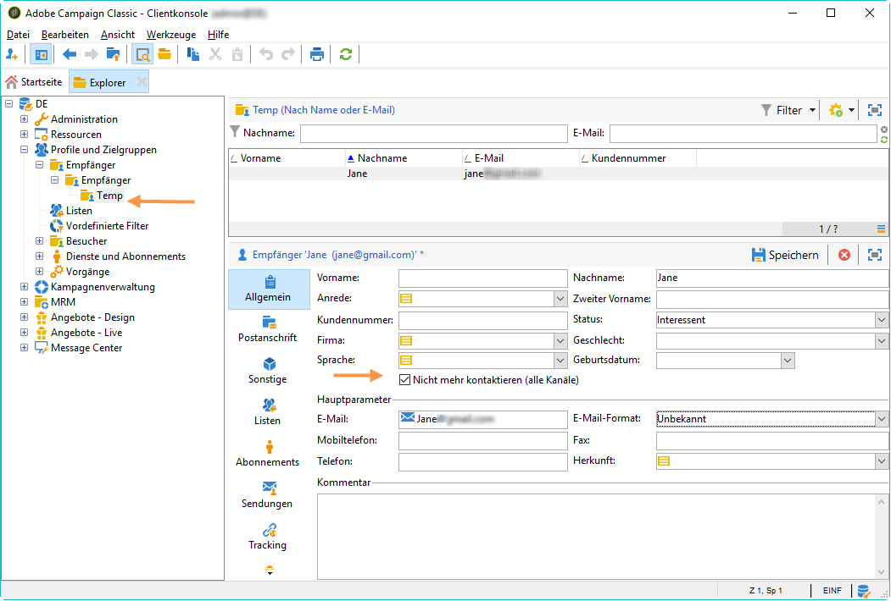

1. Er erhält eine Bestätigungsnachricht mit einem Link zur Abonnement-Bestätigung.

   

1. Wenn er auf diesen Link klickt, wird in seinem Browser die Bestätigungsseite angezeigt.

   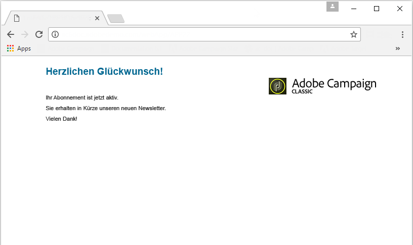

   Das Benutzerprofil wird in Adobe Campaign aktualisiert:

   * Es befindet sich nicht mehr auf der Blockierungsliste
   * und wurde zum Informationsdienst angemeldet.

     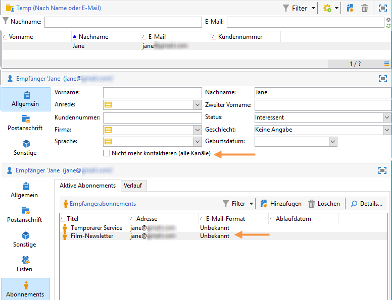

## Je nach den ausgewählten Werten unterschiedliche Optionen anzeigen {#displaying-different-options-depending-on-the-selected-values}

Im folgenden Beispiel wird der Benutzer aufgefordert, einen Fahrzeugtyp auszuwählen. Je nach ausgewähltem Typ können die verfügbaren Fahrzeugkategorien angezeigt werden. Das bedeutet, dass die in der rechten Spalte angezeigten Elemente von der Auswahl des Benutzers abhängen:

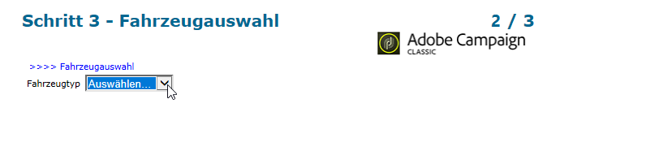

* Wenn der Benutzer &quot;Personenfahrzeug&quot; auswählt, werden die Kategorien &quot;Kompakt&quot; und &quot;Minivan&quot; angezeigt.

  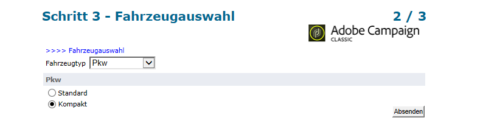

* Wenn der Benutzer &quot;Nutzfahrzeug&quot; auswählt, wird in einer Dropdown-Liste eine Auswahl angeboten.

  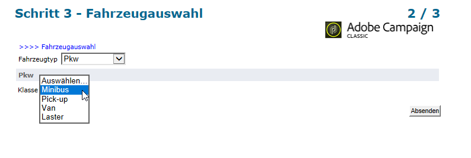

In diesem Beispiel wird der Fahrzeugtyp nicht in der Datenbank gespeichert. Die Dropdown-Liste ist wie folgt konfiguriert:

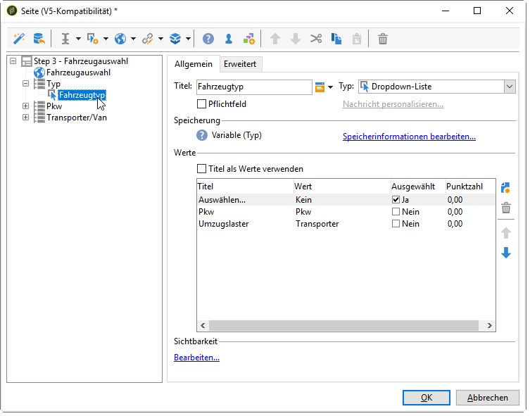

Diese Information wird in einer lokalen Variable gespeichert.

Die bedingte Anzeige in der rechten Spalte wird in Containern konfiguriert:

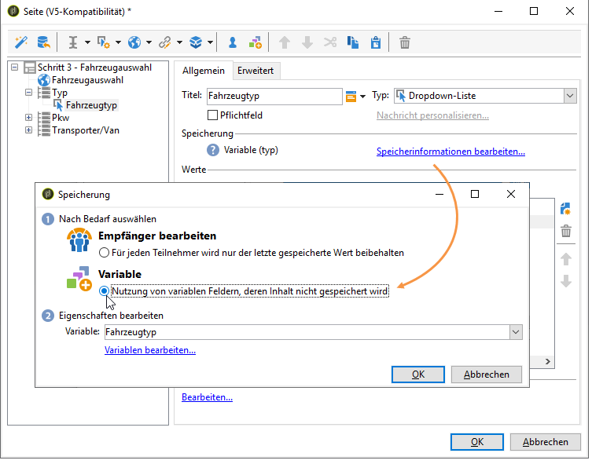

* Bedingte Sichtbarkeit der Felder für ein Personenfahrzeug:

  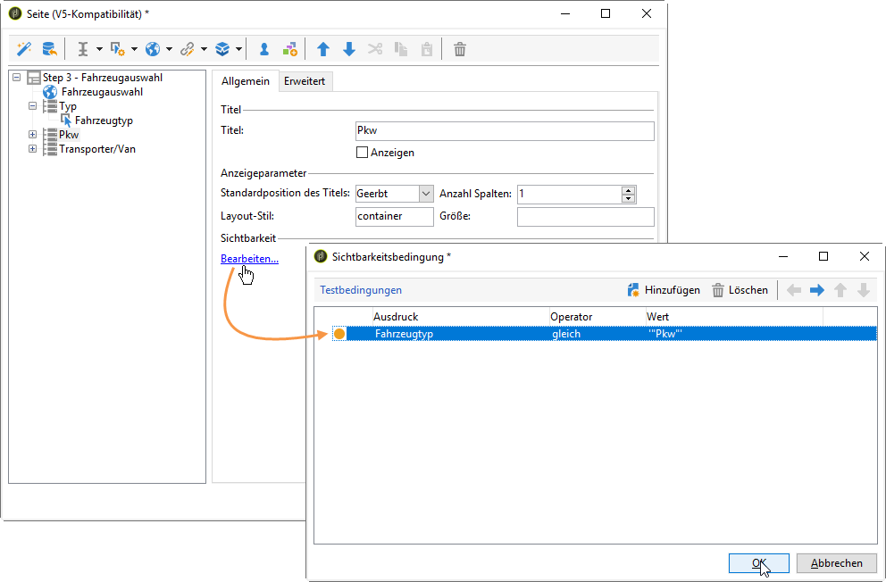

* Bedingte Sichtbarkeit der Felder für ein Nutzfahrzeug:

  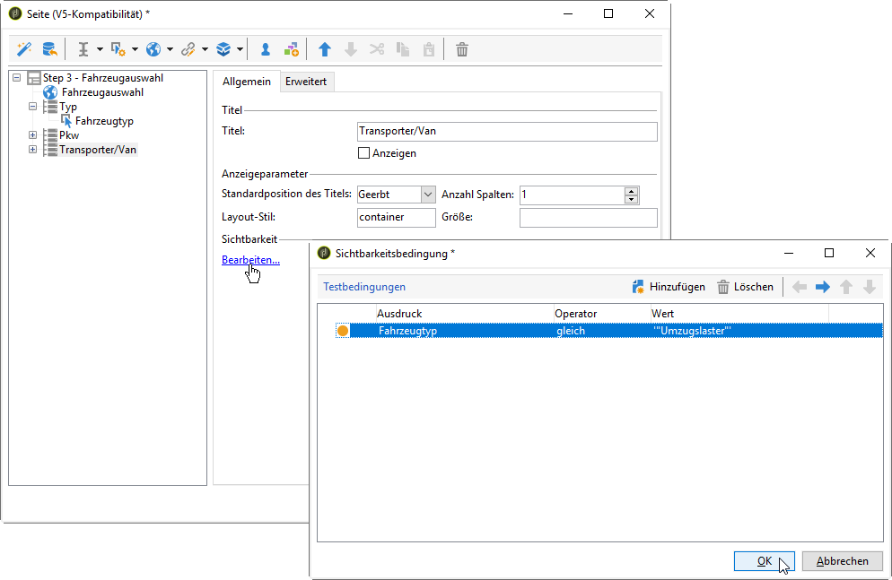
