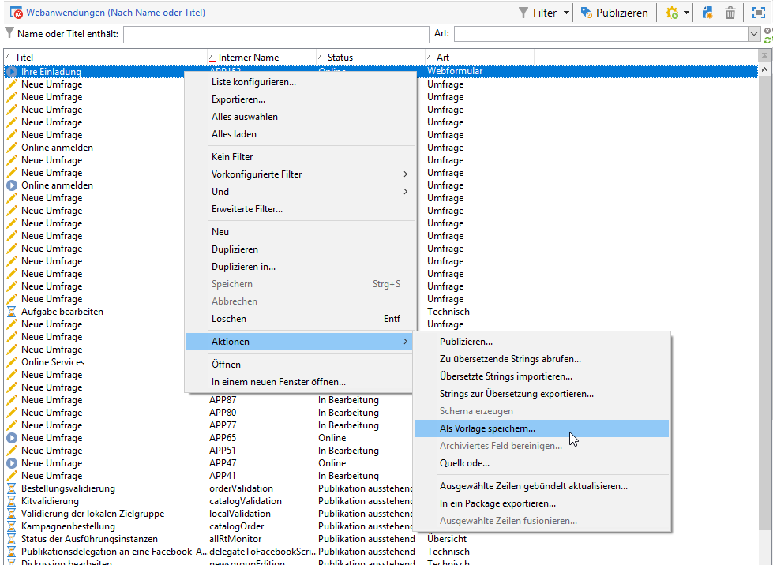
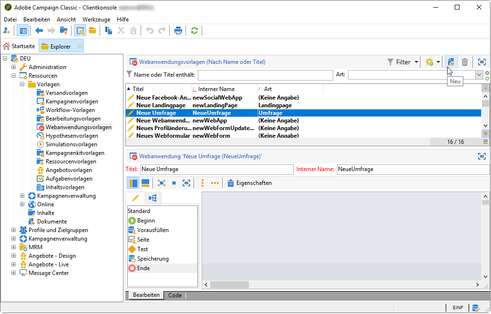
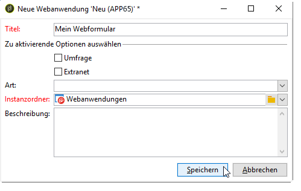

# Webformularvorlage verwenden{#using-a-web-form-template}

Formularvorlagen sind wiederverwendbare Konfigurationen, mit denen Sie neue Formulare erstellen können. Standardmäßig werden Formularvorlagen gemeinsam mit Webanwendungsvorlagen im Knoten **[!UICONTROL Ressourcen > Vorlagen > Webanwendungsvorlagen]** gespeichert.

Hier können Sie entweder neue Vorlagen erstellen oder ein bestehendes Formular in eine Vorlage umwandeln.

## Ein bestehendes Formular in eine Vorlage umwandeln {#convert-an-existing-form-into-a-template}

Sie können ein Formular in eine Vorlage umwandeln und seine Konfiguration wiederverwenden. Wählen Sie dazu das Formular aus, führen Sie einen Rechtsklick darauf aus und wählen Sie **[!UICONTROL Aktionen > Als Vorlage speichern...]** aus.

Dadurch öffnet sich ein Fenster zur Erstellung von Webanwendungen. Dort können Sie den Namen und die Beschreibung der Vorlage eingeben und den Ordner auswählen, in dem sie gespeichert werden soll.

## Neue Formularvorlage erstellen {#create-a-new-form-template}

Klicken Sie zur Erstellung einer Webformularvorlage mit der rechten Maustaste auf die Webanwendungsvorlagen-Liste und wählen Sie **[!UICONTROL Neu]** aus oder verwenden Sie die Schaltfläche **[!UICONTROL Neu]** oberhalb der Vorlagenliste.

Geben Sie den Namen der Vorlage ein. Wählen Sie im Feld **[!UICONTROL Instanzordner]** den Ordner aus, in dem die auf dieser Vorlage basierenden Webformulare gespeichert werden sollen. Über das Feld **[!UICONTROL Art]** können Sie eine Beschreibung zur Sortierung und/oder Filterung der unterschiedlichen Webanwendungsvorlagen hinzufügen.

Wählen Sie die Schaltfläche **[!UICONTROL Speichern]** aus, um die Vorlage zu erstellen. Definieren Sie dann den Inhalt dieser Vorlage und deren Parameter.

Jetzt können Sie diese Vorlage auswählen, um ein neues Formular zu erstellen.
