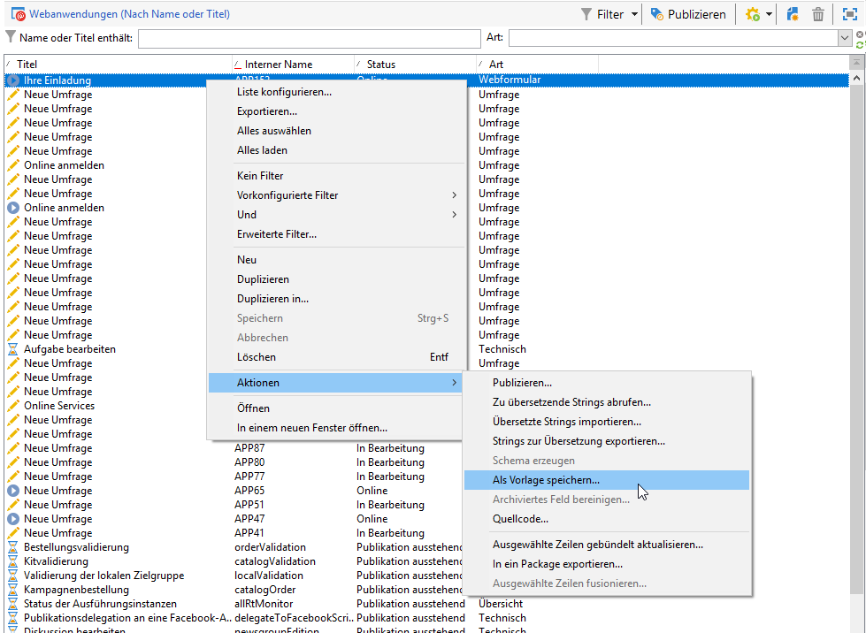
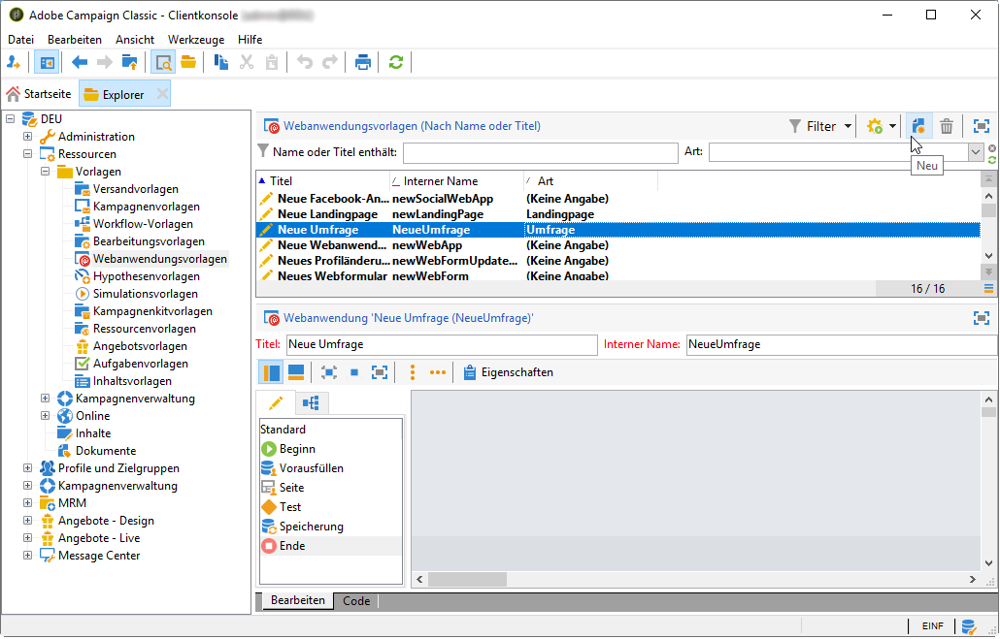
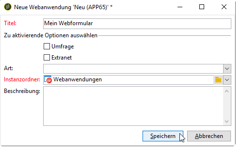

# Verwenden einer Web-Formularvorlage{#using-a-web-form-template}

Formularvorlagen sind wiederverwendbare Konfigurationen, mit denen Sie neue Formulare erstellen können. Standardmäßig werden Formularvorlagen gemeinsam mit Web-Anwendungsvorlagen im Knoten **[!UICONTROL Ressourcen > Vorlagen > Web-Anwendungsvorlagen]** gespeichert.

Hier können Sie entweder neue Vorlagen erstellen oder ein bestehendes Formular in eine Vorlage umwandeln.

## Ein bestehendes Formular in eine Vorlage umwandeln {#convert-an-existing-form-into-a-template}

Ein Formular kann in eine Vorlage umgewandelt und seine Konfiguration wiederverwendet werden. Wählen Sie dazu das Formular aus, klicken Sie mit der rechten Maustaste darauf und wählen Sie **[!UICONTROL Aktionen > Als Vorlage speichern...]**.

Diese Aktion öffnet das Fenster zum Erstellen von Web-Anwendungen. Dort können Sie den Namen und die Beschreibung der Vorlage eingeben und den Ordner auswählen, in dem sie gespeichert werden soll.

## Neue Formularvorlage erstellen {#create-a-new-form-template}

Um eine Web-Formularvorlage zu erstellen, klicken Sie mit der rechten Maustaste auf die Liste der Web-Anwendungsvorlagen und wählen Sie **[!UICONTROL Neu]**. Sie können auch die Schaltfläche **[!UICONTROL Neu]** oberhalb der Vorlagenliste verwenden.

Geben Sie den Namen der Vorlage ein. Wählen Sie im Feld **[!UICONTROL Instanzordner]** den Ordner aus, in dem die auf dieser Vorlage basierenden Webformulare gespeichert werden sollen. Über das Feld **[!UICONTROL Art]** können Sie eine Beschreibung zur Sortierung und/oder Filterung der unterschiedlichen Webanwendungsvorlagen hinzufügen.

Wählen Sie die Schaltfläche **[!UICONTROL Speichern]** aus, um die Vorlage zu erstellen. Definieren Sie dann den Inhalt dieser Vorlage und deren Parameter.

Jetzt können Sie diese Vorlage auswählen, um ein neues Formular zu erstellen.
