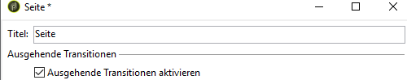
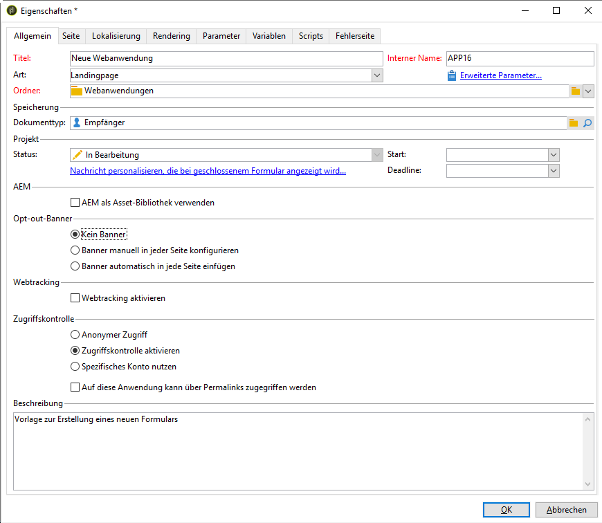

# Opt-out vom Webanwendungs-Tracking{#web-application-tracking-opt-out}

Adobe Campaign ermöglicht Ihnen, das Tracking des Verhaltens von Endbenutzern im Web zu stoppen, die sich vom Tracking mittels Cookies oder Web-Beacons abmelden. Die Funktion bietet auch die Möglichkeit, dem Endbenutzer ein Banner mit dieser Option anzuzeigen. Diese Banner können zu Webanwendungen oder Landingpages hinzugefügt werden.

Wenn sich ein Endbenutzer entscheidet, das Verhaltens-Tracking per Cookies oder Web-Beacons zu deaktivieren, wird diese Information mit JavaScript-APIs an den Adobe Campaign-Trackingserver gesendet. Beachten Sie, dass in manchen Ländern gesetzlich vorgeschrieben ist, dass Kunden den Endbenutzern eine Anmeldemöglichkeit bereitstellen müssen, bevor sie eine Abmeldemöglichkeit anbieten können (bzw. andere gesetzliche Anforderungen bestehen) und dass es in der Verantwortung des Kunden liegt, diese Gesetze einzuhalten.

>[!NOTE]
>
>Befolgen Sie beim Scripting stets die in der [Checkliste für Sicherheit und Datenschutz](https://helpx.adobe.com/de/campaign/kb/acc-security.html#dev) beschriebenen Richtlinien.

## Banner konfigurieren {#configuring-the-banner-}

Banner, die in Webanwendungen oder Landingpages angezeigt werden sollen, müssen konfiguriert werden.

Adobe Campaign stellt ein Musterbanner bereit, das Sie an Ihre Anforderungen anpassen müssen. Diese Bannerversion wird im Inhaltsmodell-Ordner als Gestaltungsbaustein angezeigt. Weiterführende Informationen dazu finden Sie auf [dieser Seite](../../delivery/using/personalization-blocks.md).

>[!IMPORTANT]
>
>Wenn Sie ein eigenes Banner erstellen möchten, personalisieren Sie das native Banner.

Um das Banner zu aktivieren, müssen Sie die Eigenschaften für Webanwendungen konfigurieren. Weitere Informationen hierzu finden Sie im Abschnitt [Webanwendungen konzipieren](../../web/using/designing-a-web-application.md).

Wenn Webtracking aktiviert ist, haben Sie folgende Möglichkeiten:

* Kein Banner
* Banner manuell in jeder Seite konfigurieren: Aktivieren Sie diese Option und wählen Sie das Banner in den Seiteneigenschaften auf jeder Seite aus.

   

* Banner automatisch in jede Seite einfügen: Wählen Sie das Banner direkt in den Eigenschaften der Webanwendung aus.

   

>[!NOTE]
>
>Für die Webanwendung v5 ist ein Kompatibilitätsmodus verfügbar, der dasselbe Verhalten aufweist.

Das Standardbanner hat folgende Struktur:

```
<div onClick="NL.ClientWebTracking.closeOptOutBanner(this);" id="defaultOptOutBanner">
  <p>Please insert your message here
   <a onClick="NL.ClientWebTracking.allow();" class="optout-accept">Accept</a>
   <a onClick="NL.ClientWebTracking.forbid();" class="optout-decline">Refuse</a>
  </p>
</div>
      
```

Ersetzen Sie **Please insert your message here** durch den Baustein, der Ihre Trackinginformation enthält. Dieser Austausch sollte in dem neuen, mit dem Opt-out-Banner verbundenen Gestaltungsbaustein ausgeführt werden.

Das Banner wird mit einer spezifischen CSS-Datei bereitgestellt. Sie können die Stile aber überschreiben, wenn Sie eine Webseite erstellen und konfigurieren. Weiterführende Informationen dazu finden Sie auf [dieser Seite](../../web/using/content-editor-interface.md).

## Opt-out-Cookie mit einer API einrichten {#setting-the-opt-out-cookie-using-api}

Adobe Campaign beinhaltet APIs, mit denen Sie den Cookie-Wert verwalten und Benutzereinstellungen abrufen können.

Der Cookie-Name ist **acoptout**. Die allgemeinen Werte sind:

* 0: Besucher hat Webtracking erlaubt (Standardwert)
* 1: Besucher verbietet Webtracking
* null: Besucher hat nichts ausgewählt, aber Webtracking ist erlaubt, da dies der Standardwert ist

Die verfügbaren clientseitigen APIs zur individuellen Anpassung des Banners sind:

* **NL.ClientWebTracking.allow()**: Stellt den Opt-out-Cookie-Wert so ein, dass Webtracking erlaubt ist. Webtracking ist standardmäßig erlaubt.
* **NL.ClientWebTracking.forbid()**: Stellt den Opt-out-Cookie-Wert so ein, dass Webtracking verboten ist. Der Besucher muss eine Eingabe vornehmen, damit Webtracking verboten wird.
* **NL.ClientWebTracking.closeOptOutBanner(bannerDomElt)**: Schließt das Opt-out-Cookie-Banner, nachdem der Besucher auf die Annehmen- oder Ablehnen-Schaltfläche geklickt hat (während der Klick-Event-Bubbling-Phase).

   bannerDomElt {DOMElement}: Das Wurzel-DOM-Element des Cookie-Banners, das entfernt werden muss

* **NL.ClientWebTracking.hasUserPrefs()**: Gibt &quot;true&quot; zurück, wenn der Besucher Einstellungen für das Webtracking ausgewählt hat.
* **NL.ClientWebTracking.getUserPrefs()**: Gibt den Opt-out-Cookie-Wert zurück, der die Eigenschaften des Benutzers definiert.

Zum Schreiben einer JSSP (JavaScript Server Page) stehen serverseitige APIs zur Verfügung:

* **NL.ServerWebTracking.generateOptOutBanner(escapeJs)**: Erzeugt das Markup für das Opt-out-Banner, das in die JSSP eingefügt wird.

   **escapeJs {Boolean}**: &quot;true&quot;, wenn das erzeugte Markup escapt werden muss, damit es in JavaScript verwendet werden kann.

   Zurückgegeben wird der HTML-Code des Opt-out-Banner-Markups, das auf der Seite angezeigt werden soll.

* **NL.ServerWebTracking._displayOptOutBanner()**

   Gibt &quot;true&quot; zurück, wenn das Opt-out-Banner dargestellt werden soll, nachdem es vom Administrator ausgewählt wurde.

   Dieser Code wird abgerufen, wenn der Administrator bereits festgelegt hat, das Webtracking-Opt-out-Banner zu verwenden.

   Das Banner sollte angezeigt werden, wenn der Besucher noch nicht festgelegt hat, ob er getrackt werden möchte oder nicht.

* **NL.ServerWebTracking.renderOptOutBanner(escapeJs)**

   Rendert das Markup für das Opt-out-Banner, indem es in die JSSP eingefügt wird. Es wird in der JSSP unverändert zwischen &lt;% %> eingefügt.

   **escapeJs {Boolean}**: &quot;true&quot;, wenn das erzeugte Markup escapt werden muss, damit es in JavaScript verwendet werden kann.

Beispiel für eine JSSP:

```
<%@ page import="/nl/core/shared/nl.js" %>
<!doctype html>
<%
NL.require('/nl/core/shared/webTracking.js');
NL.client.require('/nl/core/shared/webTracking.js');
%>
<html>
<head>
<%==NL.client.deps()%>
</head>

<body>

<!-- TEST USING SERVER API IN JSSP -->
<% 
var webTracking = new NL.ServerWebTracking(request, 'optOutBanner');
webTracking.renderOptOutBanner();
%>

<!-- TEST USING SERVER API IN A SCRIPT -->
<!--
<% 
var webTracking = new NL.ServerWebTracking(request, 'optOutBanner');
%>
<script>var el = document.createElement('div'); el.innerHTML =  "<% webTracking.renderOptOutBanner(true); %>";document.body.appendChild(el);</script>
-->

<!-- TEST OF THE CLIENT API -->
<!--
<div onClick="NL.ClientWebTracking.closeOptOutBanner(this);" id="defaultOptOutBanner">
  <p>Please insert your message here
   <a onClick="NL.ClientWebTracking.allow();" class="optout-accept">Accept</a>
   <a onClick="NL.ClientWebTracking.forbid();" class="optout-decline">Refuse</a>
  </p>
</div>
-->
</body>
</html>
```

