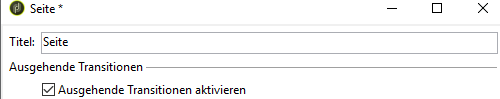
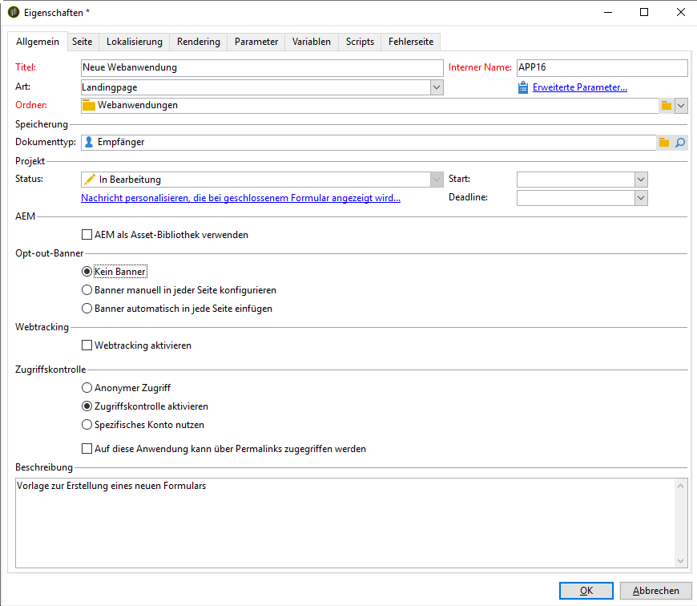

# Opt-out vom Web-Anwendungs-Tracking{#web-application-tracking-opt-out}


In Adobe Campaign können Sie das Tracking des Web-Verhaltens von Endbenutzenden anhalten, die sich vom Verhaltens-Tracking über Cookies oder Web Beacons abmelden. Die Funktion bietet auch die Möglichkeit, Endbenutzenden ein Banner mit dieser Option anzuzeigen. Diese Banner können zu Web-Anwendungen oder Landingpages hinzugefügt werden.

Wenn sich eine Person vom Verhaltens-Tracking über Cookies oder Web Beacons abmeldet, werden diese Informationen mit JavaScript-APIs an den Adobe Campaign-Tracking-Server übertragen. Beachten Sie, dass in manchen Ländern gesetzlich vorgeschrieben ist, dass den Endbenutzenden eine Anmeldemöglichkeit bereitgestellt werden muss, bevor eine Abmeldemöglichkeit angeboten wird, (bzw. andere gesetzliche Anforderungen bestehen) und dass es in der Verantwortung der Kundschaft liegt, diese Gesetze einzuhalten.

>[!NOTE]
>
>Befolgen Sie beim Scripting stets die in der [Checkliste für Sicherheit und Datenschutz](https://helpx.adobe.com/de/campaign/kb/acc-security.html#dev) beschriebenen Richtlinien.

## Banner konfigurieren {#configuring-the-banner-}

Banner, die in Webanwendungen oder Landingpages angezeigt werden sollen, müssen konfiguriert werden.

Adobe Campaign wird mit einem Beispielbanner bereitgestellt, das Sie an Ihre Anforderungen anpassen müssen. Diese Bannerversion wird als Gestaltungsbaustein im Ordner „Inhaltsmodell“ angezeigt. Weitere Informationen finden Sie in der [Dokumentation zu Campaign v8](https://experienceleague.adobe.com/docs/campaign/campaign-v8/send/personalize/personalization-blocks.html?lang=de){target="_blank"}.

>[!IMPORTANT]
>
>Wenn Sie ein eigenes Banner erstellen möchten, personalisieren Sie das native Banner.

Um das Banner zu aktivieren, müssen Sie die Eigenschaften für Webanwendungen konfigurieren. Weitere Informationen hierzu finden Sie im Abschnitt [Webanwendungen konzipieren](designing-a-web-application.md).

Wenn Webtracking aktiviert ist, haben Sie folgende Möglichkeiten:

* Kein Banner
* Banner manuell in jeder Seite konfigurieren: Aktivieren Sie diese Option und wählen Sie das Banner in den Seiteneigenschaften auf jeder Seite aus.

  

* Banner automatisch in jede Seite einfügen: Wählen Sie das Banner direkt in den Eigenschaften der Webanwendung aus.

  

>[!NOTE]
>
>Für die Webanwendung v5 ist ein Kompatibilitätsmodus verfügbar, der dasselbe Verhalten aufweist.

Das Standardbanner hat folgende Struktur:

```
<div onClick="NL.ClientWebTracking.closeOptOutBanner(this);" id="defaultOptOutBanner">
  <p>Please insert your message here
   <a onClick="NL.ClientWebTracking.allow();" class="optout-accept">Accept</a>
   <a onClick="NL.ClientWebTracking.forbid();" class="optout-decline">Refuse</a>
  </p>
</div>
      
```

Ersetzen Sie **Fügen Sie Ihren Text hier ein** durch den Baustein, der Ihre Tracking-Information enthält. Diese Ersetzung sollte in Ihrem neuen Gestaltungsbaustein im Zusammenhang mit dem Abmeldebanner ausgeführt werden.

Das Banner wird mit einer bestimmten CSS-Datei bereitgestellt. Sie können die Stile aber überschreiben, wenn Sie eine Web-Seite erstellen und konfigurieren. Mehr dazu erfahren Sie auf [dieser Seite](content-editor-interface.md).

## Opt-out-Cookie mit einer API einrichten {#setting-the-opt-out-cookie-using-api}

Adobe Campaign beinhaltet APIs, mit denen Sie den Cookie-Wert verwalten und Benutzereinstellungen abrufen können.

Der Cookie-Name ist **acoptout**. Die üblichen Werte sind folgende:

* 0: Besucher hat Webtracking erlaubt (Standardwert)
* 1: Besucher verbietet Webtracking
* null: Besucher hat nichts ausgewählt, aber Webtracking ist erlaubt, da dies der Standardwert ist

Die verfügbaren clientseitigen APIs zur individuellen Anpassung des Banners sind:

* **NL.ClientWebTracking.allow()**: Stellt den Wert des Opt-out-Cookies so ein, dass Webtracking erlaubt ist. Webtracking ist standardmäßig erlaubt.
* **NL.ClientWebTracking.forbid()**: Stellt den Wert des Opt-out-Cookies so ein, dass Webtracking nicht erlaubt ist. Um Webtracking zu verbieten, muss eine Benutzereingabe erfolgen.
* **NL.ClientWebTracking.closeOptOutBanner(bannerDomElt)**: Schließt das Opt-out-Cookie-Banner, nachdem die Person auf die Schaltfläche „Annehmen“ oder „Ablehnen“ geklickt hat. (Während der Bubbling-Phase des Klickereignisses)

  bannerDomElt {DOMElement} ist das Stamm-DOM-Element des Cookie-Banners, das entfernt werden muss

* **NL.ClientWebTracking.hasUserPrefs()**: Gibt &quot;true&quot; zurück, wenn der Besucher Einstellungen für das Webtracking ausgewählt hat.
* **NL.ClientWebTracking.getUserPrefs()**: Gibt den Opt-out-Cookie-Wert zurück, der die Eigenschaften des Benutzers definiert.

Zum Schreiben einer JSSP (JavaScript Server Page) stehen serverseitige APIs zur Verfügung:

* **NL.ServerWebTracking.generateOptOutBanner(escapeJs)**: Erzeugt das Markup für das Opt-out-Banner, das in die JSSP eingefügt wird.

  **escapeJs{Boolean}**: „true“, wenn das erzeugte Markup escapt werden muss, damit es in JavaScript verwendet werden kann.

  Zurückgegeben wird der HTML-Code des Opt-out-Banner-Markups, das auf der Seite angezeigt werden soll.

* **NL.ServerWebTracking._displayOptOutBanner()**

  Gibt &quot;true&quot; zurück, wenn das Opt-out-Banner dargestellt werden soll, nachdem es vom Administrator ausgewählt wurde.

  Dieser Code wird abgerufen, wenn der Administrator bereits festgelegt hat, das Webtracking-Opt-out-Banner zu verwenden.

  Das Banner sollte angezeigt werden, wenn der Besucher noch nicht festgelegt hat, ob er getrackt werden möchte oder nicht.

* **NL.ServerWebTracking.renderOptOutBanner(escapeJs)**

  Rendert das Markup für das Opt-out-Banner, indem es in die JSSP-Seite eingefügt wird. Es wird unverändert zwischen &lt;% %> in JSSP abgerufen.

  **escapeJs{Boolean}**: „true“, wenn das erzeugte Markup escapt werden muss, damit es in JavaScript verwendet werden kann

Beispiel für eine JSSP:

```
<%@ page import="/nl/core/shared/nl.js" %>
<!doctype html>
<%
NL.require('/nl/core/shared/webTracking.js');
NL.client.require('/nl/core/shared/webTracking.js');
%>
<html>
<head>
<%==NL.client.deps()%>
</head>

<body>

<!-- TEST USING SERVER API IN JSSP -->
<% 
var webTracking = new NL.ServerWebTracking(request, 'optOutBanner');
webTracking.renderOptOutBanner();
%>

<!-- TEST USING SERVER API IN A SCRIPT -->
<!--
<% 
var webTracking = new NL.ServerWebTracking(request, 'optOutBanner');
%>
<script>var el = document.createElement('div'); el.innerHTML =  "<% webTracking.renderOptOutBanner(true); %>";document.body.appendChild(el);</script>
-->

<!-- TEST OF THE CLIENT API -->
<!--
<div onClick="NL.ClientWebTracking.closeOptOutBanner(this);" id="defaultOptOutBanner">
  <p>Please insert your message here
   <a onClick="NL.ClientWebTracking.allow();" class="optout-accept">Accept</a>
   <a onClick="NL.ClientWebTracking.forbid();" class="optout-decline">Refuse</a>
  </p>
</div>
-->
</body>
</html>
```
