# Antworten in Webformularen{#web-forms-answers}


## Speicherfelder für Antworten {#response-storage-fields}

Antworten auf Formulare können in einem Feld der Datenbank oder vorübergehend in einer lokalen Variablen gespeichert werden. Der Speichermodus für Antworten wird bei der Felderstellung ausgewählt. Er kann über den Link **[!UICONTROL Speicher bearbeiten…]** bearbeitet werden.

Für jedes Eingabefeld in einem Formular sind die folgenden Speicheroptionen verfügbar:

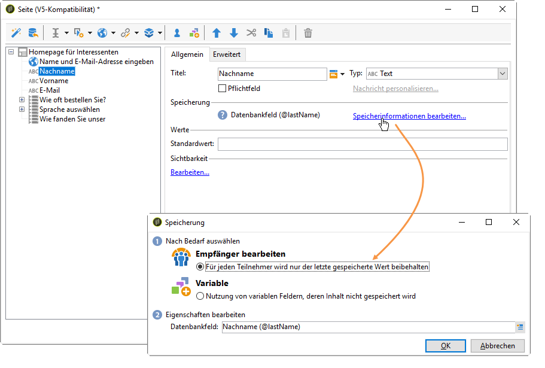

* **[!UICONTROL Empfänger bearbeiten]**

  Sie können ein Feld der Datenbank auswählen: Die Antworten der Benutzer werden in diesem Feld gespeichert. Für jeden Benutzer wird nur der zuletzt eingegebene Wert gespeichert: Es wird seinem Profil hinzugefügt: Siehe [Speichern von Daten in der Datenbank](#storing-data-in-the-database).

* **[!UICONTROL Variable]**

  Wenn Sie keine Informationen in der Datenbank speichern möchten, können Sie eine Variable verwenden. Lokale Variablen können zuvor deklariert werden. Siehe [Daten in einer lokalen Variablen speichern](#storing-data-in-a-local-variable).

### Speichern von Daten in der Datenbank {#storing-data-in-the-database}

Um Daten in einem vorhandenen Datenbankfeld zu speichern, wählen Sie das Symbol **[!UICONTROL Ausdruck bearbeiten]** und danach das Feld aus der Liste der verfügbaren Felder aus.

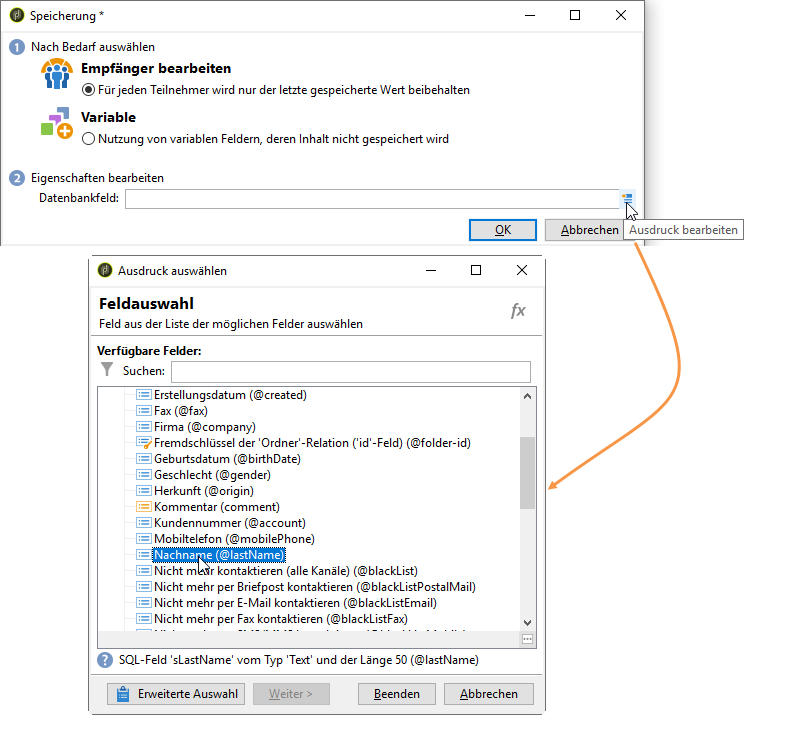

>[!NOTE]
>
>Das standardmäßige Referenzdokument ist das Schema **nms:recipient**. Wenn Sie es anzeigen oder ein neues auswählen möchten, wählen Sie das Formular in der Liste und danach die Schaltfläche **[!UICONTROL Eigenschaften]** aus.

### Daten in einer lokalen Variablen speichern {#storing-data-in-a-local-variable}

Durch die Verwendung lokaler Variablen können Daten auf derselben oder einer anderen Seite wiederverwendet werden, auch wenn sie nicht in der Datenbank gespeichert werden. Dies kann beispielsweise hilfreich sein, um die Anzeige eines Felds an eine Bedingung zu knüpfen oder um eine Nachricht anzupassen.

Dies bedeutet, dass Sie den Wert eines nicht gespeicherten Felds verwenden können, um die Anzeige einer Gruppe von Optionen auf der Seite zu autorisieren. Auf der folgenden Seite wird der Fahrzeugtyp nicht in der Datenbank gespeichert:

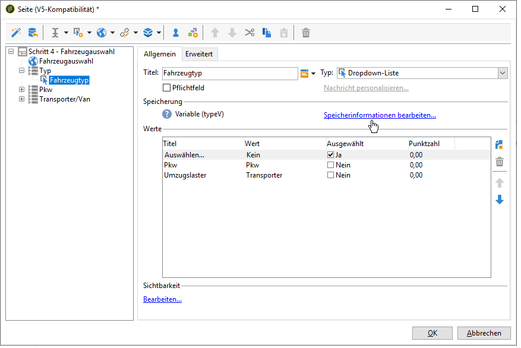

Er ist in einer Variablen gespeichert, die bei der Erstellung der Dropdown-Liste oder über den Link **[!UICONTROL Speicherinformationen bearbeiten...]** ausgewählt werden muss.

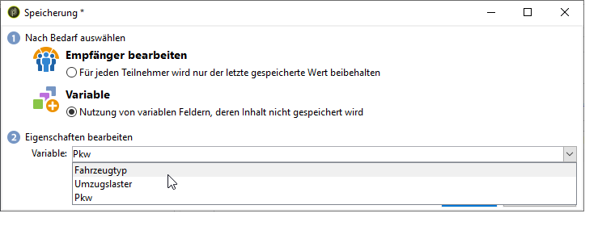

Über den Link **[!UICONTROL Variablen bearbeiten...]** können Sie vorhandene Variablen anzeigen und neue erstellen. Klicken Sie auf die Schaltfläche **[!UICONTROL Hinzufügen]**, um eine neue Variable zu erstellen.

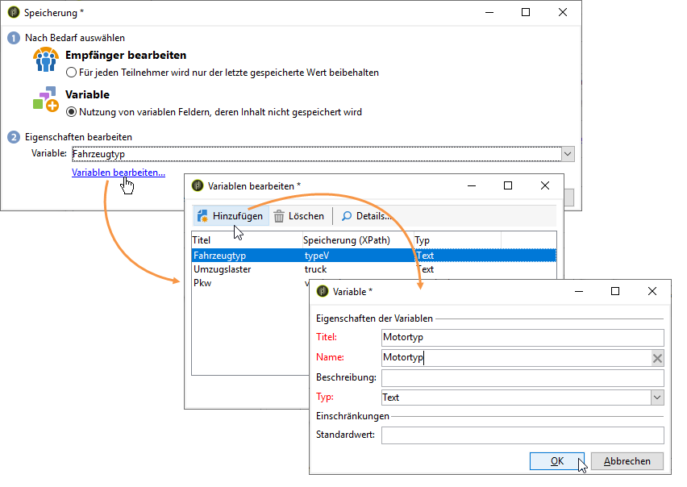

Die hinzugefügte Variable wird in der Liste lokaler Variablen verfügbar sein, wenn die Eingabefelder der Seite erstellt werden.

>[!NOTE]
>
>Sie können für jedes Formular in einem vorgelagerten Schritt Variablen erstellen. Wählen Sie dazu das Formular und danach die Schaltfläche **[!UICONTROL Eigenschaften]** aus. Der Tab **[!UICONTROL Variablen]** enthält die lokalen Variablen für das Formular.

**Beispiel für die lokale Speicherung mit einer Bedingung**

Im obigen Beispiel wird der Container mit Daten zu Personenfahrzeugen nur angezeigt, wenn die Option **[!UICONTROL Personen]** (wie in der Sichtbarkeitsbedingung dargestellt) aus der Dropdown-Liste ausgewählt wird:

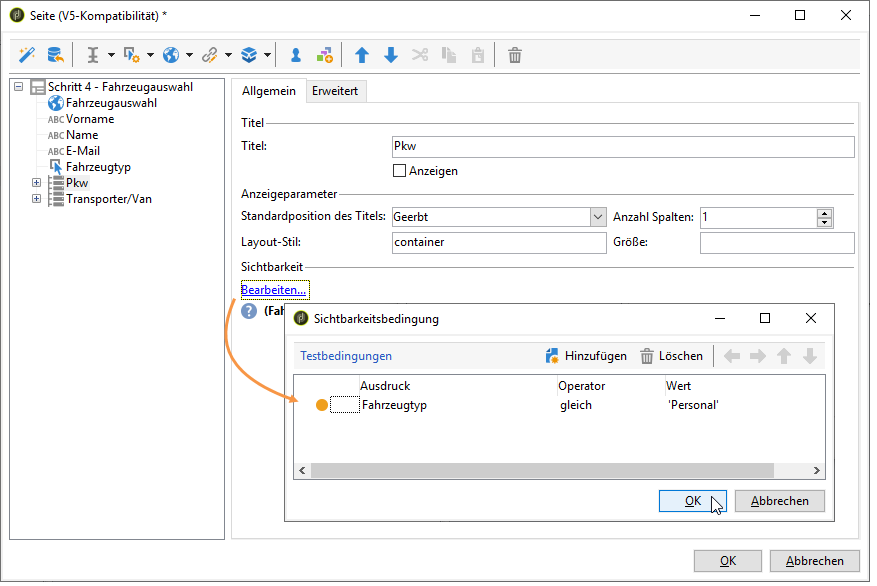

Wenn der Benutzer ein Personenfahrzeug auswählt, bietet das Webformular folgende Optionen an:

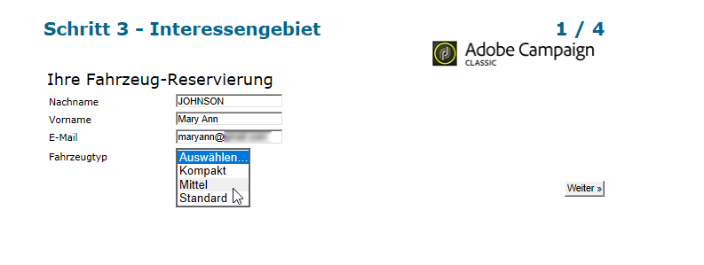

Der Container mit Daten zu Nutzfahrzeugen wird dann angezeigt, wenn die Nutzfahrzeugoption (wie in der Sichtbarkeitsbedingung dargestellt) ausgewählt wird:

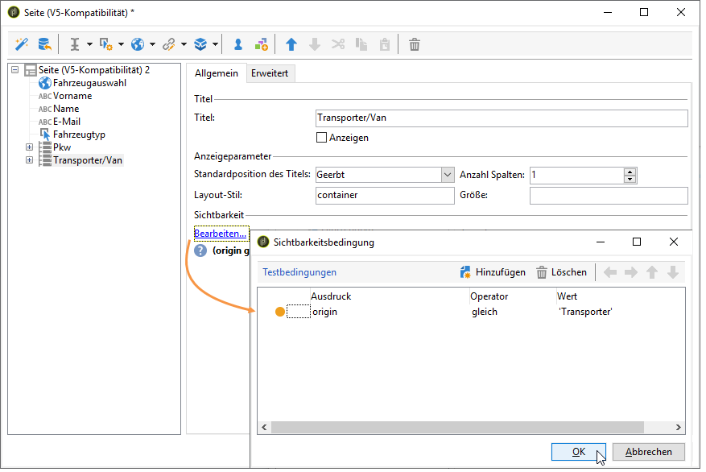

Wenn der Benutzer ein Nutzfahrzeug auswählt, bietet das Webformular folgende Optionen an:

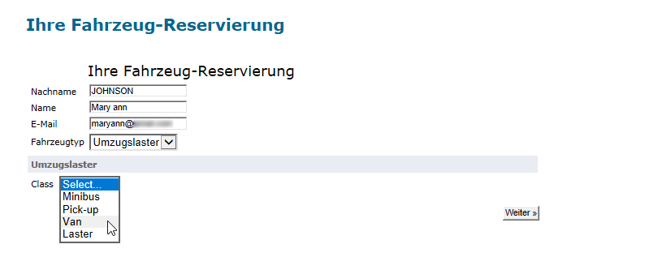

## Erfasste Informationen verwenden {#using-collected-information}

Für jedes Formular können die angegebenen Antworten in den Feldern oder Beschriftungen wiederverwendet werden. Die folgenden Syntaxen müssen verwendet werden:

* Für Inhalte, die in einem Datenbankfeld gespeichert werden:

  ```
  <%=ctx.recipient.@field name%
  ```

* Für Inhalte, die in einer lokalen Variablen gespeichert werden:

  ```
  <%= ctx.vars.variable name %
  ```

* Für Inhalte, die in einem HTML-Textfeld gespeichert werden:

  ```
  <%== HTML field name %
  ```

  >[!NOTE]
  >
  >Im Gegensatz zu anderen Feldern, bei denen `<%=`-Zeichen durch Escape-Zeichen ersetzt werden, wird der HTML-Inhalt unverändert unter Verwendung der `<%==`-Syntax gespeichert.

## Web-Formular-Antworten speichern {#saving-web-forms-answers}

Um die in Formularseiten erfassten Informationen zu speichern, müssen Sie in das Diagramm die Komponente &quot;Speicherung&quot; einfügen.

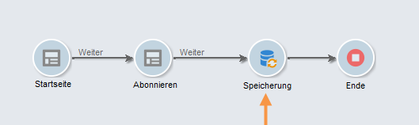

Sie haben zwei Möglichkeiten, diese Komponente zu verwenden:

* Wenn auf das Webformular über einen in einer E-Mail gesendeten Link zugegriffen wird und der Benutzer, der auf die Anwendung zugreift, bereits in der Datenbank gespeichert ist, können Sie die Option **[!UICONTROL Vorausgefüllten Datensatz aktualisieren]** aktivieren. Weitere Informationen hierzu finden Sie unter [Formular per E-Mail versenden](publishing-a-web-form.md#delivering-a-form-via-email).

  In diesem Fall verwendet Adobe Campaign den verschlüsselten Primärschlüssel des Benutzerprofils, eine eindeutige Kennung, die jedem Profil von Adobe Campaign zugewiesen wird. Sie müssen die Informationen konfigurieren, die vorab über das Feld „Vorausfüllen“ geladen werden sollen. Weitere Informationen finden Sie unter [Formulardaten vorausfüllen](publishing-a-web-form.md#pre-loading-the-form-data).

  >[!CAUTION]
  >
  >Diese Option überschreibt die Benutzerdaten, einschließlich der E-Mail-Adresse, wenn ein Feld vorhanden ist, in das Sie sie eingeben können. Sie kann nicht zum Erstellen neuer Profile verwendet werden und erfordert die Verwendung eines Felds zum Vorausfüllen im Formular.

* Um die Empfängerdaten in der Datenbank anzureichern, bearbeiten Sie das Speicherfeld und wählen Sie den Abstimmschlüssel aus. Für die interne Verwendung (normalerweise ein Intranet-System) oder für ein Formular, das z. B. zum Erstellen neuer Profile verwendet wird, können Sie die Abstimmfelder auswählen. Das Feld enthält alle Felder der Datenbank, die auf den verschiedenen Seiten der Web-Anwendung verwendet werden:

  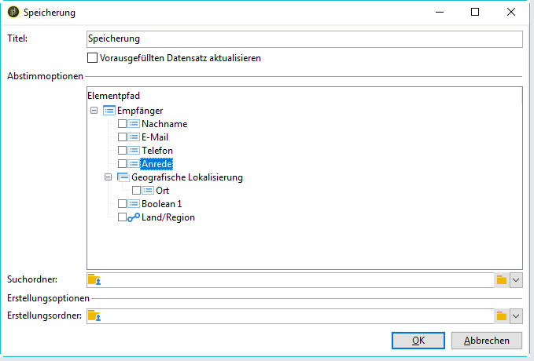

Standardmäßig werden die Daten über den Vorgang **[!UICONTROL Aktualisieren oder einfügen]** in die Datenbank importiert: Wenn ein Element bereits in der Datenbank vorhanden ist, wird es aktualisiert (z. B. der ausgewählte Newsletter oder die eingegebene E-Mail-Adresse). Wenn sie nicht vorhanden ist, werden die Informationen hinzugefügt.

Sie können dieses Verhalten jedoch ändern. Wählen Sie dazu den Stamm des Elements und den auszuführenden Vorgang aus der Dropdown-Liste aus:

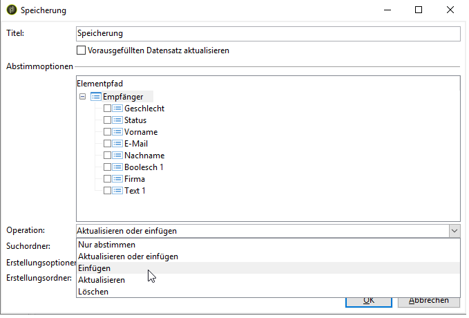

Sie können einen Suchordner für die Abstimmung und den Erstellungsordner für neue Profile auswählen. Wenn diese Felder leer sind, werden die Profile im Standardordner des Benutzers gesucht und erstellt.

>[!NOTE]
>
>Die möglichen Vorgänge sind: **[!UICONTROL einfache Abstimmung]**, **[!UICONTROL Aktualisieren oder Einfügen]**, **[!UICONTROL Einfügen]**, **[!UICONTROL Aktualisieren]**, **[!UICONTROL Löschen]**.\
>Der Standardordner des Operators entspricht dem ersten Ordner, für den er Schreibzugriff hat.\
>Weitere Informationen finden Sie in [diesem Abschnitt](../../platform/using/access-management.md).
