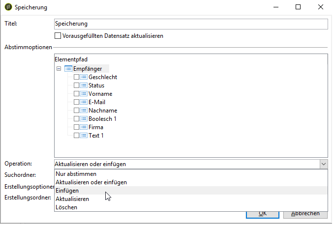

# Antworten in Webformularen{#web-forms-answers}

## Speicherfelder für Antworten {#response-storage-fields}

Antworten in Formularen können in einem Feld der Datenbank oder temporär in einer lokalen Variablen gespeichert werden. Der Speichermodus für Antworten wird während der Felderstellung ausgewählt. Er kann über den Link **[!UICONTROL Speicherinformationen bearbeiten...]** bearbeitet werden.

Für jedes Eingabefeld in einem Formular sind die folgenden Speicheroptionen verfügbar:


* **[!UICONTROL Empfänger bearbeiten]**

   Sie können ein Feld der Datenbank auswählen: Die Antworten der Benutzer werden in diesem Feld gespeichert. Für jeden Benutzer wird nur der zuletzt eingegebene Wert gespeichert: Es wird seinem Profil hinzugefügt: Siehe [Speichern von Daten in der Datenbank](#storing-data-in-the-database).

* **[!UICONTROL Variable]**

   Wenn Sie die Informationen nicht in der Datenbank speichern möchten, können Sie eine Variable verwenden. Lokale Variablen können in vorgelagerten Arbeitsschritten festgelegt werden. Siehe [Daten in einer lokalen Variablen speichern](#storing-data-in-a-local-variable).

### Speichern von Daten in der Datenbank {#storing-data-in-the-database}

Um Daten in einem vorhandenen Datenbankfeld zu speichern, wählen Sie das Symbol **[!UICONTROL Ausdruck bearbeiten]** und danach das Feld aus der Liste der verfügbaren Felder aus.


>[!NOTE]
>
>Das Standard-Referenzdokument ist das Schema **nms:recipient**. Wenn Sie es anzeigen oder ein neues auswählen möchten, wählen Sie das Formular in der Liste und danach die Schaltfläche **[!UICONTROL Eigenschaften]** aus.

### Daten in einer lokalen Variablen speichern {#storing-data-in-a-local-variable}

Durch die Verwendung lokaler Variablen können Daten auf derselben oder einer anderen Seite wiederverwendet werden, auch wenn sie nicht in der Datenbank gespeichert werden. Dies kann beispielsweise hilfreich sein, um die Anzeige eines Felds an eine Bedingung zu knüpfen oder um eine Nachricht anzupassen.

Das bedeutet, dass Sie den Wert eines nicht gespeicherten Felds verwenden können, um eine Gruppe von Optionen auf der Seite anzuzeigen. Auf der unten dargestellten Seite ist der Fahrzeugtyp nicht in der Datenbank gespeichert.


Er ist in einer Variablen gespeichert, die bei der Erstellung der Dropdown-Liste oder über den Link **[!UICONTROL Speicherinformationen bearbeiten...]** ausgewählt werden muss.


Über den Link **[!UICONTROL Variablen bearbeiten...]** können Sie vorhandene Variablen anzeigen und neue erstellen. Wenn Sie eine neue Variable erstellen möchten, wählen Sie die Schaltfläche **[!UICONTROL Hinzufügen]** aus.


Die hinzugefügte Variable wird in der Liste lokaler Variablen verfügbar sein, wenn die Eingabefelder der Seite erstellt werden.

>[!NOTE]
>
>Sie können für jedes Formular in einem vorgelagerten Schritt Variablen erstellen. Wählen Sie dazu das Formular und danach die Schaltfläche **[!UICONTROL Eigenschaften]** aus. Der Tab **[!UICONTROL Variablen]** enthält die lokalen Variablen für das Formular.

**Beispiel für die lokale Speicherung mit einer Bedingung**

Im obigen Beispiel wird der Container mit Daten zu Personenfahrzeugen nur angezeigt, wenn die Option **[!UICONTROL Personen]** (wie in der Sichtbarkeitsbedingung dargestellt) aus der Dropdown-Liste ausgewählt wird:


Wenn der Benutzer ein Personenfahrzeug auswählt, bietet das Webformular folgende Optionen an:


Der Container mit Daten zu Nutzfahrzeugen wird dann angezeigt, wenn die Nutzfahrzeugoption (wie in der Sichtbarkeitsbedingung dargestellt) ausgewählt wird:


Wenn der Benutzer ein Nutzfahrzeug auswählt, bietet das Webformular folgende Optionen an:


## Erfasste Informationen verwenden {#using-collected-information}

Für jedes Formular können die bereitgestellten Antworten in Feldern oder Titeln wiederverwendet werden. Dabei müssen die folgenden Syntaxen verwendet werden:

* Für Inhalte, die in einem Datenbankfeld gespeichert werden:

   ```
   <%=ctx.recipient.@field name%
   ```

* Für Inhalte, die in einer lokalen Variablen gespeichert werden:

   ```
   <%= ctx.vars.variable name %
   ```

* Für Inhalte, die in einem HTML-Textfeld gespeichert werden:

   ```
   <%== HTML field name %
   ```

   >[!NOTE]
   >
   >Im Gegensatz zu anderen Feldern, bei denen `<%=`-Zeichen durch Escape-Zeichen ersetzt werden, wird der HTML-Inhalt unverändert unter Verwendung der `<%==`-Syntax gespeichert.

## Webformulare-Antworten speichern {#saving-web-forms-answers}

Um die in Formularseiten erfassten Informationen zu speichern, müssen Sie in das Diagramm die Komponente &quot;Speicherung&quot; einfügen.


Sie haben zwei Möglichkeiten, diese Komponente zu verwenden:

* Wenn auf das Webformular über einen in einer E-Mail gesendeten Link zugegriffen wird und der Benutzer, der auf die Anwendung zugreift, bereits in der Datenbank gespeichert ist, können Sie die Option **[!UICONTROL Vorausgefüllten Datensatz aktualisieren]** aktivieren. Weitere Informationen hierzu finden Sie unter [Formular per E-Mail versenden](../../web/using/publishing-a-web-form.md#delivering-a-form-via-email).

   In diesem Fall verwendet Adobe Campaign den verschlüsselten Primärschlüssel des Benutzerprofils. Das ist eine einmalige Kennung, die von Adobe Campaign jedem Profil zugewiesen wird. Konfigurieren Sie die Informationen so, dass sie über die Vorausfüllen-Komponente geladen werden. Weitere Informationen finden Sie unter [Formulardaten vorausfüllen](../../web/using/publishing-a-web-form.md#pre-loading-the-form-data).

   >[!CAUTION]
   >
   >Mit dieser Option werden die Benutzerdaten, einschließlich der E-Mail-Adresse, überschrieben, wenn ein Feld vorhanden ist, über das eine neue Eingabe getätigt werden kann. Diese Option kann nicht zur Erstellung neuer Profile verwendet werden und erfordert eine Vorausfüllen-Komponente im Formular.

* Um Empfängerdaten in der Datenbank anzureichern, bearbeiten Sie die Komponente &quot;Speicherung&quot; und wählen Sie den Abstimmschlüssel aus. Wählen Sie die Abstimmfelder für die interne Verwendung (normalerweise für das Intranet) oder für ein Formular zum Erstellen neuer Profile aus. In der Komponente sind alle Datenbankfelder vorhanden, die auf den Seiten der Webanwendung verwendet werden:

   

Standardmäßig werden die Daten über den Vorgang **[!UICONTROL Aktualisieren oder einfügen]** in die Datenbank importiert: Wenn ein Element bereits in der Datenbank vorhanden ist, wird es aktualisiert (z. B. der ausgewählte Newsletter oder die eingegebene E-Mail-Adresse). Wenn es noch nicht existiert, wird die Information hinzugefügt.

Sie können dieses Verhalten jedoch auch verändern. Wählen Sie dazu die Wurzel des Elements aus und danach aus der Dropdown-Liste den auszuführenden Vorgang.



Sie können für die Abstimmung einen Suchordner und für neue Profile den Erstellungsordner auswählen. Wenn diese Felder leer sind, wird nach den Profilen gesucht und diese werden im Standardordner des jeweiligen Operators erstellt.

>[!NOTE]
>
>Die möglichen Vorgänge sind: **[!UICONTROL einfache Abstimmung]**, **[!UICONTROL Aktualisieren oder Einfügen]**, **[!UICONTROL Einfügen]**, **[!UICONTROL Aktualisieren]**, **[!UICONTROL Löschen]**.\
>Der Standardordner des Operators entspricht dem ersten Ordner, für den er Schreibzugriff hat.\
>Siehe [diesen Abschnitt](../../platform/using/access-management.md).

