# A/B-Tests{#a-b-testing}

Für einen E-Mail-Versand wurden verschiedene Inhalte erstellt und Sie möchten testen, welcher Inhalt bei der angesprochenen Zielgruppe die größten Erfolgschancen hat. Hierzu werden die verschiedenen Versionen jeweils an einen Teil der Zielgruppe gesendet. Die Version, die die besten Ergebnisse erzielt, wird dann an den Rest der Empfängerzielgruppe gesendet.

Im vorliegenden Anwendungsbeispiel wird ein Zielgruppen-Workflow verwendet, um zwei Inhaltsversionen zu vergleichen. Der Text ist jeweils derselbe, nur die Aufmachung unterscheidet sich.

Die Zielgruppe wird in drei Untergruppen geteilt: zwei Testpopulationen und die verbleibende Population. Jede Testpopulation erhält eine der beiden Versionen. Nach dem Versand werden die Öffnungsraten fünf Tage lang gesammelt. Die Version mit dem besten Ergebnis wird durch ein Script abgerufen und an die verbleibende Population gesendet.

Die Auswahl der Siegerversion kann je nach Bedarf nach verschiedenen Kriterien erfolgen. Hierbei kann es sich beispielsweise um die Öffnungsrate, Klickrate, Anmelderate oder die Reaktivität handeln.

Das vorliegende Beispiel beschränkt den Test auf zwei Versionen. Sie können jedoch bei Bedarf so viele Versionen wie nötig testen, indem Sie den Workflow entsprechend um weitere Aktivitäten ergänzen.

Gehen Sie zur Erstellung des A/B-Tests wie folgt vor:

* [1. Schritt: Erstellung eines Zielgruppen-Workflows](#step-1--creating-a-targeting-workflow)
* [2. Schritt: Konfiguration der Testpopulation](#step-2--configuring-population-samples)
* [3. Schritt: Erstellung von zwei Versandvorlagen](#step-3--creating-two-delivery-templates)
* [4. Schritt: Konfiguration der Sendungen im Workflow](#step-4--configuring-the-deliveries-in-the-workflow)
* [5. Schritt: Erstellung des Scripts](#step-5--creating-the-script)
* [7. Schritt: Start des Workflows](#step-7--starting-the-workflow)
* [8. Schritt: Ergebnisanalyse](#step-8--analyzing-the-result).

## 1. Schritt: Erstellung eines Zielgruppen-Workflows {#step-1--creating-a-targeting-workflow}

Zielgruppen-Workflows werden im Rahmen von Kampagnen im Tab **[!UICONTROL Zielbestimmungen und Workflows]** erstellt. Im vorliegenden Beispiel enthält der Workflow eine **[!UICONTROL Abfrage]**, eine **[!UICONTROL Aufspaltung]** mit je einem angeschlossenen **[!UICONTROL E-Mail-Versand]**, eine **[!UICONTROL Warten]**-Aktivität, eine **[!UICONTROL JavaScript-Code]**-Aktivität und einen **[!UICONTROL Versand]**.

1. Öffnen Sie eine existierende Kampagne oder erstellen Sie eine neue (siehe diesen [Abschnitt](../../campaign/using/setting-up-marketing-campaigns.md#creating-a-campaign)).

   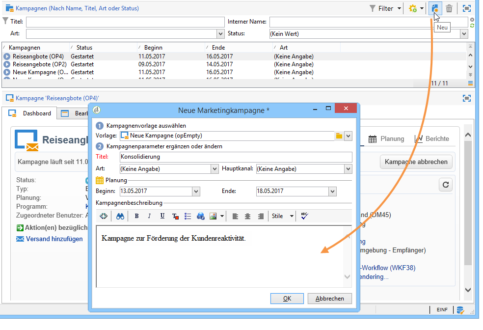

1. Gehen Sie in den Tab **[!UICONTROL Zielbestimmungen und Workflows]**.

   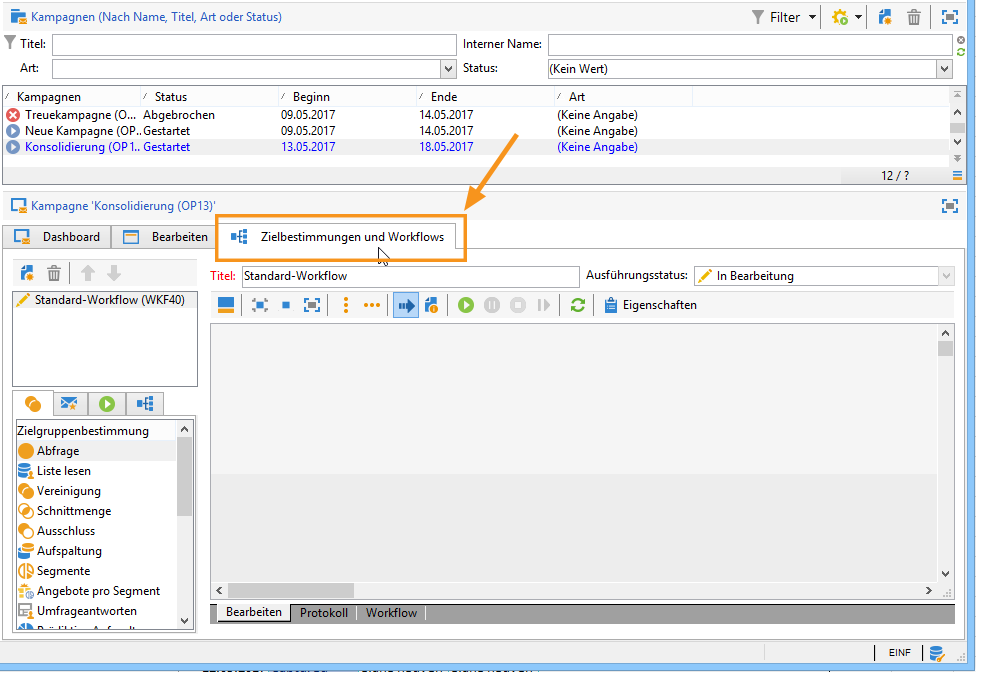

1. Klicken Sie auf **[!UICONTROL Hinzufügen]**, um einen neuen Workflow zu erstellen oder verwenden Sie den Standard-Workflow und benennen Sie ihn. Lesen Sie diesbezüglich auch diesen [Abschnitt](../../campaign/using/marketing-campaign-deliveries.md#selecting-the-target-population).

   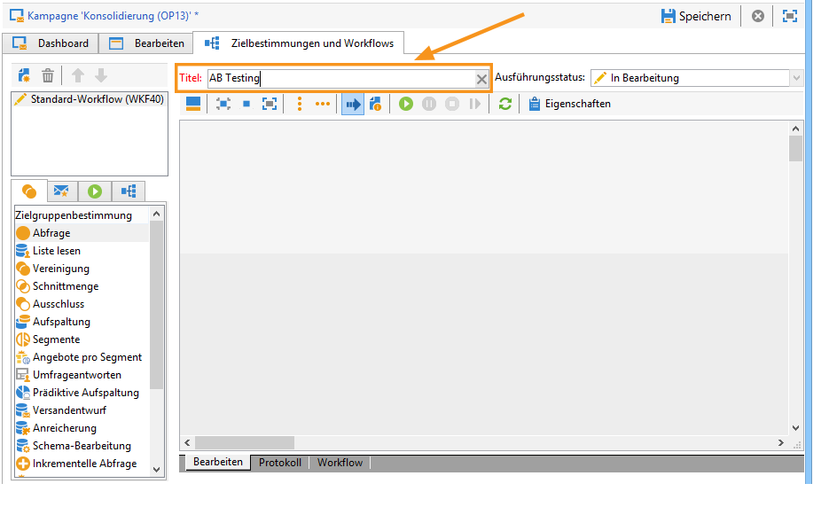

1. Ziehen Sie mit der Maus die Aktivitäten in das Workflow-Diagramm und zwar aus dem Tab **[!UICONTROL Zielgruppenbestimmung]** eine **[!UICONTROL Abfrage]** und eine **[!UICONTROL Aufspaltung]**, aus dem Tab **[!UICONTROL Sendungen]** zwei **[!UICONTROL E-Mail-Versand]**-Aktivitäten, aus dem Tab **[!UICONTROL Steuerung]** eine **[!UICONTROL Warten]**-Aktivität und aus dem Tab **[!UICONTROL Aktionen]** eine **[!UICONTROL JavaScript-Code]**-Aktivität sowie einen **[!UICONTROL Versand]**.********


## 2. Schritt: Konfiguration der Testpopulation {#step-2--configuring-population-samples}

### Konfiguration der Abfrage {#configuring-the-query-activity}

* Öffnen Sie die **[!UICONTROL Abfrage]** per Doppelklick.

   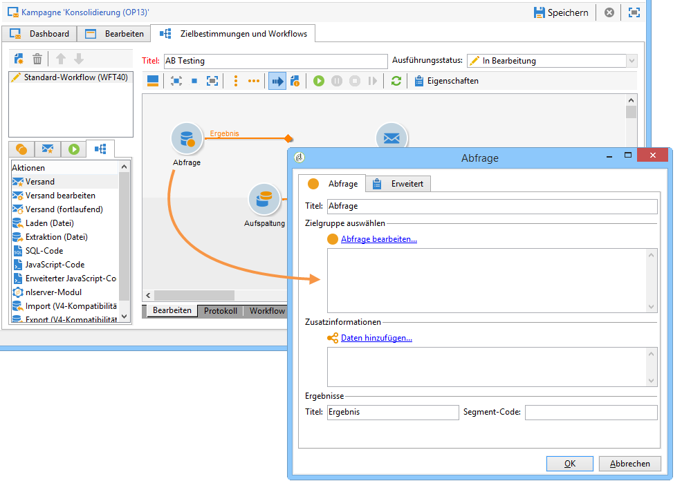

* Klicken Sie auf den Link **[!UICONTROL Abfrage bearbeiten]** und wählen Sie die Empfänger aus, die die Zielgruppe enthalten soll.

   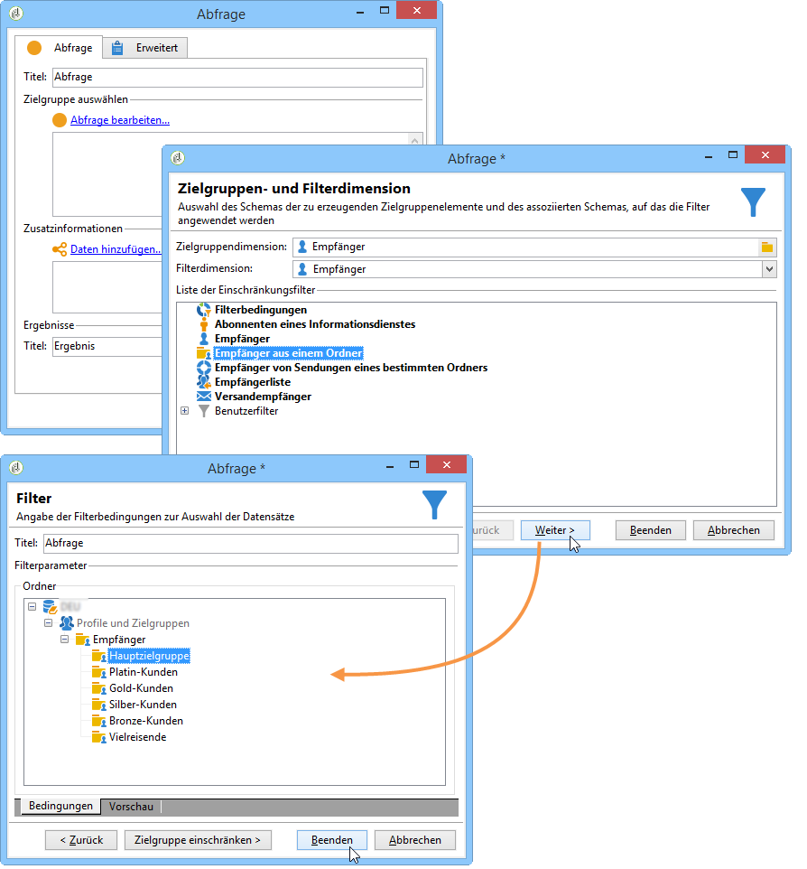

* Verbinden Sie die **[!UICONTROL Abfrage]** mit der **[!UICONTROL Aufspaltung]**.

   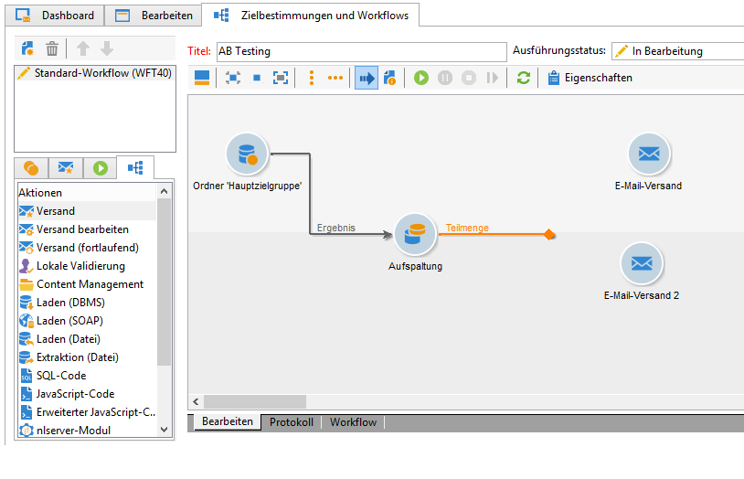

### Konfiguration der Aufspaltung {#configuring-the-split-activity}

Mithilfe dieser Aktivität werden die drei Populationen erstellt: A, B und Rest. Dank der Zufallsauswahl erhält jeweils nur ein Teil jeder Population den entsprechenden Versand.

1. Erstellung der Testpopulation A:

   * Öffnen Sie die **[!UICONTROL Aufspaltung]** per Doppelklick.

      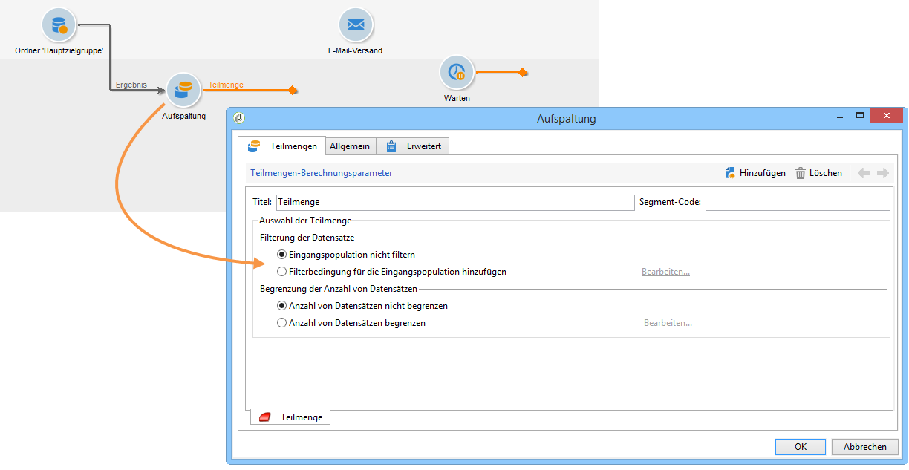

   * Ändern Sie den Titel für die Testpopulation A entsprechend ab.

      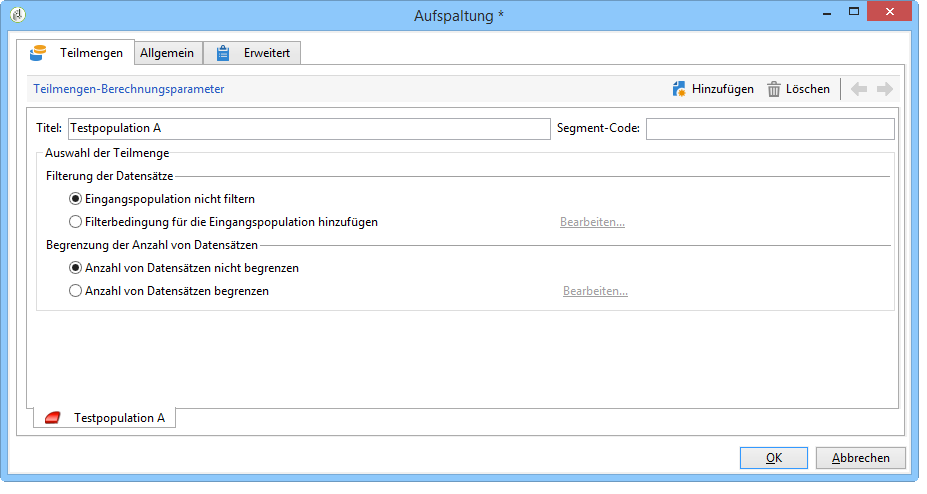

   * Aktivieren Sie die Option **[!UICONTROL Anzahl von Datensätzen begrenzen]**.

      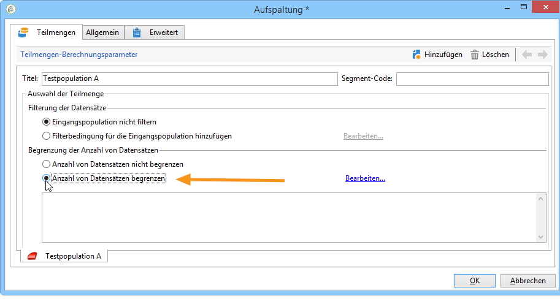

   * Klicken Sie auf den Link **[!UICONTROL Bearbeiten]**, kreuzen Sie **[!UICONTROL Zufallsauswahl aktivieren]** an und klicken Sie auf **[!UICONTROL Weiter]**.

      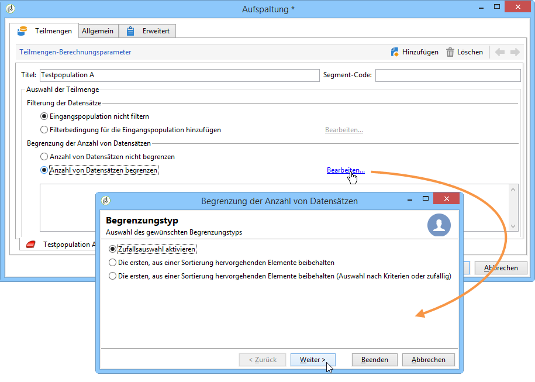

   * Begrenzen Sie die Testpopulation auf 10 % und klicken Sie auf **[!UICONTROL Beenden]**.

      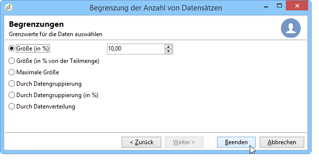

1. Erstellung der Testpopulation B:

   * Klicken Sie auf **[!UICONTROL Hinzufügen]**, um einen zweiten Tab für die Testpopulation B zu erstellen.

      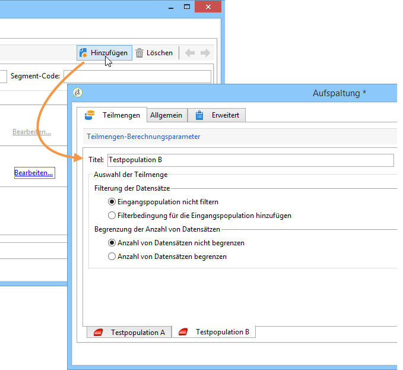

   * Begrenzen Sie wie zuvor die Testpopulation auf 10 %.

      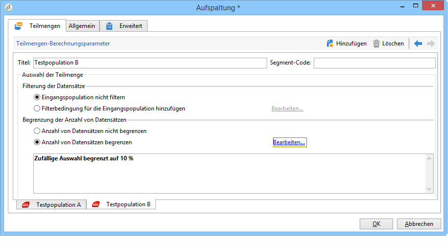

1. Erstellung der verbleibenden Population:

   * Gehen Sie in den **[!UICONTROL Allgemein]**-Tab.

      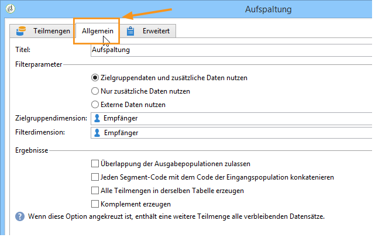

   * Aktivieren Sie die Option **[!UICONTROL Komplement erzeugen]**.

      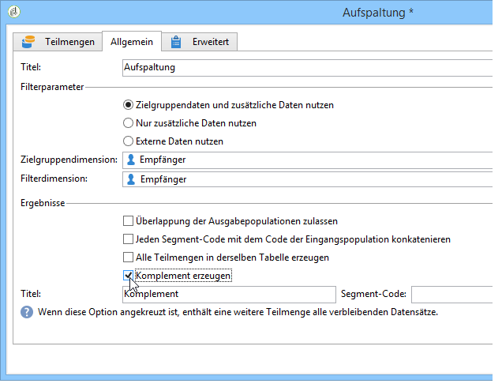

   * Benennen Sie die verbleibende Population und klicken Sie auf **[!UICONTROL OK]**, um die Aktivität zu schließen.

      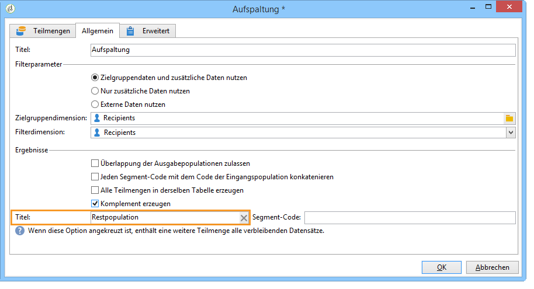

## 3. Schritt: Erstellung von zwei Versandvorlagen {#step-3--creating-two-delivery-templates}

Erstellen Sie nun zwei Versandvorlagen, die jeweils in einem an die **[!UICONTROL Aufspaltung]** angeschlossenen **[!UICONTROL E-Mail-Versand]** verwendet werden. Weiterführende Informationen finden Sie in diesem [Abschnitt](../../delivery/using/about-templates.md). Gehen Sie wie folgt vor:

1. Gehen Sie im Navigationsbaum in den Knoten **[!UICONTROL Ressourcen > Versandvorlagen]**.
1. Duplizieren Sie die Vorlage **[!UICONTROL E-Mail]**.

   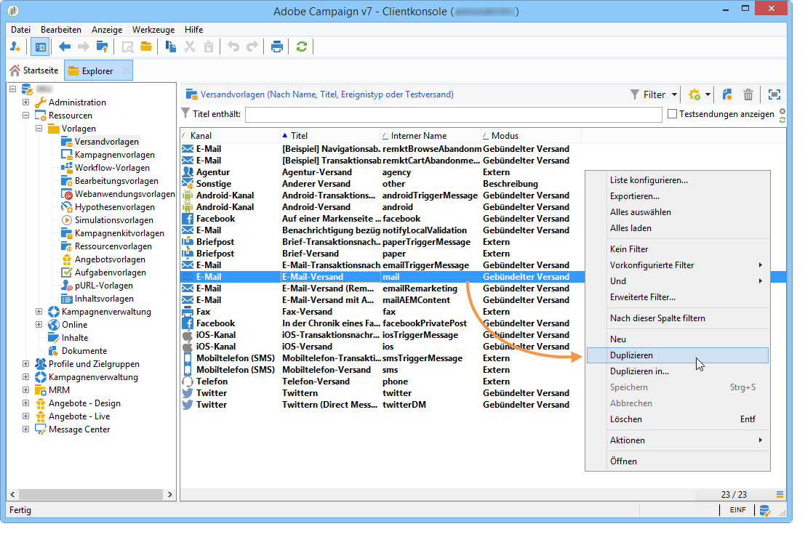

1. Erstellen Sie den Inhalt Ihres Versands A.

   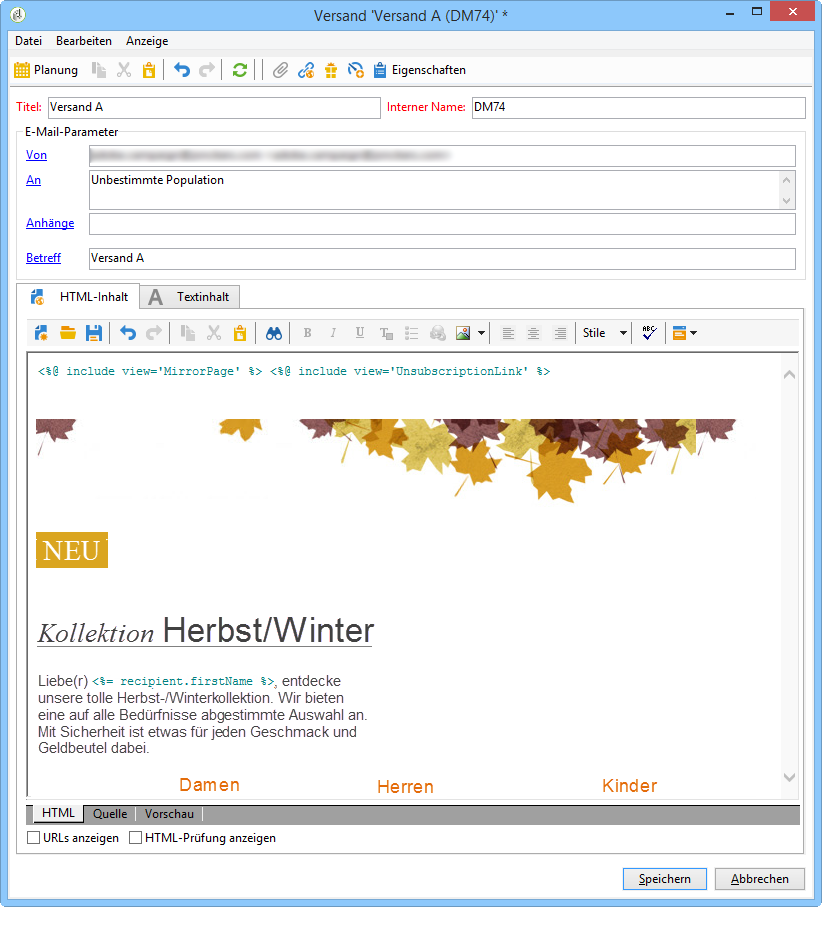

1. Wiederholen Sie den Vorgang zur Erstellung des Versands B.

   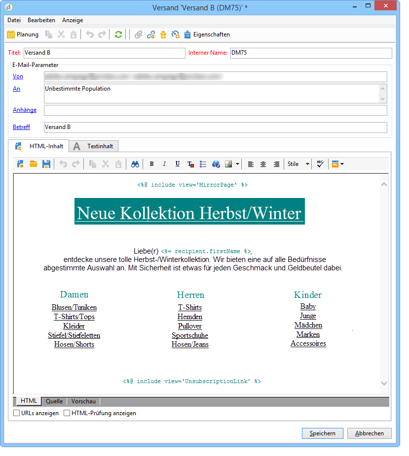

## 4. Schritt: Konfiguration der Sendungen im Workflow {#step-4--configuring-the-deliveries-in-the-workflow}

Der nächste Schritt besteht aus der Konfiguration der Sendungen. Sie sind für die drei Populationen bestimmt, die im vorherigen Schritt [Schritt 2: Konfiguration der Testpopulation](#step-2--configuring-population-samples) erstellt wurden. Die ersten beiden Sendungen ermöglichen es Ihnen, verschiedene Inhalte an Population A und B zu senden. Die dritte Sendung ist für jene Population bestimmt, die weder A noch B erhalten hat. Der Inhalt wird durch ein Skript berechnet und ist entweder mit A oder B identisch, je nachdem, welcher Versand die höchste Öffnungsrate erzielt hat. Wir müssen eine Wartezeit für die dritte Sendung konfigurieren, um das Ergebnis der Sendungen A und B zu ermitteln. Aus diesem Grund beinhaltet die dritte Sendung eine Aktivität vom Typ **[!UICONTROL Warten]**.

1. Verbinden Sie ausgehend von der Aufspaltung die Transition der Population A mit einer der **[!UICONTROL E-Mail-Versand]**-Aktivitäten.

   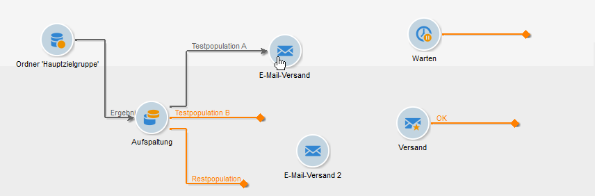

1. Öffnen Sie den Versand per Doppelklick.
1. Wählen Sie aus der Dropdown-Liste die Versandvorlage A aus.

   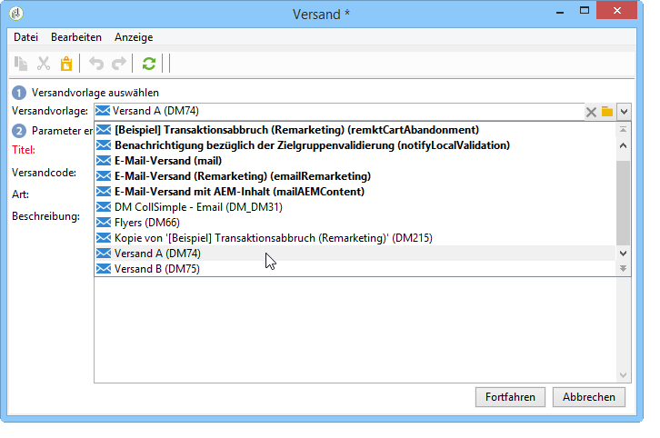

1. Klicken Sie auf **[!UICONTROL Fortfahren]** und anschließend auf .

   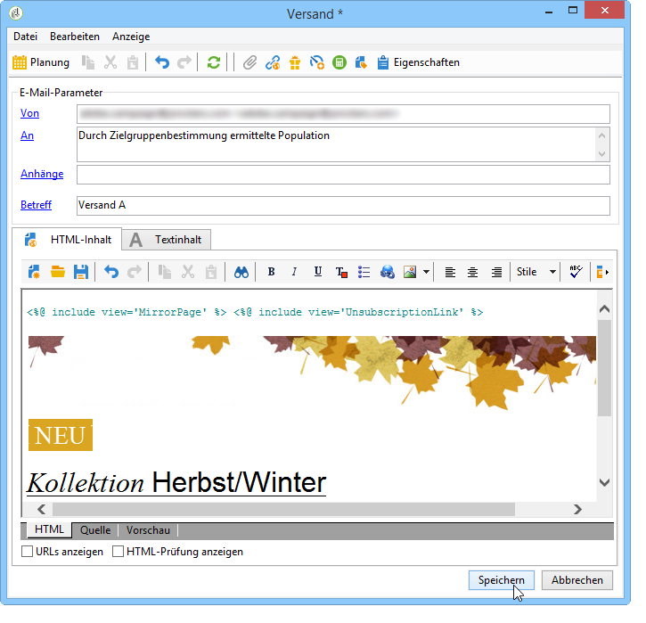

1. Verbinden Sie ausgehend von der Aufspaltung die Transition der Population B mit der zweiten **[!UICONTROL E-Mail-Versand]**-Aktivität.

   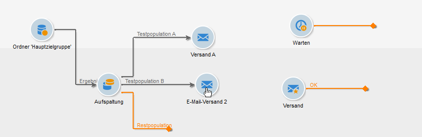

1. Öffnen Sie den Versand, wählen Sie die Vorlage B und speichern Sie den Versand.

   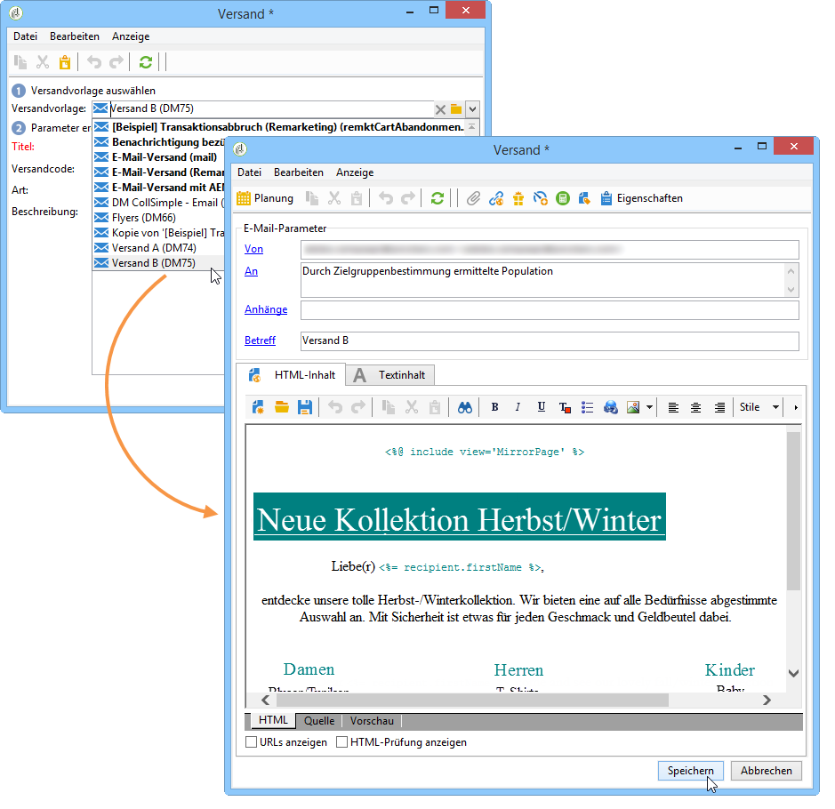

1. Verbinden Sie ausgehend von der Aufspaltung die Transition der verbleibenden Population mit der **[!UICONTROL Warten]**-Aktivität.

   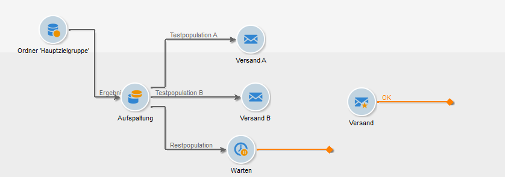

1. Öffnen Sie die **[!UICONTROL Warten]**-Aktivität und legen Sie die Wartezeit auf 5 Tage fest.

   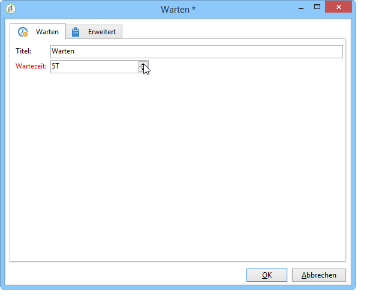

1. Verbinden Sie die **[!UICONTROL Warten]**-Aktivität mit der **[!UICONTROL JavaScript-Code]**-Aktivität.

   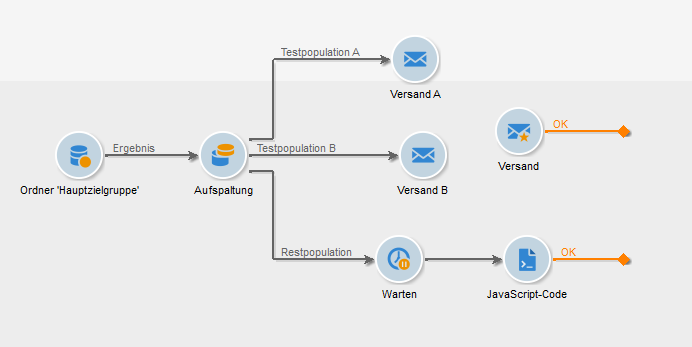

## 5. Schritt: Erstellung des Scripts {#step-5--creating-the-script}

Die Auswahl der Inhaltsversion, die an die verbleibende Population gesendet wird, erfolgt mithilfe eines Scripts. Das Script ruft die Information bezüglich der höchsten Öffnungsrate ab und kopiert den Inhalt der Siegerversion in den endgültigen Versand.

### Script-Beispiel {#example-of-a-script}

Das folgende Script kann wie im Zielgruppenbestimmungs-Workflow verwendet werden. Weitere Informationen hierzu finden Sie im Abschnitt [Implementierung](#implementation).

```
 // query the database to find the winner (best open rate)
   var winner = xtk.queryDef.create(
     <queryDef schema="nms:delivery" operation="get">
       <select>
         <node expr="@id"/>
         <node expr="@label"/>
         <node expr="[@operation-id]"/>
         <node expr="[@workflow-id]"/>
       </select>
       <where>
         <condition expr={"@FCP=0 and [@workflow-id]= " + instance.id}/>
       </where>
       <orderBy>
         <node expr="[indicators/@estimatedRecipientOpenRatio]" sortDesc="true"/>
       </orderBy>
     </queryDef>).ExecuteQuery()
   
   // create a new delivery object and initialize it by doing a copy of
   // the winner delivery
   var delivery = nms.delivery.create()
   delivery.Duplicate("nms:delivery|" + winner.@id)

   // append 'final' to the delivery label
   delivery.label = winner.@label + " final"

   // link the delivery to the operation to make sure it will be displayed in
   // the campaign dashboard. This attribute needs to be set manually here since 
   // the Duplicate() method has reset it to its default value => 0
   delivery.operation_id = winner.@["operation-id"]
   delivery.workflow_id = winner.@["workflow-id"]

   // adjust some delivery parameters to make it compatible with the 
   // "Prepare and start" option selected in the Delivery tab of this activity
   delivery.scheduling.validationMode = "manual"
   delivery.scheduling.delayed = 0
 
   // save the delivery in database
   delivery.save()
 
   // store the new delivery Id in event variables
   vars.deliveryId = delivery.id
```

Eine ausführliche Erläuterung des Scripts finden Sie unter [Script-Details](#details-of-the-script).

### Umsetzung {#implementation}

1. Öffnen Sie die **[!UICONTROL JavaScript-Code]**-Aktivität.
1. Kopieren Sie das in [Script-Beispiel](#example-of-a-script) angebotene Script in das Fenster **[!UICONTROL JavaScript-Code]**.

   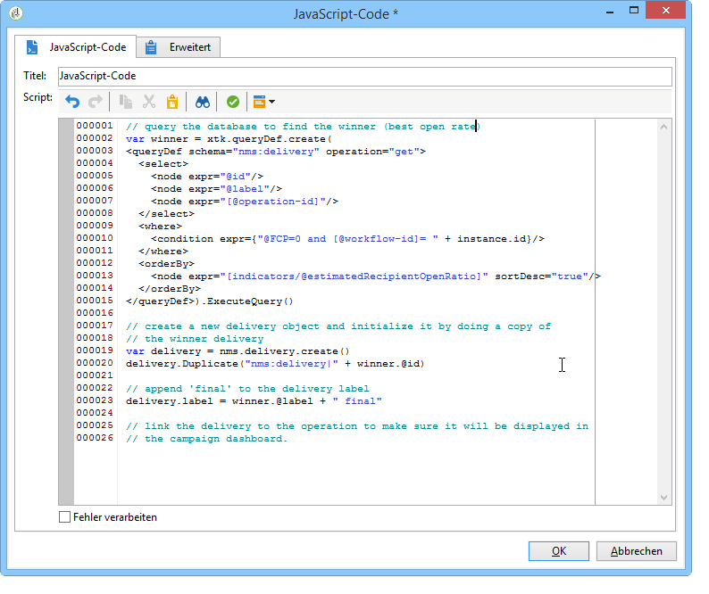

1. Geben Sie im **[!UICONTROL Titel]**-Feld den Script-Titel ein, d. h.

   ```
   <%= vars.deliveryId %>
   ```

   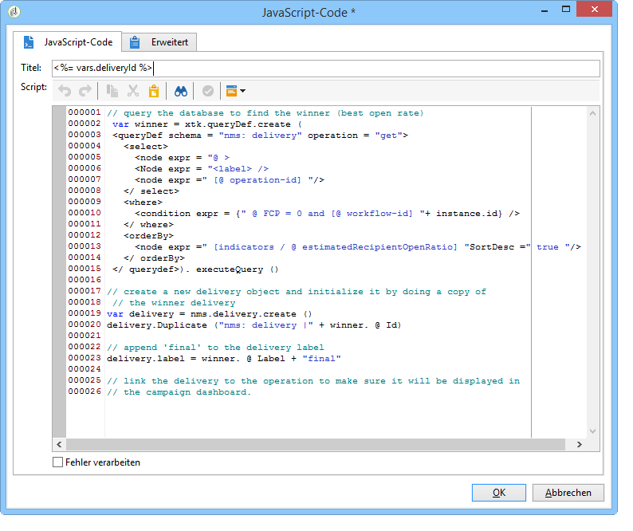

1. Schließen Sie die **[!UICONTROL JavaScript-Code]**-Aktivität.
1. Speichern Sie den Workflow.

### Script-Details {#details-of-the-script}

Im Folgenden werden die verschiedenen Script-Abschnitte und deren Funktionsweise erläutert.

* Der erste Abschnitt des Scripts ist eine Abfrage. Mit dem **queryDef**-Befehl werden aus der Tabelle **NmsDelivery** die durch die Ausführung des Workflows erstellten Sendungen abgerufen und nach ihren geschätzten Öffnungsraten geordnet. Im Anschluss werden die Informationen des Versands abgerufen, der die beste Öffnungsrate erzielt hat.

   ```
   // query the database to find the winner (best open rate)
      var winner = xtk.queryDef.create(
        <queryDef schema="nms:delivery" operation="get">
          <select>
            <node expr="@id"/>
            <node expr="@label"/>
            <node expr="[@operation-id]"/>
          </select>
          <where>
            <condition expr={"@FCP=0 and [@workflow-id]= " + instance.id}/>
          </where>
          <orderBy>
            <node expr="[indicators/@estimatedRecipientOpenRatio]" sortDesc="true"/>
          </orderBy>
        </queryDef>).ExecuteQuery()
   ```

* Der Versand mit der besten Öffnungsrate wird dupliziert.

   ```
    // create a new delivery object and initialize it by doing a copy of
    // the winner delivery
   var delivery = nms.delivery.create()
   delivery.Duplicate("nms:delivery|" + winner.@id)
   ```

* Der Titel des duplizierten Versands wird durch Hinzufügung von **final** angepasst.

   ```
   // append 'final' to the delivery label
   delivery.label = winner.@label + " final"
   ```

* Der Versand wird in das Kampagnen-Dashboard kopiert.

   ```
   // link the delivery to the operation to make sure it will be displayed in
   // the campaign dashboard. This attribute needs to be set manually here since 
   // the Duplicate() method has reset it to its default value => 0
   delivery.operation_id = winner.@["operation-id"]
   delivery.workflow_id = winner.@["workflow-id"]
   ```

   ```
   // adjust some delivery parameters to make it compatible with the 
   // "Prepare and start" option selected in the Delivery tab of this activity
   delivery.scheduling.validationMode = "manual"
   delivery.scheduling.delayed = 0
   ```

* Der Versand wird in der Datenbank gespeichert.

   ```
   // save the delivery in database
   delivery.save()
   ```

* Die eindeutige Kennung des duplizierten Versands wird in der Workflow-Variable gespeichert.

   ```
   // store the new delivery Id in event variables
   vars.deliveryId = delivery.id
   ```

### Andere Auswahlkriterien {#other-selection-criteria}

Im zuvor dargestellten Beispiel wird die endgültige Version anhand der Öffnungsraten der Testversionen bestimmt. Es besteht jedoch die Möglichkeit, andere Kriterien zu verwenden und das Script entsprechend anzupassen:

* Höchste Klickrate: `[indicators/@recipientClickRatio]`,
* Höchste Reaktionsrate (Öffnung der E-Mail und Klicks in der Nachricht): `[indicators/@reactivity]`,
* Niedrigste Beschwerderate: `[indicators/@refusedRatio]` (Attribut sortDesc auf „false“ setzen),
* Höchste Konversionsrate: `[indicators/@transactionRatio]`,
* Höchste Anzahl an besuchten Webseiten nach Erhalt der Nachricht: `[indicators/@totalWebPage]`,
* Niedrigste Abmelderate: `[indicators/@optOutRatio]`,
* Höchster Gesamtumsatz infolge des Erhalts der Nachricht: `[indicators/@amount]`.

## 6. Schritt - Ausgabeformat bestimmen {#step-6--defining-the-final-delivery}

Nachdem das Script zur Ermittlung des Gewinners des A/B-Tests erstellt wurde, können Sie die Parameter des endgültigen Versands definieren.

1. Verbinden Sie die Aktivität **[!UICONTROL JavaScript-Code]** mit der restlichen **[!UICONTROL Versand]**-Aktivität.
1. Öffnen Sie die **[!UICONTROL Versand]**-Aktivität.
1. Deaktivieren Sie die Option **[!UICONTROL Ausgehende Transition erzeugen]**, um den Workflow mit dieser Aktivität abzuschließen.
1. Lassen Sie die Standardwerte der anderen Optionen unverändert.

   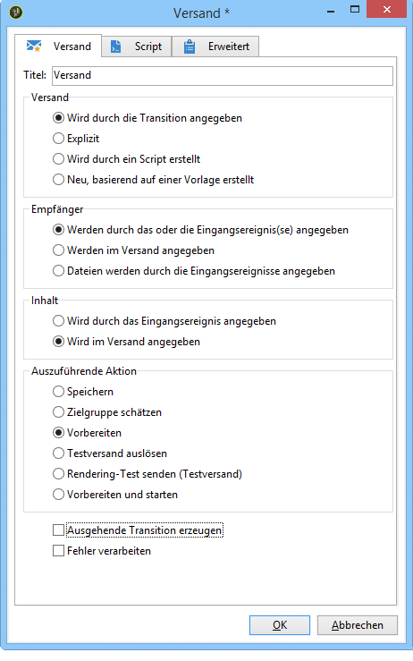

Durch die Vorbereitung des in der Transition spezifizierten Versands (definiert durch die **[!UICONTROL Javascript-Code]**-Aktivität), können Sie sie im Anschluss validieren und den Versand starten, wie im nächsten Schritt beschrieben wird.

## 7. Schritt: Start des Workflows {#step-7--starting-the-workflow}

1. Klicken Sie in der Workflow-Symbolleiste auf **[!UICONTROL Start]**.

   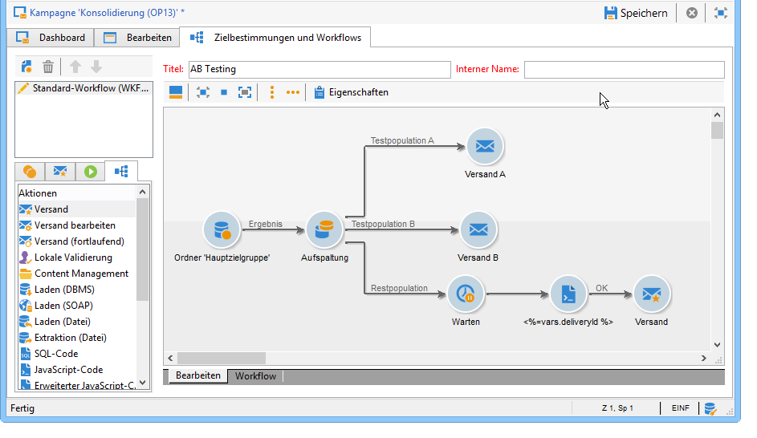

1. Gehen Sie in das Kampagnen-Dashboard und validieren Sie die Zielgruppen und Inhalte der Sendungen A und B.
1. Bestätigen Sie die Absendung der Nachrichten.
1. Lassen Sie die Wartezeit von fünf Tagen verstreichen, um die erfolgreichste Versandversion zu ermitteln.

   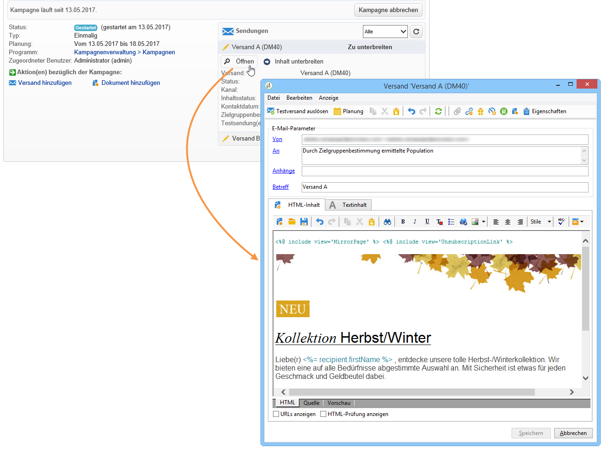

   Im vorliegenden Beispiel handelt es sich um die Version A.

1. Validieren Sie Zielgruppe und Inhalt der endgültigen Version und bestätigen Sie die Absendung.

## 8. Schritt: Ergebnisanalyse {#step-8--analyzing-the-result}

Nach Verarbeitung der Testsendungen besteht die Möglichkeit im Kampagnen-Dashboard zu prüfen, welche Empfänger welche Version erhalten und ob sie die Sendungen geöffnet haben. Klicken Sie auf den Link einer der Sendungen:

* Im **[!UICONTROL Versand]**-Tab wird angezeigt, welche Empfänger den Versand erhalten haben.

   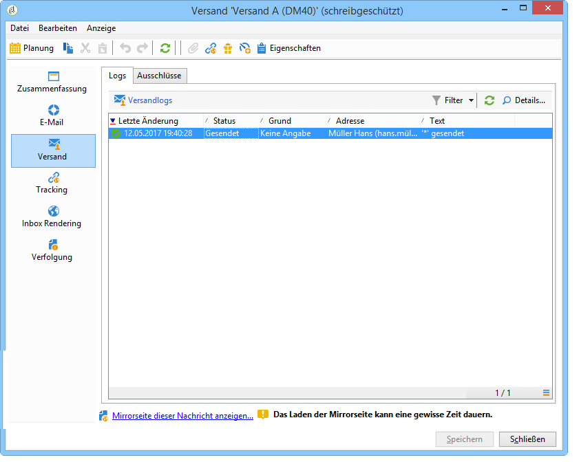

* Im **[!UICONTROL Tracking]**-Tab wird angezeigt, welche Empfänger den Versand geöffnet haben.

   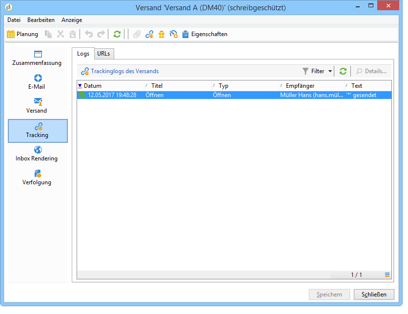

* Vergleichen Sie die Ergebnisse beider Sendungen miteinander.

   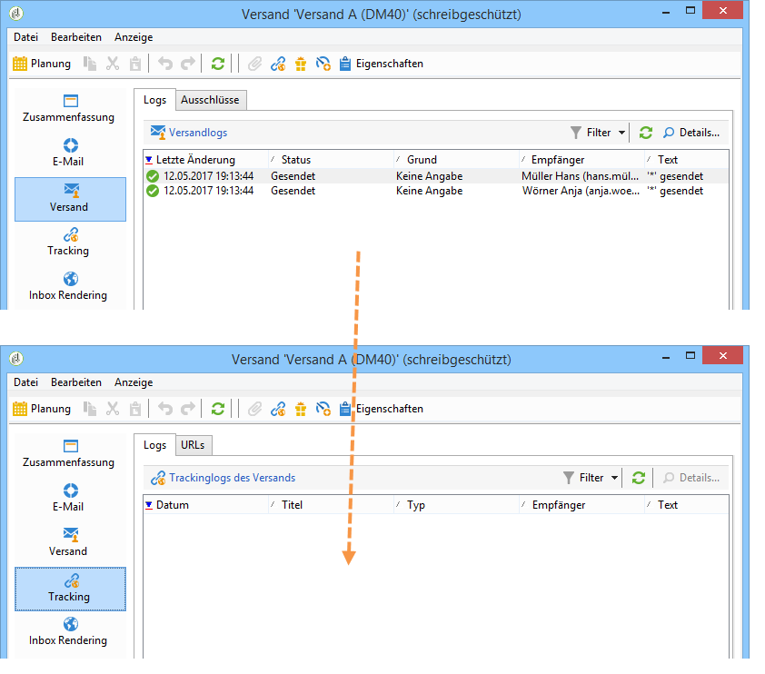

Im vorliegenden Beispiel hat der Versand A die besseren Öffnungsraten erzielt. Daher wurde der Inhalt A für den endgültigen Versand ausgewählt.

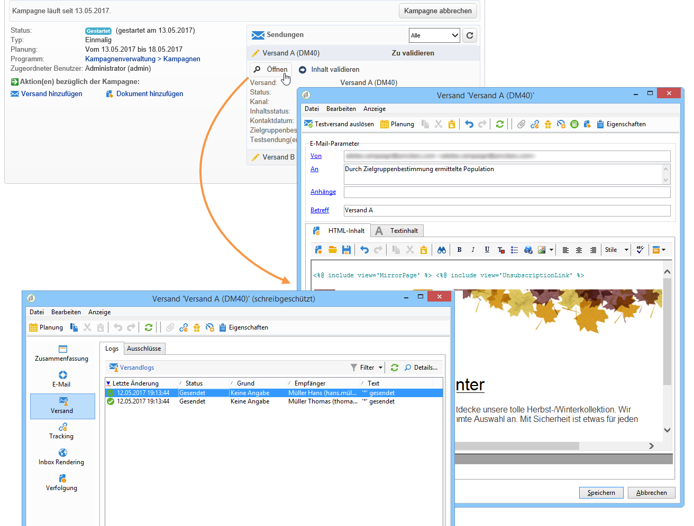

