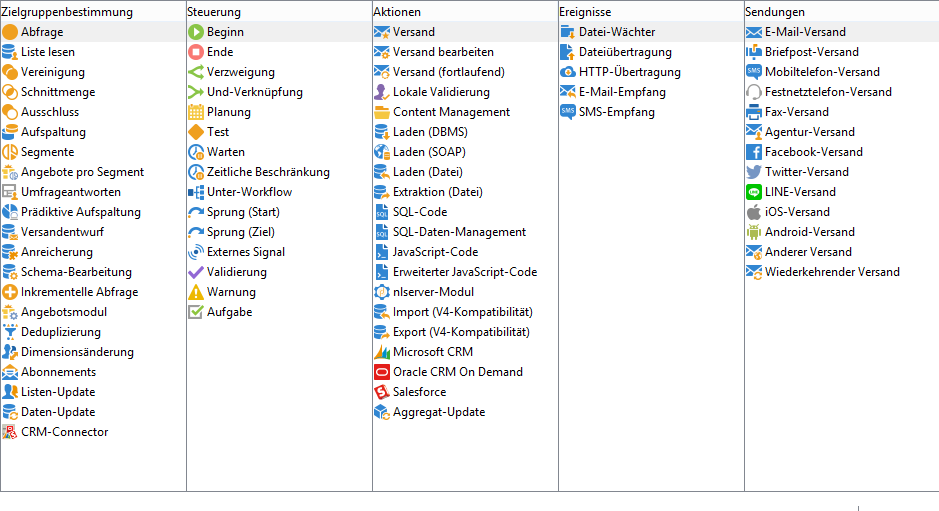

# Über Aktivitäten{#about-activities}

Das folgende Kapitel beschreibt im Detail alle zur Verfügung stehenden Workflow-Aktivitäten. Je nach Knoten oder Anwendungskontext der Workflows können die verfügbaren Aktivitäten abweichen. So bieten Kampagnen-Workflows beispielsweise kanalspezifische Versandaktivitäten.

Die verschiedenen Workflow-Aktivitäten werden in Kategorien zusammengefasst. Jeweils vier Tabs stehen simultan zur Verfügung:

In den Kampagnen-Workflows wird der Tab **[!UICONTROL Ereignisse]** durch den Tab **[!UICONTROL Versand]** ersetzt. Die Aktivitäten auf diesem Tab werden im Abschnitt [Aktionsaktivitäten](../../workflow/using/about-action-activities.md) beschrieben.

mehr dazu:

* [Über Zielgruppenbestimmungsaktivitäten](../../workflow/using/about-targeting-activities.md)
* [Daten importieren](../../workflow/using/importing-data.md)
* [Workflow ausführen](../../workflow/using/starting-a-workflow.md)
* [Best Practices bei Workflows](../../workflow/using/workflow-best-practices.md)
