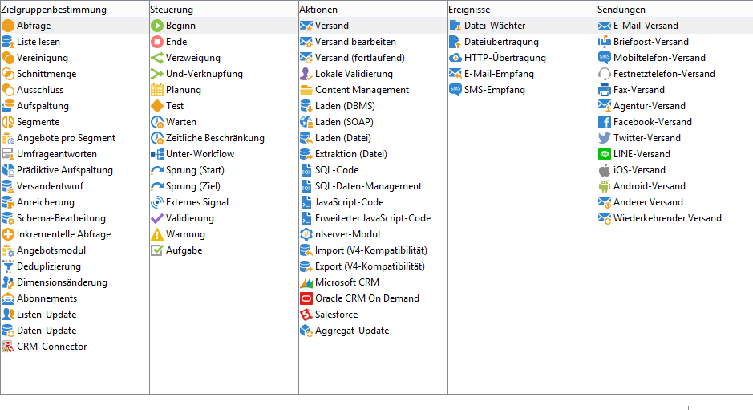

# Workflow-Aktivitäten{#wf-activities}

In diesem Abschnitt werden alle verfügbaren Aktivitäten beschrieben. Je nach Knoten oder Kontext, in dem der Workflow erstellt/bearbeitet wird, können die verfügbaren Aktivitäten variieren. Die in einer Kampagne erstellten Workflows weisen beispielsweise kanalspezifische Versandaktivitäten auf.

Workflow-Aktivitäten sind in Kategorien gruppiert. Jeweils vier Registerkarten stehen gleichzeitig zur Verfügung:

In den Kampagnen-Workflows wird der Tab **[!UICONTROL Ereignisse]** durch den Tab **[!UICONTROL Versand]** ersetzt. Die Aktivitäten auf diesem Tab werden im Abschnitt [Aktionsaktivitäten](about-action-activities.md) beschrieben.

mehr dazu:

* [Über Zielgruppenbestimmungsaktivitäten](about-targeting-activities.md)
* [Workflow ausführen](starting-a-workflow.md)
* [Best Practices bei Workflows](workflow-best-practices.md)
