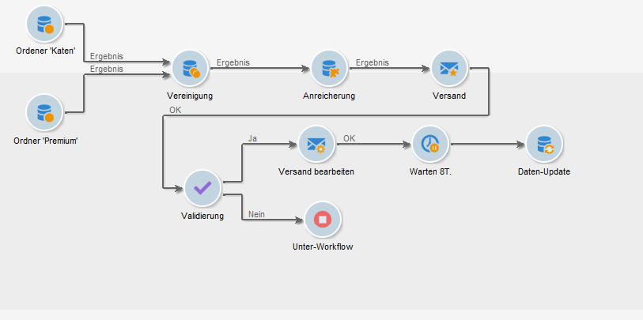

# Get started with workflows{#about-workflows}

## Über Workflows

Mit Adobe Campaign verfügen Sie über ein integriertes Workflow-Management-System, welches die zentrale Steuerung aller Prozesse und Vorgänge der Anwendung ermöglicht. Die Workflow-Engine dient der Modellierung und Automatisierung der verschiedenen Aufgaben der Anwendungsserver-Module. Mithilfe der grafischen Oberfläche lassen sich vollständige Arbeitsabläufe zur Segmentierung von Zielgruppen, der Ausführung von Kampagnen, dem Umgang mit Dateien etc. gestalten.

So bieten Workflows beispielsweise die Möglichkeit, Dateien von einem Server herunterladen, sie zu entkomprimieren und die Datensätze in die Adobe-Campaign-Datenbank zu importieren.

Oder benachrichtigen Sie andere Benutzer und fordern Sie sie dazu auf, Vorgänge zu validieren oder an Abstimmungen teilzunehmen. Auf diese Weise können Versandaktionen erstellt und anderen Benutzern vor dem Nachrichtenversand Aufgaben wie die Gestaltung des Inhalts, die Bestimmung der Zielgruppe und die Validierung von Testsendungen zugewiesen werden.

In Adobe Campaign kommen Workflows in unterschiedlichsten Kontexten und zu verschiedenen Zeitpunkten innerhalb der Kampagnenprozesse zum Einsatz.

Beispielhaft seien folgende Vorgänge genannt:

* Durchführen einer Zielgruppenbestimmung. Weitere Informationen hierzu finden Sie unter [Umsetzung](../../workflow/using/building-a-workflow.md#implementation-steps-).
* Erstellen von Kampagnen: Auf dem Tab **[!UICONTROL Workflow]** können Sie die Zielgruppe und die Sendungen erstellen. Weitere Informationen hierzu finden Sie im Abschnitt [Kampagnen-Workflows](../../workflow/using/building-a-workflow.md#campaign-workflows).
* Durchführen von technischen Prozessen: Bereinigung, Erfassung von Tracking-Informationen oder vorläufige Berechnungen. Weitere Informationen hierzu finden Sie im Abschnitt [Technische Workflows](../../workflow/using/building-a-workflow.md#technical-workflows).

Der Begriff Workflow bezeichnet einerseits einen Prozess (Workflow-Vorlage: Darstellung eines theoretischen Ablaufs) und andererseits eine Instanz dieses Prozesses (Workflow-Instanz: Darstellung des tatsächlichen Ablaufs).

Die Workflow-Vorlage beschreibt die verschiedenen zu erfüllenden Aufgaben und ihre Abfolge. Aufgabenvorlagen werden als Aktivitäten bezeichnet und durch Symbole repräsentiert. Sie sind durch Transitionen miteinander verbunden.

Jeder Workflow besteht aus:

* **[!UICONTROL Activities]**

   Aktivitäten sind Vorlagen für Aufgaben. Es gibt verschiedene Aktivitätstypen, die jeweils durch verschiedene Symbole im Diagramm dargestellt werden. Jeder Aktivitätstyp weist allgemeine und spezifische Eigenschaften auf. So haben beispielsweise alle Aktivitäten einen Namen und einen Titel, aber nur die Aktivität **[!UICONTROL Validierung]** bietet die Möglichkeit, einem Benutzer eine Aufgabe zuzuweisen.

   In einem Workflow-Diagramm kann eine einzelne Aktivität verschiedene Aufgaben auslösen. Dies ist insbesondere der Fall bei Schleifen oder (periodisch) wiederkehrenden Aktionen.

   Alle Workflow-Aktivitäten einschließlich Anwendungsbeispiele finden Sie in [diesem Abschnitt](../../workflow/using/about-activities.md).

* **[!UICONTROL Transitionen]**

   Transitionen stellen die Verbindungen zwischen Aktivitäten her und bestimmen die Reihenfolge der Verarbeitung. Jede Transition verbindet eine Quellaktivität mit einer Zielaktivität. Je nach Quellaktivität existieren verschiedene Transitionstypen. Bestimmte Transitionen bieten die Möglichkeit, zusätzliche Eigenschaften wie z. B. eine Dauer, eine Bedingung oder einen Filter zu definieren.

   Transitionen, die nicht mit einer Zielaktivität verbunden sind, werden als schwebend bezeichnet. Schwebende Transitionen sind orangefarben mit einer Raute anstelle der Pfeilspitze.

   >[!NOTE]
   >
   >Auch mit schwebenden Transitionen kann ein Workflow ausgeführt werden: Die Ausführung erzeugt einen Warnhinweis und wird bei Aktivierung einer derartigen Transition ausgesetzt. Es wird jedoch kein Fehler erzeugt. Auf diese Weise ist es möglich, einen Workflow zu starten, auch wenn seine Konzeption noch nicht vollständig abgeschlossen ist, und ihn nach und nach zu vervollständigen.

   Weiterführende Informationen zur Erstellung eines Workflows finden Sie in [diesem Abschnitt](../../workflow/using/building-a-workflow.md).

* **[!UICONTROL Arbeitstabellen]**

   Arbeitstabellen enthalten alle von der Transition übertragenen Informationen. Dies bedeutet, dass jeder Workflow mehrere Arbeitstabellen beansprucht. Vorausgesetzt, dass sie nicht bereinigt werden, können die Daten der Arbeitstabellen während des ganzen Lebenszyklus eines Workflows verwendet werden. Tatsächlich werden unnütze Tabellen bei jeder Workflow-Passivierung und gegebenenfalls während der Ausführung eines Workflows bereinigt. Letzteres ist bei umfangreichen Arbeitstabellen der Fall, um die Server nicht zu überlasten.

   Weiterführende Informationen zu Workflow-Daten und Tabellen finden Sie in [diesem Abschnitt](../../workflow/using/how-to-use-workflow-data.md).

## Wichtige Grundsätze und bewährte Verfahren

In den folgenden Abschnitten finden Sie Anleitungen und Best Practices zur Automatisierung von Prozessen mit Workflows:

* Learn more about workflow activities in [this page](../../workflow/using/how-to-use-workflow-data.md).
* In [diesem Abschnitt](../../workflow/using/building-a-workflow.md)erfahren Sie, wie Sie einen Workflow erstellen.
* In [diesem Abschnitt](../../workflow/using/importing-data.md)erfahren Sie, wie Workflows Daten in Kampagne importieren.
* Die Best Practices für den Arbeitsablauf werden auf [dieser Seite](../../workflow/using/workflow-best-practices.md)beschrieben.
* Hinweise zur Workflow-Ausführung finden Sie in [diesem Abschnitt](../../workflow/using/starting-a-workflow.md).
* Erfahren Sie, wie Sie Workflows auf [dieser Seite](../../workflow/using/monitoring-workflow-execution.md)überwachen.
* Erfahren Sie, wie Sie Benutzern Zugriff auf Workflows auf [dieser Seite](../../workflow/using/managing-rights.md)gewähren.
