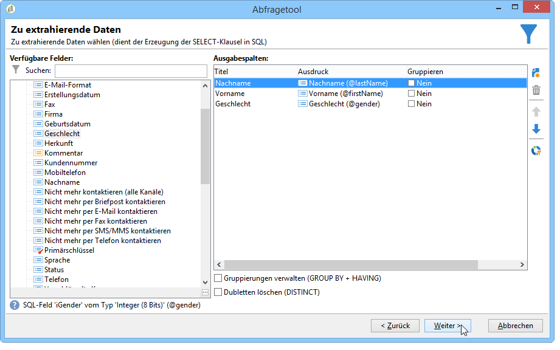
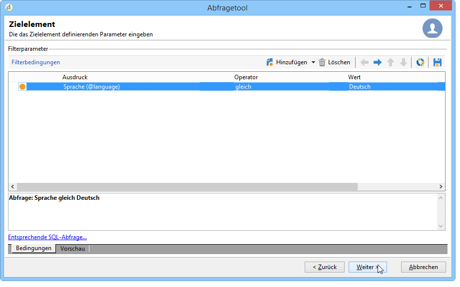
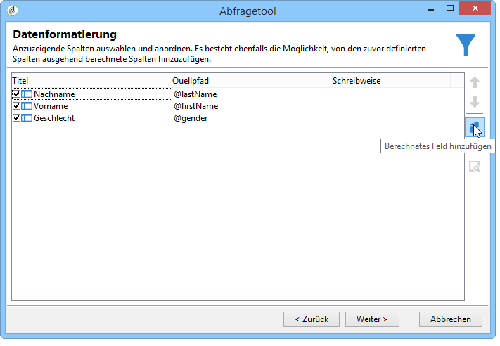
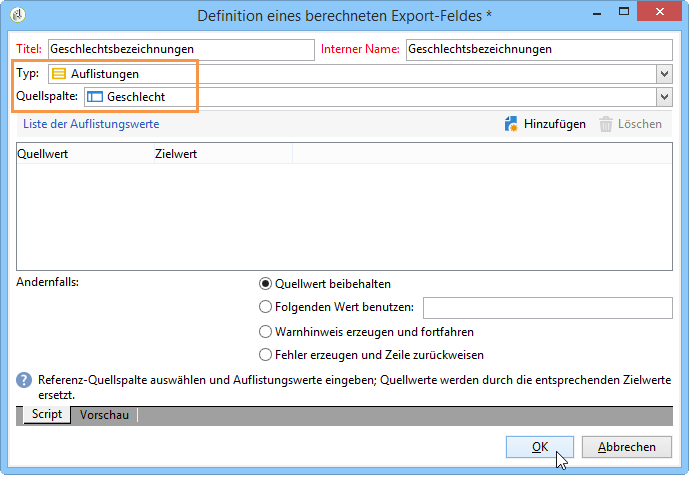
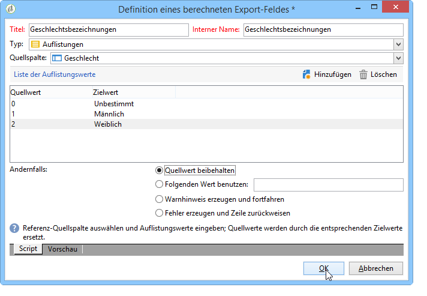
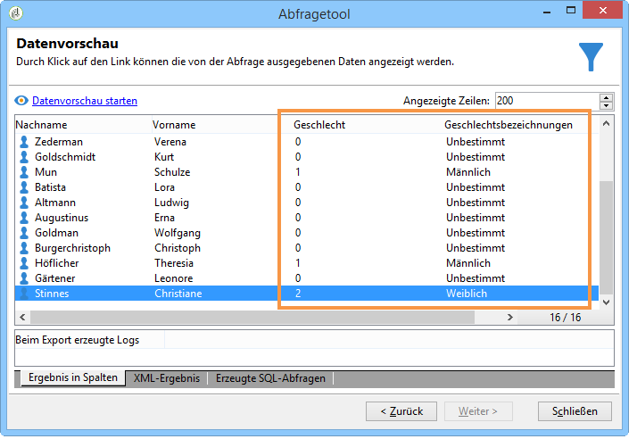
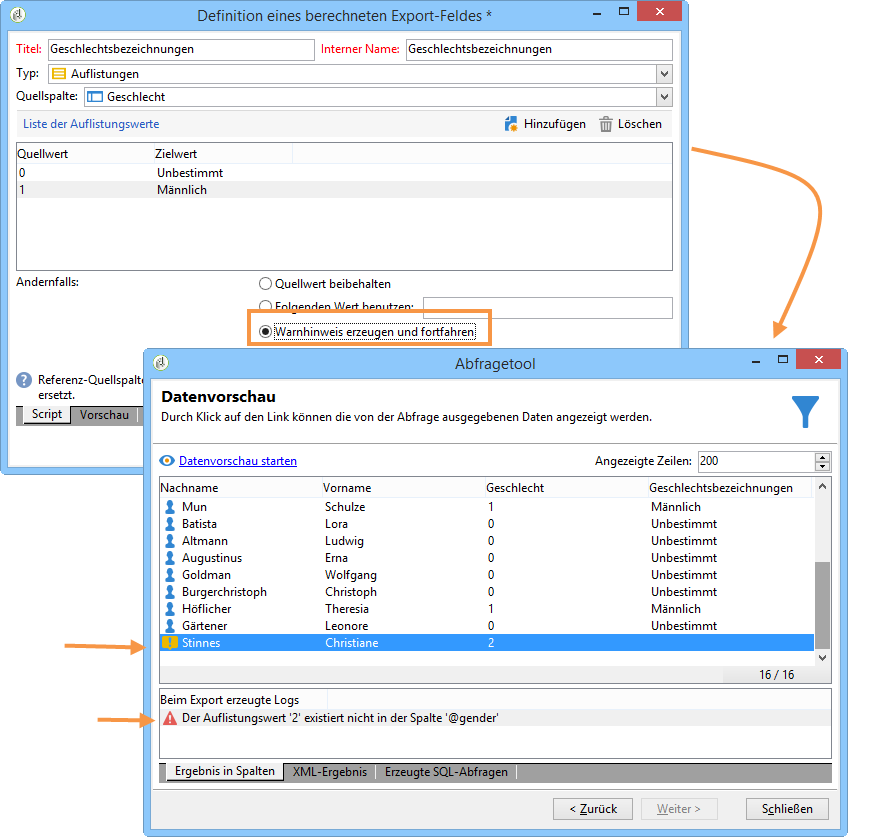
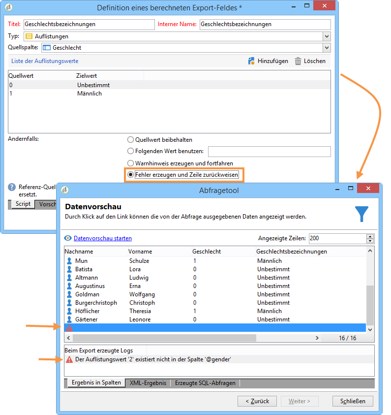

# Hinzufügung eines berechneten Auflistungsfelds {#adding-an-enumeration-type-calculated-field}

Hier möchten wir eine Abfrage mit einem berechneten **[!UICONTROL Enumerations]** Feld erstellen. Dieses Feld generiert eine zusätzliche Spalte im Datenvorschaufenster. Diese Spalte gibt die numerischen Werte an, die als Ergebnis für jeden Empfänger zurückgegeben werden (0, 1 und 2). Jedem Wert in der neuen Spalte wird ein Geschlecht zugewiesen: &quot;Männlich&quot;für &quot;1&quot;, &quot;Weiblich&quot;für &quot;2&quot;oder &quot;Nicht angegeben&quot;, wenn der Wert gleich &quot;0&quot;ist.

* Welche Tabelle soll ausgewählt werden?

   Die Empfängertabelle (nms:recipient)

* Felder, die als Ausgabespalten verwendet werden sollen?

   Nachname, Vorname, Geschlecht

* Nach welchen Kriterien sind die Informationen zu filtern?

   Nach der Sprache der Empfänger

Gehen Sie wie folgt vor:

1. Öffnen Sie das **[!UICONTROL nms:recipient]** generische Abfragetool und wählen Sie die Empfängertabelle (
1. Wählen Sie im **[!UICONTROL Data to extract]** Fenster **[!UICONTROL Last name]** und **[!UICONTROL First name]** und **[!UICONTROL Gender]**.

   

1. In the **[!UICONTROL Sorting]** window, click **[!UICONTROL Next]**: no sort is necessary for this example.
1. Wählen Sie **[!UICONTROL Data filtering]** in **[!UICONTROL Filtering conditions]**.
1. In the **[!UICONTROL Target element]** window, set a filter condition to collect recipients who speak English.

   

1. Klicken Sie im **[!UICONTROL Data formatting]** Fenster auf **[!UICONTROL Add a calculated field]**.

   

1. Gehen Sie zum **[!UICONTROL Type]** Fenster des **[!UICONTROL Export calculated field definition]** Fensters und wählen Sie **[!UICONTROL Enumerations]**.

   Definieren Sie die Spalte, auf die sich das neue berechnete Feld beziehen muss. Wählen Sie dazu die **[!UICONTROL Gender]** Spalte im Dropdown-Menü des **[!UICONTROL Source column]** Felds aus: die Zielwerte werden mit der **[!UICONTROL Gender]** Spalte übereinstimmen.

   

   Konfigurieren Sie **Quellwert** und **Zielwert**. Der Zielwert erleichtert die Lesbarkeit des Abfrageergebnisses, d. h. des Geschlechts der Empfänger (0, 1 oder 2).

   Klicken Sie für jede einzugebende Zeile &quot;source-destination&quot; **[!UICONTROL Add]** in das **[!UICONTROL List of enumeration values]**:

   * In the **[!UICONTROL Source]** column, enter the source value for each gender (0,1,2) in a new line.
   * In the **[!UICONTROL Destination]** column, enter the values: &quot;Not indicated&quot; for line &quot;0&quot;, &quot;Male&quot; for line &quot;1&quot;, and &quot;Female&quot; for line &quot;2&quot;.
   Wählen Sie die **[!UICONTROL Keep the source value]** Funktion aus.

   klicken Sie auf **[!UICONTROL OK]**, um die Konfiguration des berechneten Felds abzuschließen.

   

1. Klicken Sie im **[!UICONTROL Data formatting]** Fenster auf **[!UICONTROL Next]**.
1. Im Vorschaufenster, **[!UICONTROL start the preview of the data]**.

   Die berechnete Spalte zeigt an, welchem Geschlecht die drei Werte 0, 1 und 2 entsprechen:

   * 0 für &quot;Unbestimmt&quot;
   * 1 für &quot;Männlich&quot;
   * 2 für &quot;Weiblich&quot;
   

   Wenn Sie z. B. Geschlecht &quot;2&quot;nicht in das Feld eingeben **[!UICONTROL List of enumeration values]** und die **[!UICONTROL Generate a warning and continue]** Funktion des **[!UICONTROL In other cases]** Felds ausgewählt ist, erhalten Sie ein Warnprotokoll. Dieses Protokoll zeigt an, dass das Geschlecht &quot;2&quot; (Weiblich) nicht eingegeben wurde. Sie wird im **[!UICONTROL Logs generated during export]** Feld des Datenvorschaufensters angezeigt.

   

   Nehmen wir ein weiteres Beispiel und sagen, dass der Aufzählungswert &quot;2&quot;nicht eingegeben wurde. Wählen Sie die **[!UICONTROL Generate an error and reject the line]** Funktion aus: alle geschlechtsspezifischen &quot;2&quot;-Empfänger Anomalien und andere Informationen in der Zeile (Vor- und Nachname usw.) nicht exportiert werden. Im **[!UICONTROL Logs generated during export]** Feld des Datenvorschaufensters wird ein Fehlerprotokoll angezeigt. Dieses Protokoll gibt an, dass der Enumeration-Wert &quot;2&quot;nicht eingegeben wurde.

   
