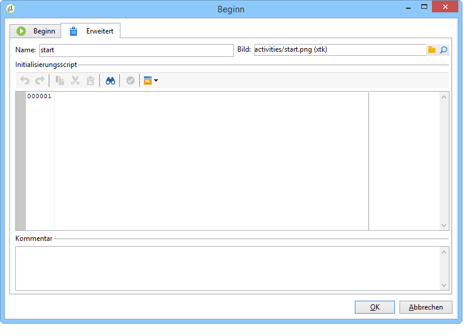
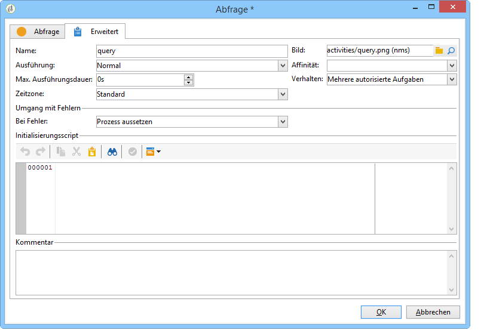

# Erweiterte Parameter{#advanced-parameters}

Der Bildschirm der Workflow-Eigenschaften enthält einen **[!UICONTROL Erweitert]**-Tab, welcher beispielsweise die Konfiguration des Verhaltens bei Fehlern und die Ausführungsdauer sowie die Erstellung eines Initialisierungsscripts erlaubt. Der Bildschirm erscheint je nach Aktivität in vereinfachter oder detaillierter Form:

* vereinfacht für die Aktivität **[!UICONTROL Start]** und **[!UICONTROL Ende]**;

   

* detailliert für die **[!UICONTROL Abfrageaktivität]**.

   

Im Folgenden werden die im **[!UICONTROL Erweitert]**-Tab jeweils auszufüllenden Felder beschrieben.

## Name {#name}

Dieses Feld enthält den internen Namen der Aktivität.

## Bild {#image}

In diesem Feld können Sie das mit einer Aktivität verknüpfte Bild ändern. Weiterführende Informationen finden Sie unter [Bilder für Aktivitäten verwalten](../../workflow/using/managing-activity-images.md).

## Ausführung {#execution}

Definieren Sie hier die Art der Aufgabenausführung. Drei Optionen stehen zur Verfügung:

In der Regel werden diese Optionen im Diagramm durch Rechtsklick auf die Aktivität ausgewählt.

* **[!UICONTROL Normal]** - die Aufgabe wird ausgeführt.
* **[!UICONTROL Nicht aktivieren]** - die Aufgabe sowie alle im selben Zweig folgenden Aktivitäten werden nicht ausgeführt.
* **[!UICONTROL Aktivieren aber nicht ausführen]** - die Aufgabe sowie alle im selben Zweig folgenden Aktivitäten werden mit sofortiger Wirkung ausgesetzt. Dies ist v. a. dann interessant, wenn die Aufgabe in Ihrer Anwesenheit gestartet werden soll. Klicken Sie zum gewünschten Ausführungszeitpunkt mit der rechten Maustaste auf eine Aktivität und wählen Sie **[!UICONTROL Normale Ausführung]**.

## Affinität {#affinity}

Mit diesem Feld können Sie die Ausführung einer Aktivität auf einem bestimmten Gerät erzwingen. Weitere Informationen hierzu finden Sie im Abschnitt [Die Neigung verwalten](../../workflow/using/managing-propensity.md).

## Max. Ausführungsdauer {#max--execution-period}

In diesem Feld kann eine maximale Dauer für die Workflow-Ausführung bestimmt werden. Wenn eine Aufgabe die angegebene Dauer überschreitet, zeigt das **[!UICONTROL Monitoring der Instanz]** einen Warnhinweis bezüglich des Workflows an. Auf diese Seite kann von der Startseite aus über die Rubrik **[!UICONTROL Monitoring]** zugegriffen werden.****

## Verhalten {#behavior}

In diesem Feld wird das Verhalten des Workflows im Fall von asynchronen Aufgaben bestimmt. Zwei Optionen stehen zur Verfügung:

* **[!UICONTROL Mehrere autorisierte Aufgaben]** - mehrere Aufgaben können gleichzeitig ausgeführt werden.
* **[!UICONTROL Die laufende Aufgabe ist prioritär]** - solange eine Aufgabe läuft, wird keine neue Aufgabe gestartet.

## Time zone {#time-zone}

In diesem Feld können Sie die Zeitzone der Aktivität auswählen. Weiterführende Informationen finden Sie unter [Zeitzonen verwalten](../../workflow/using/managing-time-zones.md).

## Fehler {#in-case-of-errors}

In diesem Feld wird angegeben, wie mit Fehlern umgegangen werden soll. Zwei Optionen stehen zur Verfügung:

* **[!UICONTROL Prozess aussetzen]** - der Workflow wird automatisch ausgesetzt, sein Status wechselt in **[!UICONTROL Fehlgeschlagen]**. Nach Beseitigung der Fehlerursache kann der Workflow neu gestartet werden.
* **[!UICONTROL Ignorieren]** - die den Fehler verursachende Aufgabe sowie alle folgenden im selben Zweig werden nicht ausgeführt. Diese Konfiguration empfiehlt sich bei wiederkehrenden Aufgaben. Wenn der Workflow-Zweig eine Planungsaktivität enthält, löst diese automatisch zum nächsten geplanten Zeitpunkt die nächste Ausführung aus.

## Initialisierungsscript {#initialization-script}

In diesem Feld können Sie Variablen initialisieren oder Aktivitätseigenschaften ändern. Weiterführende Informationen finden Sie unter [Scripts/JavaScript-Templates](../../workflow/using/javascript-scripts-and-templates.md).

## Kommentar {#comment}

Hier kann eine Beschreibung eingegeben werden. Es handelt sich um ein freies Textfeld.****
