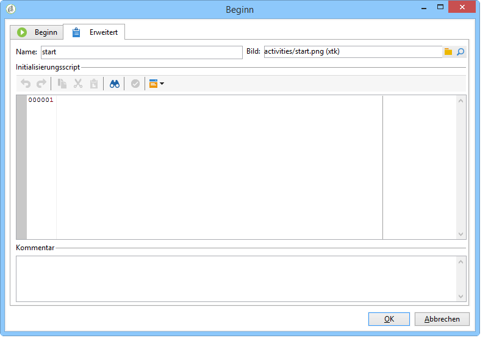
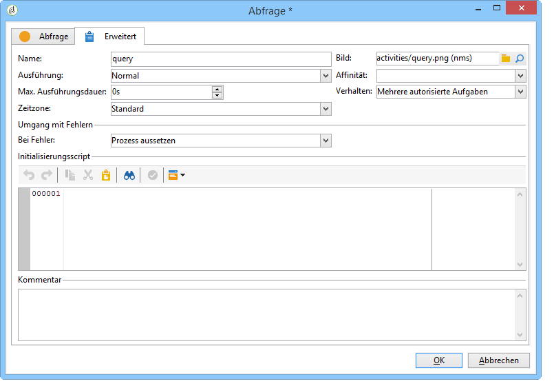

# Erweiterte Parameter{#advanced-parameters}

Der Bildschirm mit den Eigenschaften der Aktivität enthält eine Registerkarte **[!UICONTROL Erweitert]**, die beispielsweise die Konfiguration des Verhaltens bei Fehlern und die Ausführungsdauer der Aktivität sowie die Eingabe eines Initialisierungsskripts erlaubt. Es gibt zwei Versionen dieser Registerkarte:

* vereinfacht für die Aktivität **[!UICONTROL Start]** und **[!UICONTROL Ende]**;

  

* detailliert für die **[!UICONTROL Abfrageaktivität]**.

  

Im Folgenden werden die im **[!UICONTROL Erweitert]**-Tab jeweils auszufüllenden Felder beschrieben.

## Name {#name}

Dieses Feld enthält den internen Namen der Aktivität.

## Bild {#image}

In diesem Feld können Sie das mit einer Aktivität verknüpfte Bild ändern. Weiterführende Informationen finden Sie unter [Ändern von Aktivitäts-Bildern](managing-activity-images.md).

## Ausführung {#execution}

In diesem Feld definieren Sie die beim Auslösen der Aufgabe auszuführende Aktion. Es gibt drei mögliche Optionen:

In der Regel werden diese Optionen im Diagramm durch Rechtsklick auf die Aktivität ausgewählt.

* **[!UICONTROL Normal]** - die Aufgabe wird ausgeführt.
* **[!UICONTROL Nicht aktivieren]** - die Aufgabe sowie alle im selben Zweig folgenden Aktivitäten werden nicht ausgeführt.
* **[!UICONTROL Aktivieren, aber nicht ausführen]** – die Aufgabe sowie alle im selben Zweig folgenden Aktivitäten werden automatisch angehalten. Dies kann nützlich sein, wenn Sie beim Starten der Aufgabe anwesend sein möchten. Klicken Sie mit der rechten Maustaste auf die Aktivität und wählen Sie **[!UICONTROL Normale Ausführung]**.

## Affinität {#affinity}

Sie können die Ausführung eines Workflows oder einer Workflow-Aktivität auf einem bestimmten Computer erzwingen. Hierzu müssen ein oder mehrere Neigungswerte auf Workflow- oder Aktivitätsniveau definiert werden.

Die Konfiguration von Workflows mit hoher Disponibilität wird in diesem [Abschnitt](../../installation/using/configuring-campaign-server.md#high-availability-workflows-and-affinities) erläutert.

## Max. Ausführungsdauer {#max--execution-period}

In diesem Feld können Sie eine Warnung einrichten, wenn die Aufgabe zu lange dauert. Dies wirkt sich nicht auf den Workflow-Vorgang aus. Wenn die Aufgabe nicht zum Zeitpunkt der **[!UICONTROL Max. Ausführungsdauer]** vorbei ist, zeigt das **[!UICONTROL Monitoring der Instanz]** einen Warnhinweis bezüglich des Workflows an. Auf diese Seite kann von der Startseite aus über die Rubrik **[!UICONTROL Monitoring]** zugegriffen werden.

## Verhalten {#behavior}

In diesem Feld wird das Verhalten des Workflows im Fall von asynchronen Aufgaben bestimmt. Sie haben zwei Möglichkeiten:

* **[!UICONTROL Mehrere autorisierte Aufgaben]** - mehrere Aufgaben können gleichzeitig ausgeführt werden.
* **[!UICONTROL Laufende Aufgabe hat Vorrang]** – laufende Aufgaben haben Priorität. Solange eine Aufgabe läuft, wird keine neue Aufgabe gestartet.

## Zeitzone {#time-zone}

In diesem Feld können Sie die Zeitzone der Aktivität auswählen. Weiterführende Informationen finden Sie unter [Verwalten von Zeitzonen](managing-time-zones.md).

## Fehler {#in-case-of-errors}

In diesem Feld wird angegeben, wie mit Fehlern bei der Aktivität umgegangen werden soll. Sie haben zwei Möglichkeiten:

* **[!UICONTROL Prozess aussetzen]**: Der Workflow wird automatisch angehalten. Der Status ändert sich in **[!UICONTROL Fehlgeschlagen]**. Nach Lösung des Problems kann der Workflow neu gestartet werden.
* **[!UICONTROL Ignorieren]** – die Aufgabe sowie alle im selben Zweig folgenden Aktivitäten werden nicht ausgeführt. Dies kann für wiederkehrende Aufgaben nützlich sein. Wenn der Zweig eine Planungsaktivität enthält, wird diese wie üblich zum nächsten geplanten Ausführungszeitpunkt gestartet.
* **[!UICONTROL Abbruch bei Fehler]**: Der Workflow wird automatisch angehalten und kann nicht neu gestartet werden. Der Status ändert sich in **[!UICONTROL Fehlgeschlagen]**.

## Initialisierungsskript {#initialization-script}

In diesem Feld können Sie Variablen initialisieren oder Aktivitätseigenschaften ändern. Weiterführende Informationen finden Sie unter [Scripts/JavaScript-Templates](javascript-scripts-and-templates.md).

## Kommentar {#comment}

Hier kann eine Beschreibung eingegeben werden. Es handelt sich um ein freies Textfeld.****
