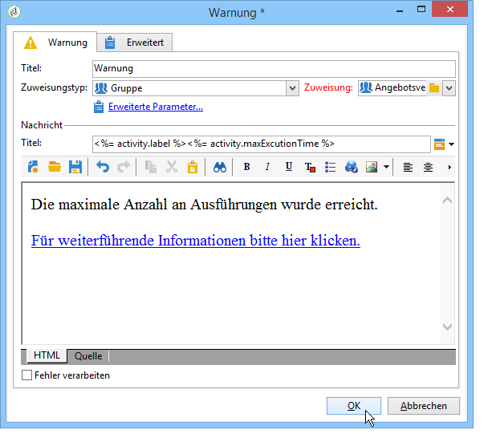

# Warnung{#alert}

Eine **Warnung** sendet eine Nachricht an eine Benutzergruppe. Die Funktionsweise entspricht der von Validierungen, mit dem Unterschied, dass keine Antwort erwartet wird.

Eine Warnung ist nicht persistent und wird nicht in der Konsole angezeigt. Die Benutzerprofile der benachrichtigten Gruppe müssen daher zwingend eine E-Mail-Adresse enthalten. Die Konfiguration dieser Aktivität entspricht der einer **Validierung**. Die Standardvorlage zur Warnung der Benutzer ist &#39;alertAssignee&#39;.
