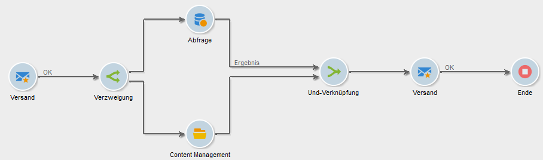

# Und-Verknüpfung{#and-join}

Bei einer Und-Verknüpfung wird die ausgehende Transition erst aktiviert, wenn alle eingehenden Transitionen aktiviert wurden. Dadurch lässt sich sicherstellen, dass gewisse Aktivitäten beendet sind, bevor die Workflow-Ausführung fortgesetzt wird.

Beispielsweise können Sie eine Und-Verknüpfungsaktivität bei der Inhaltserstellung und Automatisierung des Versand verwenden, um sicherzustellen, dass ein Versand erst gestartet wird, wenn die Zielgruppe abgefragt und die Schritte zur Inhaltsaktualisierung abgeschlossen sind. Ein spezielles Anwendungsbeispiel ist in [diesem Abschnitt](../../delivery/using/automating-via-workflows.md#creating-the-delivery-and-its-content) verfügbar.

Die an die ausgehende Transition übermittelte Population entspricht der Hauptmenge, die zuvor aus den eingehenden Transitionen der Aktivität bestimmt wurde.

Die ausgehende Transition kann nur eine der eingehenden Populationen enthalten. Wenn die Hauptmenge nicht bestimmt wurde, wird die an die ausgehende Transition übermittelte Population zufällig ausgewählt.

>[!CAUTION]
>
>Bei Verwendung einer **UND-Verknüpfung** fusionieren die Ereignisvariablen. Wenn eine Variable aber mehrmals definiert wurde, entsteht ein Konflikt und es wird ein unbestimmter Wert ausgegeben. Weiterführende Informationen hierzu finden Sie in [diesem Abschnitt](../../workflow/using/javascript-scripts-and-templates.md#event-variables).
