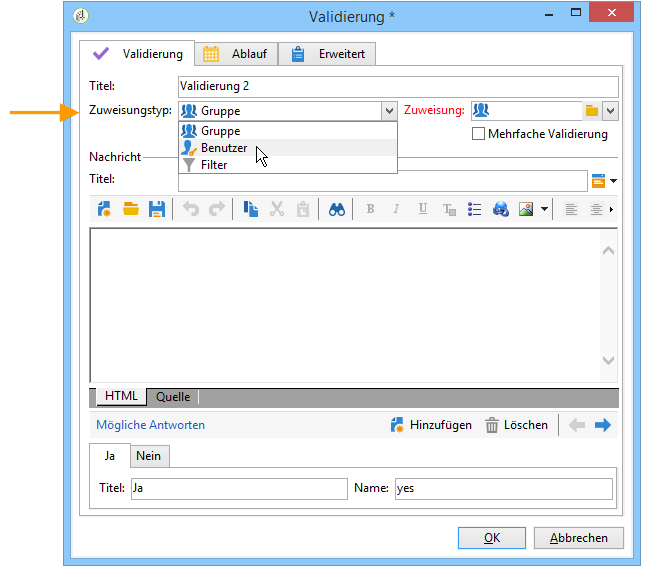
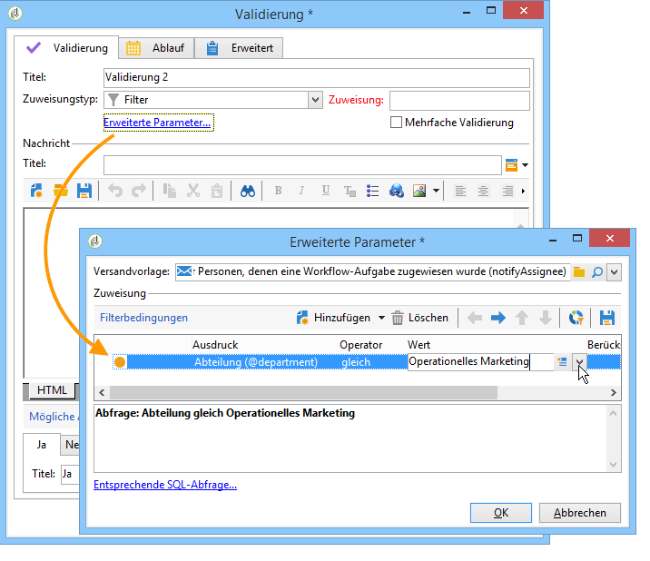
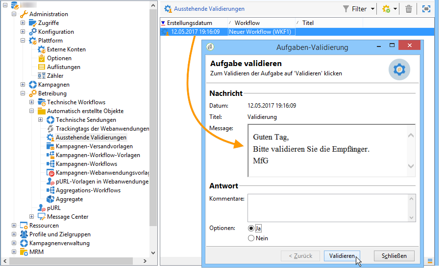
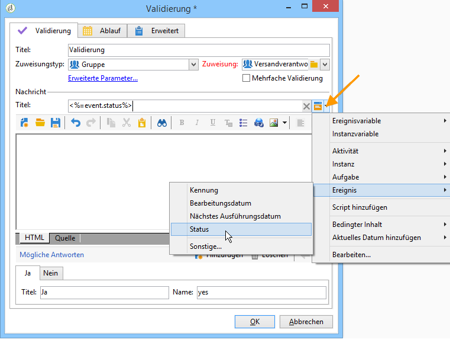

# Validierung{#approval}

Eine **Validierung** wartet auf ein Signal oder die Entscheidung eines Benutzers. Validierungsaufgaben werden Benutzern zugewiesen, die per E-Mail, Webzugriff oder in der Clientkonsole darauf antworten.

## Aufgabenzuweisung {#task-assignment}

Standardmäßig wird eine Validierung einer Benutzergruppe zugewiesen. Gruppen repräsentieren bestimmte Rollen, beispielsweise &#39;Verantwortliche Gruppe Newsletter-Inhalt&#39; oder &#39;Verantwortliche Gruppe Newsletter-Zielgruppe&#39;. Jeder Benutzer der Gruppe kann die Anfrage beantworten, aber nur die erste Antwort wird berücksichtigt (außer bei einer Mehrfach-Validierung).

Bei Bedarf kann die Validierung auch einem einzelnen oder durch die Verwendung von Filtern mehreren Benutzern zugewiesen werden.

* To select a single operator, select the **[!UICONTROL Operator]** value in the **[!UICONTROL Assignment type]** field and select the relevant operator in the drop-down list of the **[!UICONTROL Assignee]** field.

   

   >[!CAUTION]
   >
   >Nur der ausgewählte Benutzer verfügt über die Berechtigung zur Validierung der Aufgabe.

* Sie können eine Abfrage zum Filtern von Genehmigungsoperatoren definieren. Wählen Sie dazu den **[!UICONTROL Filter]** Wert im **[!UICONTROL Assignment type]** Feld aus und klicken Sie auf den **[!UICONTROL Advanced parameters...]** Link, um Filterbedingungen zu definieren, wie im folgenden Beispiel gezeigt:

   

Im Fall einer einfachen Validierung, wird die der Wahl des Benutzers entsprechende Transition aktiviert und die Aufgabe abgeschlossen. Andere Benutzer können nun die Aufgabe nicht mehr validieren.

Im Fall einer Mehrfach-Validierung wird für jede vorgenommene Validierung die entsprechende Transaktion aktiviert. Die Aufgabe wird abgeschlossen, sobald alle Benutzer der Gruppe geantwortet haben, oder wenn die Aufgabe abgelaufen ist.

Diese Aktivität betrifft nicht den gesamten Workflow, andere Aufgaben können parallel ausgeführt werden.

Benutzer können die ihnen zugewiesenen Aufgaben in der Clientkonsole validieren. Administratoren können anderen Benutzern zugewiesene Aufgaben ansehen und löschen, sie jedoch nicht validieren.

Änderungen in Bezug auf die Titel oder den Nachrichten-Textkörper der Aktivität haben keinen Einfluss auf laufende Aufgaben. Sollten jedoch die möglichen Antworten geändert werden, werden die neuen Optionen automatisch in den laufenden Aufgaben übernommen.

**Aufgaben des Genehmigungstyps** können über den **[!UICONTROL Administration > Production > Objects created automatically > Approvals pending]** Knoten aufgerufen werden: Operatoren können direkt über diese Ansicht auf das Genehmigungsformular zugreifen.

## Eigenschaften {#properties}

In den Benachrichtigungen, die an die für die Validierung ausgewählten Benutzer gesandt werden, können im Titel und im Nachrichten-Textkörper Personalisierungsvariablen verwendet werden.

Dieses **[!UICONTROL Title]** Feld enthält den Titel der Nachricht: Dies ist der Betreff der gesendeten E-Mail. Der Titel sowie der Nachrichtentext sind JavaScript-Vorlagen und können daher Werte enthalten, die nach dem Kontext des Workflows berechnet werden.

Im unteren Bereich des Editors werden die möglichen Antworten definiert. Jeder Antwort entspricht eine aus der Aktivität ausgehende Transition. Der Name ist die interne Kennung und der Titel, der in der Auswahlliste angezeigte Text.

Klicken Sie auf den **[!UICONTROL Advanced parameters...]** Link, um die Bereitstellungsvorlage auszuwählen, mit der die Operatoren benachrichtigt werden sollen. Die Standardvorlage (interner Name &quot;notificationAssignee&quot;) nimmt den Titel und die Meldung und fügt einen Link zur Webseite hinzu, die zur Beantwortung verwendet wird.

Die Vorlage kann angepasst werden. Es wird jedoch empfohlen, sie zu duplizieren und unter einem neuen Namen zu speichern. Der Zielgruppenmechanismus (externe Datei, Zielgruppen-Mapping) darf hingegen nicht geändert werden. Er ist für die korrekte Funktionsweise der Benachrichtigungen erforderlich.

An approval example is shown in [Defining approvals](../../workflow/using/executing-a-workflow.md#defining-approvals).

## Ausgabeparameter {#output-parameters}

* **[!UICONTROL response]**

   Kommentar zur Antwort

* **[!UICONTROL responseOperator]**

   Bezeichner des Operators, der reagiert hat. Dieses Feld ist ein Zahlenwert, aber ein **[!UICONTROL String]** Feld.

