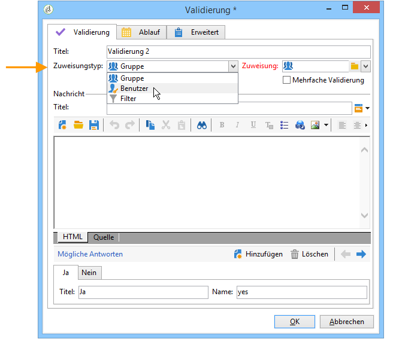
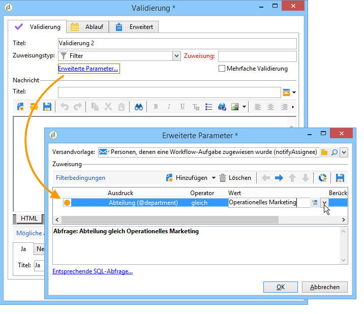
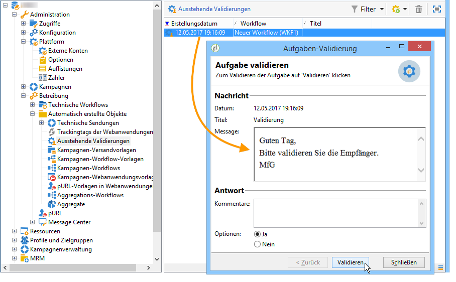
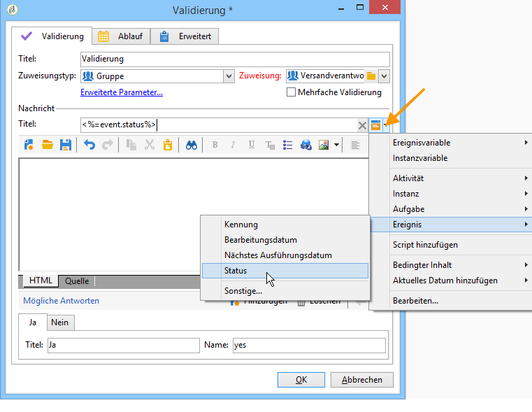

# Validierung{#approval}

Eine Aufgabe des Typs **Validierung** erfordert die Beteiligung einer Benutzerin bzw. eines Benutzers. Der Benutzerin bzw. dem Benutzer wird eine Aufgabe zugewiesen, auf die per E-Mail, über die in der E-Mail-Nachricht verknüpfte Web-Seite oder über die Konsole reagiert werden kann.

## Aufgabenzuweisung {#task-assignment}

Standardmäßig wird die Validierung einer Benutzergruppe zugewiesen. Diese Gruppe repräsentiert eine Rolle, z. B. „Gruppe für Newsletter-Inhalte“ oder „Zielgruppenbestimmungsgruppe für Newsletter“. Alle Benutzenden in der Gruppe können antworten, es wird jedoch nur die erste Antwort berücksichtigt (außer eine mehrfache Validierung ist erforderlich).

Bei Bedarf kann die Validierung auch einem einzelnen oder durch die Verwendung von Filtern mehreren Benutzern zugewiesen werden.

* Zur Auswahl eines einzelnen Benutzers ist im Feld **[!UICONTROL Zuweisungstyp]** die Option **[!UICONTROL Benutzer]** zu wählen. Wählen Sie dann aus der Dropdown-Liste des Felds **[!UICONTROL Zuweisung]** den gewünschten Benutzer aus.

  

  >[!CAUTION]
  >
  >Nur der ausgewählte Benutzer verfügt über die Berechtigung zur Validierung der Aufgabe.

* Es besteht die Möglichkeit, eine Abfrage zu erstellen, um die für die Validierung verantwortlichen Benutzenden zu filtern. Wählen Sie hierzu im Feld **[!UICONTROL Zuweisungstyp]** die Option **[!UICONTROL Filter]** aus und klicken Sie auf den Link **[!UICONTROL Erweiterte Parameter…]**, um die Filterkriterien zu definieren, wie im unten stehendem Beispiel dargestellt:

  

Im Fall einer einfachen Validierung, wird die der Wahl des Benutzers entsprechende Transition aktiviert und die Aufgabe abgeschlossen. Andere Benutzer können nun die Aufgabe nicht mehr validieren.

Im Fall einer mehrfachen Validierung werden Transitionen entsprechend der Auswahl jeder Benutzerin bzw. jedes Benutzers aktiviert. Die Aufgabe wird abgeschlossen, sobald alle Benutzenden der Gruppe reagiert haben, oder wenn die Aufgabe abgelaufen ist.

Diese Aktivität betrifft nicht den gesamten Workflow, andere Aufgaben können parallel ausgeführt werden.

Eine Benutzerin bzw. ein Benutzer kann die ihr bzw. ihm zugewiesenen Aufgaben über die Konsole validieren. Benutzer bzw. Benutzerinnen mit Administratorrechten können die Aufgaben, die einem Benutzer bzw. einer Benutzerin zugewiesen sind, anzeigen und löschen, aber nicht darauf antworten.

Änderungen in Bezug auf die Titel oder den Nachrichten-Textkörper der Aktivität haben keinen Einfluss auf laufende Aufgaben. Sollten jedoch die möglichen Antworten geändert werden, werden die neuen Optionen automatisch in den laufenden Aufgaben übernommen.

Auf **Validierungsaufgaben** kann im Knoten **[!UICONTROL Administration > Betreibung > Automatisch erstellte Objekte > Ausstehende Validierungen]** zugegriffen werden. Aus dieser Ansicht heraus gelangen die Benutzer direkt in die verschiedenen Validierungsformulare.

## Eigenschaften {#properties}

In der an die prüfenden Personen gesendeten Nachricht können Personalisierungsvariablen verwendet werden. Diese können entweder in den Nachrichtentitel oder den Textkörper eingefügt werden.

Das Feld **[!UICONTROL Titel]** enthält den Titel der Nachricht und stellt den Betreff der gesendeten E-Mail-Nachricht dar. Sowohl beim Titel als auch beim Nachrichtentext handelt es sich um JavaScript-Vorlagen. Daher können sie Werte enthalten, die entsprechend dem Kontext des Workflows berechnet wurden.

Im unteren Bereich des Editors können Sie die Liste der möglichen Antworten definieren. Zu jeder Antwort gehört eine Transition. Der Name ist die interne Kennung und der Titel ist der Text, der in der Auswahlliste angezeigt wird.

Klicken Sie auf den Link **[!UICONTROL Erweiterte Parameter…]**, um die Versandvorlage für die Benachrichtigung der Benutzenden auszuwählen. Die Standardvorlage (interner Name „notifyAssignee“) übernimmt den Titel und den Nachrichteninhalt und fügt einen Link zur Web-Seite hinzu, über die geantwortet werden kann.

Diese Vorlage kann angepasst werden, um das Nachrichten-Layout zu personalisieren, es wird jedoch empfohlen, sie zu kopieren. Der Zielgruppenbestimmungsmechanismus (externe Datei, Zielgruppen-Mapping) darf nicht geändert werden, da er für die ordnungsgemäße Funktionsweise von Benachrichtigungen erforderlich ist.

Ein Validierungsbeispiel finden Sie im Abschnitt [Validierungen definieren](defining-approvals.md).

## Ausgabeparameter {#output-parameters}

* **[!UICONTROL response]**

  Kommentar zur Antwort

* **[!UICONTROL responseOperator]**

  Kennung der Person, die geantwortet hat. Dieses Feld ist ein numerischer Wert, aber ein Feld mit einer **[!UICONTROL Zeichenfolge]**.
