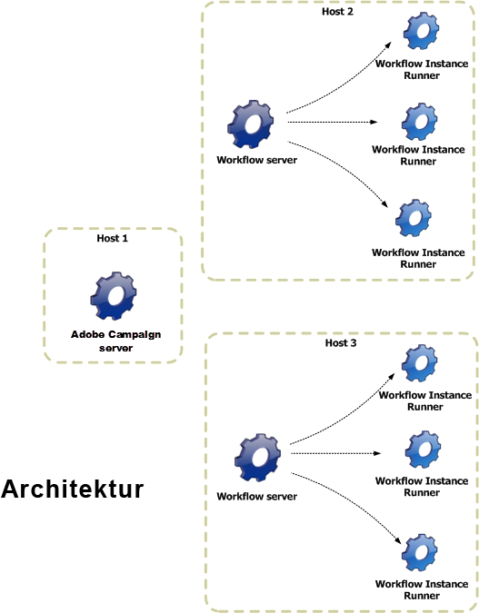

# Architektur {#architecture}

Workflows werden über eine dedizierte Engine verarbeitet. Diese kann zur besseren Lastverteilung simultan auf mehreren Servern gestartet werden.

* Der Prozess &#39;Workflow Instance Runner&#39; (runwf) führt alle Aufgaben einer spezifischen Workflow-Instanz aus. Sobald keine Aufgaben mehr zur unmittelbaren Verarbeitung anstehen, wird der Prozess passiviert, d. h. er speichert seinen derzeitigen Status in der Datenbank und hält an.
* Das Modul &#39;Workflow Server&#39; (wfserver) überwacht die laufenden Workflow-Instanzen. Wenn Aufgaben zur Ausführung anstehen, erstellt das Modul einen Prozess, um die entsprechende Instanz zu aktivieren oder zu reaktivieren.

Von Benutzern angeforderte Aktionen (Workflow starten, anhalten, aussetzen usw.) werden nicht sofort vom &#39;nlserver&#39;-Modul ausgeführt, sondern in eine Warteschlange eingereiht, um von einem Workflow-Modul verarbeitet zu werden.
