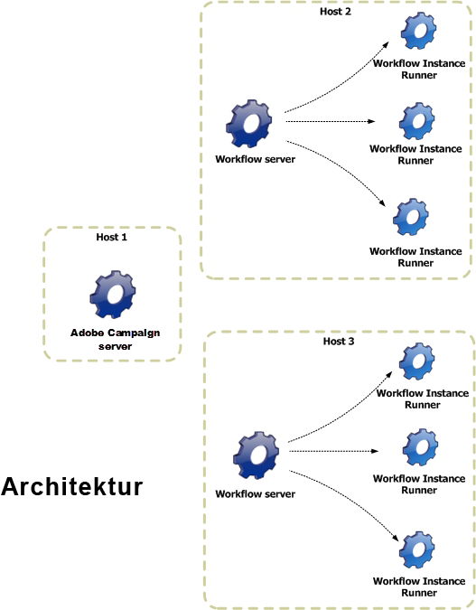

# Architektur {#architecture}

Workflows werden von einem bestimmten Modul verarbeitet. Dieses kann zur besseren Lastverteilung simultan auf mehreren Servern gestartet werden.

* Der Prozess „Workflow Instance Runner“ (runwf) führt alle Aufgaben einer bestimmten Workflow-Instanz aus. Sobald keine Aufgaben mehr zur unmittelbaren Verarbeitung anstehen, wird der Prozess passiviert, d. h. er speichert seinen derzeitigen Status in der Datenbank und hält an.
* Das Modul „Workflow Server“ (wfserver) überwacht aktuelle Workflow-Instanzen. Wenn Aufgaben zur Ausführung anstehen, erstellt das Modul einen Prozess, um die entsprechende Instanz zu aktivieren oder zu reaktivieren.
