# Erstellen eines Workflows {#building-a-workflow}

In diesem Abschnitt werden die wichtigsten Grundsätze und Best Practices für den Aufbau eines Workflows in Campaign erläutert.

* Einen Workflow erstellen, siehe [Neuen Workflow erstellen](#creating-a-new-workflow).
* Das Workflow-Diagramm entwerfen, siehe [Aktivitäten hinzufügen und verbinden](#adding-and-linking-activities).
* Auf Parameter und Eigenschaften von Aktivitäten zugreifen, siehe [Aktivitäten konfigurieren](#configuring-activities).
* Targeting-Workflows erstellen, siehe [Zielgruppen-Workflows](#targeting-workflows).
* Workflows zum Ausführen einer Kampagne verwenden, siehe [Kampagnen-Workflows](#campaign-workflows).
* Technische Workflows aufrufen und anlegen, siehe [Technische Workflows](#technical-workflows).
* Workflows mit Vorlagen erstellen, siehe [Workflow-Vorlagen](#workflow-templates).

## Erstellen eines neuen Workflows {#creating-a-new-workflow}

Öffnen Sie in **[!UICONTROL Explorer]** einen Workflow-Ordner. Standardmäßig können Sie **[!UICONTROL Profile und Zielgruppen]** > **[!UICONTROL Vorgänge]** > **[!UICONTROL Zielgruppen-Workflow]** verwenden.

Klicken Sie auf die Schaltfläche **[!UICONTROL Neu]** oberhalb der Workflow-Liste, um einen neuen Workflow zu erstellen.

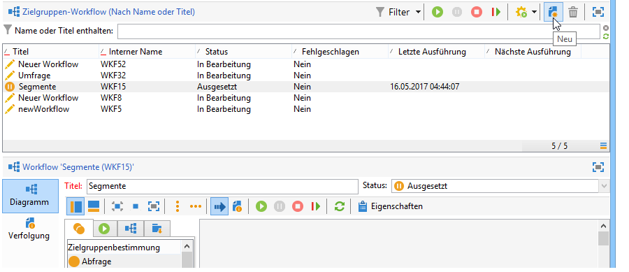

Darüber hinaus kann ein neuer Workflow auch mit der Schaltfläche **[!UICONTROL Erstellen]** von der Workflow-Übersicht aus (Rubrik **[!UICONTROL Monitoring]** > **[!UICONTROL Workflow]**) erstellt werden.

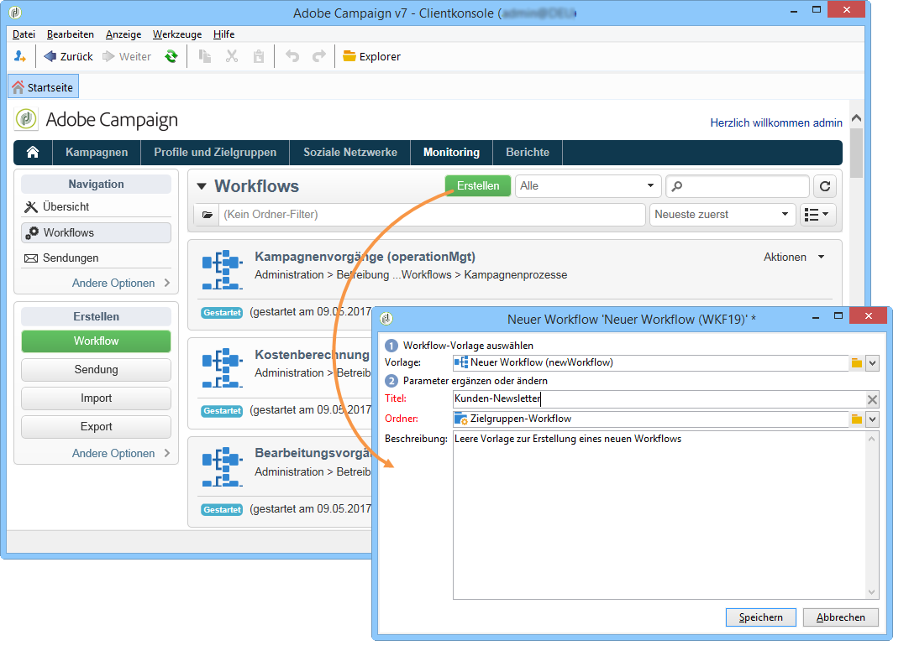

Benennen Sie den Workflow und klicken Sie auf **[!UICONTROL Speichern]**.

>[!NOTE]
>
>Vergewissern Sie sich bei der Änderung des internen Namens einer Workflow-Aktivität bzw. eines Workflows, dass Sie den Workflow speichern, bevor Sie ihn schließen, damit der neue interne Name richtig berücksichtigt wird.

## Hinzufügen und Verknüpfen von Aktivitäten {#adding-and-linking-activities}

Definieren Sie jetzt die verschiedenen Aktivitäten und verbinden Sie sie in einem Diagramm. In diesem Schritt der Konfiguration sehen wir den Diagrammtitel und den Workflow-Status (Bearbeitung läuft). Der untere Bereich des Fensters dient nur zur Bearbeitung des Diagramms. Er enthält eine Symbolleiste, eine Palette von Aktivitäten (links) und das Diagramm selbst (rechts).

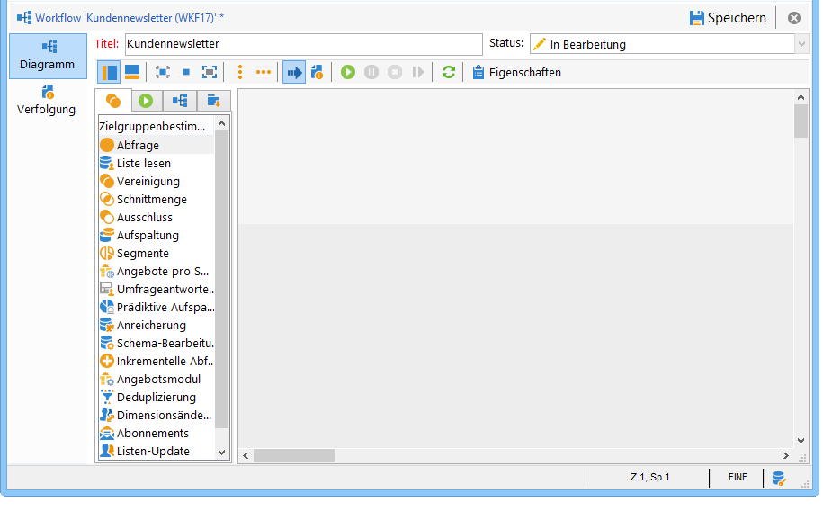

>[!NOTE]
>
>Sollte die Palette nicht angezeigt werden, können Sie sie durch Klick auf die erste Schaltfläche links in der Symbolleiste einblenden.

In den einzelnen Tabs der Palette werden die Aktivitäten nach Kategorie geordnet angezeigt. Die verfügbaren Tabs und Aktivitäten sind je nach Workflow-Typ unterschiedlich (technischer, Zielgruppen- oder Kampagnen-Workflow).

* Der erste Tab enthält Zielgruppenbestimmungs- und Datenmanipulationsaktivitäten. Diese Aktivitäten werden unter [Zielgruppenbestimmungsaktivitäten](about-targeting-activities.md) beschrieben.
* Der zweite Tab enthält die Planungsaktivitäten, die in erster Linie der Koordination der anderen Aktivitäten dienen. Diese Aktivitäten werden unter [Steuerungsaktivitäten](about-flow-control-activities.md) beschrieben.
* Der dritte Tab enthält Tools und Aktionen, die im Workflow verwendet werden können. Diese Aktivitäten werden unter [Aktionsaktivitäten](about-action-activities.md) beschrieben.
* Der vierte Tab enthält die Aktivitäten, die von einem bestimmten Ereignis abhängen, beispielsweise vom Erhalt einer E-Mail oder dem Empfang einer Datei auf dem Server. Diese Aktivitäten werden unter [Ereignisaktivitäten](about-event-activities.md) beschrieben.

So erstellen Sie das Diagramm

1. Fügen Sie eine Aktivität hinzu, indem Sie sie in der Palette auswählen und an die gewünschte Stelle im Diagramm ziehen.

   Ziehen Sie zunächst einen **Beginn** und anschließend einen **Versand** in das Diagramm.

   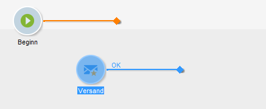

1. Verbinden Sie die beiden Aktivitäten, indem Sie die Transition des **Beginns** über den **Versand** ziehen und ablegen.

   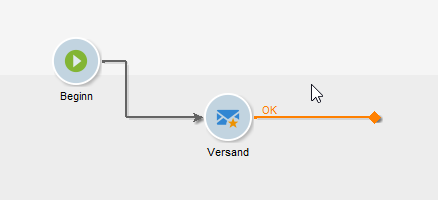

   Zwei Aktivitäten werden automatisch miteinander verbunden, wenn Sie die zweite Aktivität direkt am Ende der ersten platzieren.

1. Fügen Sie wie in unten stehender Abbildung weitere benötigte Aktivitäten hinzu und verbinden Sie sie.

   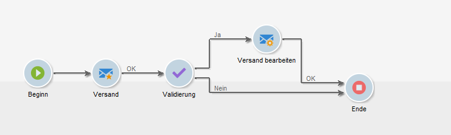

>[!CAUTION]
>
>Sie können Aktivitäten innerhalb eines Workflows kopieren und einfügen. Wir raten jedoch davon ab, Aktivitäten über verschiedene Workflows hinweg zu kopieren und einzufügen. Einige Einstellungen, die Aktivitäten wie Sendungen und Planung betreffen, können zu Konflikten und Fehlern beim Ausführen des Ziel-Workflows führen. Stattdessen empfehlen wir, Workflows zu **duplizieren**. Weitere Informationen finden Sie unter [Duplizieren von Workflows](#duplicating-workflows).

Die Darstellung und das Layout des Diagramms kann mithilfe der folgenden Elemente angepasst werden:

* **Verwenden der Symbolleiste**

  Über die Symbolleiste des Workflow-Editors besteht Zugriff auf Funktionen zur Formatierung und Ausführung der Workflows.

  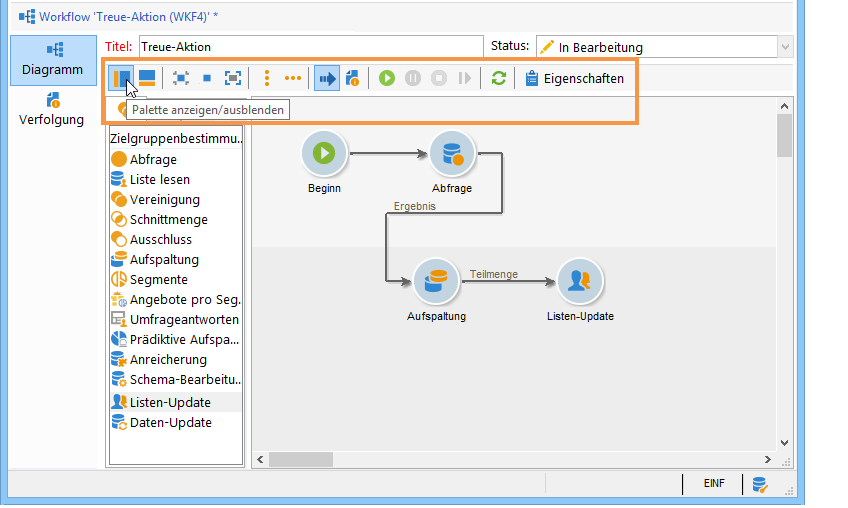

  Sie können den Editor anpassen, indem Sie z. B. die Palette und die Übersicht ein- oder ausblenden oder die Größe und Ausrichtung der grafischen Objekte verändern.

  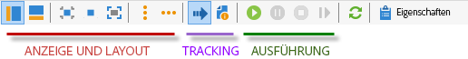

  Die Symbole zur Anzeige des Fortschritts und der Protokolle werden in den folgenden Abschnitten beschrieben:

   * [Anzeige des Fortschritts](../../workflow/using/monitoring-workflow-execution.md#displaying-progress)
   * [Anzeige von Protokollen](../../workflow/using/monitoring-workflow-execution.md#displaying-logs)

* **Objektausrichtung**

  Um die Symbole der Aktivitäten auszurichten, markieren Sie diese und klicken Sie in der Symbolleiste auf **[!UICONTROL Vertikal ausrichten]** oder **[!UICONTROL Horizontal ausrichten]**.

  Mit der **Strg**-Taste können Sie mehrere Aktivitäten auswählen, die im Diagramm nicht unmittelbar nebeneinander positioniert sind. Klicken Sie auf den Hintergrund des Diagramms, um die Auswahl aufzuheben.

* **Hintergrundbild und Symbole**

  Das Hintergrundbild des Diagramms und die Symbole der einzelnen Aktivitäten können personalisiert werden. Siehe [Ändern der Bilder für Aktivitäten](managing-activity-images.md).

## Konfigurieren von Aktivitäten {#configuring-activities}

Doppelklicken Sie auf eine Aktivität, um sie zu konfigurieren oder klicken Sie mit der rechten Maustaste und wählen Sie im Kontextmenü die Option **[!UICONTROL Öffnen...]** aus.

>[!NOTE]
>
>Aktivitäten des Kampagnen-Workflows werden in [diesem Abschnitt](about-activities.md) erläutert.

Die erste Registerkarte enthält die grundlegende Konfiguration. Die Registerkarte **[!UICONTROL Erweitert]** enthält zusätzliche Parameter, die insbesondere für die Bestimmung des Verhaltens bei auftretenden Fehlern, die Angabe der Ausführungsdauer einer Aktivität und die Eingabe eines Initialisierungsskripts verwendet werden.

Für eine optimale Lesbarkeit des Workflows und zum besseren Verständnis seiner Aktivitäten können Sie in den Aktivitäten Kommentare verfassen. Diese werden angezeigt, wenn Sie im Diagramm mit dem Mauszeiger über eine Aktivität fahren.

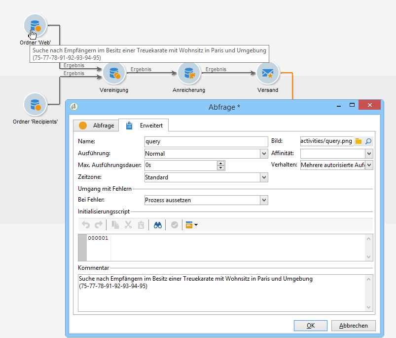

## Zielgruppen-Workflows {#targeting-workflows}

Zielgruppenbestimmungs-Workflows ermöglichen die Erstellung mehrerer Versandziele. Mit Workflow-Aktivitäten können Sie Abfragen erstellen, Vereinigungen oder Ausschlüsse basierend auf bestimmten Kriterien definieren und Zeitpläne hinzufügen. Das Ergebnis dieser Zielgruppenbestimmung kann automatisch in eine Liste übertragen werden, die als Zielgruppe der Versandaktionen dienen kann.

Adobe Campaign bietet in den Workflows darüber hinaus Data Management-Optionen, die erweiterte Funktionen für komplexe Zielgruppenbestimmungen enthalten. Weitere Informationen hierzu finden Sie unter [Data Management](targeting-data.md#data-management).

Alle diese Aktivitäten sind im ersten Tab der Workflow-Palette enthalten.

>[!NOTE]
>
>Zielgruppenbestimmungs-Aktivitäten werden in diesem [Abschnitt](about-activities.md) beschrieben.

Der Zugriff auf Zielgruppen-Workflows erfolgt im Navigationsbaum über den Knoten **[!UICONTROL Profile und Zielgruppen > Aufträge > Zielgruppen-Workflows]** oder auf der Startseite über die Rubrik **[!UICONTROL Profile und Zielgruppen]**.

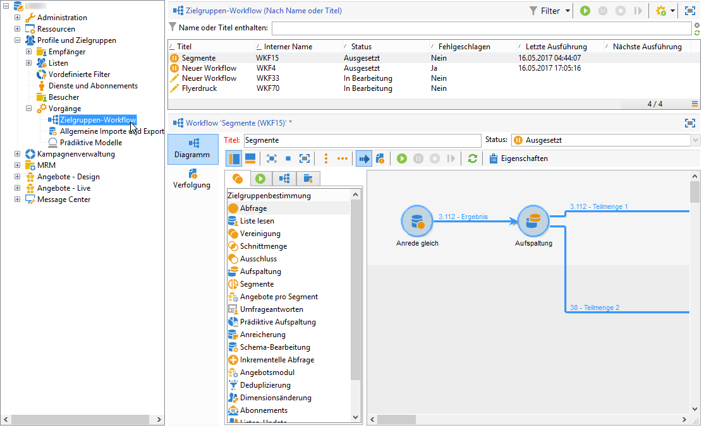

Im Gegensatz dazu werden die im Rahmen einer Kampagne erstellten Zielgruppen-Workflows zusammen mit den anderen Kampagnen-Workflows gespeichert.

### Wichtige Schritte zum Erstellen eines Zielgruppen-Workflows {#implementation-steps-}

In den folgenden Abschnitten finden Sie Details zum Erstellen eines Zielgruppen-Workflows:

1. **Identifizieren** von Daten in der Datenbank – Siehe [Erstellen von Abfragen](targeting-data.md#creating-queries)
1. **Vorbereiten** der Daten auf die Versandanforderungen – Siehe [Anreichern und Ändern von Daten](targeting-data.md#enriching-and-modifying-data)
1. **Verwenden** von Daten zur Durchführung von Aktualisierungen oder innerhalb eines Versands – Siehe [Aktualisieren der Datenbank](how-to-use-workflow-data.md#updating-the-database)

Die Ergebnisse aller Anreicherungen und aller Behandlungen, die während der Zielgruppenbestimmung durchgeführt werden, werden gespeichert und können über Personalisierungsfelder beispielsweise zur Gestaltung individueller Nachrichten verwendet werden. Weitere Informationen hierzu finden Sie unter [Zielgruppendaten](data-life-cycle.md#target-data)

### Zielgruppenbestimmungs- und Filterdimensionen {#targeting-and-filtering-dimensions}

Bei Vorgängen zur Datensegmentierung wird der Zielgruppenbestimmungsschlüssel einer Filterdimension zugeordnet. Die Zielgruppendimension definiert die Population, die von einer Kampagne angesprochen werden soll: Empfangende, Kundschaft, Abonnierende, Benutzende etc. Die Filterdimension ermöglicht die Einschränkung der gewählten Population nach bestimmten Kriterien: Vertragsinhabende, Abonnierende eines bestimmten Newsletters etc.

Wenn Sie beispielsweise alle Personen auswählen möchten, die seit mehr als fünf Jahren eine Lebensversicherung haben, verwenden Sie die Zielgruppendimension **Kunden** und die Filterdimension **Vertragsinhabende**. Anschließend können Sie die Filterbedingungen in der Abfrageaktivität definieren.

Nach Auswahl einer Zielgruppendimension stehen nur die Filterdimensionen zur Verfügung, die mit der gewählten Zielgruppendimension kompatibel sind.

Diese beiden Dimensionen müssen miteinander verknüpft sein. Der Inhalt der Liste **[!UICONTROL Filterdimension]** hängt somit von der im ersten Feld angegebenen Zielgruppendimension ab.

Bei Auswahl der Empfängerinnen und Empfänger (**Empfänger**) stehen folgende Filterdimensionen zur Verfügung:

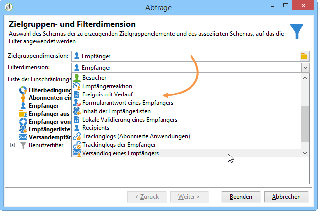

Während bei Auswahl der **Webanwendungen** die Liste folgende Filterdimensionen vorschlägt:

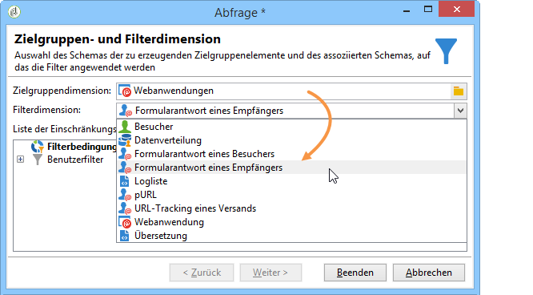

## Kampagnen-Workflows {#campaign-workflows}

Sie können für jede Kampagne Workflows erstellen, die über die Registerkarte **[!UICONTROL Zielgruppenbestimmungen und Workflows]** ausgeführt werden. Diese Workflows sind kampagnenspezifisch.

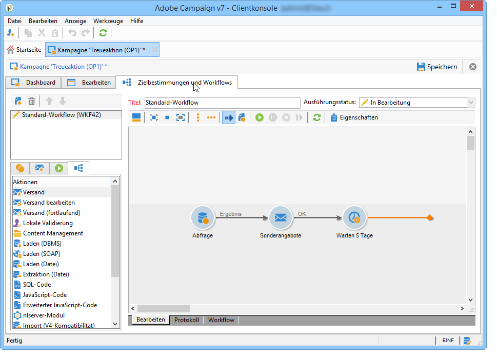

Dieser Tab enthält dieselben Aktivitäten für alle Workflows. [Mehr dazu](#implementation-steps-)

Zusätzlich zur Zielgruppenbestimmung von Kampagnen ermöglichen Kampagnen-Workflows die vollständige Erstellung und Konfiguration von Sendungen für alle verfügbaren Kanäle. Sobald sie im Workflow erstellt wurden, sind diese Sendungen im Dashboard der Kampagne verfügbar. [Mehr dazu](../../campaign/using/marketing-campaign-deliveries.md)

Alle Kampagnen-Workflows werden zentral im Knoten **[!UICONTROL Administration > Betreibung > Automatisch erstellte Objekte > Kampagnen-Workflows]** gespeichert.

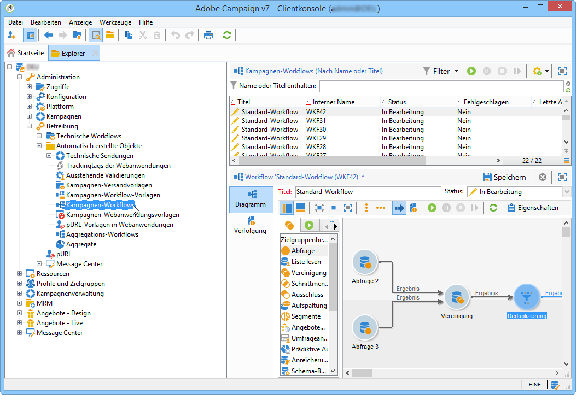

Weitere Informationen zu Kampagnen-Workflows und entsprechende Anwendungsbeispiele finden Sie auf [dieser Seite](../../campaign/using/marketing-campaign-deliveries.md#building-the-main-target-in-a-workflow).

## Technische Workflows {#technical-workflows}

Die technischen Workflows sind standardmäßig in Adobe Campaign enthalten. Dies sind Verfahren und Aufträge, die für eine periodische Ausführung auf dem Server geplant sind. Damit können Sie Wartungen der Datenbank durchführen, Tracking-Informationen zu Sendungen weiterleiten und geplante Prozesse für Sendungen einrichten. Technische Workflows werden über den Knoten **[!UICONTROL Administration > Produktion > Technische Workflows]** konfiguriert.

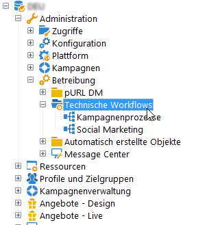

Zur Erstellung von technischen Workflows stehen spezifische Vorlagen zur Verfügung. Diese können je nach Bedarf angepasst werden.

Der Unterordner **[!UICONTROL Kampagnenprozesse]** enthält die für die Ausführung wichtiger Kampagnenvorgänge (Benachrichtigungen zu Aufgaben, Lagerverwaltung, Kostenberechnungen etc.) notwendigen Workflows.

>[!NOTE]
>
>Die mit den verschiedenen Modulen gelieferten technischen Workflows werden in einem [gesonderten Kapitel](about-technical-workflows.md) beschrieben.

Sie können andere technische Workflows im Knoten **[!UICONTROL Administration > Betreibung > Technische Workflows]** des Navigationsbaums erstellen. Dies sollte jedoch erfahrenen Benutzerinnen und Benutzern vorbehalten bleiben.

Die angebotenen Aktivitäten entsprechen denen für Zielgruppen-Workflows. [Mehr dazu](#implementation-steps-)

## Workflow-Vorlagen {#workflow-templates}

Workflow-Vorlagen enthalten die allgemeine Konfiguration von Eigenschaften und gegebenenfalls eine Reihe von in einem Diagramm verketteten Aktivitäten. Diese Konfiguration kann für die Erstellung neuer Workflows mit einer bestimmten Anzahl vorkonfigurierter Elemente wiederverwendet werden.

Die Konfiguration neuer Workflow-Vorlagen kann ausgehend von existierenden Vorlagen geschehen oder aber durch die Umwandlung eines existierenden Workflows in eine Vorlage.

Workflow-Vorlagen werden im Knoten **[!UICONTROL Ressourcen > Vorlagen > Workflow-Vorlagen]** des Navigationsbaums gespeichert.

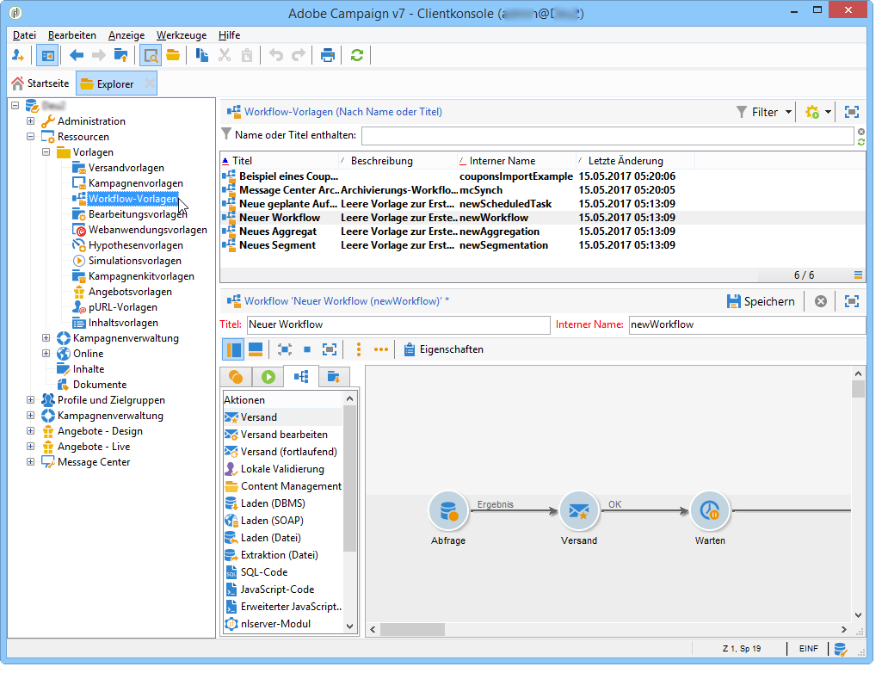

Neben den gängigen Workflow-Parametern können Sie in den Eigenschaften der Vorlage auch die Ausführungsdatei der auf Basis der Vorlage erstellten Workflows definieren.

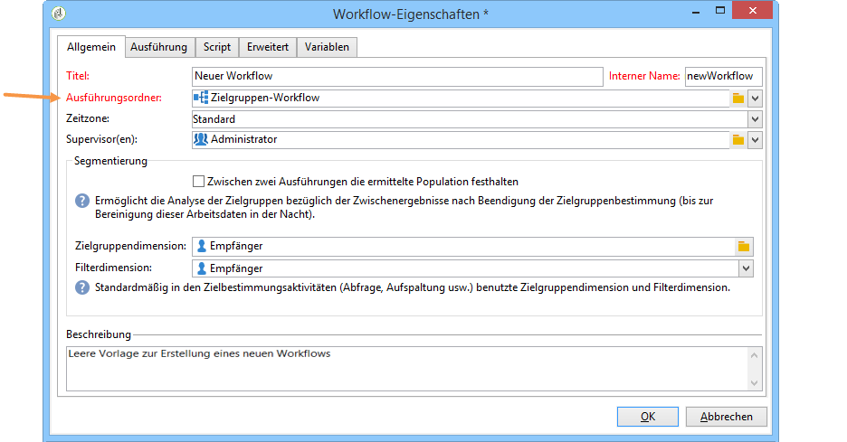

## Duplizieren von Workflows {#duplicating-workflows}

Sie können verschiedene Typen von Workflows duplizieren. Nach dem Duplizieren werden Änderungen des Workflows nicht in die Kopie des Workflows übernommen.

>[!CAUTION]
>
>Die Funktion zum Kopieren/Einfügen ist in den Workflows verfügbar. Es wird jedoch empfohlen, **Duplizieren** zu verwenden. Die Konfiguration der kopierten Aktivitäten bleibt dabei unverändert. Bei Versandaktivitäten (E-Mail, SMS, Push-Benachrichtigung ...) wird auch das der Aktivität angehängte Versandobjekt kopiert, was zu einem Absturz führen kann.

1. Klicken Sie mit der rechten Maustaste auf einen Workflow.
1. Klicken Sie auf **Duplizieren**.

   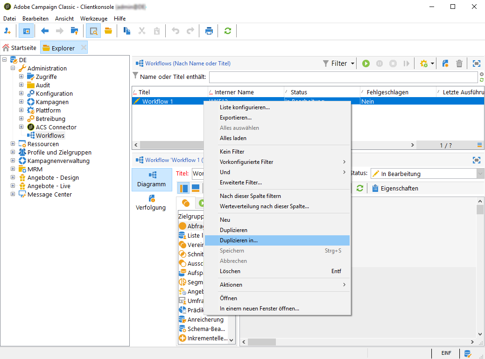

1. Ändern Sie den Workflow-Titel im Workflow-Fenster.
1. Klicken Sie auf **Speichern**.

Die duplizierte Funktion steht in der Ansicht einer Kampagne nicht direkt zur Verfügung.

Sie können jedoch eine Ansicht erstellen, die alle Workflows in Ihrer Instanz anzeigt. In dieser Ansicht können Sie Workflows mit **Duplizieren in** duplizieren.

**Erstellen einer Ansicht**

1. Navigieren Sie in **Explorer** zu dem Ordner, in dem Sie Ihre Ansicht erstellen müssen.
1. Klicken Sie mit der rechten Maustaste und gehen Sie zu **Neuen Ordner hinzufügen** > **Prozess**, wählen Sie **Workflows** aus.

   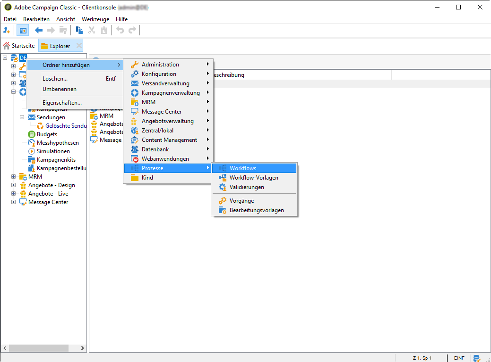

Der neue Ordner **Workflows** wird erstellt.

1. Klicken Sie mit der rechten Maustaste und wählen Sie **Eigenschaften** aus.
1. Aktivieren Sie unter **Einschränkung** die Option **Ordner ist eine Ansicht** und klicken Sie auf **Speichern**.

   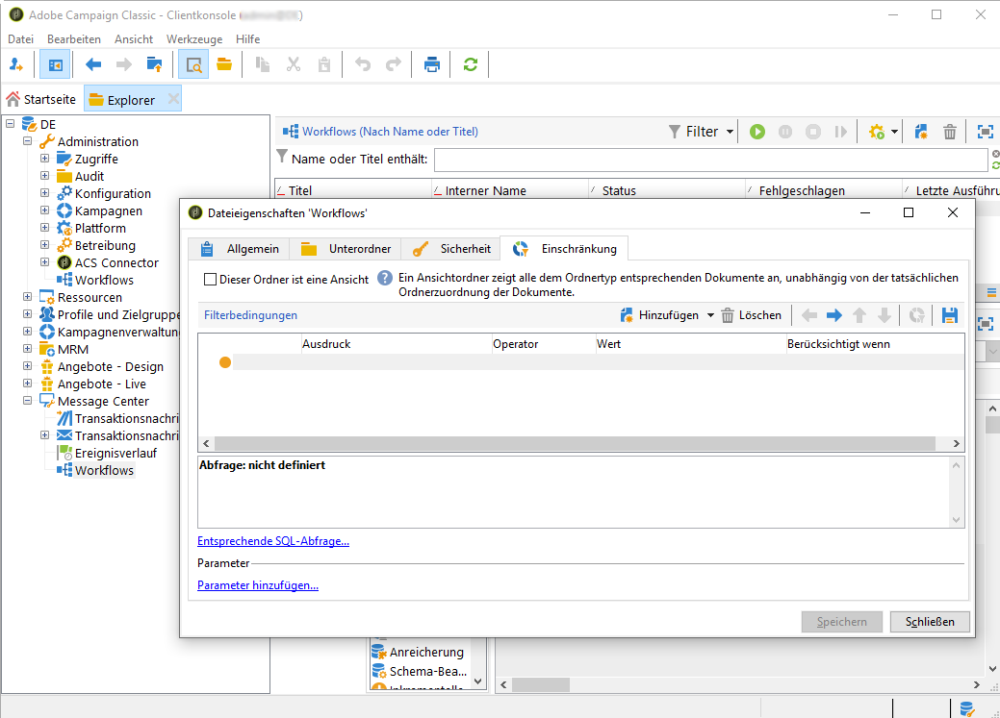

Der Ordner wird nun mit allen Workflows Ihrer Instanz gefüllt.

**Duplizieren von Kampagnen-Workflows**

1. Wählen Sie in der Workflow-Ansicht einen Kampagnen-Workflow aus.
1. Klicken Sie mit der rechten Maustaste auf **Duplizieren in**.
   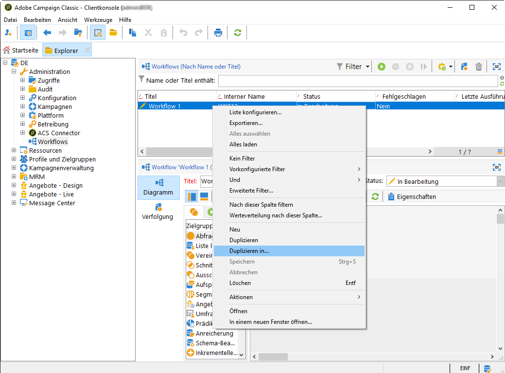
1. Ändern Sie den Titel.
1. Wählen Sie **Speichern** aus.

Ihr duplizierter Workflow wird in der Ansicht „Workflow“ angezeigt.
