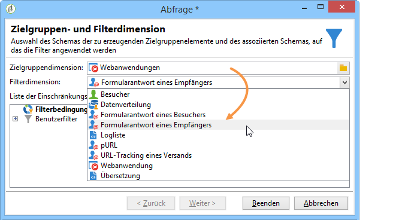

# Workflow erstellen {#building-a-workflow}

In diesem Abschnitt werden die wichtigsten Grundsätze und Best Practices für den Aufbau eines Workflows in Campaign erläutert.

* Einen Workflow erstellen, siehe [Neuen Workflow erstellen](#creating-a-new-workflow).
* Das Workflow-Diagramm entwerfen, siehe [Aktivitäten hinzufügen und verbinden](#adding-and-linking-activities).
* Auf Parameter und Eigenschaften von Aktivitäten zugreifen, siehe [Aktivitäten konfigurieren](#configuring-activities).
* Targeting-Workflows erstellen, siehe [Zielgruppen-Workflows](#targeting-workflows).
* Mit einem Workflow eine Kampagne ausführen, siehe [Kampagnen-Workflows](#campaign-workflows).
* Technische Workflows aufrufen und anlegen, siehe [Technische Workflows](#technical-workflows).
* Workflows mit Vorlagen erstellen, siehe [Workflow-Vorlagen](#workflow-templates).

## Neuen Workflow erstellen {#creating-a-new-workflow}

Öffnen Sie in **[!UICONTROL Explorer]** einen Workflow-Ordner. Standardmäßig können Sie **[!UICONTROL Profile und Zielgruppen]** > **[!UICONTROL Vorgänge]** > **[!UICONTROL Zielgruppen-Workflow]** verwenden.

Klicken Sie auf die Schaltfläche **[!UICONTROL Neu]** oberhalb der Workflow-Liste, um einen neuen Workflow zu erstellen.

Darüber hinaus kann ein neuer Workflow auch mit der Schaltfläche **[!UICONTROL Erstellen]** von der Workflow-Übersicht aus (Rubrik **[!UICONTROL Monitoring]** > **[!UICONTROL Workflow]**) erstellt werden.

Benennen Sie den Workflow und klicken Sie auf **[!UICONTROL Speichern]**.

>[!NOTE]
>
>Vergewissern Sie sich bei der Änderung des internen Namens einer Workflow-Aktivität bzw. eines Workflows, dass Sie den Workflow speichern, bevor Sie ihn schließen, damit der neue interne Name richtig berücksichtigt wird.

## Aktivitäten hinzufügen und verbinden {#adding-and-linking-activities}

In diesem Schritt werden die Aktivitäten im Diagramm positioniert, konfiguriert und miteinander in Beziehung gesetzt. Bisher zeigt das Workflow-Fenster nur den Titel und den Status des Workflows an (In Bearbeitung). Der untere Bereich des Fensters dient der Konzeption des Diagramms. Er enthält eine Symbolleiste, eine Palette mit den verfügbaren Aktivitäten (links) und das Diagramm selbst (rechts).

>[!NOTE]
>
>Sollte die Palette nicht angezeigt werden, können Sie sie durch Klick auf die erste Schaltfläche links in der Symbolleiste einblenden.

In den einzelnen Tabs der Palette werden die Aktivitäten nach Kategorie geordnet angezeigt. Die verfügbaren Tabs und Aktivitäten sind je nach Workflow-Typ unterschiedlich (technischer, Zielgruppen- oder Kampagnen-Workflow).

* Der erste Tab enthält Zielgruppen- und Datenmanipulationsaktivitäten. Diese Aktivitäten werden unter [Zielgruppenbestimmungsaktivitäten](../../workflow/using/about-targeting-activities.md) beschrieben.
* Der zweite Tab enthält die Planungsaktivitäten, die in erster Linie der Koordination der anderen Aktivitäten dienen. Diese Aktivitäten werden unter [Steuerungsaktivitäten](../../workflow/using/about-flow-control-activities.md) beschrieben.
* Der dritte Tab enthält Tools und Aktionen, die im Workflow verwendet werden können. Diese Aktivitäten werden unter [Aktionsaktivitäten](../../workflow/using/about-action-activities.md) beschrieben.
* Der vierte Tab enthält die Aktivitäten, die von einem bestimmten Ereignis abhängen, beispielsweise vom Erhalt einer E-Mail oder dem Empfang einer Datei auf dem Server. Diese Aktivitäten werden unter [Ereignisaktivitäten](../../workflow/using/about-event-activities.md) beschrieben.

So erstellen Sie das Diagramm

1. Fügen Sie eine Aktivität hinzu, indem Sie sie in der Palette auswählen und an die gewünschte Stelle im Diagramm ziehen.

   Ziehen Sie zunächst einen **Beginn** und anschließend einen **Versand** in das Diagramm.

   

1. Verbinden Sie die beiden Aktivitäten, indem Sie die Transition des **Beginns** über den **Versand** ziehen und ablegen.

   

   Zwei Aktivitäten werden automatisch miteinander verbunden, wenn Sie die zweite Aktivität direkt am Ende der ersten platzieren.

1. Fügen Sie wie in unten stehender Abbildung weitere benötigte Aktivitäten hinzu und verbinden Sie sie.

   

>[!CAUTION]
>
>Sie können Aktivitäten innerhalb eines Workflows kopieren und einfügen. Wir raten jedoch davon ab, Aktivitäten über verschiedene Workflows hinweg zu kopieren und einzufügen. Einige Einstellungen, die Aktivitäten wie Sendungen und Planung betreffen, können zu Konflikten und Fehlern beim Ausführen des Ziel-Workflows führen. Stattdessen empfehlen wir, Workflows zu **duplizieren**. Weitere Informationen finden Sie unter [Workflows duplizieren ](#duplicating-workflows).

Die Darstellung und das Layout des Diagramms kann mithilfe der folgenden Elemente angepasst werden:

* **Symbolleiste**

   Über die Symbolleiste des Workflow-Editors besteht Zugriff auf Funktionen zur Formatierung und Ausführung der Workflows.

   

   Sie können den Editor anpassen, indem Sie z. B. die Palette und die Übersicht ein- oder ausblenden oder die Größe und Ausrichtung der grafischen Objekte verändern.

   

   Die Symbole zum Start und zur Verfolgung von erweiterten Zielgruppen-Workflows werden in diesem [Abschnitt](../../campaign/using/marketing-campaign-deliveries.md#creating-a-targeting-workflow) beschrieben.

* **Objektausrichtung**

   Um die Symbole der Aktivitäten auszurichten, markieren Sie diese und klicken Sie in der Symbolleiste auf **[!UICONTROL Vertikal ausrichten]** oder **[!UICONTROL Horizontal ausrichten]**.

   Mithilfe der **STRG**-Taste können Sie mehrere Aktivitäten markieren, die im Diagramm nicht unmittelbar nebeneinander positioniert sind, oder die Markierung einzelner Aktivitäten entfernen. Durch Klick in den Diagrammhintergrund werden alle Markierungen entfernt.

* **Hintergrundbild und Symbole**

   Das Hintergrundbild des Diagramms und die Symbole der einzelnen Aktivitäten können personalisiert werden. Siehe [Bilder für Aktivitäten verwalten](../../workflow/using/managing-activity-images.md).

## Aktivitäten konfigurieren {#configuring-activities}

Doppelklicken Sie auf eine Aktivität, um sie zu konfigurieren oder klicken Sie mit der rechten Maustaste und wählen Sie im Kontextmenü die Option **[!UICONTROL Öffnen...]** aus.

>[!NOTE]
>
>Aktivitäten des Kampagnen-Workflows werden in [diesem Abschnitt](../../workflow/using/about-activities.md) erläutert.

Der erste Tab enthält allgemeine Parameter, während Sie im Tab **[!UICONTROL Erweitert]** den Umgang mit Fehlern und die Ausführungsdauer der Aktivität bestimmen oder ein Initialisierungsscript erfassen können.

Für eine optimale Lesbarkeit des Workflows und zum besseren Verständnis seiner Aktivitäten können Sie in den Aktivitäten Kommentare verfassen. Diese werden angezeigt, wenn Sie im Diagramm eine Aktivität mit dem Mauszeiger überfahren.

## Zielgruppen-Workflows {#targeting-workflows}

Zielgruppen-Workflows erlauben die Bestimmung von einer oder mehreren Versandzielgruppen. Dies geschieht mithilfe von Abfragen, Vereinigungen oder Ausschlüssen nach bestimmten Kriterien. Das Ergebnis der Zielgruppenbestimmung kann dann beispielsweise in eine Liste übertragen werden, um diese als Grundlage für Versandaktionen zu verwenden.

Adobe Campaign bietet in den Workflows darüber hinaus Data Management-Optionen, die erweiterte Funktionen für komplexe Zielgruppenbestimmungen enthalten. Weitere Informationen hierzu finden Sie unter [Data Management](../../workflow/using/targeting-data.md#data-management).

Alle diese Aktivitäten sind im ersten Tab der Workflow-Palette enthalten.

>[!NOTE]
>
>Zielgruppenaktivitäten werden in diesem [Abschnitt](../../workflow/using/about-activities.md) beschrieben.

Der Zugriff auf Zielgruppen-Workflows erfolgt im Navigationsbaum über den Knoten **[!UICONTROL Profile und Zielgruppen > Vorgänge > Zielgruppen-Workflows]** oder auf der Startseite über die Rubrik **[!UICONTROL Profile und Zielgruppen]**.

Im Gegensatz dazu werden die im Rahmen einer Kampagne erstellten Zielgruppen-Workflows zusammen mit den anderen Kampagnen-Workflows gespeichert.

### Umsetzung {#implementation-steps-}

Die Konzeption von Zielgruppen geschieht in drei Schritten:

1. Auswahl der gewünschten Datensätze aus der Datenbank, siehe [Abfragen erstellen](../../workflow/using/targeting-data.md#creating-queries).
1. Informationen zum Vorbereiten der Daten auf die Versandanforderungen finden Sie unter [Daten anreichern und ändern](../../workflow/using/targeting-data.md#enriching-and-modifying-data).
1. Verwendung der Daten für Aktualisierungen, Versandaktionen usw., siehe [Datenbank aktualisieren ](../../workflow/using/how-to-use-workflow-data.md#updating-the-database).

Die Ergebnisse der Anreicherungen werden gespeichert und können über Personalisierungsfelder beispielsweise zur Gestaltung individueller Nachrichten verwendet werden. Weitere Informationen hierzu finden Sie unter [Zielgruppendaten](../../workflow/using/data-life-cycle.md#target-data)

### Zielgruppen- und Filterdimensionen {#targeting-and-filtering-dimensions}

Bei Vorgängen zur Datensegmentierung wird einer Zielgruppendimension in der Regel eine Filterdimension zugeordnet. Die Zielgruppendimension definiert die Population, die von einer Kampagne angesprochen werden soll: Empfänger, Kunden, Abonnenten, Benutzer etc. Die Filterdimension ermöglicht die Einschränkung der gewählten Population nach bestimmten Kriterien: Kauf eines bestimmten Produkts, Abonnement eines bestimmten Newsletters etc.

Angenommen, Sie möchten alle Kunden auswählen, die seit mehr als fünf Jahren eine Lebensversicherung haben. Verwenden Sie in diesem Fall die Zielgruppendimension **Kunden** und die Filterdimension **Hat eine Versicherung abgeschlossen**. In der Abfrageaktivität können Sie die weiteren Filterbedingungen definieren (Versicherung = Lebensversicherung, Abschlussdatum > 5 Jahre).

Nach Auswahl einer Zielgruppendimension stehen nur die Filterdimensionen zur Verfügung, die mit der gewählten Zielgruppendimension kompatibel sind.

Beide Dimensionen müssen zwingend in Relation zueinander stehen. Der Inhalt der Liste **[!UICONTROL Filterdimension]** hängt somit von der im ersten Feld angegebenen Zielgruppendimension ab.

Bei Auswahl der Empfänger (**recipent**) im Feld Zielgruppendimension stehen folgende Filterdimensionen zur Verfügung:

Während bei Auswahl der **Webanwendungen** die Liste folgende Filterdimensionen vorschlägt:

## Kampagnen-Workflows {#campaign-workflows}

Sie können für jede Kampagne Workflows erstellen, die über den Tab **[!UICONTROL Zielbestimmungen und Workflows]** ausgeführt werden. Workflows gelten nur für die jeweilige Kampagne.

Dieser Tab enthält dieselben Aktivitäten für alle Workflows. Sie werden im Abschnitt [Umsetzung](#implementation-steps-) vorgestellt.

Neben der Zielgruppenbestimmung ermöglichen Kampagnen-Workflows die Erstellung und Konfiguration aller Sendungen einer Kampagne, unabhängig vom gewählten Kanal. Diese Sendungen sind nach ihrer Erstellung über das Dashboard der Kampagne verfügbar.

Alle Kampagnen-Workflows werden zentral im Knoten **[!UICONTROL Administration > Betreibung > Automatisch erstellte Objekte > Kampagnen-Workflows]** gespeichert.

Weitere Informationen zu Kampagnen-Workflows und entsprechende Anwendungsbeispiele finden Sie auf dieser [Seite](../../campaign/using/marketing-campaign-deliveries.md#building-the-main-target-in-a-workflow).

## Technische Workflows {#technical-workflows}

Technische Workflows sind standardmäßg in Adobe Campaign enthalten. Sie steuern regelmäßige Serverabläufe, wie beispielsweise Datenbankbereinigungen, den Abruf von Trackinginformationen oder geplante Vorgänge zur Versandvorbereitung. Der Zugriff auf technische Workflows erfolgt im Knoten **[!UICONTROL Administration > Betreibung > Technische Workflows]**.

Zur Erstellung von technischen Workflows stehen spezifische Vorlagen zu Verfügung. Diese können je nach Bedarf angepasst werden.

Der Unterordner **[!UICONTROL Kampagnenprozesse]** enthält die für die Ausführung wichtiger Kampagnenvorgänge (Benachrichtigungen zu Aufgaben, Lagerverwaltung, Kostenberechnungen etc.) notwendigen Workflows.

>[!NOTE]
>
>Die mit den verschiedenen Modulen gelieferten technischen Workflows werden in einem [gesonderten Kapitel](../../workflow/using/about-technical-workflows.md) beschrieben.

Sie haben die Möglichkeit, im Knoten **[!UICONTROL Administration > Betreibung > Technische Workflows]** weitere technische Workflows zu erstellen. Dies sollte jedoch erfahrenen Benutzern vorbehalten bleiben.

Die angebotenen Aktivitäten entsprechen denen für Zielgruppen-Workflows. Weitere Informationen hierzu finden Sie unter [Umsetzung](#implementation-steps-).

## Workflow-Vorlagen {#workflow-templates}

Eine Workflow-Vorlage besteht aus einer Reihe von konfigurierten Eigenschaften und gegebenenfalls aus einem Diagramm mit verbundenen Aktivitäten. Auf Basis derartiger Vorlagen können neue Workflows erstellt werden, die die konfigurierten Parameter übernehmen.

Die Konfiguration neuer Workflow-Vorlagen kann ausgehend von existierenden Vorlagen geschehen oder aber durch die Umwandlung eines existierenden Workflows in eine Vorlage.

Workflow-Vorlagen werden im Knoten **[!UICONTROL Ressourcen > Vorlagen > Workflow-Vorlagen]** des Navigationsbaums gespeichert.

Neben den gängigen Workflow-Parametern können Sie in den Workflow-Eigenschaften der Vorlage auch den Ausführungsordner der auf Basis der Vorlage erstellten Workflows definieren.

## Workflows duplizieren {#duplicating-workflows}

Sie können verschiedene Typen von Workflows duplizieren. Nach dem Duplizieren werden Änderungen des Workflows nicht in die Kopie des Workflows übernommen.

>[!CAUTION]
>
>Die Funktion zum Kopieren/Einfügen ist in den Workflows verfügbar. Es wird jedoch empfohlen, **Duplizieren** zu verwenden. Die Konfiguration der kopierten Aktivitäten bleibt dabei unverändert. Bei Versandaktivitäten (E-Mail, SMS, Push-Benachrichtigung ...) wird auch das der Aktivität angehängte Versandobjekt kopiert, was zu einem Absturz führen kann.

1. Klicken Sie mit der rechten Maustaste auf einen Workflow.
1. Klicken Sie auf **Duplizieren**.

   

1. Ändern Sie den Workflow-Titel im Workflow-Fenster.
1. Wählen Sie **Speichern** aus.

Die duplizierte Funktion steht in der Ansicht einer Kampagne nicht direkt zur Verfügung.

Sie können jedoch eine Ansicht erstellen, die alle Workflows in Ihrer Instanz anzeigt. In dieser Ansicht können Sie Workflows mit **Duplizieren in** duplizieren.

**Erstellen wir zunächst eine Ansicht:**

1. Navigieren Sie in **Explorer** zu dem Ordner, in dem Sie Ihre Ansicht erstellen müssen.
1. Klicken Sie mit der rechten Maustaste und gehen Sie zu **Neuen Ordner hinzufügen** > **Prozess**, wählen Sie **Workflows** aus.

   

Der neue Ordner **Workflows** wird erstellt.

1. Klicken Sie mit der rechten Maustaste und wählen Sie **Eigenschaften** aus.
1. Aktivieren Sie unter **Einschränkung** die Option **Ordner ist eine Ansicht** und klicken Sie auf **Speichern**.

   

Der Ordner wird nun mit allen Workflows Ihrer Instanz gefüllt.

**Kampagnen-Workflows duplizieren**

1. Wählen Sie in der Workflow-Ansicht einen Kampagnen-Workflow aus.
1. Klicken Sie mit der rechten Maustaste auf **Duplizieren in**.
   
1. Ändern Sie den Titel.
1. Wählen Sie **Speichern** aus.

Ihr duplizierter Workflow wird in der Ansicht „Workflow“ angezeigt.
