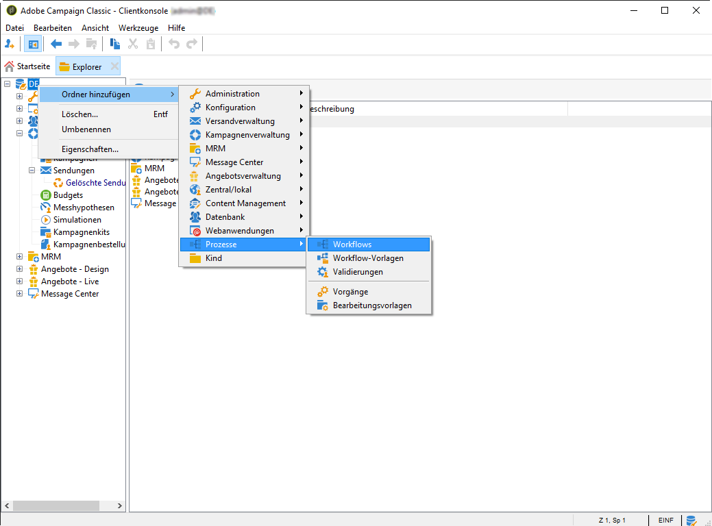

# Workflow erstellen {#building-a-workflow}

In diesem Abschnitt werden die wichtigsten Grundsätze und Best Practices für den Aufbau eines Workflows in Campaign erläutert.

* Einen Workflow erstellen, siehe [Neuen Workflow erstellen](#creating-a-new-workflow).
* Das Workflow-Diagramm entwerfen, siehe [Aktivitäten hinzufügen und verbinden](#adding-and-linking-activities).
* Auf Parameter und Eigenschaften von Aktivitäten zugreifen, siehe [Aktivitäten konfigurieren](#configuring-activities).
* Targeting-Workflows erstellen, siehe [Zielgruppen-Workflows](#targeting-workflows).
* Mit einem Workflow eine Kampagne ausführen, siehe [Kampagnen-Workflows](#campaign-workflows).
* Technische Workflows aufrufen und anlegen, siehe [Technische Workflows](#technical-workflows).
* Workflows mit Vorlagen erstellen, siehe [Workflow-Vorlagen](#workflow-templates).

## Neuen Workflow erstellen {#creating-a-new-workflow}

Greifen Sie von der **[!UICONTROL Explorer]** Seite auf einen Workflow-Ordner zu. Standardmäßig können Sie **[!UICONTROL Profiles and Targets]** > **[!UICONTROL Jobs]** > **[!UICONTROL Targeting workflows]**.

Click the **[!UICONTROL New]** button located above the list of workflows.

Or, you can also use the **[!UICONTROL Create]** button in the workflow overview (**[!UICONTROL Monitoring]** > **[!UICONTROL Workflow]** link).

Enter a label and click **[!UICONTROL Save]**.

>[!NOTE]
>
>Vergewissern Sie sich bei der Änderung des internen Namens einer Workflow-Aktivität bzw. eines Workflows, dass Sie den Workflow speichern, bevor Sie ihn schließen, damit der neue interne Name richtig berücksichtigt wird.

## Aktivitäten hinzufügen und verbinden {#adding-and-linking-activities}

In diesem Schritt werden die Aktivitäten im Diagramm positioniert, konfiguriert und miteinander in Beziehung gesetzt. Bisher zeigt das Workflow-Fenster nur den Titel und den Status des Workflows an (In Bearbeitung). Der untere Bereich des Fensters dient der Konzeption des Diagramms. Er enthält eine Symbolleiste, eine Palette mit den verfügbaren Aktivitäten (links) und das Diagramm selbst (rechts).

>[!NOTE]
>
>Sollte die Palette nicht angezeigt werden, können Sie sie durch Klick auf die erste Schaltfläche links in der Symbolleiste einblenden.

In den einzelnen Tabs der Palette werden die Aktivitäten nach Kategorie geordnet angezeigt. Die verfügbaren Tabs und Aktivitäten sind je nach Workflow-Typ unterschiedlich (technischer, Zielgruppen- oder Kampagnen-Workflow).

* Die erste Registerkarte enthält Targeting- und Datenverarbeitungsaktivitäten. Diese Aktivitäten sind in den [Targeting-Aktivitäten](../../workflow/using/about-targeting-activities.md)detailliert.
* Die zweite Registerkarte enthält die Planungsaktivitäten, die hauptsächlich zur Koordinierung anderer Aktivitäten verwendet werden. Diese Aktivitäten sind in den [Flusskontrollaktivitäten](../../workflow/using/about-flow-control-activities.md)ausführlich beschrieben.
* Die dritte Registerkarte enthält Werkzeuge und Aktionen, die im Workflow verwendet werden können. Diese Aktivitäten sind in den [Aktionen](../../workflow/using/about-action-activities.md)ausführlich beschrieben.
* Die vierte Registerkarte enthält Aktivitäten, die von einem bestimmten Ereignis abhängen, wie z. B. der Erhalt einer E-Mail oder die Ankunft einer Datei auf einem Server. Diese Aktivitäten werden in den [Veranstaltungsaktivitäten](../../workflow/using/about-event-activities.md)detailliert beschrieben.

So erstellen Sie das Diagramm

1. Fügen Sie eine Aktivität hinzu, indem Sie sie in der Palette auswählen und an die gewünschte Stelle im Diagramm ziehen.

   Ziehen Sie zunächst einen **Beginn** und anschließend einen **Versand** in das Diagramm.

   

1. Verbinden Sie die beiden Aktivitäten, indem Sie die Transition des **Beginns** über den **Versand** ziehen und ablegen.

   

   Zwei Aktivitäten werden automatisch miteinander verbunden, wenn Sie die zweite Aktivität direkt am Ende der ersten platzieren.

1. Fügen Sie wie in unten stehender Abbildung weitere benötigte Aktivitäten hinzu und verbinden Sie sie.

   

>[!CAUTION]
>
>Sie können Aktivitäten in einem Workflow kopieren und einfügen. Es wird jedoch nicht empfohlen, Einfügeaktivitäten über verschiedene Workflows hinweg zu kopieren. Einige Einstellungen, die an Aktivitäten wie Auslieferungen und Zeitplaner angehängt sind, können zu Konflikten und Fehlern beim Ausführen des Ziel-Workflows führen. Stattdessen haben wir empfohlen, Arbeitsabläufe zu **duplizieren** . Weitere Informationen finden Sie unter [Duplizieren von Workflows](#duplicating-workflows).

### Zusätzliche Darstellungsoptionen {#additional-layout-options}

Die Darstellung und das Layout des Diagramms kann mithilfe der folgenden Elemente angepasst werden:

* **Symbolleiste**

   Über die Symbolleiste des Workflow-Editors besteht Zugriff auf Funktionen zur Formatierung und Ausführung der Workflows.

   

   Sie können den Editor anpassen, indem Sie z. B. die Palette und die Übersicht ein- oder ausblenden oder die Größe und Ausrichtung der grafischen Objekte verändern.

   

   Die Symbole zum Start und zur Verfolgung von erweiterten Zielgruppen-Workflows werden in diesem [Abschnitt](../../campaign/using/marketing-campaign-deliveries.md#creating-a-targeting-workflow) beschrieben.

* **Objektausrichtung**

   Um Symbole auszurichten, wählen Sie sie aus und klicken Sie auf das Symbol **[!UICONTROL Align vertically]** oder **[!UICONTROL Align horizontally]** .

   Mithilfe der **STRG**-Taste können Sie mehrere Aktivitäten markieren, die im Diagramm nicht unmittelbar nebeneinander positioniert sind, oder die Markierung einzelner Aktivitäten entfernen. Durch Klick in den Diagrammhintergrund werden alle Markierungen entfernt.

* **Hintergrundbild und Symbole**

   Sie können das Hintergrundbild des Diagramms sowie die Bilder zu den verschiedenen Aktivitäten anpassen. Siehe [Verwalten von Aktivitätsbildern](../../workflow/using/managing-activity-images.md).

## Aktivitäten konfigurieren {#configuring-activities}

Double-click an activity to configure it or right-click and select **[!UICONTROL Open...]**.

>[!NOTE]
>
>Aktivitäten des Kampagnen-Workflows werden in [diesem Abschnitt](../../workflow/using/about-activities.md) erläutert.

Die erste Registerkarte enthält die Basiskonfiguration. The **[!UICONTROL Advanced]** tab contains the additional parameters, which are used particularly for defining behavior when an error is encountered, specifying the execution duration for an activity, and for entering an initialization script.

Für eine optimale Lesbarkeit des Workflows und zum besseren Verständnis seiner Aktivitäten können Sie in den Aktivitäten Kommentare verfassen. Diese werden angezeigt, wenn Sie im Diagramm eine Aktivität mit dem Mauszeiger überfahren.

## Zielgruppen-Workflows {#targeting-workflows}

Zielgruppen-Workflows erlauben die Bestimmung von einer oder mehreren Versandzielgruppen. Dies geschieht mithilfe von Abfragen, Vereinigungen oder Ausschlüssen nach bestimmten Kriterien. Das Ergebnis der Zielgruppenbestimmung kann dann beispielsweise in eine Liste übertragen werden, um diese als Grundlage für Versandaktionen zu verwenden.

Zusätzlich zu diesen Aktivitäten können Sie mit den Datenverwaltungsoptionen Daten bearbeiten und auf erweiterte Funktionen zugreifen, um komplexe Targeting-Probleme zu lösen. For more on this, refer to [Data Management](../../workflow/using/targeting-data.md#data-management).

Alle diese Aktivitäten sind im ersten Tab der Workflow-Palette enthalten.

>[!NOTE]
>
>Zielgruppenaktivitäten werden in diesem [Abschnitt](../../workflow/using/about-activities.md) beschrieben.

Targeting-Arbeitsabläufe können über den **[!UICONTROL Profiles and Targets > Jobs > Targeting workflows]** Knoten der Adobe Campaign-Struktur oder über das Menü der Homepage erstellt und bearbeitet **[!UICONTROL Profiles and Targets > Targeting workflows]** werden.

Im Gegensatz dazu werden die im Rahmen einer Kampagne erstellten Zielgruppen-Workflows zusammen mit den anderen Kampagnen-Workflows gespeichert.

### Umsetzung {#implementation-steps-}

Die Konzeption von Zielgruppen geschieht in drei Schritten:

1. For identifying data in the database, refer to [Creating queries](../../workflow/using/targeting-data.md#creating-queries).
1. Informationen zum Vorbereiten der Daten auf die Anforderungen der Bereitstellung finden Sie unter [Datenanreicherung und Datenmodifizierung](../../workflow/using/targeting-data.md#enriching-and-modifying-data).
1. For using data to perform updates or within a delivery, refer to [Updating the database](../../workflow/using/how-to-use-workflow-data.md#updating-the-database).

Die Ergebnisse aller beim Targeting durchgeführten Anreicherungen und Behandlungen werden in Personalisierungsfeldern gespeichert und zugänglich gemacht, insbesondere zur Verwendung bei der Erstellung personalisierter Nachrichten. For more on this, refer to [Target data](../../workflow/using/executing-a-workflow.md#target-data)

### Zielgruppen- und Filterdimensionen {#targeting-and-filtering-dimensions}

Bei Vorgängen zur Datensegmentierung wird einer Zielgruppendimension in der Regel eine Filterdimension zugeordnet. Die Zielgruppendimension definiert die Population, die von einer Kampagne angesprochen werden soll: Empfänger, Kunden, Abonnenten, Benutzer etc. Die Filterdimension ermöglicht die Einschränkung der gewählten Population nach bestimmten Kriterien: Kauf eines bestimmten Produkts, Abonnement eines bestimmten Newsletters etc.

Angenommen, Sie möchten alle Kunden auswählen, die seit mehr als fünf Jahren eine Lebensversicherung haben. Verwenden Sie in diesem Fall die Zielgruppendimension **Kunden** und die Filterdimension **Hat eine Versicherung abgeschlossen**. In der Abfrageaktivität können Sie die weiteren Filterbedingungen definieren (Versicherung = Lebensversicherung, Abschlussdatum > 5 Jahre).

Nach Auswahl einer Zielgruppendimension stehen nur die Filterdimensionen zur Verfügung, die mit der gewählten Zielgruppendimension kompatibel sind.

Diese beiden Dimensionen müssen miteinander verknüpft sein. Der Inhalt der **[!UICONTROL Filtering dimension]** Liste hängt daher von der Targeting-Dimension ab, die im ersten Feld angegeben wird.

Bei Auswahl der Empfänger (**recipent**) im Feld Zielgruppendimension stehen folgende Filterdimensionen zur Verfügung:

Während bei Auswahl der **Webanwendungen** die Liste folgende Filterdimensionen vorschlägt:

## Kampagnen-Workflows {#campaign-workflows}

Für jede Kampagne können Sie Workflows erstellen, die über die **[!UICONTROL Targeting and workflows]** Registerkarte ausgeführt werden. Diese Arbeitsabläufe sind spezifisch für die Kampagne.

Diese Registerkarte enthält dieselben Aktivitäten wie für alle Workflows. Sie werden im Abschnitt [Implementierungsschritte](#implementation-steps-) vorgestellt.

Neben der Zielgruppenbestimmung ermöglichen Kampagnen-Workflows die Erstellung und Konfiguration aller Sendungen einer Kampagne, unabhängig vom gewählten Kanal. Diese Sendungen sind nach ihrer Erstellung über das Dashboard der Kampagne verfügbar.

Alle Kampagnen-Workflows werden unter dem **[!UICONTROL Administration > Production > Objects created automatically > Campaign workflows]** Knoten zentralisiert.

Weitere Informationen zu Kampagnen-Workflows und entsprechende Anwendungsbeispiele finden Sie auf dieser [Seite](../../campaign/using/marketing-campaign-deliveries.md#building-the-main-target-in-a-workflow).

## Technische Workflows {#technical-workflows}

Technische Arbeitsabläufe werden standardmäßig mit Adobe Campaign bereitgestellt. Es handelt sich um Vorgänge oder Aufträge, die für die regelmäßige Ausführung auf dem Server geplant sind. Sie ermöglichen Ihnen die Wartung der Datenbank, die Weiterverfolgung von Informationen über Lieferungen und die Einrichtung vorläufiger Prozesse bei Lieferungen. Technische Arbeitsabläufe werden über den **[!UICONTROL Administration > Production > Technical workflows]** Knoten konfiguriert.

Zur Erstellung von technischen Workflows stehen spezifische Vorlagen zu Verfügung. Diese können je nach Bedarf angepasst werden.

The **[!UICONTROL Campaign process]** subfolder centralizes the workflows required for executing processes within the campaigns: task notification, stock management, cost calculation, etc.

>[!NOTE]
>
>Die mit den verschiedenen Modulen gelieferten technischen Workflows werden in einem [gesonderten Kapitel](../../workflow/using/about-technical-workflows.md) beschrieben.

Sie können weitere technische Arbeitsabläufe im **[!UICONTROL Administration > Production > Technical workflows]** Knoten der Baumstruktur erstellen. Dieser Vorgang ist jedoch für Benutzer von Experten reserviert.

Die angebotenen Aktivitäten entsprechen denen für Targeting-Workflows. For more on this, refer to [Implementation steps](#implementation-steps-).

## Workflow-Vorlagen {#workflow-templates}

Eine Workflow-Vorlage besteht aus einer Reihe von konfigurierten Eigenschaften und gegebenenfalls aus einem Diagramm mit verbundenen Aktivitäten. Auf Basis derartiger Vorlagen können neue Workflows erstellt werden, die die konfigurierten Parameter übernehmen.

Die Konfiguration neuer Workflow-Vorlagen kann ausgehend von existierenden Vorlagen geschehen oder aber durch die Umwandlung eines existierenden Workflows in eine Vorlage.

Workflow-Vorlagen werden im **[!UICONTROL Resources > Templates > Workflow templates]** Knoten der Adobe Campaign-Struktur gespeichert.

Neben den gängigen Workflow-Parametern können Sie in den Workflow-Eigenschaften der Vorlage auch den Ausführungsordner der auf Basis der Vorlage erstellten Workflows definieren.

## Workflows duplizieren {#duplicating-workflows}

Sie können verschiedene Typen von Workflows duplizieren. Nach dem Duplizieren werden Änderungen des Workflows nicht in die Kopie des Workflows übernommen.

>[!CAUTION]
>
>Copy-Paste ist in Workflows verfügbar. Es wird jedoch empfohlen, **Duplicate** zu verwenden. Nachdem eine Aktivität kopiert wurde, wird ihre gesamte Konfiguration beibehalten. Bei Auslieferungsaktivitäten (E-Mail, SMS, Push-Benachrichtigung...) wird auch das der Aktivität angehängte Auslieferungsobjekt kopiert, was zu einem Absturz führen kann.

1. Klicken Sie mit der rechten Maustaste auf einen Workflow.
1. Klicken Sie auf **Duplizieren**.

   

1. Ändern Sie im Workflow-Fenster die Workflow-Beschriftung.
1. Wählen Sie **Speichern** aus.

Die duplizierte Funktion steht in der Ansicht einer Kampagne nicht direkt zur Verfügung.

Sie können jedoch eine Ansicht erstellen, die alle Arbeitsabläufe in Ihrer Instanz anzeigt. In dieser Ansicht können Sie Arbeitsabläufe mit **Duplizieren zu duplizieren**.

**Erstellen wir zunächst eine Ansicht:**

1. Navigieren Sie in **Explorer** zu dem Ordner, in dem Sie Ihre Ansicht erstellen müssen.
1. Klicken Sie mit der rechten Maustaste und **fügen Sie einen neuen Ordner** hinzu > **Prozess**, wählen Sie **Workflows**.

   

Der neue Ordner **Workflows** wird erstellt.

1. Right-click and select **Properties**.
1. Aktivieren Sie unter **Einschränkung** die Option **Ordner ist eine Ansicht** und klicken Sie auf **Speichern**.

   

Der Ordner wird nun mit allen Workflows Ihrer Instanz gefüllt.

**Duplizieren eines Kampagnen-Workflows**

1. Wählen Sie in der Workflow-Ansicht einen Kampagnen-Workflow aus.
1. Klicken Sie mit der rechten Maustaste auf **Duplizieren zu**.
   
1. Ändern Sie die Beschriftung.
1. Wählen Sie **Speichern** aus.

Ihr duplizierter Workflow wird in der Ansicht &quot;Workflow&quot;angezeigt.
