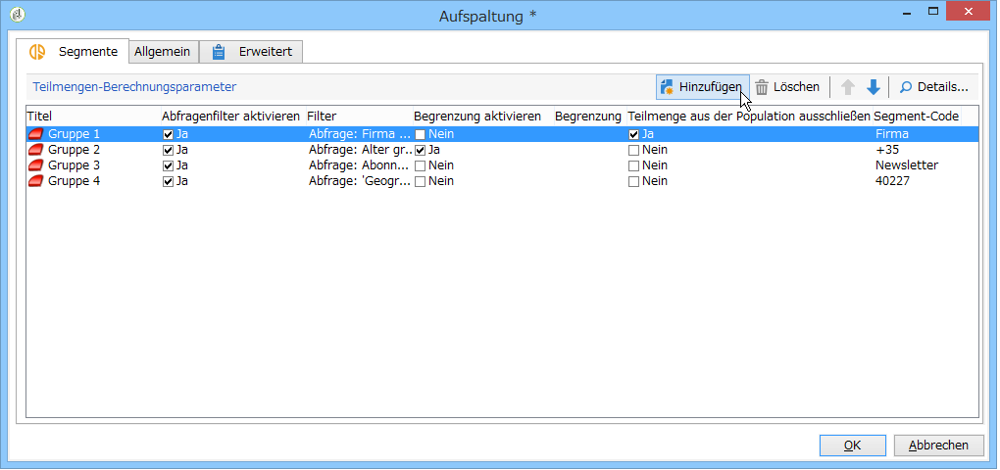
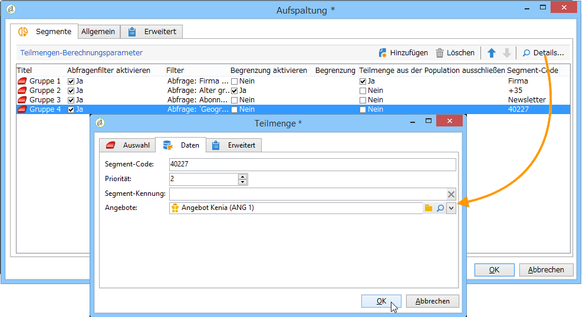

# Segmente{#cells}

Die **[!UICONTROL Segmente]**-Aktivität bietet eine Ansicht der verschiedenen Teilmengen in Form von Spalten, was den Umgang mit Teilmengen erleichtert, falls diese sehr zahlreich sind. Des Weiteren bietet die Aktivität Vorteile bei Personalisierungen.



Die Segmentierungsaktivität ermöglicht benutzerspezifische Konfigurationen. Standardmäßig können Details in einem dedizierten Fenster mit den Tabs **[!UICONTROL Auswahl]** und **[!UICONTROL Erweitert]** eingesehen werden. Im unten abgebildeten Beispiel wurde das entsprechende Formular angepasst und ein Tab **[!UICONTROL Daten]** hinzugefügt, um die Zuordnung von Angeboten und Prioritätsniveaus zu den einzelnen Teilmengen zu erlauben:



Öffnen Sie das Workflow-Formular im Knoten **[!UICONTROL Administration > Konfiguration > Formulare]** und fügen Sie folgende Zeilen ein:

```
<container img="nms:miniatures/mini-enrich.png" label="Data">
                <input xpath="@code"/>
                <container xpath="select/node[@alias='@numTest']">
                  <input alwaysActive="true" expr="'long'" type="expr" xpath="@type"/>
                  <input alwaysActive="true" expr="'Priority'" type="expr" xpath="@label"/>
                  <input label="Priority" maxValue="12" minValue="0" type="number"
                         xpath="@value" xpathEditFromType="@type"/>
                </container>
                <container xpath="select/node[@alias='@test']">
                  <input alwaysActive="true" expr="'string'" type="expr" xpath="@type"/>
                  <input alwaysActive="true" expr="'Identifier'" type="expr" xpath="@label"/>
                  <input label="Cell identifier" xpath="@value"/>
                </container>
                <container xpath="select/node[@alias='linkTest']">
                  <input alwaysActive="true" expr="'link'" type="expr" xpath="@type"/>
                  <input alwaysActive="true" expr="'nms:offer'" type="expr" xpath="@dataType"/>
                  <input alwaysActive="true" expr="'Offre'" type="expr" xpath="@label"/>
                  <input computeStringAlias="@valueLabel" label="Offers" notifyPathList="@_cs|@valueLabel"
                         schema="nms:offer" type="linkEdit" xpath="@value"/>
                </container>
```

Die Personalisierung von Formularen sollte erfahrenen Benutzern vorbehalten bleiben. Weiterführende Informationen finden Sie in diesem [Abschnitt](../../configuration/using/identifying-a-form.md).
