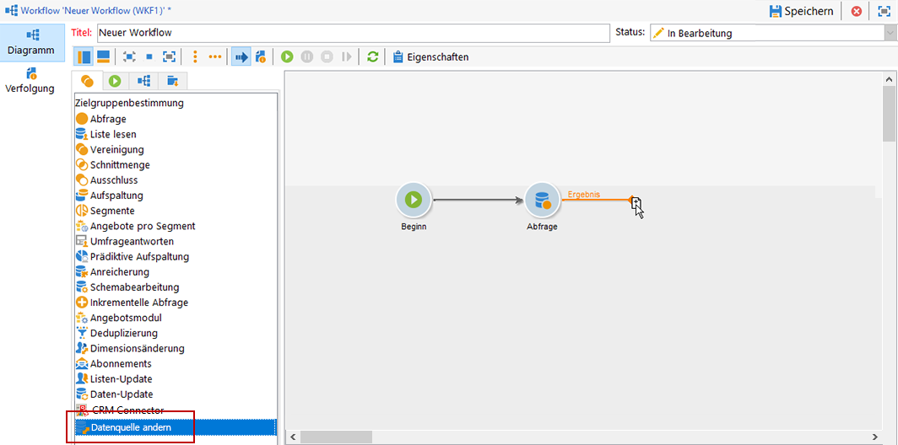
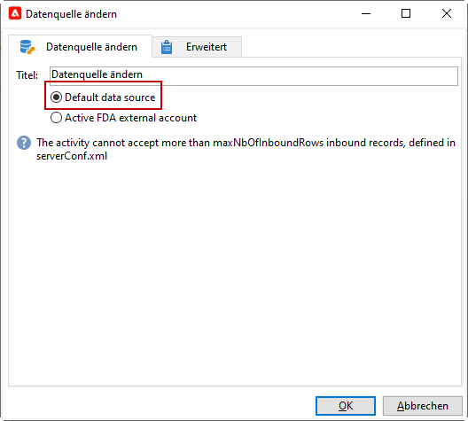
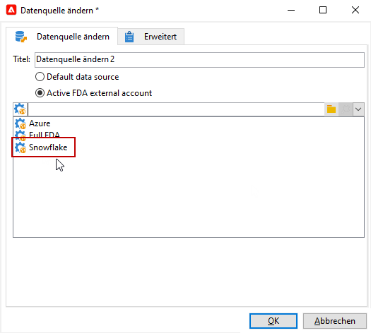

# Datenquelle ändern {#change-data-source}

>[!NOTE]
>
> Die Aktivität **[!UICONTROL Datenquelle ändern]** ist nur mit dem Package **[!UICONTROL Zugriff auf externe Daten (Federated Data Access)]** verfügbar. Weitere Informationen zu integrierten Adobe Campaign Classic-Packages finden Sie auf dieser [Seite](../../installation/using/installing-campaign-standard-packages.md).

Die Aktivität **[!UICONTROL Datenquelle ändern]** ermöglicht es Ihnen, die Datenquelle des Workflows **[!UICONTROL Arbeitstabelle]** zu ändern. Dies bietet mehr Flexibilität bei der Verwaltung von Daten in verschiedenen Datenquellen wie FDA, FFDA und lokalen Datenbanken.

Die **[!UICONTROL Arbeitstabelle]** ermöglicht es dem Adobe Campaign Classic-Workflow, Daten zu verarbeiten und für die Workflow-Aktivitäten freizugeben.
Standardmäßig wird die **[!UICONTROL Arbeitstabelle]** in derselben Datenbank erstellt wie die Quelle der Daten, die abgefragt werden.

Wenn Sie beispielsweise die Tabelle **[!UICONTROL Profile]** in der Cloud-Datenbank abfragen, erstellen Sie eine **[!UICONTROL Arbeitstabelle]** in derselben Cloud-Datenbank.
Um dies zu ändern, können Sie die Aktivität **[!UICONTROL Datenquelle ändern]** hinzufügen, um eine andere Datenquelle für Ihre **[!UICONTROL Arbeitstabelle]** auszuwählen.

Beachten Sie, dass Sie bei Verwendung der Aktivität **[!UICONTROL Datenquelle ändern]** zur Cloud-Datenbank zurückkehren müssen, um die Ausführung des Workflows fortzusetzen.

So verwenden Sie die Aktivität **[!UICONTROL Datenquelle ändern]**:

1. Erstellen Sie einen Workflow.

1. Fragen Sie Ihre ausgewählten Empfänger mit einer **[!UICONTROL Abfrage]**-Aktivität ab.

   Weitere Informationen zur Aktivität **[!UICONTROL Abfrage]** erhalten Sie auf dieser [Seite](../../workflow/using/query.md#creating-a-query).

1. Fügen Sie in der Registerkarte **[!UICONTROL Targeting]** die Aktivität **[!UICONTROL Datenquelle ändern]** hinzu.

   

1. Doppelklicken Sie auf die Aktivität **[!UICONTROL Datenquelle ändern]**, um die **[!UICONTROL Standarddatenquelle]** auszuwählen.

   Die Arbeitstabelle, die das Ergebnis Ihrer Abfrage enthält, wird dann in die standardmäßige PostgreSQL-Datenbank verschoben.

   

1. Ziehen Sie aus der Registerkarte **[!UICONTROL Aktionen]** die Aktivität **[!UICONTROL JavaScript-Code]** per Drag-and-drop, um einzelne Vorgänge auf die Arbeitstabelle anzuwenden.

   Weitere Informationen zur Aktivität **[!UICONTROL JavaScript-Code]** finden Sie auf der Seite [JavaScript-Code und erweiterter JavaScript-Code](../../workflow/using/sql-code-and-javascript-code.md#javascript-code).

1. Fügen Sie eine weitere Aktivität vom Typ **[!UICONTROL Datenquelle ändern]** hinzu, um zur Cloud-Datenbank zurückzukehren.

1. Doppelklicken Sie auf Ihre Aktivität und wählen Sie **[!UICONTROL Aktives externes FDA-Konto]** und dann das entsprechende externe Konto für die **[!UICONTROL Externe Datenbank]** aus.

   

1. Sie können den Workflow jetzt starten.
