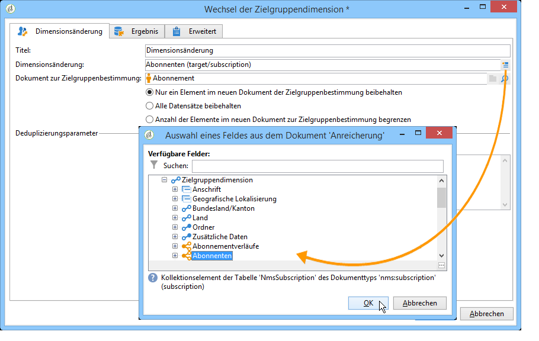
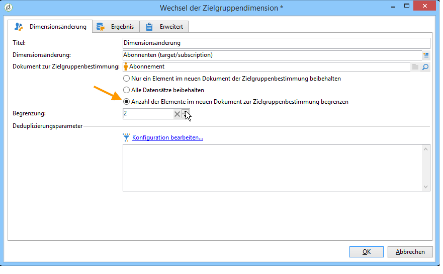
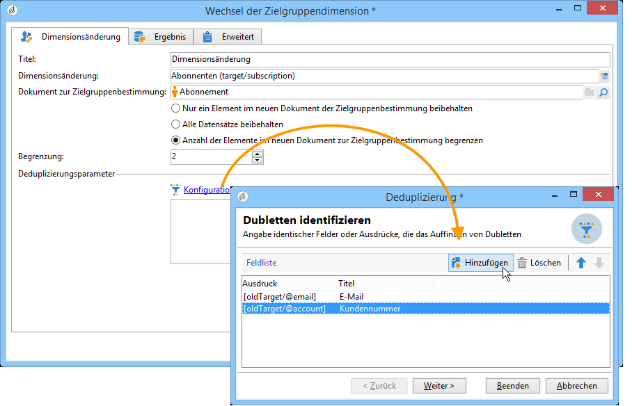
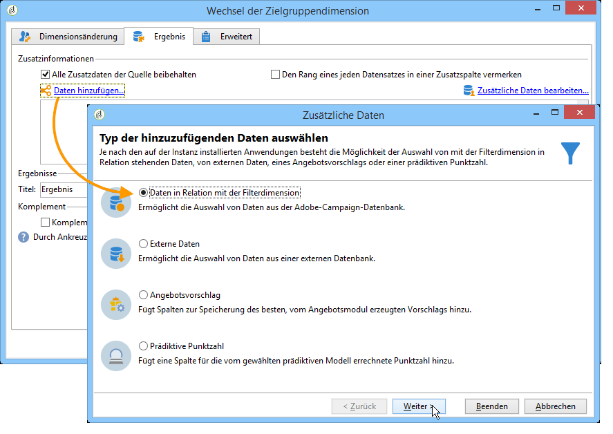
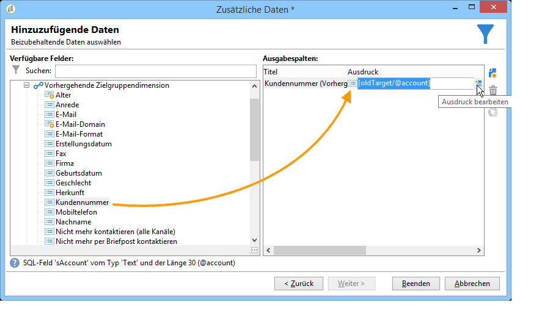
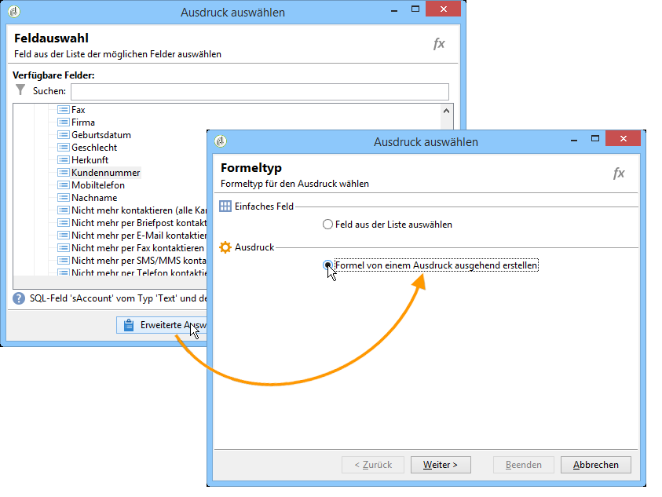
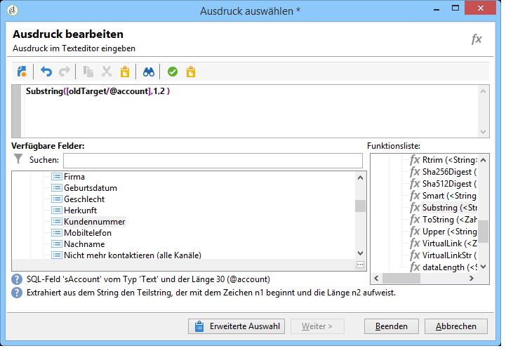
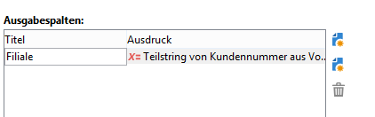
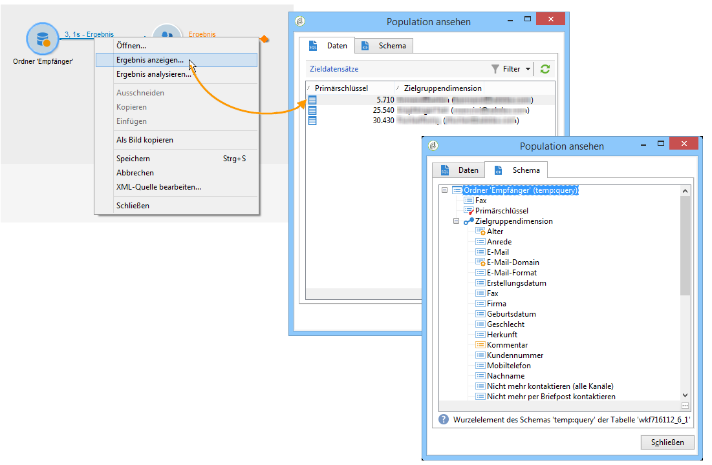
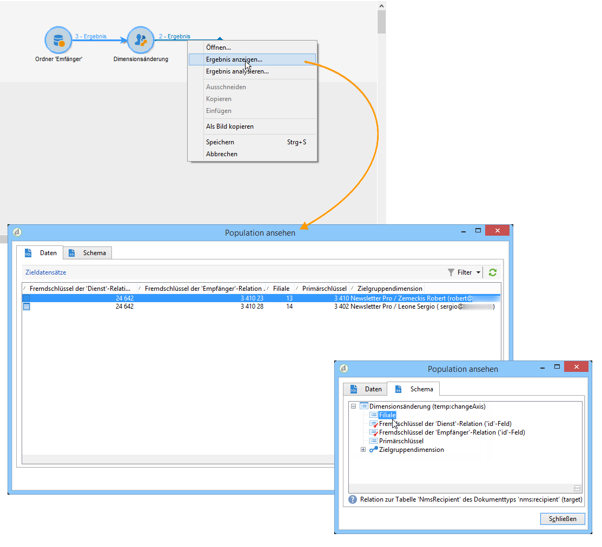

# Dimensionsänderung{#change-dimension}

Die Dimensionsänderung ermöglicht den Wechsel der Zielgruppendimension im Verlauf der Zielbestimmung. Je nach Datenmodell und Eingangsdimension können Sie beispielsweise von der Dimension &quot;Policen&quot; zur Dimension &quot;Kunden&quot; wechseln.

Diese Aktivität bietet des Weiteren die Möglichkeit, Zusatzspalten für die neue Zielgruppe zu definieren.

Außerdem können Deduplizierungskriterien für die Daten angegeben werden.

## Konfiguration {#configuration-mode}

Gehen Sie wie folgt vor:

1. Wählen Sie im Feld **[!UICONTROL Dimensionsänderung]** die neue Zielgruppendimension aus.

   

1. Sie können entscheiden, ob alle oder nur bestimmte Elemente in der ausgehenden Transition übermittelt werden sollen. Im vorliegenden Beispiel wird die Anzahl der möglichen Dubletten auf 2 begrenzt.

   

   Wenn Sie nur einen Datensatz beibehalten wollen, erscheint im Arbeitsschema eine Kollektion, welche alle Datensätze, die nicht im Endergebnis enthalten sind, enthält. Anhand dieser Kollektion können Sie, wie bei anderen Kollektionen auch, Aggregate berechnen oder Informationen abrufen.

   Wenn Sie beispielsweise von der Dimension **[!UICONTROL Kunden]** zur Dimension **[!UICONTROL Empfänger]** wechseln, können Sie die Kunden eines bestimmten Geschäfts unter Angabe der getätigten Käufe abrufen.

1. Wenn Sie nicht alle Datensätze beibehalten, können Sie die Deduplizierungsparameter bestimmen.

   

   Mithilfe der blauen Pfeile lässt sich die Reihenfolge der Dublettenverarbeitung bestimmen.

   Im vorliegenden Beispiel erfolgt die Deduplizierung zunächst über die E-Mail-Adresse und bei Bedarf anschließend über die Kundennummer.

1. Im **[!UICONTROL Ergebnis]**-Tab kann die Hinzufügung von Zusatzinformationen konfiguriert werden.

   Sie können beispielsweise den Bezirk anhand der Postleitzahl wiederherstellen, indem Sie eine **Substring**-Funktion verwenden. Gehen Sie dazu wie folgt vor:

   * Klicken Sie auf den Link **[!UICONTROL Daten hinzufügen...]** und kreuzen Sie die Option **[!UICONTROL Daten in Relation mit der Filterdimension]** an.

      

      >[!NOTE]
      >
      >Weitere Informationen zur Erstellung und Verwendung von Zusatzspalten finden Sie unter [Daten hinzufügen](../../workflow/using/query.md#adding-data).

   * Wählen Sie die ursprüngliche Zielgruppendimension aus (vor der Dimensionsänderung), markieren Sie die **[!UICONTROL Kundennummer]** und klicken Sie auf **[!UICONTROL Ausdruck bearbeiten]****[!UICONTROL .]**

      

   * Klicken Sie auf die Schaltfläche **[!UICONTROL Erweiterte Auswahl]** und kreuzen Sie die Option **[!UICONTROL Formel von einem Ausdruck ausgehend erstellen]** an.

      

   * Verwenden Sie die Funktionsliste, um die Formel zu erstellen.

      

   * Geben Sie abschließend einen Titel für die neu erstellte Spalte an.

      

1. Starten Sie den Workflow, um das Ergebnis zu prüfen. Die folgenden Abbildungen zeigen die Tabellen vor und nach der Dimensionsänderung sowie die Struktur der Workflow-Tabellen:

   

   

