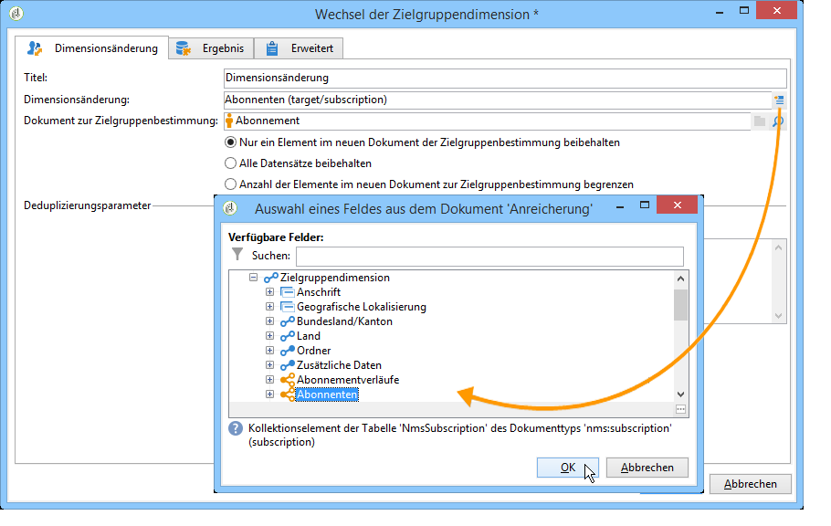
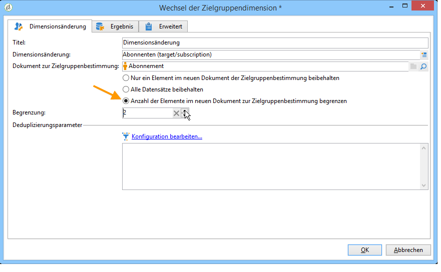
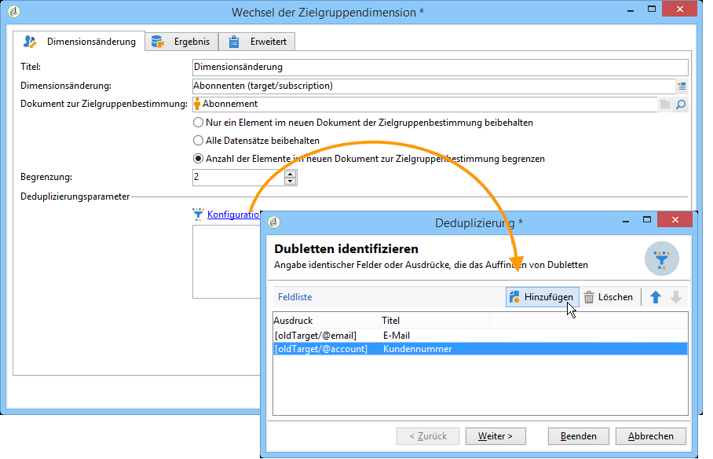
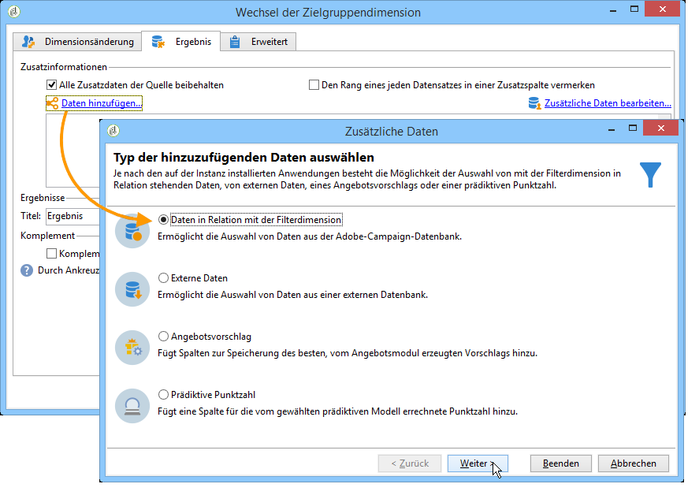
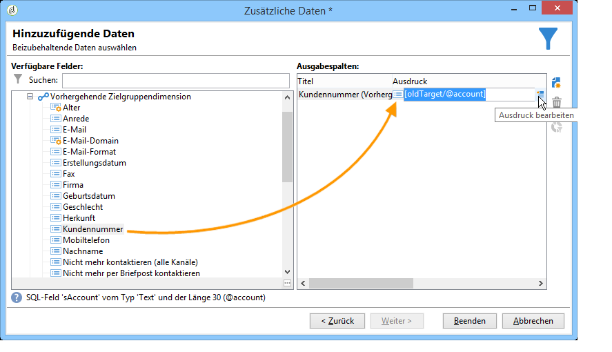
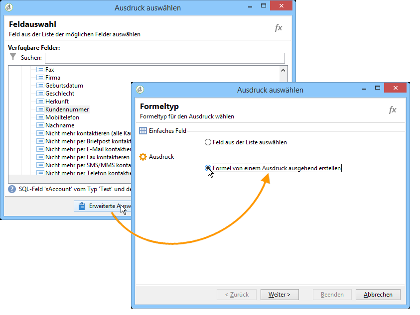
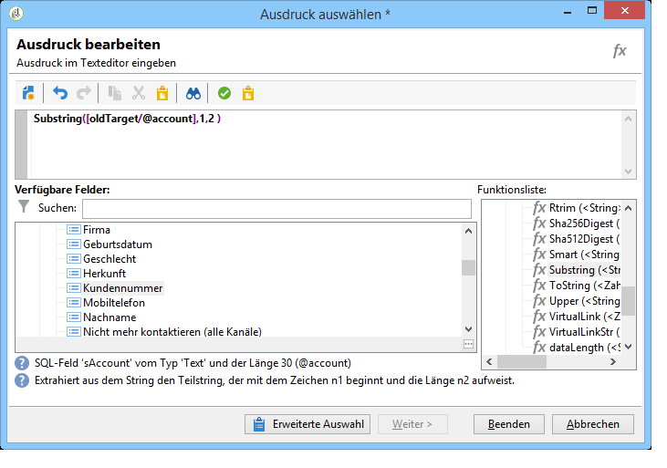
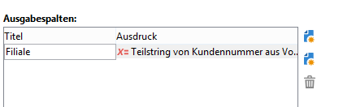
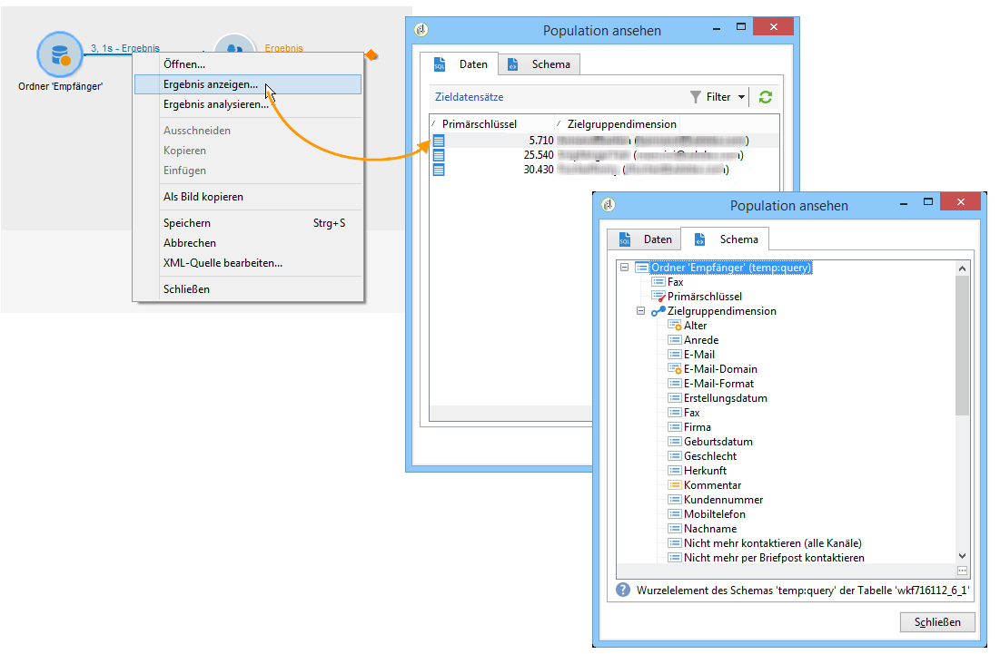
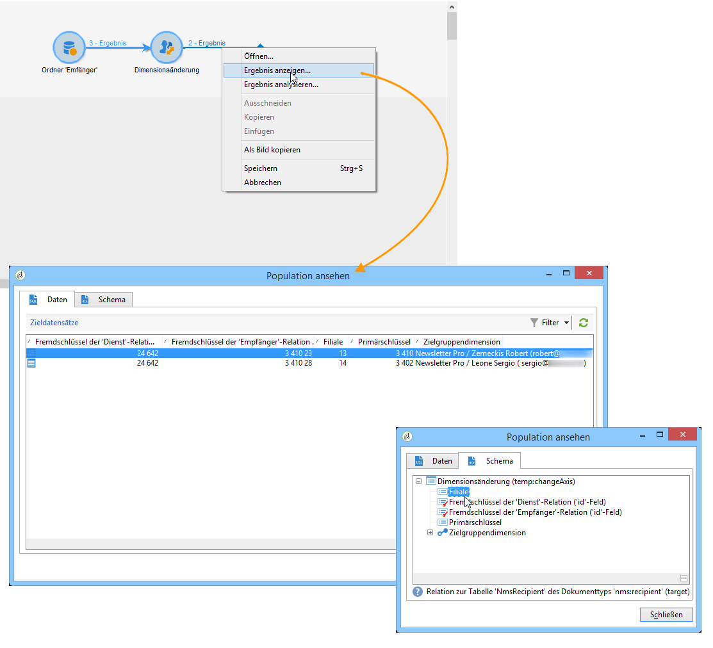

# Dimensionsänderung{#change-dimension}

Mit der Aktivität Dimensionsänderung können Sie die Zielgruppendimension während des Zielkonstruktionszyklus ändern. Die Achsenverschiebung hängt von der Datenvorlage und der Eingabedimension ab. Auf diese Weise können Sie beispielsweise von der Dimension „Verträge“ zur Dimension „Kunden“ wechseln.

Diese Aktivität bietet des Weiteren die Möglichkeit, Zusatzspalten für die neue Zielgruppe zu definieren.

Außerdem können Deduplizierungskriterien für die Daten angegeben werden.

## Konfiguration {#configuration-mode}

Gehen Sie wie folgt vor:

1. Wählen Sie im Feld **[!UICONTROL Dimensionsänderung]** die neue Zielgruppendimension aus.

   

1. Bei der Dimensionsänderung können Sie alle Elemente beibehalten oder diejenigen auswählen, die in der Ausgabe beibehalten werden sollen. Im folgenden Beispiel gilt für den Wert max. Anzahl der Duplikate ist auf 2 gesetzt.

   

   Wenn Sie sich dafür entscheiden, nur einen Datensatz zu behalten, wird im Arbeitsschema eine Sammlung angezeigt: Diese Sammlung stellt alle Datensätze dar, die im Endergebnis nicht angesprochen werden (da nur ein Datensatz beibehalten wird). Wie alle anderen Sammlungen können Sie mit dieser Sammlung Aggregate berechnen oder Informationen in Spalten abrufen.

   Wenn Sie beispielsweise von der Dimension **[!UICONTROL Kunden]** zur Dimension **[!UICONTROL Empfänger]** wechseln, können Sie die Kunden eines bestimmten Geschäfts unter Angabe der getätigten Käufe abrufen.

1. Wenn Sie nicht alle Datensätze beibehalten, können Sie die Deduplizierungsparameter bestimmen.

   

   Mithilfe der blauen Pfeile lässt sich die Reihenfolge der Duplikatverarbeitung bestimmen.

   Im vorliegenden Beispiel erfolgt die Deduplizierung zunächst über die E-Mail-Adresse und bei Bedarf anschließend über die Kundennummer.

1. Im **[!UICONTROL Ergebnis]**-Tab kann die Hinzufügung von Zusatzinformationen konfiguriert werden.

   Sie können beispielsweise den Bezirk anhand der Postleitzahl wiederherstellen, indem Sie eine **Substring**-Funktion verwenden. Gehen Sie dazu wie folgt vor:

   * Klicken Sie auf den Link **[!UICONTROL Daten hinzufügen...]** und kreuzen Sie die Option **[!UICONTROL Daten in Relation mit der Filterdimension]** an.

     

     >[!NOTE]
     >
     >Weitere Informationen zur Erstellung und Verwendung von Zusatzspalten finden Sie unter [Daten hinzufügen](query.md#adding-data).

   * Wählen Sie die ursprüngliche Zielgruppendimension aus (vor der Dimensionsänderung), markieren Sie die **[!UICONTROL Kundennummer]** und klicken Sie auf **[!UICONTROL Ausdruck bearbeiten]****[!UICONTROL .]**

     

   * Klicken Sie auf die Schaltfläche **[!UICONTROL Erweiterte Auswahl]** und kreuzen Sie die Option **[!UICONTROL Formel von einem Ausdruck ausgehend erstellen]** an.

     

   * Verwenden Sie die Funktionsliste, um die Formel zu erstellen.

     

   * Geben Sie abschließend einen Titel für die neu erstellte Spalte an.

     

1. Führen Sie den Workflow aus, um das Ergebnis dieser Konfiguration anzuzeigen. Vergleichen Sie die Daten in den Tabellen vor und nach der Aktivität Dimensionsänderung und vergleichen Sie die Struktur der Workflow-Tabellen, wie in den folgenden Beispielen gezeigt:

   

   
