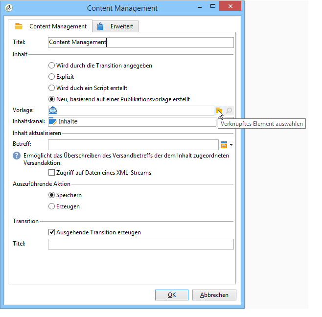
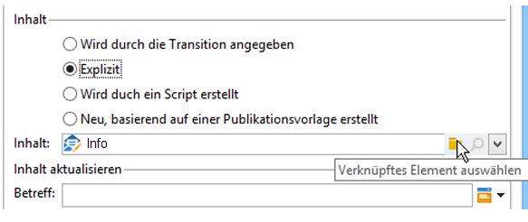
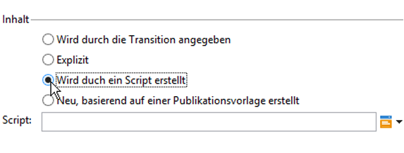
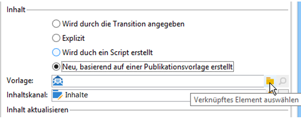
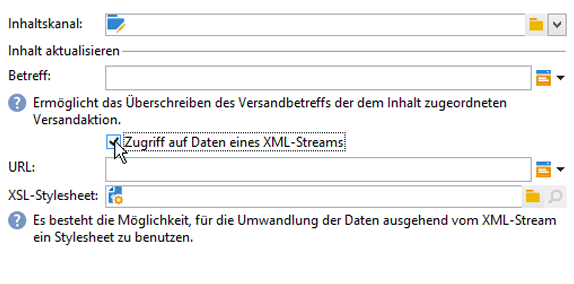
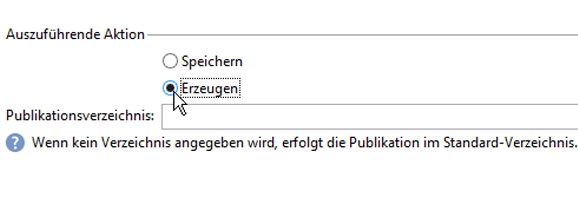

# Content Management{#content-management}

Mithilfe der Aktivität **Content Management** lassen sich Inhalte erstellen und bearbeiten sowie Inhaltsdateien erzeugen. Die Inhalte können dann im Ramen einer Versandaktivität genutzt werden.

>[!CAUTION]
>
>Das Content Management ist ein optionales Modul von Adobe Campaign. Bitte prüfen Sie Ihren Lizenzvertrag.

Die Konfiguration der Aktivität gliedert sich in drei Schritte:

* **Inhalt auswählen**: Der Inhalt kann zuvor erstellt worden sein oder in der Aktivität erstellt werden.
* **Inhalt aktualisieren**: Die Aufgabe kann den Betreff des Inhalts ändern oder den gesamten XML-Inhalt importieren.
* **Auszuführende Aktion**: Der Inhalt kann gespeichert oder erzeugt werden.

   

   Konfiguration und Verwendung des Content Managements in Adobe Campaign werden in diesem [Abschnitt](../../delivery/using/about-content-management.md) detailliert beschrieben.

1. **Content**

   * **[!UICONTROL Wird durch die Transition angegeben]**

      Bei Auswahl dieser Option wird der durch die eingehende Transition übermittelte Inhalt verwendet. Dies bedeutet, dass das Ereignis, welches das Content Management aktiviert, eine **[!UICONTROL contentId]**-Variable enthalten muss. Diese kann durch eine vorangehende Content-Management-Aktivität oder durch ein beliebiges Script bestimmt worden sein.

   * **[!UICONTROL Explizit]**

      Wählen Sie diese Option, wenn ein zuvor erstellter Inhalt verwendet werden soll. Geben Sie diesen im Feld **[!UICONTROL Inhalt]** an. Das Feld erscheint nur, wenn die Option **[!UICONTROL Explizit]** angekreuzt wurde.

      

   * **[!UICONTROL Wird durch ein Script erstellt]**

      Die Kennung des Inhalts wird über ein Script erstellt. Im Feld **[!UICONTROL Script]** wird das JavaScript-Template berechnet, welches die Kennung (den Primärschlüssel) des Inhalts evaluiert. Das Feld erscheint nur, wenn die Option **[!UICONTROL Wird durch ein Script erstellt]** angekreuzt wurde.

      

   * **[!UICONTROL Neu, basierend auf einer Publikationsvorlage erstellt]**

      Wählen Sie diese Option, wenn ein neuer, auf einer Vorlage beruhender Inhalt erstellt werden soll. Geben Sie im Feld **[!UICONTROL Inhaltskanal]** den Ordner an, in dem der neue Inhalt gespeichert werden soll und im Feld **[!UICONTROL Vorlage]** die zu verwendende Publikationsvorlage.

      

1. **Bereich Inhalt aktualisieren**

   * **[!UICONTROL Betreff]**

      Hier kann der Betreff der dem Inhalt entsprechenden Versandaktion überschrieben werden.

   * **[!UICONTROL Zugriff auf Daten eines XML-Streams]**

      Mithilfe dieser Option ist es möglich, einen Inhalt ausgehend von einem XML-Dokument, das von einem Webserver heruntergeladen wurde, zu erstellen und ihn gegebenenfalls mit einem XSL-Stylesheet umzuwandeln. Im Feld **[!UICONTROL URL]** ist die URL für den XML-Download und im Feld **[!UICONTROL XSL-Stylesheet]** das für die Umwandlung zu nutzende Stylesheet anzugeben. Letzteres ist optional.

      

1. **Auszuführende Aktion**

   * **[!UICONTROL Speichern]**

      Der erstellte oder geänderte Inhalt wird gespeichert.

      In diesem Fall wird die ausgehende Transition einmal aktiviert. In der Variable **[!UICONTROL contentId]** wird die Kennung des Inhalts gespeichert.

   * **[!UICONTROL Erzeugen]**

      Der Inhalt wird gespeichert und die Ausgabedateien für alle Umwandlungsvorlagen mit dem Publikationstyp &#39;Datei&#39; werden erzeugt.

      

      In diesem Fall wird die ausgehende Transition für jede erzeugte Datei aktiviert. In der Variable **[!UICONTROL contentId]** wird die Kennung des Inhalts und in der Variable **[!UICONTROL filename]** der Name der Datei gespeichert.

## Eingabeparameter {#input-parameters}

* contentId

Kennung des zu verwendenden Inhalts, wenn die Option **[!UICONTROL Wird durch die Transition angegeben]** ausgewählt wurde.

## Ausgabeparameter {#output-parameters}

* contentId

   Kennung des Inhalts.

* filename

   Vollständiger Name der erzeugten Datei, wenn die Aktion **[!UICONTROL Erzeugen]** ausgewählt wurde.

## Beispiele   {#examples}

Beispiele werden in diesem [Abschnitt](../../delivery/using/automating-via-workflows.md#examples) bereitgestellt.
