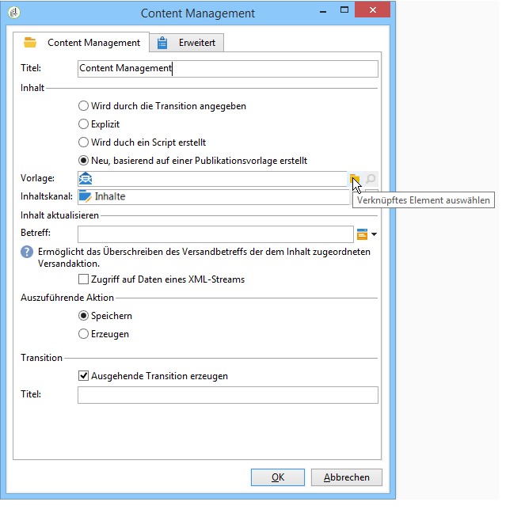
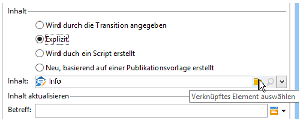
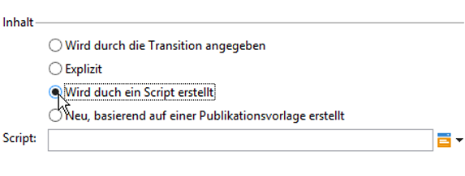
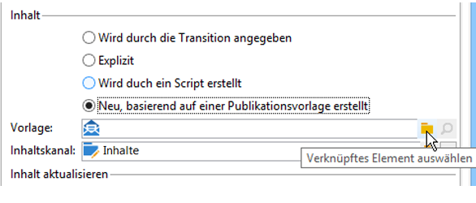
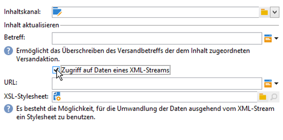
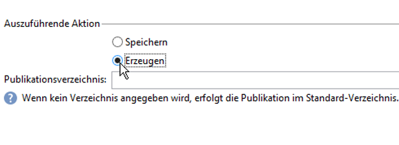

# Content-Management{#content-management}

Eine **Content-Management**-Aktivität ermöglicht Ihnen das Erstellen und Bearbeiten eines Inhalts und das Generieren von Dateien basierend auf diesem Inhalt. Diese Inhalte können dann über eine Aktivität vom Typ „Versand“ bereitgestellt werden.

>[!CAUTION]
>
>Content-Management ist ein optionales Adobe Campaign-Modul. Prüfen Sie diesbezüglich Ihren Lizenzvertrag.

Die Konfiguration der Aktivität gliedert sich in drei Schritte:

* **Inhalt auswählen**: Der Inhalt kann zuvor erstellt worden sein oder in der Aktivität erstellt werden.
* **Inhalt aktualisieren**: Die Aufgabe kann den Betreff des Inhalts ändern oder den gesamten XML-Inhalt importieren.
* **Auszuführende Aktion**: Der Inhalt kann gespeichert oder erzeugt werden.

  

  Konfiguration und Verwendung des Content-Managements in Adobe Campaign werden in diesem [Abschnitt](../../delivery/using/about-content-management.md) detailliert beschrieben.

1. **Content**

   * **[!UICONTROL Wird durch die Transition angegeben]**

     Mit dieser Option können Sie den in der Transition angegebenen Inhalt verwenden, d. h. das Ereignis, das das Content-Management aktiviert, muss eine **[!UICONTROL contentId]**-Variable enthalten. Diese Variable kann durch ein vorheriges Content-Management oder ein beliebiges Skript festgelegt worden sein.

   * **[!UICONTROL Explizit]**

     Wählen Sie diese Option, wenn ein zuvor erstellter Inhalt verwendet werden soll. Geben Sie diesen im Feld **[!UICONTROL Inhalt]** an. Das Feld erscheint nur, wenn die Option **[!UICONTROL Explizit]** angekreuzt wurde.

     

   * **[!UICONTROL Wird durch ein Script erstellt]**

     Die Kennung des Inhalts wird über ein Script erstellt. Im Feld **[!UICONTROL Script]** wird das JavaScript-Template berechnet, welches die Kennung (den Primärschlüssel) des Inhalts auswertet. Das Feld erscheint nur, wenn die Option **[!UICONTROL Wird durch ein Script erstellt]** aktiviert wurde.

     

   * **[!UICONTROL Neu, basierend auf einer Veröffentlichungsvorlage erstellt]**

     Erstellt ausgehend von einer Veröffentlichungsvorlage einen neuen Inhalt. Der neue Inhalt wird im Ordner gespeichert, der im Feld **[!UICONTROL String]** angegeben ist. Das Feld **[!UICONTROL Vorlage]** gibt die zu verwendende Veröffentlichungsvorlage an.

     

1. **Bereich Inhalt aktualisieren**

   * **[!UICONTROL Betreff]**

     Hier kann der Betreff der dem Inhalt entsprechenden Versandaktion überschrieben werden.

   * **[!UICONTROL Zugriff auf Daten eines XML-Streams]**

     Mit dieser Option können Sie den Inhalt aus einem XML-Dokument erstellen, das über ein XSL-Stylesheet heruntergeladen wurde. Wenn diese Option ausgewählt ist, wird die **[!UICONTROL URL]** gibt das XML-Inhalts-Download-URL an. Das Feld **[!UICONTROL XSL-Stylesheet]** gibt das für die Umwandlung zu nutzende Stylesheet an. Letzteres ist optional.

     

1. **Auszuführende Aktion**

   * **[!UICONTROL Speichern]**

     Der erstellte oder geänderte Inhalt wird gespeichert.

     In diesem Fall wird die ausgehende Transition einmal aktiviert. In der Variable **[!UICONTROL contentId]** wird die Kennung des Inhalts gespeichert.

   * **[!UICONTROL Erzeugen]**

     Der Inhalt wird gespeichert und die Ausgabedateien für alle Umwandlungsvorlagen mit dem Veröffentlichungstyp &#39;Datei&#39; werden erzeugt.

     

     In diesem Fall wird die ausgehende Transition für jede erzeugte Datei aktiviert. In der Variable **[!UICONTROL contentId]** wird die Kennung des Inhalts und in der Variable **[!UICONTROL filename]** der Name der Datei gespeichert.

## Eingabeparameter {#input-parameters}

* contentId

Kennung des zu verwendenden Inhalts, wenn die Option **[!UICONTROL Wird durch die Transition angegeben]** ausgewählt wurde.

## Ausgabeparameter {#output-parameters}

* contentId

  Kennung des Inhalts.

* filename

  Vollständiger Name der erzeugten Datei, wenn die Aktion **[!UICONTROL Erzeugen]** ausgewählt wurde.

## Beispiele {#examples}

Beispiele werden in diesem [Abschnitt](../../delivery/using/automating-via-workflows.md#examples) bereitgestellt.
