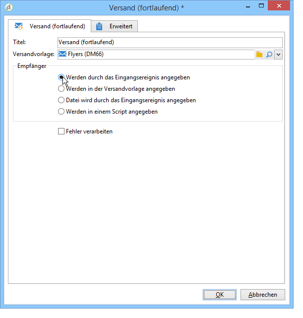
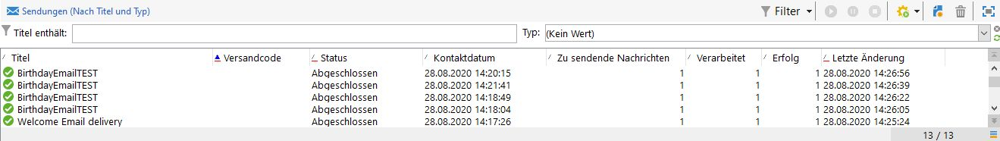

# Versand (fortlaufend){#continuous-delivery}

Ein **fortlaufender Versand** bietet die Möglichkeit, Empfänger zu existierenden Versandaktionen hinzuzufügen. Auf diese Weise wird das wiederholte Erstellen von identischen Sendungen vermieden. Dies ist insbesondere für Benachrichtigungen, die regelmäßig, aber nicht zu planbaren Zeitpunkten versendet werden, interessant. In der Versandvorlage kann ein Script zur Berechnung des jeweiligen Titels (und des Kampagnenordners) definiert werden, sodass bei Berechnung eines noch nicht existierenden Titels der Versand automatisch erstellt wird.

Dank der Option **[!UICONTROL Fehler verarbeiten]** erscheint eine spezifische Transition, wenn ein Fehler auftritt. In diesem Fall wird die Ausführung des Workflows nicht ausgesetzt, sondern fortgeführt.

Dies gilt für Fehler des Dateisystems (Datei kann nicht verschoben werden, Zugriff auf das Verzeichnis nicht möglich usw.).

Fehler, die aus der Konfiguration der Aktivität resultieren, beispielsweise durch Angabe von ungültigen Werten (z. B. inexistentes Verzeichnis), werden nicht verarbeitet.

## Eingabeparameter {#input-parameters}

* tableName
* schema

Jedes eingehende Ereignis muss eine durch diese Parameter definierte Zielgruppe angeben.

Dies gilt nur, wenn die Option **[!UICONTROL Wird durch das Eingangsereignis angegeben]** angekreuzt wurde.

## Ausgabeparameter {#output-parameters}

* tableName
* schema
* recCount

Anhand der drei Werte lässt sich die durch den wiederkehrenden Versand ermittelte Zielgruppe identifizieren. **[!UICONTROL tableName]** ist der Name der Tabelle, welche die Kennungen der Zielgruppenempfänger enthält, **[!UICONTROL schema]** ist das Schema der Population, (i. d. R. nms:recipient) und **[!UICONTROL recCount]** ist die Anzahl an Elementen in der Tabelle.

Die Transition des Komplements weist die gleichen Parameter auf.

## How to set up a continuous delivery

This section explains how to set up a continuous delivery.

The **continuous delivery** lets you add new recipients to an existing delivery and avoids you having to create a new delivery each time a new recipient is added. You can update the creative directly in the campaign workflow and it will update the template in the delivery template Resource folder.

A continuous delivery will create a SINGLE delivery and delivery logs (broadLog) and tracking logs that reference that one delivery are added each time it executes.

This video shows how to configure a continuous delivery with an incremental query.

>[!VIDEO](https://video.tv.adobe.com/v/25039?quality=12)
