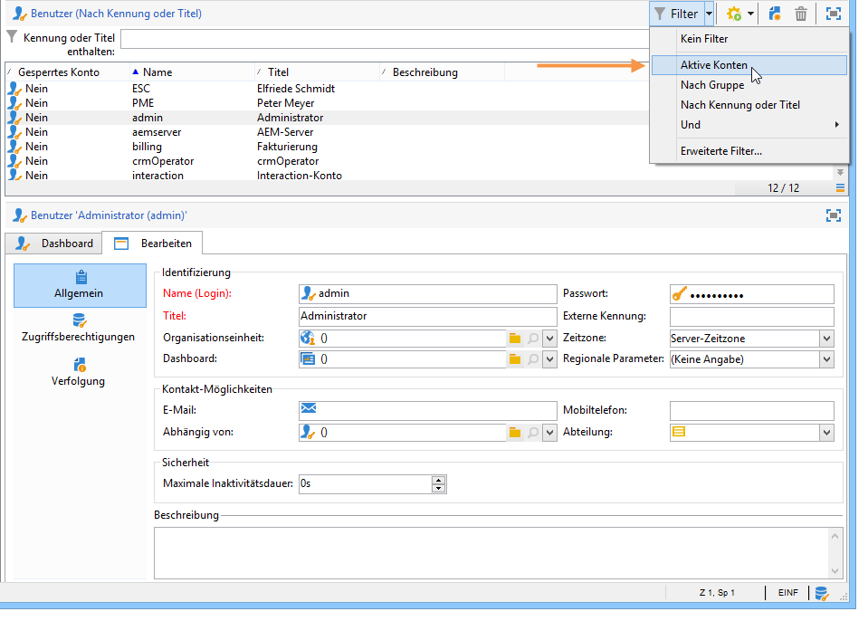
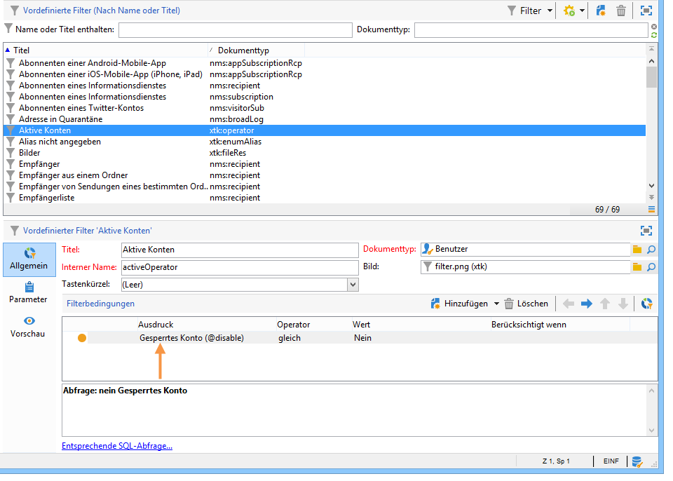
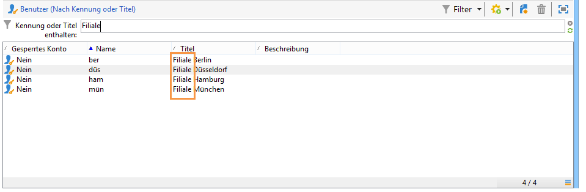
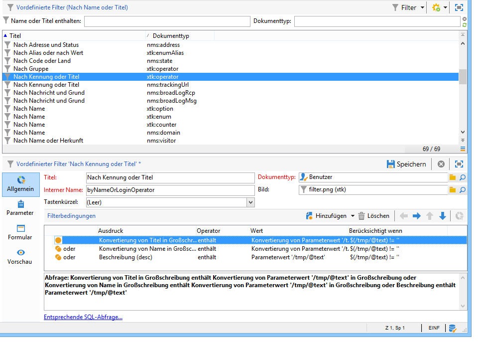
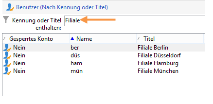

# Erstellung von Filtern {#creating-a-filter}

Filter werden in Adobe Campaign auf die gleiche Weise erstellt wie Abfragen.

>[!NOTE]
>
>Weiterführende Informationen zum Erstellen von Filtern finden Sie in [diesem Abschnitt](../../platform/using/filtering-options.md).

Der Knoten **[!UICONTROL Administration > Konfiguration > Vordefinierte Filter]** enthält alle in Listen und Übersichten verwendeten Filter.

Beispielsweise kann die Benutzerliste nach **[!UICONTROL Aktiven Konten]** gefiltert werden:

Der entsprechende Filter enthält die Abfrage bezüglich des Werts **[!UICONTROL Gesperrtes Konto]** des **[!UICONTROL Benutzer]**-Schemas:

Dieselbe Liste kann mit dem Filter **[!UICONTROL Nach Login oder Titel]** nach dem im Eingabefeld erfassten Wert durchsucht werden:

Dieser Filter wird wie folgt konfiguriert:

Um dem Filter zu entsprechen, muss das Benutzerkonto eine der folgenden Bedingungen erfüllen:

* Der Titel enthält die im Eingabefeld erfassten Zeichen;
* der Benutzername enthält die im Eingabefeld erfassten Zeichen;
* die Beschreibung enthält die im Eingabefeld erfassten Zeichen.

>[!NOTE]
>
>Bei Verwendung der Funktion **[!UICONTROL Upper]** werden bei einer Abfrage Groß- und Kleinschreibung nicht beachtet.

Die Spalte **[!UICONTROL Berücksichtigt wenn]** ermöglicht die Konfiguration von Voraussetzungen dafür, dass die Filterbedingungen zum Tragen kommen. Die Zeichen **$(/tmp/@text)** entsprechen dem Inhalt des dem Filter zugeordneten Eingabefelds:

Hier ist **$(/tmp/@text)=&#39;Filiale&#39;**.

Der Ausdruck **$(/tmp/@text)!=&#39;&#39;** prüft jede Bedingung, wenn das Eingabefeld nicht leer ist.
