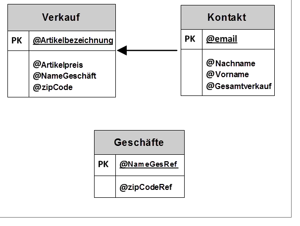
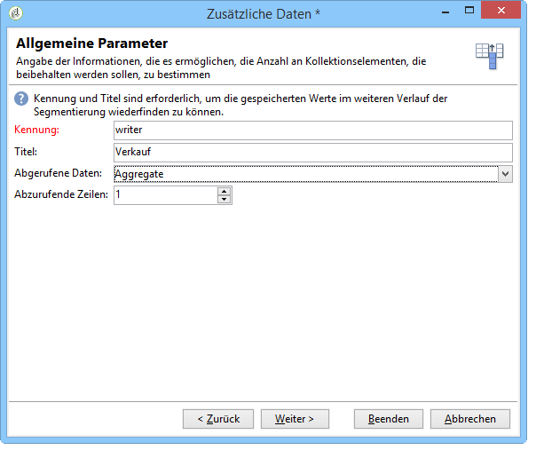

# Erstellung einer zusammenfassenden Liste.{#creating-a-summary-list}

Das folgende Anwendungsbeispiel erläutert die Erstellung eines Workflows zum Abruf und zur Anreicherung von Dateien mit dem Ziel, eine zusammenfassende Liste zu erstellen. Die zu erstellende Liste enthält Kontakte, die Einkäufe in Geschäften getätigt haben.


Die Datenstruktur stellt sich wie folgt dar:



Sie ermöglicht Ihnen Folgendes:

* Verwendung der verschiedenen Optionen der Anreicherung;
* Aktualisierung der in der Datenbank gespeicherten Informationen im Anschluss an eine Abstimmung;
* Erstellung einer Gesamtübersicht der angereicherten Daten.

Gehen Sie wie folgt vor, um eine zusammenfassende Liste zu erstellen:

1. Abruf und Ladung einer Verkaufsdatei in die Workflow-Arbeitstabelle.
1. Anreicherung der importierten Daten durch Erstellung einer Relation zu einer Referenztabellle.
1. Aktualisierung der Verkaufsdatei mit den Anreicherungsdaten.
1. Anreicherung der Kontaktdaten mit einem aus der Verkaufstabelle stammenden Aggregat.
1. Erstellung einer zusammenfassenden Liste.

## 1. Schritt: Laden der Datei und Abstimmung der importierten Daten {#step-1--loading-the-file-and-reconciling-the-imported-data}

Die zu ladenden Verkaufsdaten weisen folgende Struktur auf:

```
Product Name;Product price;Store
Computer;2000;London 3
Tablet;600;Cambridge
Computer;2000;London 5
Comptuer;2000;London 8
Tablet;600;Cambridge
Phone;500;London 5
```

Die Daten stammen aus der Datei &quot;Verkauf.txt&quot;

1. Ziehen Sie die Aktivitäten **Datei-Wächter** und **Laden (Datei)** in das Workflow-Diagramm.

   Der **Datei-Wächter** sammelt Dateien und sendet sie auf den Adobe-Campaign-Server.

   Die Aktivität **Laden (Datei)** lädt die gesammelten Daten in die Arbeitstabelle des Workflows.

   Weitere Informationen zu dieser Aktivität finden Sie unter Daten aus einer Datei [laden](../../workflow/using/importing-data.md#loading-data-from-a-file).

1. Konfigurieren Sie den **Datei-Wächter** dahingehend, dass er Textdateien (.txt) im angegebenen Verzeichnis abruft.

   

   Mit der **Dateierfassungs** -Aktivität können Sie das Fehlen einer Datei im Quellordner verwalten. Markieren Sie dazu die **[!UICONTROL Process file nonexistence]** Option. In diesem Arbeitsablauf wurde eine **Wait** -Aktivität hinzugefügt, um eine weitere Dateisammlung auszuprobieren, wenn sie zum Zeitpunkt der Sammlung im Verzeichnis fehlt.

1. Konfigurieren Sie die Aktivität **Laden (Datei)**, indem Sie eine Beispieldatei angeben, die die gleiche Datenstruktur wie die zu importierenden Daten aufweist.

   

   Klicken Sie auf den **[!UICONTROL Click here to change the file format...]** Link, um die Spalten mit den internen Namen und Bezeichnungen der Tabelle &quot;Einkäufe&quot;umzubenennen.

   

Nach dem Import der Daten, werden diese durch Erstellung einer Relation zur Referenztabelle (hier Geschäft) angereichert.

Ziehen Sie die Anreicherung in das Diagramm und konfigurieren Sie sie wie folgt:

1. Definieren Sie als Hauptmenge die aus der Aktivität **Laden (Datei)** stammenden Daten.

   

1. Klicken Sie auf **[!UICONTROL Add data]** und wählen Sie die **[!UICONTROL A link]** Option aus.

   

1. Select the **[!UICONTROL Define a collection]** option.
1. Wählen Sie das Schema &quot;Geschäfte&quot; als Zielschema aus.

   

Weitere Informationen zu den verschiedenen Linktypen finden Sie unter Daten [anreichern und ändern](../../workflow/using/targeting-data.md#enriching-and-modifying-data).

Im nächsten Bildschirm ist der Join zu erstellen, der die Abstimmung zwischen den Daten erlaubt. Wählen Sie aus der Hauptmenge die Quelle und aus dem Schema &quot;Geschäfte&quot; den Zieldatensatz aus.


Dank des Joins ist es nun möglich, die Workflow-Arbeitstabelle um eine aus dem Schema &quot;Geschäfte&quot; stammende Spalte zu erweitern: hier &quot;Referenz-Postleitzahl&quot;.

1. Öffnen Sie die Anreicherung.
1. Klicks **[!UICONTROL Edit additional data]**.
1. Add the &quot;ZipCode Reference&quot; field to the **[!UICONTROL Output columns]**.


Nach der Anreicherung stellen sich die Daten der Workflow-Arbeitstabelle wie folgt dar:


## 2. Schritt: Schreiben der angereicherten Daten in die &#39;Verkauf&#39;-Tabelle {#step-2--writing-enriched-data-to-the--purchases--table}

In diesem Schritt werden die importierten und angereicherten Daten in die &quot;Verkauf&quot;-Tabelle geschrieben. Dies geschieht mithilfe der Aktivität **Datenaktualisierung**.

Vor der Aktualisierung sind die Daten der Workflow-Arbeitstabelle mit denen aus der Zielgruppendimension **Verkauf** abzustimmen.****

1. Click the **[!UICONTROL Reconciliation]** tab of the enrichment activity.
1. Wählen Sie die Zieldimension, im vorliegenden Beispiel also das Schema &#39;Verkauf&#39;, aus.
1. Geben Sie einen Quellausdruck für die Daten der Workflow-Arbeitstabelle an (hier &quot;NameGeschäft&quot;).
1. Geben Sie dann einen Zielausdruck für die Daten der Verkauf-Tabelle an (hier &quot;NameGeschäft&quot;).
1. Aktivieren Sie die **[!UICONTROL Keep unreconciled data coming from the work table]** Option.


Konfigurieren Sie die **Datenaktualisierung**-Aktivität wie folgt:

1. Select the **[!UICONTROL Insert or update]** option in the **[!UICONTROL Operation type]** field to avoid creating new records each time the file is collected.
1. Wählen Sie den **[!UICONTROL By directly using the targeting dimension]** Wert für die **[!UICONTROL Record identification]** Option aus.
1. Select the &quot;Purchases&quot; schema as a **[!UICONTROL Document type]**.
1. Geben Sie die Liste der zu aktualisierenden Felder an. In der **[!UICONTROL Destination]** Spalte können Sie die Felder des Schemas &quot;Einkäufe&quot;definieren. In der **[!UICONTROL Expression]** Spalte können Sie die Felder in der Arbeitstabelle auswählen, um eine Zuordnung durchzuführen.
1. Klicken Sie auf die **[!UICONTROL Generate an outbound transition]** Option.


## 3. Schritt: Anreicherung der &#39;Kontakt&#39;-Daten {#step-3--enriching--contact--data-}

Das Schema &quot;Kontakte&quot; steht in Relation zum Schema &#39;Verkauf&#39;. Dies ermöglicht die Verwendung einer weiteren Option der Anreicherungsaktivität, nämlich die Hinzufügung von Daten in Relation mit der Filterdimension.

Ziel dieser zweiten Anreicherung ist es, ein Aggregat von Verkaufsdaten zu erstellen, um den Gesamtumsatz pro identifiziertem Kontakt zu berechnen.

1. Ziehen Sie eine **Abfrage** in das Workflow-Diagramm, um alle in der Datenbank gespeicherten **Kontakte** abzurufen.
1. Schließen Sie eine **Anreicherung** an und definieren Sie als Hauptmenge die Population aus der vorangehenden Abfrage.
1. Click add **[!UICONTROL Data]**.
1. Klicken Sie auf die **[!UICONTROL Data linked to the targeting dimension]** Option.
1. Klicken Sie auf die **[!UICONTROL Data linked to the filtering dimension]** Option im **[!UICONTROL Select fields to add]** Fenster.
1. Wählen Sie die **[!UICONTROL Purchases]** Node und klicken Sie auf **[!UICONTROL Next]**.

   

1. Ändern Sie das **[!UICONTROL Collected data]** Feld, indem Sie die **[!UICONTROL Aggregates]** Option auswählen.

   

1. Klicks **[!UICONTROL Next]**.
1. Geben Sie folgenden Ausdruck an, um für jeden Kontakt die Summe der Verkäufe zu berechnen: &quot;Sum(@artikelpreis)&quot;.

   

Für die zusammenfassende Liste werden Felder aus dem Verkaufsschema und aus der ersten Anreicherung benötigt.

1. Klicken Sie auf den **[!UICONTROL Edit additional data...]** Link in der Anreicherungsaktivität.
1. Fügen Sie die Felder &quot;Verkauf/NameGeschäft&quot; und &quot;Verkauf/Referenz-Postleitzahl&quot; hinzu.

   

1.  Klicken Sie auf die **[!UICONTROL Properties]** Registerkarte.
1. Ändern Sie die zweite Relation, um nur eine Zeile zu erstellen.

   

## 4. Schritt: Erstellung einer zusammenfassenden Liste {#step-4--creating-and-adding-to-a-summary-list}

Im letzten Schritt werden die angereicherten Daten in eine Liste geschrieben.

1. Platzieren Sie im Anschluss an die zweite Anreicherung ein **Listen-Update** im Workflow-Diagramm.
1. Select the **[!UICONTROL Create the list if necessary (Calculated name)]** option.
1. Wählen Sie einen Wert für den berechneten Titel aus. Im vorliegenden Beispiel wird das aktuelle Datum als Titel für die Liste verwendet: &lt;%= formatDate(new Date(), &quot;%2D.%2M.%2Y&quot;) %>.

Nach Ausführung des Workflows enthält die Liste folgende Informationen:

* eine Liste an Kontakten,
* eine Spalte mit Gesamtumsätzen,
* eine Spalte mit Geschäftsbezeichnungen,
* eine Spalte mit der Referenz-Postleitzahl für die Geschäfte, die im Referenzschema der Geschäfte enthalten sind.


