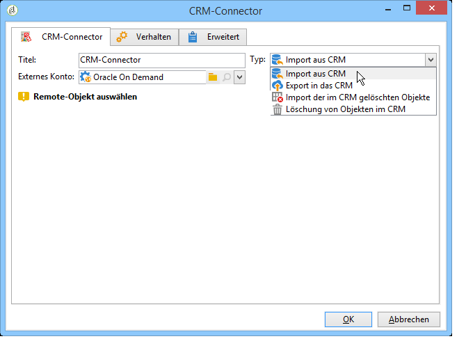
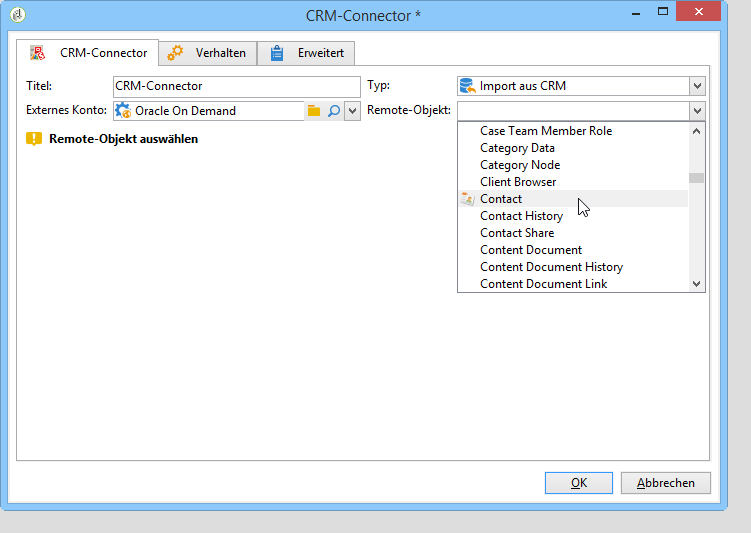

# CRM-Connector{#crm-connector}

Die Aktivität **CRM-Connector** ermöglicht die Konfiguration einer Datensynchronisation zwischen Adobe Campaign und einem CRM-System.

Weiterführende Informationen zu CRM-Connectoren finden Sie in diesem [Abschnitt](../../platform/using/crm-connectors.md).

Mit dieser Aktivität können Sie folgende Aufgaben erledigen:

* Import aus dem CRM
* Export in das CRM
* Import der im CRM gelöschten Objekte
* Löschung von Objekten im CRM

Wählen Sie zunächst das externe Konto aus, das dem CRM-System entspricht, mit dem Sie eine Synchronisation konfigurieren möchten, und anschließend das zu synchronisierende Objekt (Konten, Opportunities, Kontakte etc.).

Die Konfiguration dieser Aktivität hängt von dem auszuführenden Prozess ab. Verschiedene Konfigurationen werden [auf dieser Seite](../../platform/using/crm-data-sync.md) detailliert beschrieben.
