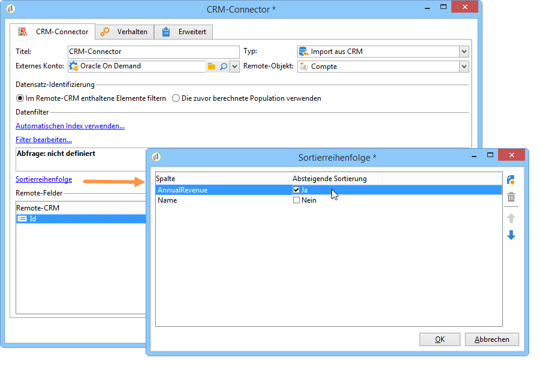

# CRM-Connector{#crm-connector}

Die **CRM-Connector**-Aktivität dient der Konfiguration einer Datensynchronisation zwischen Adobe Campaign und einem CRM.

Weiterführende Informationen zu CRM-Connectoren finden Sie in diesem [Abschnitt](../../platform/using/crm-connectors.md).

Folgende Optionen stehen zur Auswahl:

* Aus dem CRM-System importieren (siehe [Aus dem CRM](#importing-from-the-crm)importieren),
* Export in CRM (siehe [Export in CRM](#exporting-to-the-crm)),
* Im CRM gelöschte Objekte importieren (siehe [Importieren von Objekten, die im CRM](#importing-objects-deleted-in-the-crm)gelöscht wurden),
* Löschen Sie Objekte in CRM (siehe [Löschen von Objekten in CRM](#deleting-objects-in-the-crm)).


Wählen Sie zunächst das externe Konto aus, das dem CRM-System entspricht, mit dem Sie eine Synchronisation konfigurieren möchten, und anschließend das zu synchronisierende Objekt (Konto, Opportunities, Kontakte etc.).


Die Konfiguration der Aktivität hängt von der gewählten Option ab und wird im Folgenden dargestellt:

## Import aus CRM {#importing-from-the-crm}

Zum Import von CRM-Daten in Adobe Campaign ist ein Workflow nach folgendem Muster zu erstellen:


Gehen Sie zur Konfiguration der **CRM-Connector**-Aktivität wie folgt vor:

1. Wählen Sie einen **[!UICONTROL Import from the CRM]** Vorgang aus.
1. Gehen Sie zur **[!UICONTROL Remote object]** Dropdownliste und wählen Sie das Objekt aus, das vom Prozess betroffen ist. Dieses Objekt fällt mit einer der Tabellen zusammen, die während der Connector-Konfiguration in Adobe Campaign erstellt wurden.
1. Go to the **[!UICONTROL Remote fields]** section and enter the fields to be imported.

   To add a field, click the **[!UICONTROL Add]** button in the toolbar, then click the **[!UICONTROL Edit expression]** icon.

   

   Ändern Sie bei Bedarf das Datenformat über die Dropdownliste der **[!UICONTROL Conversion]** Spalten. Mögliche Konvertierungstypen werden auf dieser [Seite](../../platform/using/crm-connectors.md#data-format)beschrieben.

   >[!CAUTION]
   >
   >Die Datensatzkennung im CRM ist erforderlich, um die Objekte aus dem CRM denen aus der Adobe-Campaign-Datenbank zuordnen zu können. Sie wird automatisch bei Validierung der Aktivität hinzugefügt.
   > 
   >Außerdem ist das Datum der letzten CRM-seitigen Änderung erforderlich, um einen inkrementellen Datenimport zu ermöglichen.

1. Sie können die zu importierenden Daten auch nach Ihren Anforderungen filtern. To do this, click the **[!UICONTROL Edit the filter...]** link.

   Im folgenden Beispiel importiert Adobe Campaign nur Kontakte, die nach dem 20. Januar 2014 aktiv waren.

   

   The limitations linked to data filtering modes are detailed in [Filter on data](#filter-on-data) section.

1. The **[!UICONTROL Use automatic index]** option enables you to automatically manage incremental object synchronization between the CRM and Adobe Campaign, depending on the date and their last modification.

   For more on this, refer to [Variable management](#variable-management).

## Variablenverwaltung {#variable-management}

Enabling the **[!UICONTROL Automatic index]** option lets you collect only objects modified since the last import.


Das Datum der letzten Synchronisation wird in der im Konfigurationsfenster angezeigten Option gespeichert. Standardmäßig ist dies:

```
LASTIMPORT_<%=instance.internalName%>_<%=activityName%>
```

Sie können jedoch auch ein anderes CRM-Remote-Feld angeben, um die letzten Änderungen zu identifizieren.

Unten stehende Felder kommen (in der angegebenen Reihenfolge) zur Anwendung:

* Bei Microsoft Dynamics: **modifiedon**,
* Bei Oracle On Demand: **LastUpdated**, **ModifiedDate**, **LastLoggedIn**,
* Bei Salesforce.com: **LastModifiedDate**, **SystemModstamp**.

Durch Aktivierung der **[!UICONTROL Automatic index]** Option werden drei Variablen generiert, die im Synchronisierungs-Workflow über eine **[!UICONTROL JavaScript code]** Typaktivität verwendet werden können. Diese Aktivitäten sind:

* **vars.crmOptionName**: entspricht dem Datum des letzten Imports.
* **vars.crmStartImport**: entspricht dem Startdatum des letzten Datenabrufs (einschließlich).
* **vars.crmEndDate**: entspricht dem Enddatum des letzten Datenabrufs (ausschließlich).

   Die Daten werden im Format **yyyy/MM/dd hh:mm:ss** ausgedrückt.

## Datenfilter {#filter-on-data}

Um eine effiziente Funktionsweise mit den diversen CRM-Systemen sicherzustellen, sind bei der Filtererstellung folgende Regeln zu beachten:

* Jedes Filterniveau darf nur einen Typ von logischen Operatoren verwenden.
* Der Operator AUSSER (AND-NOT) wird nicht unterstützt.
* Vergleiche können nur Null-Werte (&#39;is empty&#39;/&#39;is not empty&#39; type) oder Zahlen betreffen. Das bedeutet, dass nach der Bewertung der **[!UICONTROL Value]** Spalte (rechte Spalte) das Ergebnis dieser Bewertung eine Zahl sein muss.
* The data in the **[!UICONTROL Value]** column is assessed in JavaScript.
* Vergleiche vom Typ JOIN werden nicht unterstützt.
* Der Ausdruck (linke Spalte) muss zwingend ein Feld sein. Er darf weder eine Kombination aus mehreren Ausdrücken, noch eine Ziffer usw. sein.

Die im folgenden Beispiel dargestellte Filterbedingung wäre somit im Fall eines CRM-Imports NICHT gültig, da

* der ODER-Operator sich auf dem gleichen Niveau wie die UND-Operatoren befinden;
* die Vergleiche sich auf Zeichenketten beziehen.


## Sortierreihenfolge {#order-by}

In Microsoft Dynamics und Salesforce.com haben Sie die Möglichkeit, die zu importierenden Remote-Felder auf- oder absteigend zu sortieren.

To do this, click the **[!UICONTROL Order by]** link and add the columns to the list.

Die Spaltenreihenfolge der Liste zeigt die Sortierreihenfolge an:



## Datensatz-Identifizierung {#record-identification}

Statt im CRM-System enthaltene (und u. U. gefilterte) Elemente direkt zu importieren, können Sie eine zuvor im Workflow berechnete Population verwenden.

Wählen Sie dazu die **[!UICONTROL Use the population calculated upstream]** Option aus und geben Sie das Feld mit der Remote-Kennung an.

Wählen Sie anschließend die aus der Eingangspopulation zu importierenden Felder wie in unten stehendem Beispiel aus:


## Export in CRM {#exporting-to-the-crm}

Der Export von Daten aus Adobe Campaign ermöglicht die vollständige Kopie eines Inhalts in ein CRM-System.

Zum Export von Daten in ein CRM-System ist ein Workflow nach folgendem Muster zu erstellen:


Gehen Sie bei der Konfiguration der **CRM-Connector**-Aktivität wie folgt vor:

1. Wählen Sie einen **[!UICONTROL Export to CRM]** Vorgang aus.
1. Gehen Sie zur **[!UICONTROL Remote object]** Dropdownliste und wählen Sie das Objekt aus, das vom Prozess betroffen ist. Dieses Objekt fällt mit einer der Tabellen zusammen, die während der Connector-Konfiguration in Adobe Campaign erstellt wurden.

   >[!CAUTION]
   >
   >Die Exportfunktion der **CRM-Connector**-Aktivität ist in der Lage, Felder zum CRM-System hinzuzufügen oder existierende Felder zu aktualisieren. Für die Aktualisierung ist die Angabe des Primärschlüssels der Remote-Tabelle erforderlich. Andernfalls werden die Daten hinzugefügt (und nicht aktualisiert).

1. Geben Sie im Abschnitt **[!UICONTROL Mapping]** die zu exportierenden Adobe-Campaign-Felder und die entsprechenden CRM-Felder an.

   

   To add a field, click the **[!UICONTROL Add]** button in the toolbar, then click the **[!UICONTROL Edit expression]** icon.

   Wenn für ein Feld keine CRM-seitige Entsprechung existiert, werden die enthaltenen Werte nicht aktualisiert, sondern direkt dem CRM-System hinzugefügt.

   Ändern Sie bei Bedarf das Datenformat über die Dropdownliste der **[!UICONTROL Conversion]** Spalten. Mögliche Konvertierungstypen werden in diesem [Abschnitt](../../platform/using/crm-connectors.md#data-format)beschrieben.

   Die Liste der zu exportierenden Datensätze und das Exportergebnis werden in einer temporären Datei gespeichert, die zugänglich bleibt, solange der Workflow nicht abgeschlossen oder neu gestartet wurde. Dies gewährleistet, dass der Vorgang im Falle von Fehlern wieder aufgenommen werden kann, ohne Gefahr zu laufen, einen Datensatz mehrmals zu exportieren oder Daten zu verlieren.

## Datenformat und Fehlerverarbeitung {#data-format-and-error-processing}

Es besteht die Möglichkeit, das Datenformat beim Import aus dem oder beim Export in das CRM-System direkt zu konvertieren.

Wählen Sie hierzu in der entsprechenden Spalte die anzuwendende Konvertierung aus.


Der **[!UICONTROL Default]** Modus wendet eine automatische Datenkonvertierung an, was in den meisten Fällen einer Kopie/Einfügen der Daten entspricht. Das Zeitzonenmanagement wird jedoch angewendet.

Darüber hinaus sind folgende Konvertierungen möglich:

* **[!UICONTROL Date only]**: In diesem Modus werden die Felder Datum und Uhrzeit gelöscht.
* **[!UICONTROL Without time offset]**: In diesem Modus wird die Zeitzonenverwaltung im Standardmodus abgebrochen.
* **[!UICONTROL Copy/Paste]**: Dieser Modus verwendet Rohdaten wie Zeichenfolgen (keine Konvertierung).


Im Rahmen von Datenimporten oder -exporten können Sie einen bestimmten Prozess auf Fehler und Ablehnungen anwenden. Wählen Sie dazu die Optionen **[!UICONTROL Process rejects]** und **[!UICONTROL Process errors]** auf der **[!UICONTROL Behavior]** Registerkarte aus.

Diese Optionen erzeugen die entsprechenden ausgehenden Transitionen.


Nun können Sie nach Wunsch Aktivitäten im Zusammenhang mit den Vorgängen positionieren.

Im Anschluss an die Fehler-Transition können Sie beispielsweise eine Warte-Aktivität einfügen und Neustarts des Workflows planen.

Zurückweisungen werden mit dem Fehlercode und der entsprechenden Nachricht erfasst. Dies bietet die Möglichkeit, eine Zurückweisungsverfolgung zu etablieren, um Ihre Synchronisationsprozesse zu optimieren.

Even when the **[!UICONTROL Process rejects]** option isn&#39;t enabled, a warning is generated for each rejected column with an error code and message.

The **[!UICONTROL Reject]** outbound transition lets you access the output schema that contains the specific columns relevant to error messages and codes. Diese Spalten sind:

* Bei Oracle On Demand: **errorLogFilename** (Name der Protokolldatei bei Oracle), **errorCode** (Fehlercode), **errorSymbol** (Fehlersymbol, unterscheidet sich vom Fehlercode), **errorMessage** (Beschreibung des Fehlerkontexts).
* Bei Salesforce.com: **errorSymbol** (Fehlersymbol, unterscheidet sich vom Fehlercode), **errorMessage** (Beschreibung des Fehlerkontexts).

## Import der im CRM gelöschten Objekte {#importing-objects-deleted-in-the-crm}

Für eine umfassende Datensynchronisation besteht die Möglichkeit, CRM-seitig gelöschte Objekte in Adobe Campaign zu importieren.

Gehen Sie hierzu wie folgt vor:

1. Wählen Sie einen **[!UICONTROL Import objects deleted in the CRM]** Vorgang aus.
1. Gehen Sie zur **[!UICONTROL Remote object]** Dropdownliste und wählen Sie das Objekt aus, das vom Prozess betroffen ist. Dieses Objekt fällt mit einer der Tabellen zusammen, die während der Connector-Konfiguration in Adobe Campaign erstellt wurden.
1. Geben Sie den Löschzeitraum an, der in den **[!UICONTROL Start date]** und den **[!UICONTROL End date]** Feldern berücksichtigt werden soll. Diese Daten werden in den Zeitraum einbezogen.

   

   >[!CAUTION]
   >
   >Der Löschzeitraum für die zu importierenden Objekte muss die Einschränkungen des jeweiligen CRM-Systems berücksichtigen. So ist es z. B. in Salesforce.com nicht möglich, Daten abzurufen, die vor mehr als 30 Tagen gelöscht wurden.

## Löschung von Objekten im CRM {#deleting-objects-in-the-crm}

Zur Löschung von Objekten im CRM ist die Angabe der Primärschlüssel der zu löschenden Remote-Elemente erforderlich.


Auf der **[!UICONTROL Behavior]** Registerkarte können Sie die Verarbeitung von Ablehnungen aktivieren. Diese Option generiert einen zweiten Ausgabenübergang für die **[!UICONTROL CRM connector]** Aktivität. Weiterführende Informationen hierzu finden Sie in diesem [Abschnitt](../../platform/using/crm-connectors.md#error-processing).

Even when the **[!UICONTROL Process rejects]** option is disabled, a warning is generated for each rejected column.

## Konfigurationsbeispiel für einen Import von Kontakten {#example-of-how-to-configure-a-contact-import}

Im unten abgebildeten Beispiel sollen Kontakte aus einem Oracle-On-Demand-CRM importiert werden. Die aus dem CRM zu importierenden Felder sind so auszuwählen, dass sie mit denen der Adobe-Campaign-Datenbank übereinstimmen.


