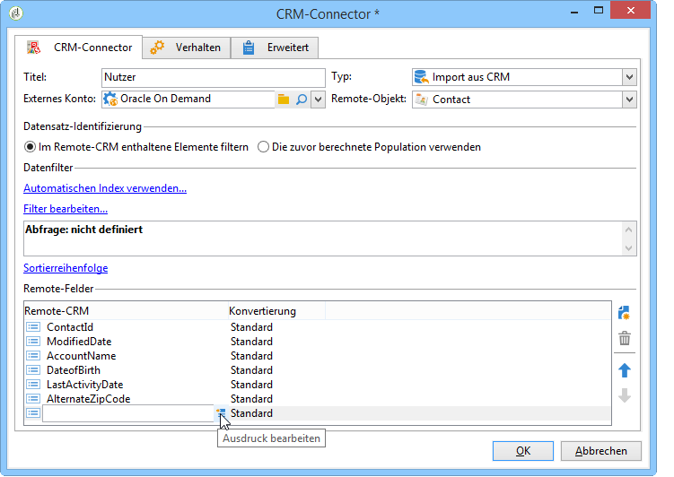

# CRM-Connector{#crm-connector}

Die **CRM-Connector**-Aktivität dient der Konfiguration einer Datensynchronisation zwischen Adobe Campaign und einem CRM.

Weiterführende Informationen zu CRM-Connectoren finden Sie in diesem [Abschnitt](../../platform/using/crm-connectors.md).

Folgende Optionen stehen zur Auswahl:

* Importieren aus CRM (siehe [Import aus CRM](#importing-from-the-crm)),
* Exportieren in CRM (siehe [Export in CRM](#exporting-to-the-crm)),
* Importieren der im CRM gelöschten Objekte (siehe [Import der im CRM gelöschten Objekte](#importing-objects-deleted-in-the-crm)),
* Löschen von Objekten im CRM (siehe [Löschungen von Objekten im CRM](#deleting-objects-in-the-crm)).


Wählen Sie zunächst das externe Konto aus, das dem CRM-System entspricht, mit dem Sie eine Synchronisation konfigurieren möchten, und anschließend das zu synchronisierende Objekt (Konto, Opportunities, Kontakte etc.).


Die Konfiguration der Aktivität hängt von der gewählten Option ab und wird im Folgenden dargestellt:

## Import aus CRM {#importing-from-the-crm}

Zum Import von CRM-Daten in Adobe Campaign ist ein Workflow nach folgendem Muster zu erstellen:


Gehen Sie zur Konfiguration der **CRM-Connector**-Aktivität wie folgt vor:

1. Wählen Sie den Vorgang vom Typ **[!UICONTROL Import aus CRM]**.
1. Wählen Sie in der Dropdown-Liste des Felds **[!UICONTROL Remote-Objekt]** das vom Vorgang betroffene Objekt aus. Das Objekt entspricht einer der Tabellen, die bei der Connector-Konfiguration in Adobe Campaign erstellt wurden.
1. Geben Sie im Abschnitt **[!UICONTROL Remote-Felder]** die zu importierenden Felder an.

   Um ein Feld hinzuzufügen, klicken Sie auf die Schaltfläche **[!UICONTROL Hinzufügen]** in der Symbolleiste und anschließend auf **[!UICONTROL Ausdruck bearbeiten]**.

   

   Falls nötig, kann das Datenformat über die Dropdown-Liste der Spalte **[!UICONTROL Konvertierung]** geändert werden. Mögliche Konvertierungen werden auf dieser [Seite](../../platform/using/crm-connectors.md#data-format) beschrieben.

   >[!CAUTION]
   >
   >Die Datensatzkennung im CRM ist erforderlich, um die Objekte aus dem CRM denen aus der Adobe-Campaign-Datenbank zuordnen zu können. Sie wird automatisch bei Validierung der Aktivität hinzugefügt.
   > 
   >Außerdem ist das Datum der letzten CRM-seitigen Änderung erforderlich, um einen inkrementellen Datenimport zu ermöglichen.

1. Je nach Bedarf können die zu importierenden Daten gefiltert werden. Klicken Sie hierzu auf den Link **[!UICONTROL Filter bearbeiten...]**.

   Im folgenden Beispiel importiert Adobe Campaign nur Kontakte, die nach dem 20. Januar 2014 aktiv waren.

   

   Einschränkungen in Bezug auf Datenfilter werden im Abschnitt [Datenfilter](#filter-on-data) beschrieben.

1. Die Option **[!UICONTROL Automatischen Index verwenden]** erlaubt die automatische Verwaltung der inkrementellen Synchronisation der Objekte zwischen dem CRM-System und Adobe Campaign in Abhängigkeit vom letzten Änderungsdatum.

   Konsultieren Sie diesbezüglich die [Variablenverwaltung](#variable-management).

## Variablenverwaltung {#variable-management}

Durch Aktivierung der Option **[!UICONTROL Automatischer Index]** ist es möglich, nur die seit dem letzten Import geänderten Objekte abzurufen.


Das Datum der letzten Synchronisation wird in der im Konfigurationsfenster angezeigten Option gespeichert. Standardmäßig ist dies:

```
LASTIMPORT_<%=instance.internalName%>_<%=activityName%>
```

Sie können jedoch auch ein anderes CRM-Remote-Feld angeben, um die letzten Änderungen zu identifizieren.

Unten stehende Felder kommen (in der angegebenen Reihenfolge) zur Anwendung:

* Bei Microsoft Dynamics: **modifiedon**,
* Bei Oracle On Demand: **LastUpdated**, **ModifiedDate**, **LastLoggedIn**,
* Bei Salesforce.com: **LastModifiedDate**, **SystemModstamp**.

Die Aktivierung der Option **[!UICONTROL Automatischer Index]** erzeugt drei Variablen, die im Synchronisations-Workflow über eine **[!UICONTROL JavaScript]**-Aktivität genutzt werden können. Diese Variablen sind:

* **vars.crmOptionName**: entspricht dem Datum des letzten Imports.
* **vars.crmStartImport**: entspricht dem Startdatum des letzten Datenabrufs (einschließlich).
* **vars.crmEndDate**: entspricht dem Enddatum des letzten Datenabrufs (ausschließlich).

   Die Daten werden im Format **yyyy/MM/dd hh:mm:ss** ausgedrückt.

## Datenfilter {#filter-on-data}

Um eine effiziente Funktionsweise mit den diversen CRM-Systemen sicherzustellen, sind bei der Filtererstellung folgende Regeln zu beachten:

* Jedes Filterniveau darf nur einen Typ von logischen Operatoren verwenden.
* Der Operator AUSSER (AND-NOT) wird nicht unterstützt.
* Vergleiche können sich nur auf Nullwerte (&#39;ist leer&#39;/&#39;ist nicht leer&#39;) oder Ziffern beziehen. Bei Auswertung der **[!UICONTROL Wert]**-Spalte (rechte Spalte) muss ein numerischer Wert ausgegeben werden.
* Die Daten der **[!UICONTROL Wert]**-Spalte werden in JavaScript ausgewertet.
* Vergleiche vom Typ JOIN werden nicht unterstützt.
* Der Ausdruck (linke Spalte) muss zwingend ein Feld sein. Er darf weder eine Kombination aus mehreren Ausdrücken, noch eine Ziffer usw. sein.

Die im folgenden Beispiel dargestellte Filterbedingung wäre somit im Fall eines CRM-Imports NICHT gültig, da

* der ODER-Operator sich auf dem gleichen Niveau wie die UND-Operatoren befinden;
* die Vergleiche sich auf Zeichenketten beziehen.


## Sortierreihenfolge {#order-by}

In Microsoft Dynamics und Salesforce.com haben Sie die Möglichkeit, die zu importierenden Remote-Felder auf- oder absteigend zu sortieren.

Klicken Sie hierfür auf **[!UICONTROL Sortierreihenfolge]** und fügen Sie die Spalten zur Liste hinzu.

Die Spaltenreihenfolge der Liste zeigt die Sortierreihenfolge an:


## Datensatz-Identifizierung {#record-identification}

Statt im CRM-System enthaltene (und u. U. gefilterte) Elemente direkt zu importieren, können Sie eine zuvor im Workflow berechnete Population verwenden.

Kreuzen Sie hierfür die Option **[!UICONTROL Die zuvor berechnete Population verwenden]** an und geben Sie das die Remote-Kennung enthaltende Feld an.

Wählen Sie anschließend die aus der Eingangspopulation zu importierenden Felder wie in unten stehendem Beispiel aus:


## Export in CRM {#exporting-to-the-crm}

Der Export von Daten aus Adobe Campaign ermöglicht die vollständige Kopie eines Inhalts in ein CRM-System.

Zum Export von Daten in ein CRM-System ist ein Workflow nach folgendem Muster zu erstellen:


Gehen Sie bei der Konfiguration der **CRM-Connector**-Aktivität wie folgt vor:

1. Wählen Sie den Vorgang vom Typ **[!UICONTROL Export in das CRM]**.
1. Wählen Sie in der Dropdown-Liste des Felds **[!UICONTROL Remote-Objekt]** das vom Vorgang betroffene Objekt aus. Das Objekt entspricht einer der Tabellen, die bei der Connector-Konfiguration in Adobe Campaign erstellt wurden.

   >[!CAUTION]
   >
   >Die Exportfunktion der **CRM-Connector**-Aktivität ist in der Lage, Felder zum CRM-System hinzuzufügen oder existierende Felder zu aktualisieren. Für die Aktualisierung ist die Angabe des Primärschlüssels der Remote-Tabelle erforderlich. Andernfalls werden die Daten hinzugefügt (und nicht aktualisiert).

1. Geben Sie im Abschnitt **[!UICONTROL Mapping]** die zu exportierenden Adobe-Campaign-Felder und die entsprechenden CRM-Felder an.

   

   Um ein Feld hinzuzufügen, klicken Sie auf die Schaltfläche **[!UICONTROL Hinzufügen]** in der Symbolleiste und anschließend auf **[!UICONTROL Ausdruck bearbeiten]**.

   Wenn für ein Feld keine CRM-seitige Entsprechung existiert, werden die enthaltenen Werte nicht aktualisiert, sondern direkt dem CRM-System hinzugefügt.

   Falls nötig, kann das Datenformat über die Dropdown-Liste der Spalte **[!UICONTROL Konvertierung]** geändert werden. Mögliche Konvertierungen werden in diesem [Abschnitt](../../platform/using/crm-connectors.md#data-format) beschrieben.

   Die Liste der zu exportierenden Datensätze und das Exportergebnis werden in einer temporären Datei gespeichert, die zugänglich bleibt, solange der Workflow nicht abgeschlossen oder neu gestartet wurde. Dies gewährleistet, dass der Vorgang im Falle von Fehlern wieder aufgenommen werden kann, ohne Gefahr zu laufen, einen Datensatz mehrmals zu exportieren oder Daten zu verlieren.

## Datenformat und Fehlerverarbeitung {#data-format-and-error-processing}

Es besteht die Möglichkeit, das Datenformat beim Import aus dem oder beim Export in das CRM-System direkt zu konvertieren.

Wählen Sie hierzu in der entsprechenden Spalte die anzuwendende Konvertierung aus.


Im **[!UICONTROL Standard]**-Modus entspricht die Konvertierung zumeist einem einfachen Kopieren/Einfügen der Daten. Die verschiedenen Zeitzonen werden in jedem Fall berücksichtigt.

Darüber hinaus sind folgende Konvertierungen möglich:

* **[!UICONTROL Nur Datum]**: löscht die Uhrzeit aus Feldern vom Typ Datum+Uhrzeit.
* **[!UICONTROL Ohne Zeitverschiebung]**: gibt im Gegensatz zum Standardmodus die Uhrzeit ohne Berücksichtigung der Zeitzonen wieder.
* **[!UICONTROL Kopieren/Einfügen]**: verwendet die ursprünglichen Daten als Strings weiter (keine Konvertierung).


Im Rahmen eines Imports oder Exports ist es möglich, einen spezifischen Umgang mit Fehlern und Zurückweisungen zu definieren. Wählen Sie diesbezüglich im Tab **[!UICONTROL Verhalten]** die Optionen **[!UICONTROL Zurückweisungen in einer Datei speichern]** und **[!UICONTROL Fehler verarbeiten]** aus.

Diese Optionen erzeugen die entsprechenden ausgehenden Transitionen.


Nun können Sie nach Wunsch Aktivitäten im Zusammenhang mit den Vorgängen positionieren.

Im Anschluss an die Fehler-Transition können Sie beispielsweise eine Warte-Aktivität einfügen und Neustarts des Workflows planen.

Zurückweisungen werden mit dem Fehlercode und der entsprechenden Nachricht erfasst. Dies bietet die Möglichkeit, eine Zurückweisungsverfolgung zu etablieren, um Ihre Synchronisationsprozesse zu optimieren.

Auch wenn die Option **[!UICONTROL Zurückweisungen in einer Datei speichern]** nicht aktiviert wurde, werden für jede zurückgewiesene Spalte ein Fehlercode und die entsprechende Nachricht erzeugt.

Die ausgehende Transition **[!UICONTROL Zurückweisung]** verleiht Zugang zum Ausgabeschema, welches die Spalten für Fehlercodes- und -nachrichten enthält. Die Spalten präsentieren sich wie folgt:

* Bei Oracle On Demand: **errorLogFilename** (Name der Protokolldatei bei Oracle), **errorCode** (Fehlercode), **errorSymbol** (Fehlersymbol, unterscheidet sich vom Fehlercode), **errorMessage** (Beschreibung des Fehlerkontexts).
* Bei Salesforce.com: **errorSymbol** (Fehlersymbol, unterscheidet sich vom Fehlercode), **errorMessage** (Beschreibung des Fehlerkontexts).

## Import der im CRM gelöschten Objekte {#importing-objects-deleted-in-the-crm}

Für eine umfassende Datensynchronisation besteht die Möglichkeit, CRM-seitig gelöschte Objekte in Adobe Campaign zu importieren.

Gehen Sie hierzu wie folgt vor:

1. Wählen Sie den Vorgang vom Typ **[!UICONTROL Import der im CRM gelöschten Objekte]** aus.
1. Wählen Sie in der Dropdown-Liste des Felds **[!UICONTROL Remote-Objekt]** das vom Vorgang betroffene Objekt aus. Das Objekt entspricht einer der Tabellen, die bei der Connector-Konfiguration in Adobe Campaign erstellt wurden.
1. Bestimmen Sie durch Eingabe von **[!UICONTROL Startdatum]** und **[!UICONTROL Enddatum]** den Zeitraum, für den gelöschte Objekte importiert werden sollen. Der Zeitraum versteht sich einschließlich Start- und Enddatum.

   

   >[!CAUTION]
   >
   >Der Löschzeitraum für die zu importierenden Objekte muss die Einschränkungen des jeweiligen CRM-Systems berücksichtigen. So ist es z. B. in Salesforce.com nicht möglich, Daten abzurufen, die vor mehr als 30 Tagen gelöscht wurden.

## Löschung von Objekten im CRM {#deleting-objects-in-the-crm}

Zur Löschung von Objekten im CRM ist die Angabe der Primärschlüssel der zu löschenden Remote-Elemente erforderlich.


Im Tab **[!UICONTROL Verhalten]** kann die Zurückweisungsverarbeitung aktiviert werden. Dies erzeugt eine weitere ausgehende Transition aus der **[!UICONTROL CRM-Connector]**-Aktivität. Weiterführende Informationen hierzu finden Sie in diesem [Abschnitt](../../platform/using/crm-connectors.md#error-processing).

Auch wenn die Option **[!UICONTROL Zurückweisungen in einer Datei speichern]** nicht aktiviert wurde, wird für jede zurückgewiesene Spalte ein Warnhinweis erzeugt.

## Konfigurationsbeispiel für einen Import von Kontakten {#example-of-how-to-configure-a-contact-import}

Im unten abgebildeten Beispiel sollen Kontakte aus einem Oracle-On-Demand-CRM importiert werden. Die aus dem CRM zu importierenden Felder sind so auszuwählen, dass sie mit denen der Adobe-Campaign-Datenbank übereinstimmen.


