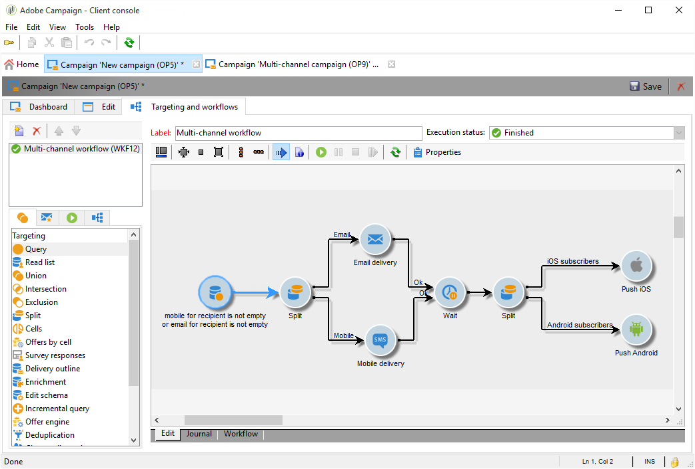

# Kanalübergreifender Versand{#cross-channel-deliveries}

Auf kanalübergreifende Sendungen kann auf der Registerkarte **[!UICONTROL Sendungen]** von Kampagnen-Workflows zugegriffen werden.

Die verfügbaren Kanäle sind:

* [E-Mail](../../delivery/using/about-email-channel.md)
* [Briefpost](../../delivery/using/about-direct-mail-channel.md)
* [Mobile](../../delivery/using/sms-channel.md)
* [Twitter](../../social/using/about-social-marketing.md)
* [iOS](../../delivery/using/create-notifications-ios.md)
* [Android](../../delivery/using/create-notifications-android.md)

Wählen Sie die Vorlage aus, auf der der Versand basieren soll, und definieren Sie ihre Inhalte.

Die Zielgruppe des Versands kann mithilfe der verschiedenen dedizierten Zielgruppenbestimmungs-Aktivitäten vorab im Workflow definiert werden.

Hier erstellen wir beispielsweise einen Workflow für den Versand einer E-Mail oder einer SMS an Abonnenten einer Push-Benachrichtigung sowie für eine Push-Benachrichtigung eine Woche später. Gehen Sie dazu wie folgt vor:

1. Erstellen Sie eine Kampagne.
1. Fügen Sie in Ihrer Kampagne dem Workflow im Tab **[!UICONTROL Zielgruppenbestimmungen und Workflows]** eine **[!UICONTROL Abfrage]** hinzu.
1. Konfigurieren Sie Ihre Abfrage. In unserem Beispiel wählen wir als Zieldimension die Empfänger aus, die Push-Benachrichtigungen abonniert haben.

   >[!NOTE]
   >
   >Verwenden Sie für Push-Benachrichtigungen die Zieldimension **Abonnierte Anwendungen**.

   

1. Fügen Sie Ihrer Abfrage die Filterbedingungen hinzu. In unserem Fall wählen wir Empfänger aus, die eine Mobiltelefonnummer oder E-Mail-Adresse besitzen.

   

1. Fügen Sie Ihrem Workflow eine **[!UICONTROL Aufspaltung]** hinzu, um Empfänger in Besitzer einer Mobiltelefonnummer und in Besitzer einer E-Mail-Adresse zu unterteilen.
1. Wählen Sie im Tab **[!UICONTROL Versand]** für jeden Zieldatensatz einen Versand.

   Erstellen Sie Ihren Versand auf dieselbe Weise wie mit dem klassischen Versand-Assistenten, indem Sie die Versandaktivität in Ihrem Workflow durch einen Doppelklick auswählen. Weiterführende Informationen dazu finden Sie auf dieser [Seite](../../delivery/using/about-email-channel.md).

   

1. Fügen Sie eine **[!UICONTROL Warten]**-Aktivität hinzu und konfigurieren Sie sie, damit die Empfänger nicht zu viele Sendungen gleichzeitig erhalten.
1. Fügen Sie eine **[!UICONTROL Aufspaltung]** hinzu, um Abonnenten in Anwender von iOS- und Android-Apps zu unterteilen.

   Wählen Sie für jedes Betriebssystem einen Dienst aus. Weiterführende Informationen zur Abonnementerstellung finden Sie auf dieser [Seite](../../delivery/using/configuring-the-mobile-application.md).

   

1. Wählen Sie für jedes Betriebssystem einen Versand über eine mobile App aus und konfigurieren Sie ihn.

   
