# Workflow für einen kanalübergreifenden Versand{#cross-channel-delivery-workflow}

In diesem Anwendungsbeispiel wird ein Workflow zum kanalübergreifenden Versand beschrieben. Das allgemeine Konzept kanalübergreifender Sendungen finden Sie in [diesem Abschnitt](../../workflow/using/cross-channel-deliveries.md).

Das Ziel besteht darin, aus den Empfängern der Datenbank eine Audience auszuwählen und diese in gesonderte Gruppen zu unterteilen, um der einen Gruppe eine E-Mail und der anderen Gruppe eine SMS zukommen zu lassen.

Die Umsetzung des Anwendungsbeispiels gliedert sich in folgende Schritte:

1. Creating a **[!UICONTROL Query]** activity to target your audience.
1. Creating an **[!UICONTROL Email delivery]** activity containing a link to an offer.
1. Using a **[!UICONTROL Split]** activity to:

   * Den Empfängern, die die erste E-Mail nicht geöffnet haben, eine weitere zu senden.
   * Den Empfängern, die die E-Mail geöffnet, aber nicht auf den Link zum Angebot geklickt haben, eine SMS zu senden.
   * Die Empfänger, die die E-Mail geöffnet und den Link angeklickt haben, zur Datenbank hinzuzufügen.

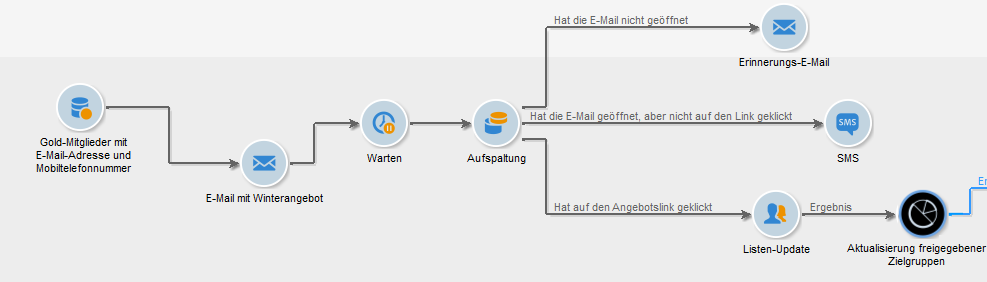

## Schritt 1: Auswählen einer Audience {#step-1--targeting-the-audience}

Um Ihre Zielgruppe zu bestimmen, erstellen Sie eine Abfrage zur Identifizierung der Empfänger.

1. Kampagne erstellen. Weiterführende Informationen hierzu finden Sie in [diesem Abschnitt](../../campaign/using/setting-up-marketing-campaigns.md#creating-a-campaign).
1. In the **[!UICONTROL Targeting and workflows]** tab of your campaign, add a **Query** activity to your workflow. For more on using this activity, refer to [this section](../../workflow/using/query.md).
1. Definieren Sie die Empfänger, die Ihre Sendungen erhalten sollen. Wählen Sie beispielsweise Gold-Mitglieder als Zieldimension aus.
1. Fügen Sie Filterbedingungen zu Ihrer Abfrage hinzu. Wählen Sie in diesem Beispiel Empfänger, die eine E-Mail-Adresse und eine Mobiltelefonnummer haben.

   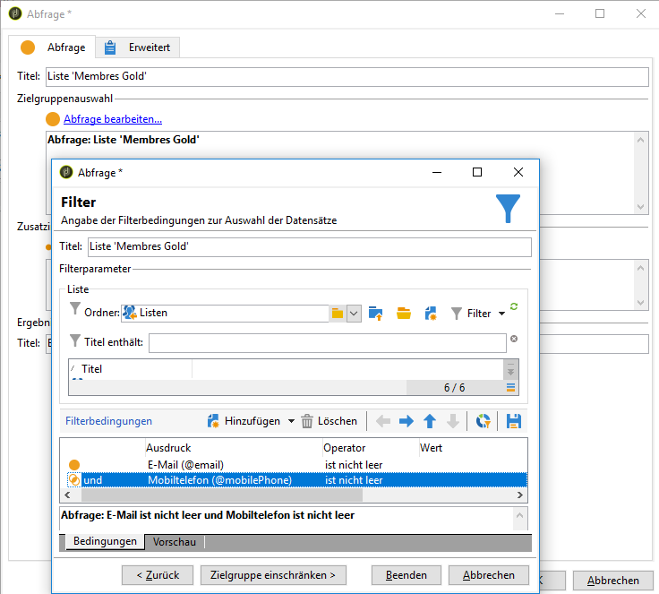

1. Speichern Sie Ihre Änderungen.

## Schritt 2: Erstellen einer E-Mail mit einem Angebot {#step-2--creating-an-email-including-an-offer}

1. Erstellen Sie eine **[!UICONTROL Email delivery]** Aktivität und doppelklicken Sie darauf, um sie zu bearbeiten. For more on creating an email, refer to [this section](../../delivery/using/about-email-channel.md).
1. Gestalten Sie die Nachricht und fügen Sie einen Link einschließlich eines Angebots in den Inhalt ein.

   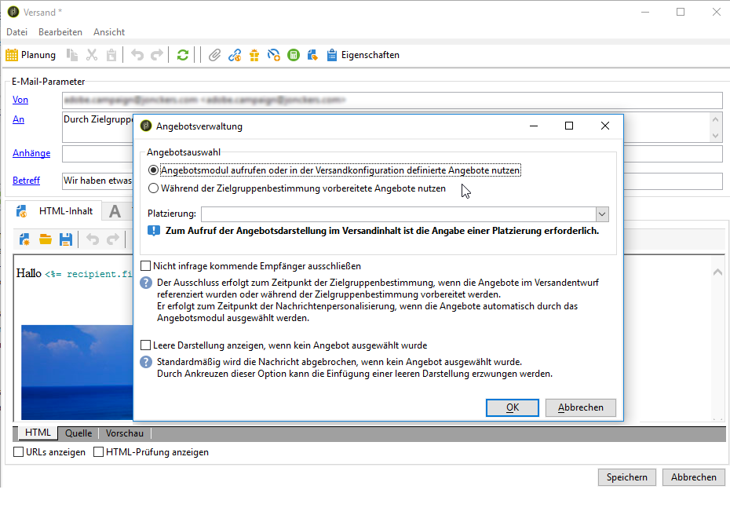

   Weiterführende Informationen zum Einfügen eines Angebots in den Nachrichtentext finden Sie in [diesem Abschnitt](../../interaction/using/integrating-an-offer-via-the-wizard.md#delivering-with-a-call-to-the-offer-engine).

1. Speichern Sie Ihre Änderungen.
1. Klicken Sie mit der rechten Maustaste auf die **[!UICONTROL Email delivery]** Aktivität, um sie zu öffnen.
1. Wählen Sie die **[!UICONTROL Generate an outbound transition]** Option zum Wiederherstellen der Population und der Verfolgungsprotokolle.

   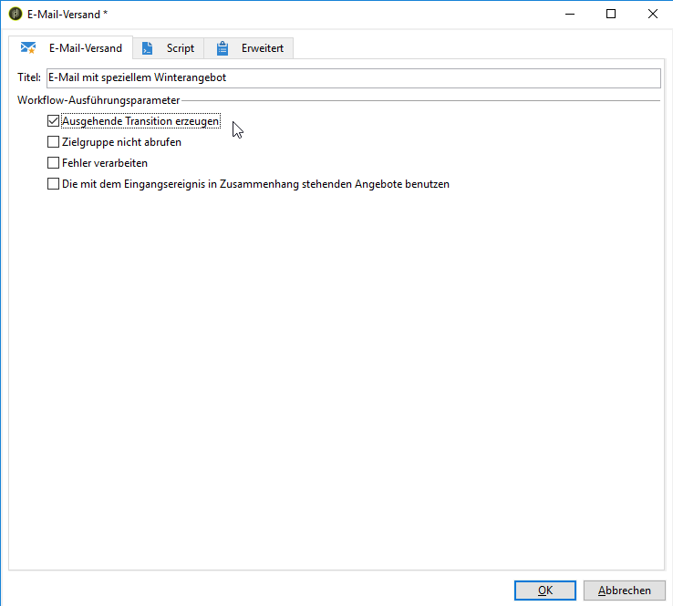

   Mit diesen Informationen können Sie abhängig vom Verhalten des Empfängers beim Erhalt der ersten E-Mail eine weitere Nachricht senden.

1. Add a **[!UICONTROL Wait]** activity to let a few days for the recipients to open the email.

   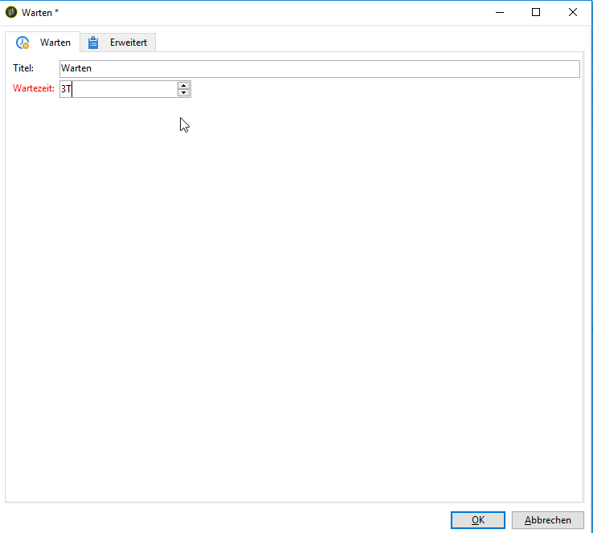

## Schritt 3: Segmentieren der resultierenden Audience {#step-3--segmenting-the-resulting-audience}

Sobald Ihre Zielgruppe feststeht und Ihr erster Versand bereit ist, müssen Sie die Zielgruppe mithilfe von Filterbedingungen in unterschiedliche Populationen unterteilen.

1. Fügen Sie zum Workflow die Aktivität **Aufspaltung** hinzu und öffnen Sie sie. Weiterführende Informationen zur Verwendung dieser Aktivität finden Sie in [diesem Abschnitt](../../workflow/using/split.md).
1. Erstellen Sie aus der zuvor in der Abfrage berechneten Population drei Segmente.

   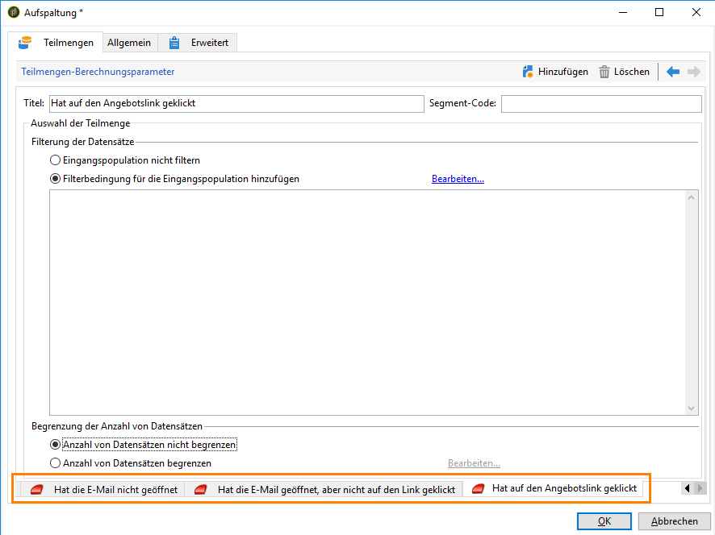

1. Wählen Sie für die erste Untergruppe die **[!UICONTROL Add a filtering condition on the inbound population]** Option aus und klicken Sie auf **[!UICONTROL Edit]**.

   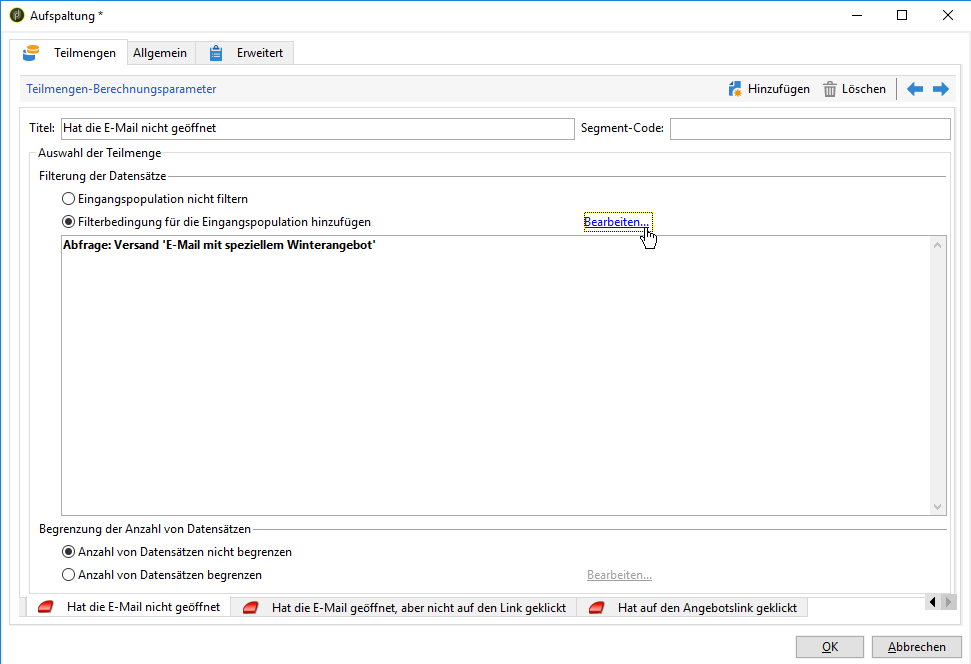

1. Wählen Sie **[!UICONTROL Recipients of a delivery]** als Beschränkungsfilter aus und klicken Sie auf **[!UICONTROL Next]**.

   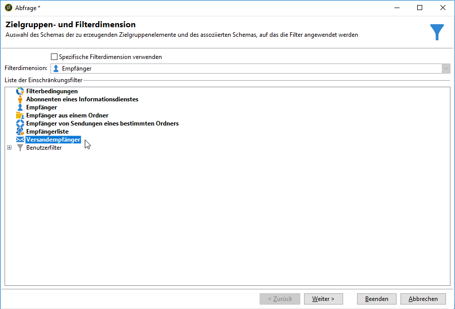

1. Wählen Sie in den Filtereinstellungen **[!UICONTROL Recipients who have not opened or clicked (email)]** aus der **[!UICONTROL Behavior]** Dropdownliste die E-Mail mit dem Angebot aus, das Sie aus der Bereitstellungsliste senden möchten. Klicks **[!UICONTROL Finish]**.

   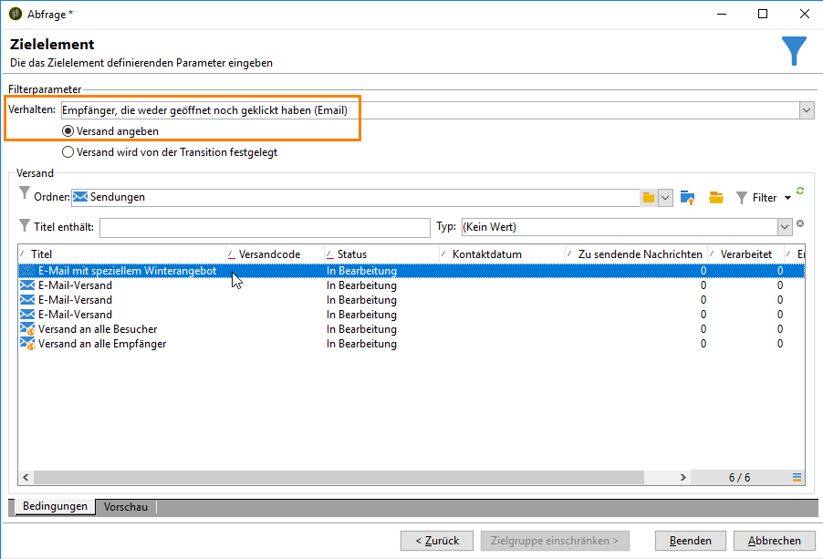

1. Fahren Sie ähnlich für die zweite Untergruppe fort und wählen Sie **[!UICONTROL Recipients who have not clicked (email)]** aus der **[!UICONTROL Behavior]** Dropdownliste aus.

   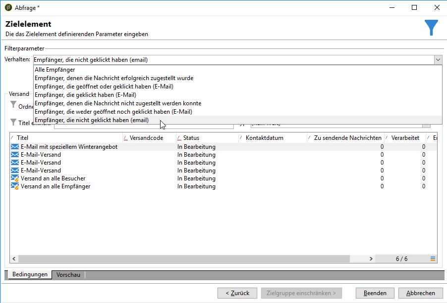

1. Wählen Sie für die dritte Untergruppe nach Auswahl **[!UICONTROL Add a filtering condition on the inbound population]** und Klicken **[!UICONTROL Edit]** die **[!UICONTROL Use a specific filtering dimension]** Option aus.
1. Wählen Sie **[!UICONTROL Recipient tracking log]** aus der **[!UICONTROL Filtering dimension]** Dropdownliste aus, markieren Sie **[!UICONTROL Filtering conditions]** aus der **[!UICONTROL List of restriction filters]** und klicken Sie auf **[!UICONTROL Next]**.

   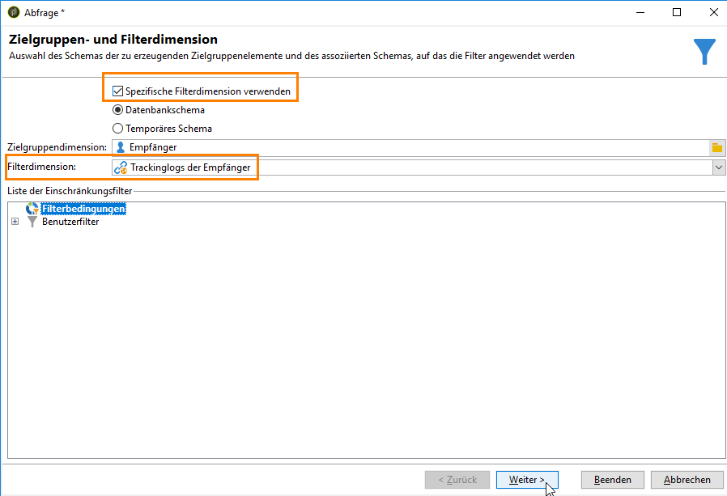

1. Wählen Sie die Filterbedingungen folgendermaßen aus:

   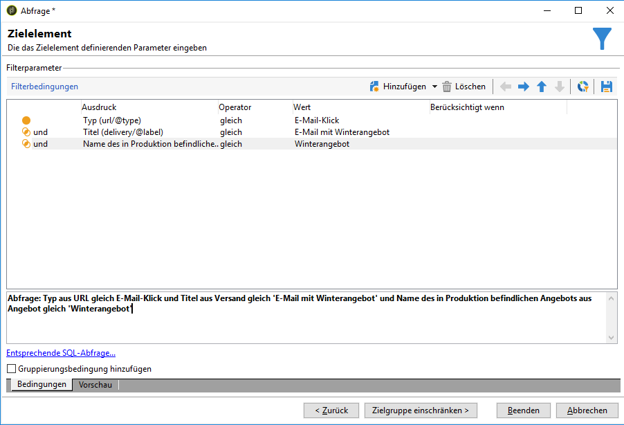

1. Click **[!UICONTROL Finish]** to save your changes.

## Schritt 4: Fertigstellen des Workflows {#step-4--finalizing-the-workflow}

1. Add the relevant activities to your workflow after the three subsets resulting from the **[!UICONTROL Split]** activity:

   * Add an **[!UICONTROL Email delivery]** activity to send a reminder email to the first subset.
   * Add a **[!UICONTROL Mobile delivery]** activity to send an SMS message to the second subset.
   * Add a **[!UICONTROL List update]** activity to add the corresponding recipients to the database.

1. Doppelklicken Sie auf die Versandaktivitäten in Ihrem Workflow, um sie zu bearbeiten. Weiterführende Informationen zur Erstellung von E-Mails und SMS finden Sie in [E-Mail-Kanal](../../delivery/using/about-email-channel.md) and [SMS-Kanal](../../delivery/using/sms-channel.md).
1. Doppelklicken Sie auf die **[!UICONTROL List update]** Aktivität und wählen Sie die **[!UICONTROL Generate an outbound transition]** Option aus.

   Anschließend können Sie die resultierenden Empfänger aus Adobe Campaign in die Adobe Experience Cloud exportieren. Beispielsweise können Sie die Zielgruppe in Adobe Target verwenden, indem Sie dem Workflow eine **[!UICONTROL Update shared audience]** Aktivität hinzufügen. For more on this, refer to [Exporting an audience](../../integrations/using/importing-and-exporting-audiences.md#exporting-an-audience).

1. Verwenden Sie die Schaltfläche **Starten** in der Symbolleiste, um den Workflow auszuführen.

Die Zielgruppe der **Abfrageaktivität** wird entsprechend dem Verhalten der Empfänger segmentiert, um eine E-Mail- oder eine SMS-Zustellung zu erhalten. Die verbleibende Population wird der Datenbank mithilfe der **[!UICONTROL List update]** Aktivität hinzugefügt.
