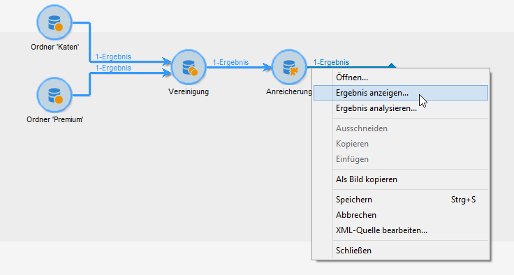
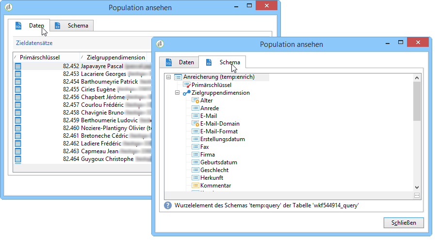
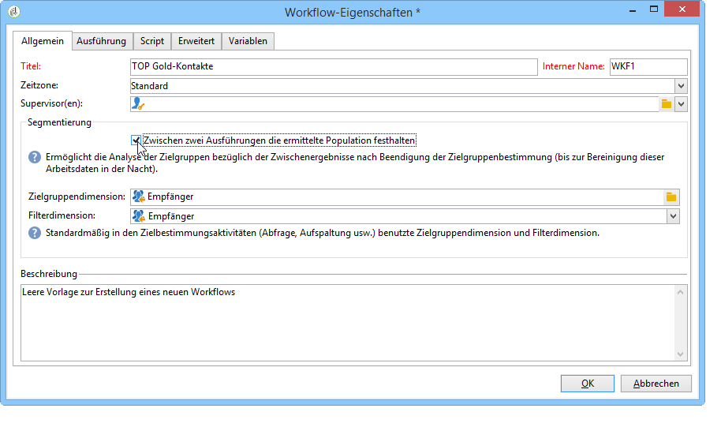
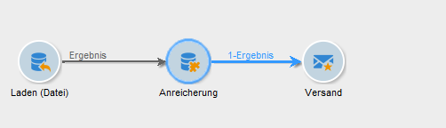
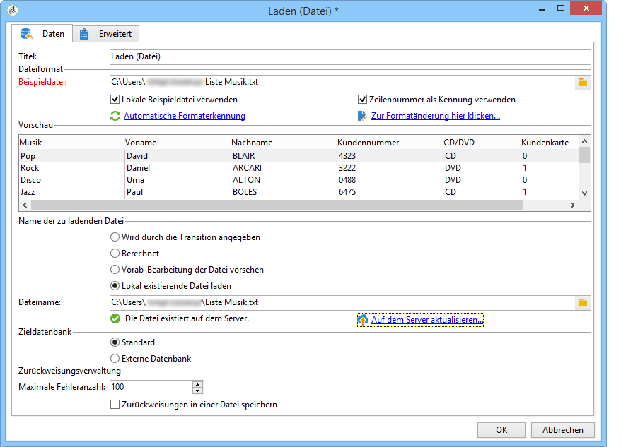
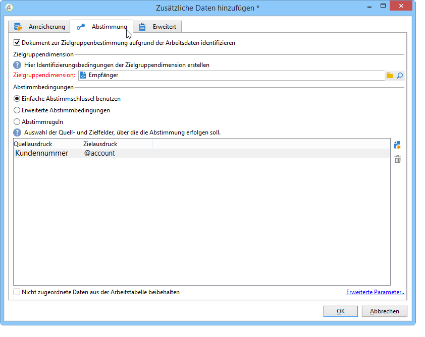
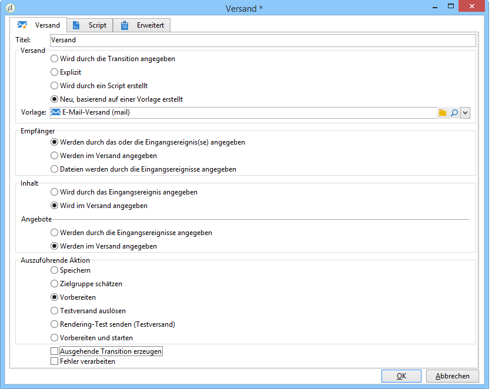
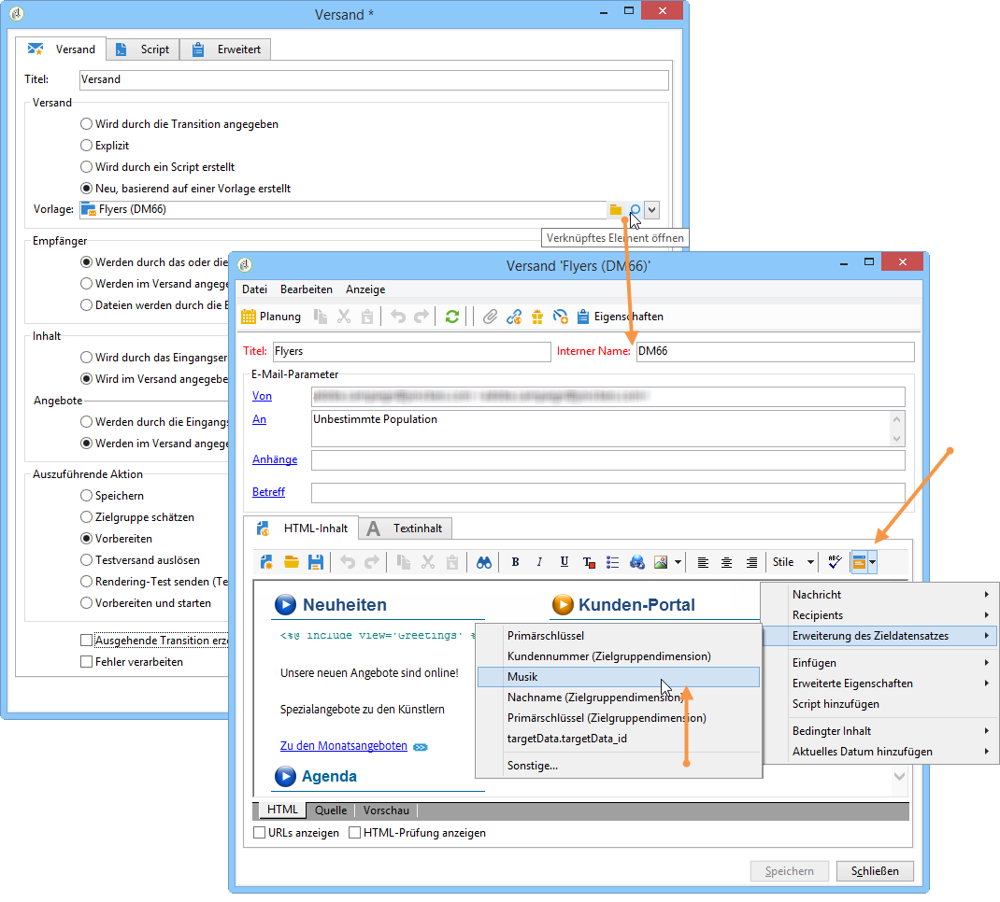
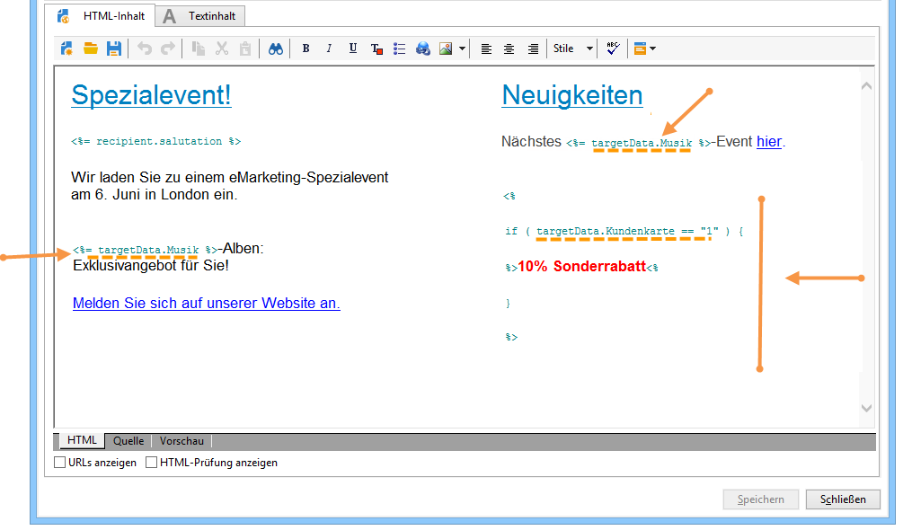
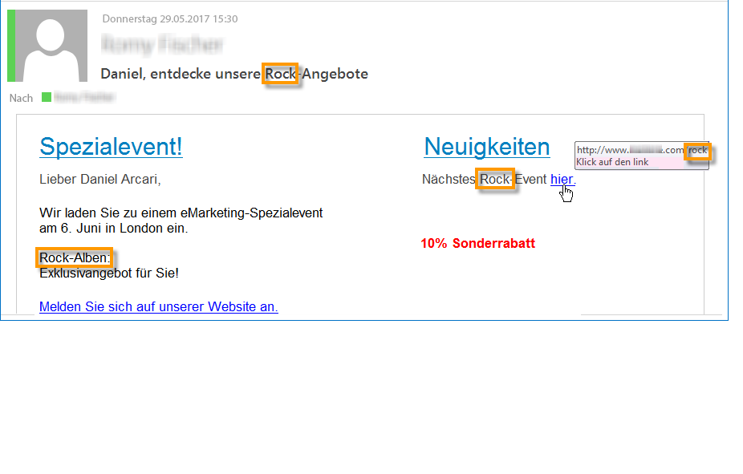

# Lebenszyklus der Arbeitsdaten {#data-life-cycle}

## Arbeitstabellen {#work-table}

In einem Workflow werden die von einer Aktivität zur anderen übertragenen Daten in temporären Arbeitstabellen gespeichert.

Die Daten können durch Rechtsklick auf die entsprechende Transition angezeigt und analysiert werden.



Wählen Sie im Kontextmenü die entsprechende Option aus:

* Ergebnis anzeigen...

   Diese Option ermöglicht die Anzeige der Zielgruppendaten und der Struktur der Arbeitstabelle (Tab **[!UICONTROL Schema]**).

   

   Weitere Informationen finden Sie unter [Arbeitstabellen und Workflow-Schemata](../../workflow/using/monitoring-workflow-execution.md#worktables-and-workflow-schema).

* Ergebnis analysieren...

   Diese Option bietet Zugriff auf den Assistenten zur beschreibenden Analyse, welcher die Erstellung von Statistiken und Berichten über die in der Transition übermittelten Daten ermöglicht.

   Weiterführende Informationen hierzu finden Sie in diesem [Abschnitt](../../reporting/using/using-the-descriptive-analysis-wizard.md).

Die Zielgruppendaten werden im Verlauf der Workflow-Ausführung nach und nach bereinigt. Nur die letzte Arbeitstabelle bleibt zugänglich. Sie haben die Möglichkeit, den Workflow dahingehend zu konfigurieren, dass alle Arbeitstabellen beibehalten werden. Kreuzen Sie hierzu in den Workflow-Eigenschaften die Option **[!UICONTROL Zwischen zwei Ausführungen die ermittelte Population festhalten]** an.

Bei großen Datenmengen sollte diese Option jedoch nicht aktiviert werden.



## Zielgruppendaten {#target-data}

Die in den Arbeitstabellen gespeicherten Daten können insbesondere in Personalisierungsfeldern verwendet werden.

Auf diese Weise können Sie in einem Versand mithilfe einer Liste gesammelte oder aus Umfrageantworten stammende Informationen verwenden. Dies geschieht über folgende Syntax:

```
%= targetData.FIELD %
```

Personalisierungsinformationen vom Typ **[!UICONTROL Erweiterung des Zieldatensatzes]** (targetData) stehen nur in Zielgruppen-Workflows zur Verfügung. Dies bedeutet, dass die Versandzielgruppe im Workflow zu bestimmen und in der in den Versand eingehenden Transition zu übermitteln ist.

Wenn Sie Testsendungen durchführen möchten, muss die Testversand-Zielgruppe daher im Modus **[!UICONTROL Adressersetzung]** konzipiert werden, damit die Personalisierungsdaten ausgefüllt werden können. Weiterführende Informationen hierzu finden Sie in diesem [Abschnitt](../../delivery/using/steps-defining-the-target-population.md#using-address-substitution-in-proof).

Im folgenden Anwendungsbeispiel sollen Kundeninformationen in einer Liste gesammelt und dann in einer personalisierten E-mail verwendet werden.

Gehen Sie wie folgt vor:

1. Erstellen Sie einen Workflow, um die Informationen zu sammeln, sie mit der Datenbank abzustimmen und den Versand zu starten.

   

   Im vorliegenden Beispiel enthält die Datei folgende Informationen:

   ```
   Music,First name,Last name,Account,CD/DVD,Card
   Pop,David,BLAIR,4323,CD,0
   Rock,Daniel,ARCARI,3222,DVD,1
   Disco,Uma,ALTON,0488,DVD,0
   Jazz,Paul,BOLES,6475,CD,1
   Jazz,David,BOUKHARI,0841,DVD,1
   [...]
   ```

   Die Aktivität zum Laden der Datei wird folgendermaßen konfiguriert:

   

1. Konfigurieren Sie nun die Aktivität vom Typ **[!UICONTROL Anreicherung]**, um die geladenen Daten mit denen der Datenbank abzustimmen.

   Hier dient die Kundennummer als Abstimmschlüssel:

   

1. Konfigurieren Sie dann die **[!UICONTROL Versandaktivität]**. Sie wird basierend auf einer Vorlage erstellt und die Empfänger werden durch die eingehende Transition bestimmt.

   

   >[!CAUTION]
   >
   >Nur die von der Transition übermittelten Daten können für die Versandpersonalisierung verwendet werden. Personalisierungsfelder vom Typ **targetData** stehen nur für die in die **[!UICONTROL Versandaktivität]** eingehende Population zur Verfügung.

1. Verwenden Sie in der Versandvorlage die im Workflow gesammelten Daten.

   Fügen Sie hierfür Personalisierungsfelder vom Typ **[!UICONTROL Erweiterung des Zieldatensatzes]** ein.

   

   Im vorliegenden Beispiel wird der bevorzugte Musikstil des Kunden und der bevorzugte Datenträger (CD oder DVD) - gemäß den Informationen der geladenen Datei - eingefügt.

   Des Weiteren enthält der Versand ein Angebot für Kunden mit Kundenkarte, d. h. für Kunden, bei denen der Wert &#39;Kundenkarte&#39; gleich 1 ist.

   

   Daten vom Typ **[!UICONTROL Erweiterung des Zieldatensatzes]** (targetData) werden wie andere Personalisierungsfelder auch in Sendungen eingefügt. D. h. sie können u. a. in Nachrichtenbetreffs, Linktiteln oder Links selbst verwendet werden.

   Die in der ersten Aktivität des Workflows erhobenen Empfänger erhalten somit die folgende Nachricht:

   
