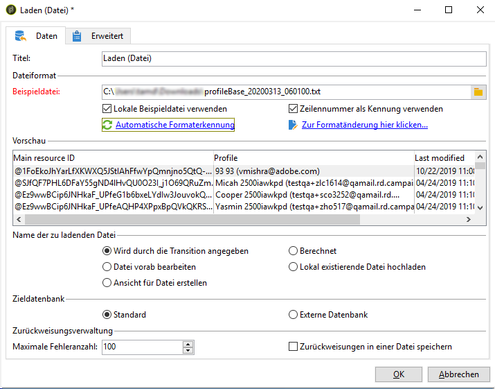
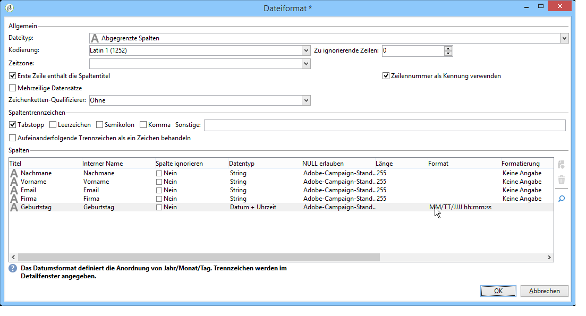
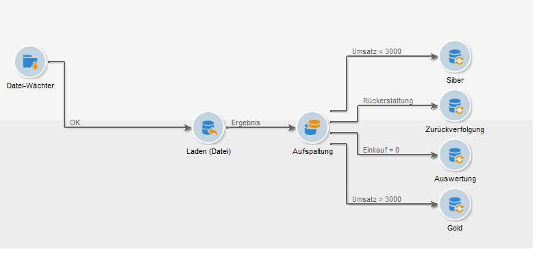
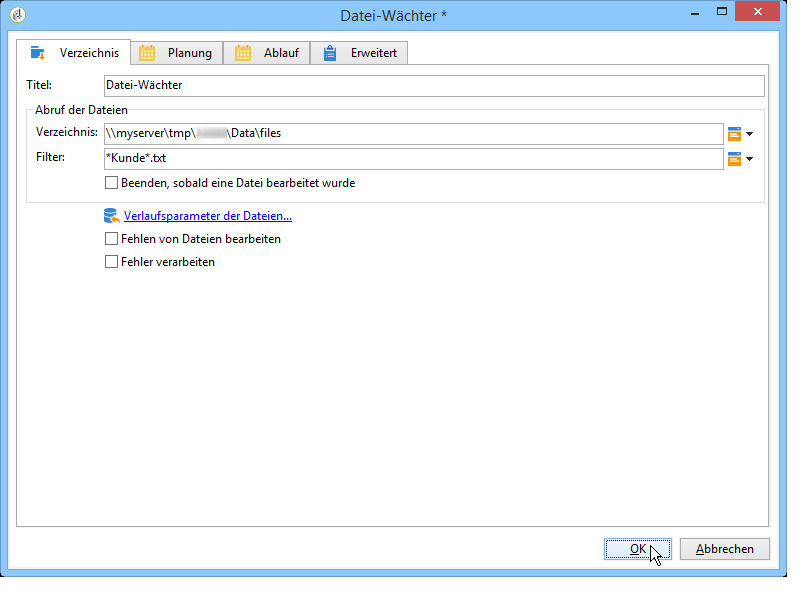
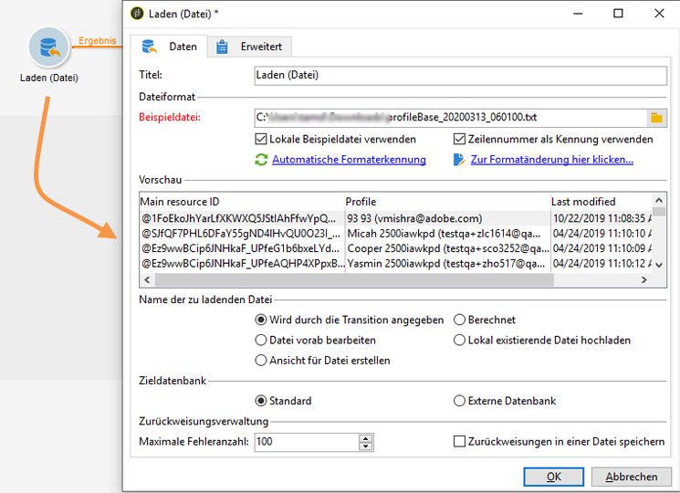
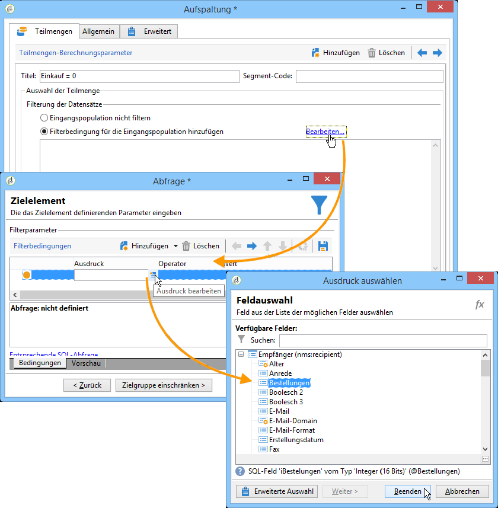
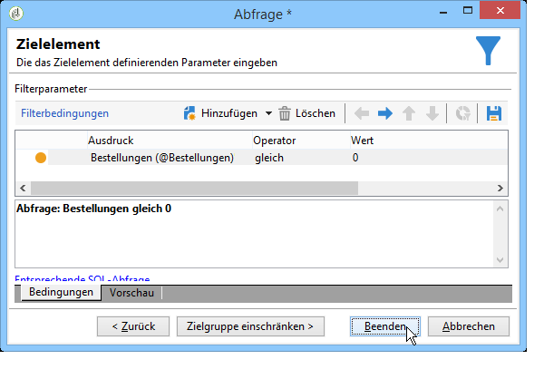
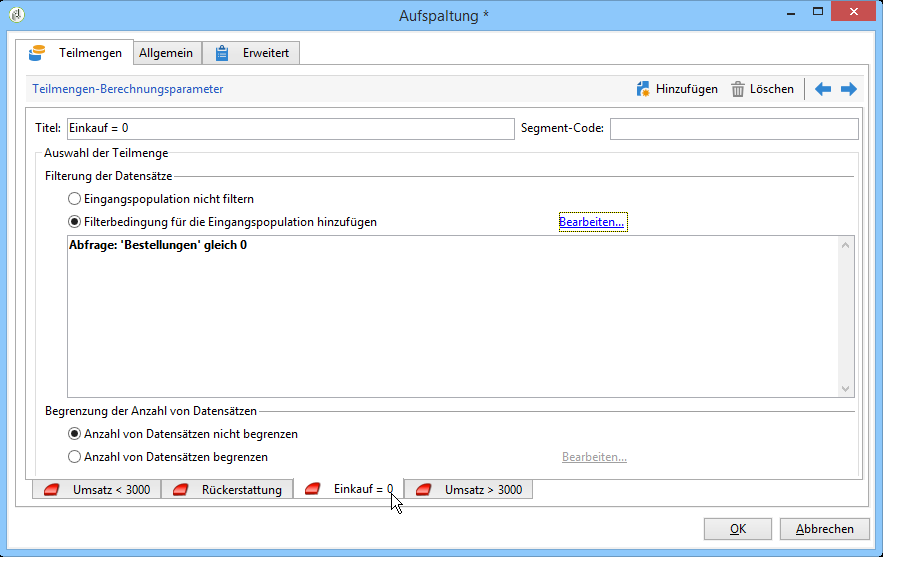

# Laden (Datei){#data-loading-file}

## Verwendung {#use}

Mit der **[!UICONTROL Load (File)]** Aktivität können Sie direkt auf eine Quelle externer Daten zugreifen und diese in Adobe Campaign verwenden. Tatsächlich befinden sich nicht immer alle für Targeting-Operationen erforderlichen Daten in der Adobe Campaign-Datenbank: es kann in externen Dateien verfügbar gemacht werden.

Die zu ladende Datei kann in der Transition angegeben oder bei Ausführung der Aktivität berechnet werden. Es kann sich beispielsweise um die Liste der zehn meistgekauften Artikel eines Kunden handeln, wobei die Kaufhandlungen in einer separaten, externen Datenbank verwaltet werden.

Im oberen Bereich des Fensters zur Konfiguration dieser Aktivität wird das Dateiformat angegeben. Wählen Sie eine Beispieldatei aus, die das gleiche Format aufweist, wie die zu importierende Datei. Die Datei kann lokal oder auf dem Server gespeichert werden.

>[!CAUTION]
>
>Unterstützt werden ausschließlich Dateiformate mit einfach strukturierten Daten wie beispielsweise .txt, .csv etc. Die Verwendung von XML wird nicht empfohlen.

Es besteht die Möglichkeit, eine Vorab-Bearbeitung der Datei vor dem Import zu definieren. Hierbei kann es sich z. B. darum handeln, die Datei nicht auf dem Server, sondern im Zuge der Workflow-Ausführung zu dekomprimieren, um auf dem Server Speicherplatz zu sparen. Wählen Sie die **[!UICONTROL Pre-process the file]** Option aus und wählen Sie eine der drei Optionen: **[!UICONTROL None]**, **[!UICONTROL Decompression]** (zcat) oder **[!UICONTROL Decrypt]** (gpg).

## Datei formatieren {#defining-the-file-format}

Beim Laden einer Datei werden das Spaltenformat automatisch erkannt und Standardparameter für jeden Datentyp angewendet. Diese Standardparameter können angepasst werden, um beispielsweise im Fall von Fehlern oder leeren Werten einen spezifischen Umgang mit Ihren Daten zu definieren.

Wählen Sie dazu im Hauptfenster **[!UICONTROL Click here to change the file format...]** der **[!UICONTROL Data loading (file)]** Aktivität aus. Daraufhin wird das Fenster mit den Formatdetails geöffnet.

Sie haben nun die Möglichkeit, allgemeine Formatierungsoptionen der Datei sowie das Format der einzelnen Spalten anzupassen.

In den allgemeinen Formatierungsoptionen kann beispielsweise die Art der Spaltenerkennung definiert werden (Kodierung der Datei, verwendete Trennzeichen etc.).

Verschiedene Optionen zum Umgang mit den Spaltenwerten stehen zur Auswahl:

* **[!UICONTROL Ignore column]**: verarbeitet diese Spalte beim Laden der Daten nicht.
* **[!UICONTROL Data type]**: gibt den Datentyp an, der für jede Spalte erwartet wird.
* **[!UICONTROL Allow NULLs]**: gibt an, wie leere Werte verwaltet werden.

   * **[!UICONTROL Adobe Campaign default]**: erzeugt nur einen Fehler für die numerischen Felder, andernfalls wird ein NULL-Wert eingefügt.
   * **[!UICONTROL Empty value allowed]**: erlaubt leere Werte. Der Wert NULL wird eingefügt.
   * **[!UICONTROL Always populated]**: erzeugt einen Fehler, wenn ein Wert leer ist.

* **[!UICONTROL Length]**: gibt die maximale Anzahl von Zeichen für den **String** -Datentyp an.
* **[!UICONTROL Format]**: Definition des Formats von Uhrzeit und Datum.
* **[!UICONTROL Data transformation]**: definiert, ob ein Zeichenfolgenprozess auf eine **Zeichenfolge** angewendet werden muss.

   * **[!UICONTROL None]**: die importierte Zeichenfolge wird nicht geändert.
   * **[!UICONTROL First letter in upper case]**: Der erste Buchstabe jedes Wortes der Zeichenfolge beginnt mit einer Großschreibung.
   * **[!UICONTROL Upper case]**: alle Zeichen in der Zeichenfolge in Großbuchstaben.
   * **[!UICONTROL Lower case]**: alle Zeichen in der Zeichenfolge in Kleinbuchstaben.

* **[!UICONTROL White space management]**: gibt an, ob bestimmte Leerzeichen in einer Zeichenfolge ignoriert werden müssen. Der **[!UICONTROL Ignore spaces]** Wert lässt nur zu, dass Leerzeichen am Anfang und am Ende einer Zeichenfolge ignoriert werden.
* **[!UICONTROL Error processings]**: definiert das Verhalten, wenn ein Fehler auftritt.

   * **[!UICONTROL Ignore the value]**: der Wert wird ignoriert. Im Ausführungsprotokoll des Workflows wird ein Hinweis erzeugt.
   * **[!UICONTROL Reject line]**: die gesamte Zeile wird nicht verarbeitet.
   * **[!UICONTROL Use a default value in case of error]**: ersetzt den Wert, der den Fehler verursacht, durch einen im **[!UICONTROL Default value]** Feld definierten Standardwert.
   * **[!UICONTROL Reject the line when there is no remapping value]**: die gesamte Zeile wird nur verarbeitet, wenn eine Zuordnung für den fehlerhaften Wert definiert wurde (siehe die **[!UICONTROL Mapping]** Option unten).
   * **[!UICONTROL Use a default value in case the value is not remapped]**: ersetzt den Wert, der den Fehler verursacht, durch einen im **[!UICONTROL Default value]** Feld definierten Standardwert, es sei denn, für den fehlerhaften Wert wurde eine Zuordnung definiert (siehe die **[!UICONTROL Mapping]** Option unten).

* **[!UICONTROL Default value]**: gibt den Standardwert entsprechend der gewählten Fehlerverarbeitung an.
* **[!UICONTROL Mapping]**: Dieses Feld ist nur in der Spaltendetailkonfiguration verfügbar (Zugriff über einen Doppelklick oder über die Optionen rechts neben der Spaltenliste). Dadurch werden bestimmte Werte beim Import transformiert. Sie können beispielsweise &quot;drei&quot; in &quot;3&quot; umwandeln.

## Anwendungsbeispiel: Daten abrufen und in die Datenbank laden {#example--collecting-data-and-loading-it-in-the-database}

Im vorliegenden Beispiel wird täglich eine Datei vom Server abgerufen, ihr Inhalt geladen und die Datenbank mit den neuen Daten aktualisiert. Die abgerufene Datei enthält Daten von Kunden eines Geschäfts, die Käufe getätigt haben (unter oder über 3000 Euro), denen ein Kauf zurückerstattet wurde oder die das Geschäft besucht haben, ohne einen Kauf zu tätigen. Je nach abgerufener Information werden die Datenbankprofile unterschiedlichen Vorgängen unterzogen.

1. Die Datei-Wächter-Aktivität dient dazu, in definierten Zeitabständen die in einem bestimmten Verzeichnis gespeicherten Dateien abzurufen.

   Die **[!UICONTROL Directory]** Registerkarte enthält Informationen zu den wiederherzustellenden Dateien. In unserem Beispiel werden alle Dateien im Textformat wiederhergestellt, deren Namen das Wort &quot;Kunden&quot;enthalten und die im Verzeichnis tmp/Adobe/Data/files des Servers gespeichert sind.

   Die Verwendung der **[!UICONTROL File collector]** ist im Abschnitt [Dateierfassung](../../workflow/using/file-collector.md) detailliert beschrieben.

   

   The **[!UICONTROL Schedule]** tab lets you schedule the execution of the collector, i.e. to specify the frequency with which the presence of these files will be checked.

   Hier soll der Datei-Wächter an allen Tagen, an denen die Geschäfte geöffnet haben, um 21 Uhr ausgelöst werden.

   

   To do this, click the **[!UICONTROL Change...]** button located in the lower right-hand section of the editing tool and configure the schedule.

   For more on this, refer to [Scheduler](../../workflow/using/scheduler.md).

1. Konfigurieren Sie anschließend die Datei-Laden-Aktivität, um anzugeben, wie die abgerufenen Dateien zu lesen sind. Wählen Sie hierzu eine Beispieldatei aus, die dieselbe Struktur aufweist, wie die zu ladenden Dateien.

   

   Im vorliegenden Beispiel besteht die Datei aus fünf Spalten:

   * Die erste Spalte enthält einen dem Ereignis entsprechenden Code: Kauf (Transaktionsbetrag kleiner oder größer als 3000 Euro), Kein Kauf oder Rückgabe eines oder mehrerer Artikel.
   * Die anderen Spalten enthalten jeweils die Vornamen, Nachnamen und E-Mail-Adressen der Kunden sowie die Kundennummern.
   Die Formatierung der Daten geschieht auf die gleiche Weise wie bei einem Datenimport in Adobe Campaign. Weiterführende Informationen finden Sie in diesem [Abschnitt](../../platform/using/importing-data.md#step-2---source-file-selection).

1. Positionieren Sie im Anschluss eine Aufspaltungsaktivität und geben Sie je nach Wert in der **Ereignis**-Spalte die zu erstellenden Teilmengen an.

   Die Funktionsweise dieser Aktivität wird im Abschnitt beschrieben.

   

   Erstellen Sie eine Teilmenge pro Wert in der **Ereignis**-Spalte.

   

   The **[!UICONTROL Split]** activity will therefore contain the following information:

   

1. Geben Sie dann die für jede Population durchzuführenden Prozesse an. In unserem Beispiel werden wir **[!UICONTROL Update the data]** in die Datenbank gehen. Platzieren Sie dazu eine **[!UICONTROL Update data]** Aktivität am Ende jedes ausgehenden Übergangs von der aufgeteilten Aktivität.

   Die **[!UICONTROL Update data]** Aktivität wird im Abschnitt [Daten](../../workflow/using/update-data.md) aktualisieren beschrieben.

