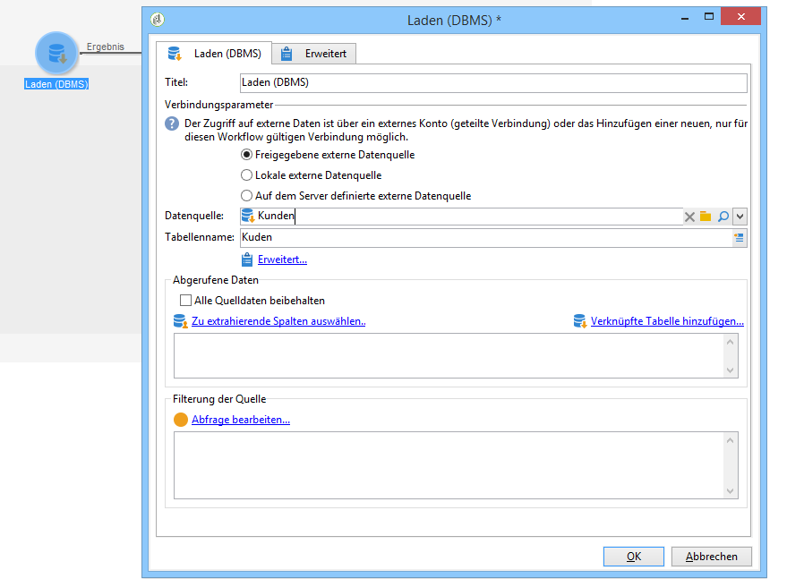
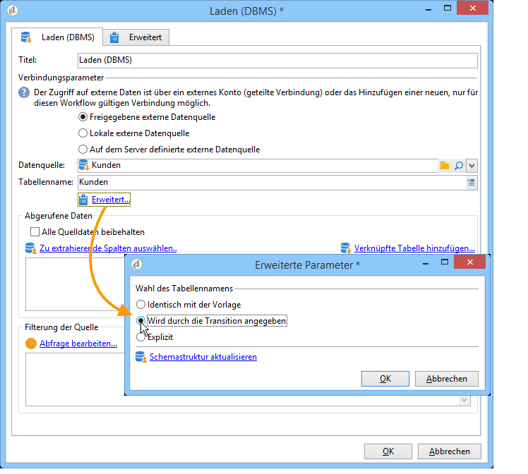
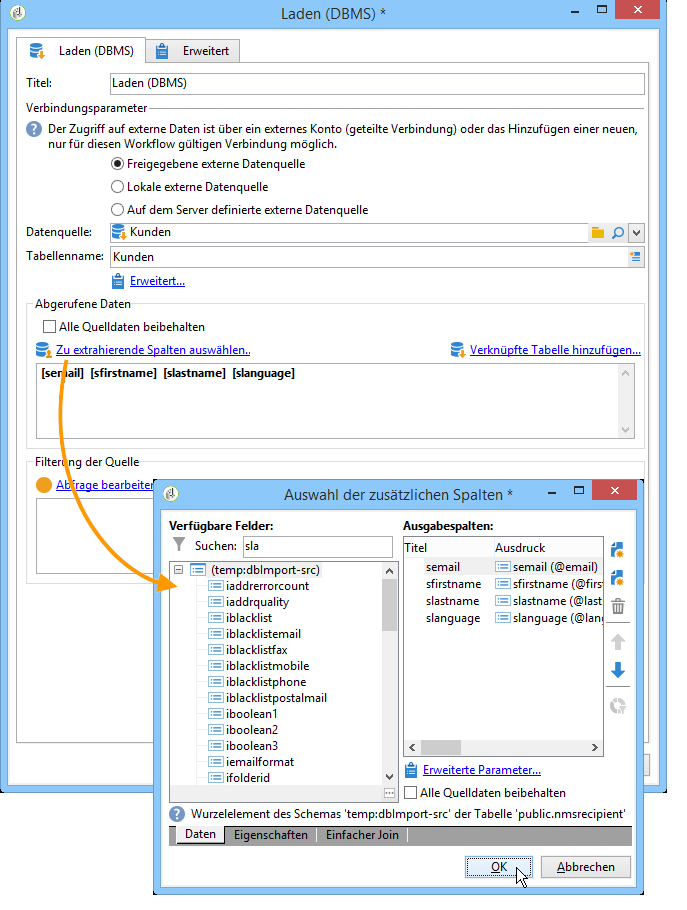

# Laden (DBMS){#data-loading-rdbms}

The **[!UICONTROL Data loading (RDBMS)]** activity lets you access this external database directly and to collect only the data required for targeting.

Zur Verbesserung der Leistung empfehlen wir die Verwendung der Abfrageaktivität (wo die Daten einer externen Datenbank verwendet werden können). For more on this, refer to [Accessing an external database (FDA)](../../workflow/using/accessing-an-external-database--fda-.md).

Gehen Sie wie folgt vor:

1. Wählen Sie aus der Dropdown-Liste die Datenquelle aus und geben Sie den Namen der Tabelle an, die die zu extrahierenden Daten enthält.

   

   The name of the table entered in the corresponding field is used as a template for collecting data in the external database. The name of the table processed by the workflow can be computed or conveyed by the inbound transition of the data loading activity. To select the table to be used, click the **[!UICONTROL Advanced..]**. und wählen Sie die **[!UICONTROL Specified in the transition]** oder- **[!UICONTROL Explicit]** Option aus.

   

1. Klicken Sie auf den **[!UICONTROL Select the columns to extract...]** Link, um die in der Datenbank zu erfassenden Daten auszuwählen.

   

1. Sie können einen Filter für diese Daten definieren. To do this, click the **[!UICONTROL Edit query....]** link.

   Derart abgerufene Daten sind im weiteren Verlauf des Workflows verwendbar.

