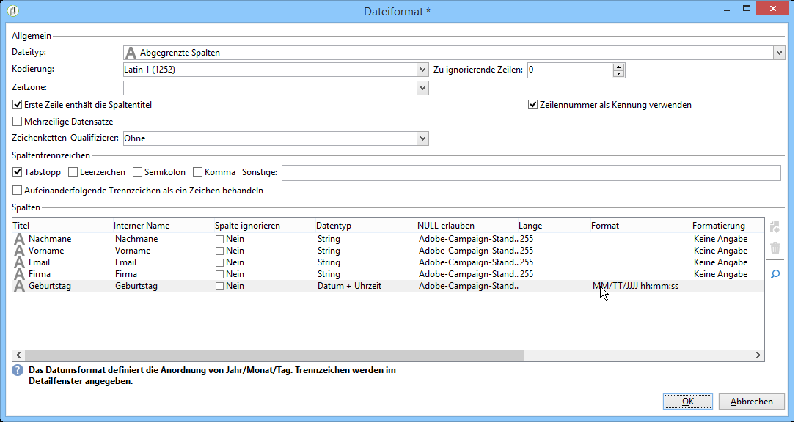
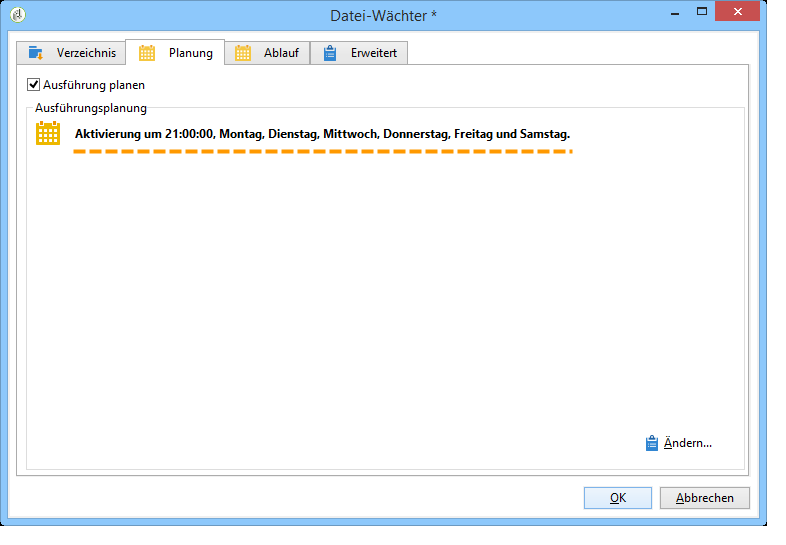
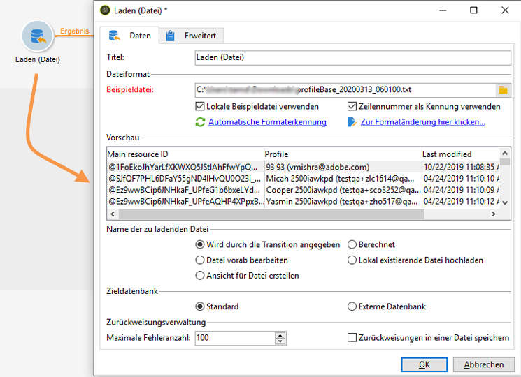
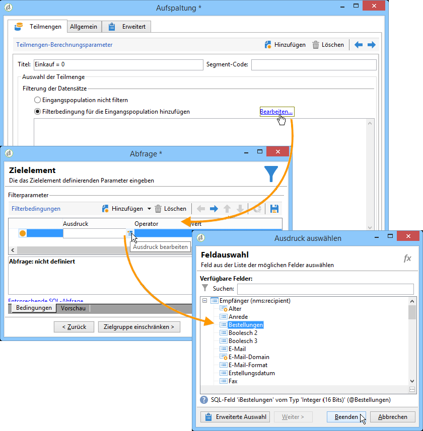

# Laden (Datei){#data-loading-file}

## Verwendung {#use}

Mit der Aktivität **[!UICONTROL Laden (Datei)]** können Sie direkt auf eine Quelle externer Daten zugreifen und diese in Adobe Campaign nutzen. So befinden sich nicht immer alle für Targeting-Vorgänge erforderlichen Daten in der Adobe Campaign-Datenbank; sie können aber in externen Dateien verfügbar gemacht werden.

Die zu ladende Datei kann in der Transition angegeben oder bei Ausführung der Aktivität berechnet werden. Es kann sich beispielsweise um die Liste der zehn meistgekauften Artikel eines Kunden handeln, wobei die Kaufhandlungen in einer separaten, externen Datenbank verwaltet werden.

Im oberen Bereich des Fensters zur Konfiguration dieser Aktivität wird das Dateiformat angegeben. Wählen Sie eine Beispieldatei aus, die das gleiche Format aufweist, wie die zu importierende Datei. Die Datei kann lokal oder auf dem Server gespeichert werden.

>[!CAUTION]
>
>Unterstützt werden ausschließlich Dateiformate mit einfach strukturierten Daten wie beispielsweise .txt, .csv etc. Die Verwendung von XML wird nicht empfohlen.

## Anwenden der Vorab-Bearbeitungsetappe {#pre-processing}

Es besteht die Möglichkeit, eine Vorab-Bearbeitung zu definieren, die während des Dateiimports ausgeführt werden soll. Hierbei kann es sich z. B. darum handeln, dass die Datei nicht auf dem Server, sondern im Zuge der Dateiverarbeitung entpackt wird (was Speicherplatz für die entpackte Datei spart). [Erfahren Sie, wie Sie eine Datei vor der Verarbeitung dekomprimieren oder entschlüsseln](../../platform/using/unzip-decrypt.md).

Wählen Sie dazu die Option **[!UICONTROL Datei vorab bearbeiten]** aus und wählen Sie dann eine der drei Optionen aus: **[!UICONTROL Keine]**, **[!UICONTROL Dekomprimierung]** (zcat) oder **[!UICONTROL Entschlüsseln]** (gpg).

>[!CAUTION]
>
>Wenn Sie mit einer hybriden oder On-Premise-Implementierung arbeiten, funktionieren Vorverarbeitungsbefehle möglicherweise nicht nativ, da ihre Standardkonfiguration den Befehl „zcat“ verwendet, der unter Windows nicht verfügbar ist. In diesem Fall müssen Sie den Knoten **preProcessCommand** in der Server-Konfigurationsdatei (serverConf.xml) anpassen, damit Ihre Anforderungen erfüllt werden können. [Erfahren Sie, wie Sie Vorab-Bearbeitungsbefehle in der Server-Konfigurationsdatei konfigurieren](../../installation/using/the-server-configuration-file.md#preprocesscommand)

## Datei formatieren {#defining-the-file-format}

Beim Laden einer Datei werden das Spaltenformat automatisch erkannt und Standardparameter für jeden Datentyp angewendet. Diese Standardparameter können angepasst werden, um beispielsweise im Fall von Fehlern oder leeren Werten einen spezifischen Umgang mit Ihren Daten zu definieren.

Verwenden Sie in diesem Fall im Hauptfenster der Aktivität **[!UICONTROL Laden (Datei)]** den Link **[!UICONTROL Zur Formatänderung hier klicken...]**, um das Detailfenster zur Formatbearbeitung zu öffnen.

Sie haben nun die Möglichkeit, allgemeine Formatierungsoptionen der Datei sowie das Format der einzelnen Spalten anzupassen.

In den allgemeinen Formatierungsoptionen kann beispielsweise die Art der Spaltenerkennung definiert werden (Kodierung der Datei, verwendete Trennzeichen etc.).

Verschiedene Optionen zum Umgang mit den Spaltenwerten stehen zur Auswahl:

>[!NOTE]
>
>Sie können beliebig viele Spalten hinzufügen. Die maximale Länge der Werte in jeder Spalte wird durch den ausgewählten Datentyp bestimmt.

* **[!UICONTROL Spalte ignorieren]**: Spalte wird beim Laden der Daten nicht berücksichtigt.
* **[!UICONTROL Datentyp]**: Angabe des in der Spalte erwarteten Datentyps.
* **[!UICONTROL NULL erlauben]**: Angabe des Umgangs mit leeren Werten.

   * **[!UICONTROL Adobe-Campaign-Standardeinstellung]**: Erzeugt nur bei numerischen Feldern einen Fehler. Fügt bei anderen Feldern den Wert NULL ein.
   * **[!UICONTROL Leer erlaubt]**: Leere Werte sind zulässig, der Wert NULL wird eingefügt.
   * **[!UICONTROL Leer nicht erlaubt]**: Erzeugung eines Fehlers bei leeren Werten.

* **[!UICONTROL Länge]**: Angabe der maximal zulässigen Anzahl an Zeichen für Daten vom Typ **String**.
* **[!UICONTROL Format]**: Definition des Formats von Uhrzeit und Datum.
* **[!UICONTROL Formatierung]**: Definition der Groß- und Kleinschreibung bei Daten vom Typ **String**.

   * **[!UICONTROL Keine Angabe]**: Der importierte String wird nicht geändert.
   * **[!UICONTROL Ersten Buchstaben großschreiben]**: Der erste Buchstabe aller Worte des Strings wird großgeschrieben.
   * **[!UICONTROL Großbuchstaben]**: Alle Buchstaben des Strings werden großgeschrieben.
   * **[!UICONTROL Kleinbuchstaben]**: Alle Buchstaben des Strings werden kleingeschrieben.

* **[!UICONTROL Umgang mit Leerzeichen]**: Angabe, ob gewisse Leerzeichen einem String ignoriert werden sollen. Der Wert **[!UICONTROL Leerzeichen ignorieren]** erlaubt es nur, Leerzeichen am Anfang und am Ende eines Strings zu ignorieren.
* **[!UICONTROL Umgang mit Fehlern]**: Definition des Verhaltens beim Auftritt von Fehlern.

   * **[!UICONTROL Wert ignorieren]**: Der Wert wird ignoriert. Im Ausführungsprotokoll des Workflows wird ein Hinweis erzeugt.
   * **[!UICONTROL Zeile zurückweisen]**: Die gesamte Zeile wird nicht verarbeitet.
   * **[!UICONTROL Bei Fehler Standardwert verwenden]**: Der den Fehler verursachende Wert wird durch den im Feld **[!UICONTROL Standardwert]** gespeicherten Wert ersetzt.
   * **[!UICONTROL Bei fehlender Neukodifizierung Zeile zurückweisen]**: Die gesamte Zeile wird nicht verarbeitet, es sei denn, für den fehlerhaften Wert wurde ein Mapping definiert (siehe nachfolgend die Option **[!UICONTROL Mapping]**).
   * **[!UICONTROL Bei fehlender Neukodifizierung Standardwert verwenden]**: Der den Fehler verursachende Wert wird durch den im Feld **[!UICONTROL Standardwert]** gespeicherten Wert ersetzt, es sei denn, für den fehlerhaften Wert wurde ein Mapping definiert (siehe nachfolgend die Option **[!UICONTROL Mapping]**).

* **[!UICONTROL Standardwert]**: Angabe des Standardwerts, der im Bezug auf den jeweils definierten Umgang mit Fehlern zum Tragen kommt.
* **[!UICONTROL Mapping]**: Auf dieses Feld kann nur in der Detailkonfiguration einer Spalte zugegriffen werden (entweder per Doppelklick oder mithilfe der entsprechenden Schaltfläche rechts der Spaltenliste). Es ermöglicht im Zuge des Imports die Umwandlung gewisser Werte. So kann beispielsweise &quot;drei&quot; in &quot;3&quot; umgewandelt werden.

## Anwendungsbeispiel: Daten abrufen und in die Datenbank laden {#example--collecting-data-and-loading-it-in-the-database}

Im vorliegenden Beispiel wird täglich eine Datei vom Server abgerufen, ihr Inhalt geladen und die Datenbank mit den neuen Daten aktualisiert. Die abgerufene Datei enthält Daten von Kunden eines Geschäfts, die Käufe getätigt haben (unter oder über 3000 Euro), denen ein Kauf zurückerstattet wurde oder die das Geschäft besucht haben, ohne einen Kauf zu tätigen. Je nach abgerufener Information werden die Datenbankprofile unterschiedlichen Vorgängen unterzogen.

1. Die Datei-Wächter-Aktivität dient dazu, in definierten Zeitabständen die in einem bestimmten Verzeichnis gespeicherten Dateien abzurufen.

   Die Informationen bezüglich des oder der abzurufenden Verzeichnisse werden im **[!UICONTROL Verzeichnis]**-Tab angegeben. Im vorliegenden Beispiel sollen alle Textformat-Dateien abgerufen werden, deren Name das Wort &#39;Kunde&#39; enthält und die im Verzeichnis tmp/Adobe/Data/files des Servers gespeichert sind.

   Weiterführende Informationen zum Thema **[!UICONTROL Datei-Wächter]** finden Sie im Abschnitt [Datei-Wächter](file-collector.md).

   

   Im **[!UICONTROL Planung]**-Tab wird die Ausführungshäufigkeit des Datei-Wächters konfiguriert, d. h. in welchen Abständen das Vorhandensein derartiger Dateien überprüft wird.

   Hier soll der Datei-Wächter an allen Tagen, an denen die Geschäfte geöffnet haben, um 21 Uhr ausgelöst werden.

   

   Klicken Sie auf die Schaltfläche **[!UICONTROL Ändern...]** rechts unten im Editor, um die Planung entsprechend zu konfigurieren.

   Weitere Informationen hierzu finden Sie im Abschnitt [Planung](scheduler.md).

1. Konfigurieren Sie anschließend die Datei-Laden-Aktivität, um anzugeben, wie die abgerufenen Dateien zu lesen sind. Wählen Sie hierzu eine Beispieldatei aus, die dieselbe Struktur aufweist, wie die zu ladenden Dateien.

   

   Im vorliegenden Beispiel besteht die Datei aus fünf Spalten:

   * Die erste Spalte enthält einen dem Ereignis entsprechenden Code: Kauf (Transaktionsbetrag kleiner oder größer als 3000 Euro), Kein Kauf oder Rückgabe eines oder mehrerer Artikel.
   * Die anderen Spalten enthalten jeweils die Vornamen, Nachnamen und E-Mail-Adressen der Kunden sowie die Kundennummern.

   Die Format-Konfiguration der zu ladenden Datei geschieht auf die gleiche Weise wie bei einem Datenimport in Adobe Campaign. Weitere Informationen hierzu finden Sie in [diesem Abschnitt](../../platform/using/executing-import-jobs.md#step-2---source-file-selection).

1. Positionieren Sie im Anschluss eine Aufspaltungsaktivität und geben Sie je nach Wert in der **Ereignis**-Spalte die zu erstellenden Teilmengen an.

   Die Funktionsweise dieser Aktivität wird im Abschnitt beschrieben.

   

   Erstellen Sie eine Teilmenge pro Wert in der **Ereignis**-Spalte.

   

   Die **[!UICONTROL Aufspaltung]** stellt sich somit wie folgt dar:

   

1. Definieren Sie dann die auszuführenden Prozesse für jeden Populationstyp. In unserem Beispiel werden wir in der Datenbank die **[!UICONTROL Daten aktualisieren]**. Platzieren Sie dazu die Aktivität **[!UICONTROL Daten-Update]** am Ende jeder ausgehenden Transition der Aktivität „Aufspaltung“.

   Die Aktivität **[!UICONTROL Daten-Update]** wird im Abschnitt [Daten-Update](update-data.md) genauer beschrieben.
