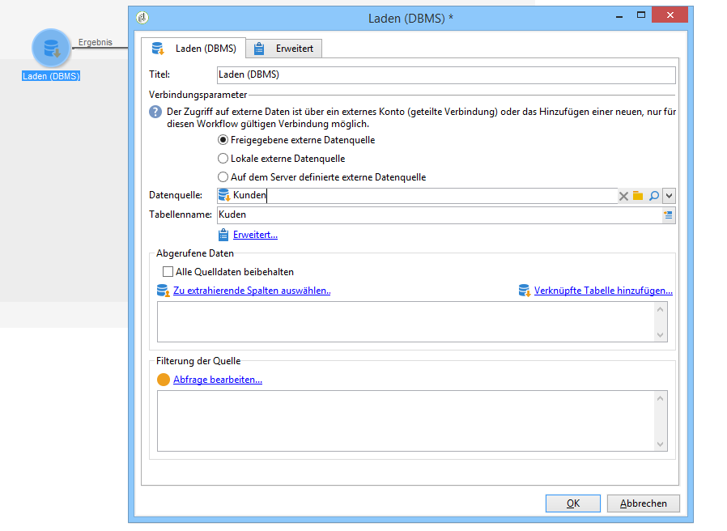
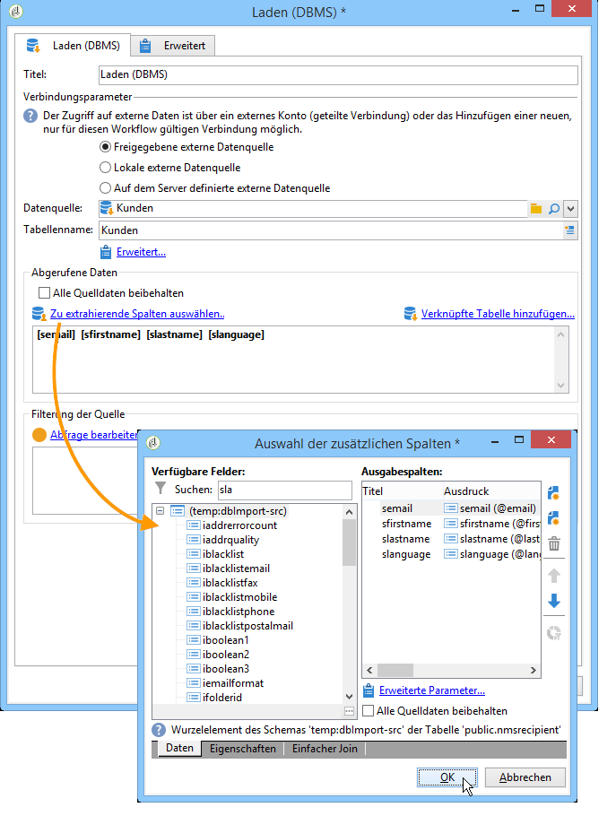

# Laden (DBMS){#data-loading-rdbms}

Die Aktivität **[!UICONTROL Laden (DBMS)]** dient dem Abruf von für die Zielgruppenbestimmung erforderlichen Daten durch Zugriff auf externe Datenbanken.

Um eine korrekte Performance sicherzustellen, ist die Verwendung einer Abfrageaktivität vorzuziehen, die ebenfalls den Abruf externer Daten erlaubt. Weitere Informationen hierzu finden Sie unter [Zugriff auf externe Datenbanken (FDA)](accessing-an-external-database-fda.md).

Gehen Sie wie folgt vor:

1. Wählen Sie aus der Dropdown-Liste die Datenquelle aus und geben Sie den Namen der Tabelle an, die die zu extrahierenden Daten enthält.

   

   Der Name der Tabelle, die in das entsprechende Feld eingegeben wurde, dient als Vorlage für die Datenerfassung in der externen Datenbank. Der Name der vom Workflow verarbeiteten Tabelle kann durch die eingehende Transition der Aktivität zum Laden der Daten berechnet oder übermittelt werden. Klicken Sie auf die Schaltfläche **[!UICONTROL Erweitert..]**. und wählen Sie die Option **[!UICONTROL Wird durch die Transition angegeben]** oder **[!UICONTROL Explizit]**.

   

1. Klicken Sie auf den Link **[!UICONTROL Zu extrahierende Spalten auswählen...]**, um die abzurufenden Daten auszuwählen.

   

1. Sie können einen Filter für diese Daten definieren. Klicken Sie dazu auf die Schaltfläche **[!UICONTROL Abfrage bearbeiten...]** -Link.

   Derart abgerufene Daten sind im weiteren Verlauf des Workflows verwendbar.
