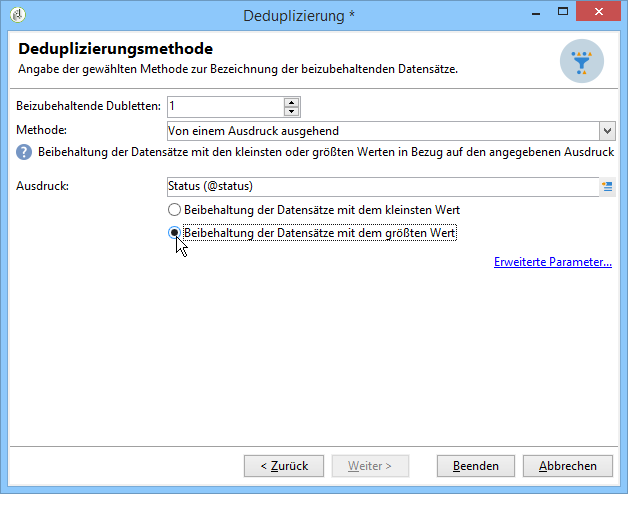

# Deduplizierung{#deduplication}

Die Deduplizierung dient der Identifizierung von Dubletten in der oder den eingehenden Aktivitäten. Zur Identifizierung können beispielsweise die E-Mail-Adresse, eine Telefonnummer oder andere Felder herangezogen werden.

## Best Practices {#best-practices}

Bei der Deduplizierung werden die eingehenden Datenströme getrennt verarbeitet. Wenn also ein Empfänger &#39;A&#39; sowohl im Ergebnis der Abfrage 1 als auch im Ergebnis der Abfrage 2 enthalten ist, wird er nicht dedupliziert.

In diesem Fall ist wie folgt vorzugehen:

* Schließen Sie an die Abfragen zunächst eine **Vereinigung** an, um alle eingehenden Datenströme zusammenzufassen.
* Erstellen Sie dann eine **Deduplizierung** im Anschluss an die **Vereinigung**.

## Konfiguration {#configuration}

Die Aktivität ist zu benennen, Deduplizierungsmethode und -bedingungen sind anzugeben und gegebenenfalls Optionen in Bezug auf das Ergebnis zu wählen.

Klicken Sie auf den Link **[!UICONTROL Konfiguration bearbeiten...]**, um die Deduplizierungsmethode zu definieren.

1. Auswahl der Zielgruppe

   Wählen Sie die Zielgruppendimension aus (standardmäßig bezieht sich die Deduplizierung auf die Empfänger) und kreuzen Sie das für die Identifizierung von Dubletten zu verwendende Feld an: E-Mail-Adresse, Telefon (Mobil oder Festnetz), Fax oder Postanschrift.

   

   >[!NOTE]
   >
   >Wenn Sie externe Daten als Eingabe verwenden möchten (z. B. Daten aus einer externen Datei), müssen Sie die Option **[!UICONTROL Temporäres Schema]** markieren.
   >
   >Die Option **[!UICONTROL Sonstige]** ermöglicht im nächsten Schritt die Auswahl anderer Felder:

   

1. Deduplizierungsmethode

   Wählen Sie aus der Dropdown-Liste die gewünschte Methode aus und geben Sie die Anzahl an beizubehaltenden Dubletten an.

   

   Folgende Methoden stehen zur Verfügung:

   * **[!UICONTROL Automatische Auswahl]**: wählt nach dem Zufallsprinzip unter den Dubletten den beizubehaltenden Datensatz aus.
   * **[!UICONTROL Gemäß einer Werteliste]**: ermöglicht die Bestimmung einer Reihenfolge nach Priorität von Werten für ein oder mehrere Felder. Wählen Sie zur Bestimmung dieser Werte ein Feld aus oder erstellen Sie einen Ausdruck, fügen Sie dann den oder die Werte der entsprechenden Tabelle hinzu. Verwenden Sie die Schaltfläche **[!UICONTROL Hinzufügen]** oberhalb der Werteliste, um ein neues Feld zu definieren.

      

   * **[!UICONTROL Wert nicht leer]**: hiermit lassen sich vornehmlich jene Datensätze beibehalten, für die der Wert des ausgewählten Ausdrucks nicht leer ist.

      

   * **[!UICONTROL Von einem Ausdruck ausgehend]**: Beibehalten werden die Datensätze, für die der ausgewählte Ausdruck den kleinsten oder größen Wert aufweist.

      
   Klicken Sie auf **[!UICONTROL Beenden]**, um die Auswahl der Deduplizierungsmethode zu bestätigen.

   Die konfigurierten Deduplizierungsparameter werden zusammenfassend angezeigt.

   Im unteren Bereich des Fensters können Sie den Titel der ausgehenden Transition anpassen und einen Segment-Code angeben, der dem Ergebnis zugeordnet wird. Dieser Code kann im weiteren Verlauf als Kriterium bei der Zielgruppenbestimmung herangezogen werden.

   

   Kreuzen Sie die Option **[!UICONTROL Komplement erzeugen]** an, wenn Sie auch die restliche Population im weiteren Verlauf des Workflows verwenden möchten. Das Komplement enthält in diesem Fall alle Dubletten und die Aktivität weist somit, wie unten abgebildet, eine zusätzliche Transition auf:

   

## Anwendungsbeispiel: Dubletten identifizieren, bevor ein Versand gestartet wird {#example--identify-the-duplicates-before-a-delivery}

Im folgenden Beispiel soll die Vereinigung der Ergebnisse dreier Abfragen dedupliziert werden.

Ziel des Workflows ist die Bestimmung einer Versandzielgruppe ohne Dubletten, damit dieselben Empfänger den Versand nicht mehrmals erhalten.

Die identifizierten Dubletten werden für eine eventuelle spätere Verwendung in einer spezifischen Liste gespeichert.

1. Positionnieren Sie die erforderlichen Aktivitäten wie oben abgebildet im Workflow-Diagramm.

   Die Vereinigungsaktivität dient hier der Zusammenführung der verschiedenen Abfrageergebnisse in einer ausgehenden Transition. Auf diese Weise erfolgt die Deduplizierung nicht separat für jede Abfrage, sondern gebündelt für alle Ergebnisse. Weitere Informationen zu diesem Thema finden Sie unter [Best Practices](#best-practices).

1. Öffnen Sie die Deduplizierungsaktivität und klicken Sie auf den Link **[!UICONTROL Konfiguration bearbeiten...]**, um die Deduplizierungsmethode zu bestimmen.
1. Wählen Sie im sich öffnenden Fenster die Option **[!UICONTROL Datenbankschema]** aus.
1. Wählen Sie für die Zielgruppen- und die Filterdimension jeweils **Empfänger** aus.
1. Kreuzen Sie **[!UICONTROL E-Mail]** als Identifizierungskriterium der Dubletten an, damit jeder Empfänger den Versand nur einmal erhält. Klicken Sie auf **[!UICONTROL Weiter]**.

   Wenn die Identifizierung der Dubletten auf einem anderen als den angebotenen Feldern basieren soll, kreuzen Sie **[!UICONTROL Sonstige]** an. Im nächsten Schritt können Sie dann das Feld aus den in der zugrundeliegenden Tabelle enthaltenen auswählen.

1. Geben Sie an, dass nur ein Datensatz beibehalten werden soll, wenn dieselbe E-Mail-Adresse für mehrere Empfänger identifiziert wurde.
1. Wählen Sie als Deduplizierungsmethode **[!UICONTROL Automatische Auswahl]**, damit der beizubehaltende Datensatz zufällig bestimmt wird. Klicken Sie abschließend auf **[!UICONTROL Beenden]**.

Bei Ausführung des Workflows werden die als Dubletten identifizierten Empfänger von der Ergebnismenge (und somit vom Versand) ausgeschlossen und in der Liste der Dubletten gespeichert. Diese Liste kann erneut verwendet werden, um die Identifizierung der Dubletten nicht wiederholt vornehmen zu müssen.

## Eingabeparameter {#input-parameters}

* tableName
* schema

Jedes eingehende Ereignis muss eine durch diese Parameter definierte Zielgruppe angeben.

## Ausgabeparameter {#output-parameters}

* tableName
* schema
* recCount

Anhand der drei Werte lässt sich die durch die Deduplizierung ermittelte Zielgruppe identifizieren. **[!UICONTROL tableName]** ist der Name der Tabelle, welche die Kennungen der Zielgruppenempfänger speichert, **[!UICONTROL schema]** ist das Schema der Population, (i. d. R. nms:recipient) und **[!UICONTROL recCount]** ist die Anzahl an Elementen in der Tabelle.

Die Transition des Komplements weist die gleichen Parameter auf.
