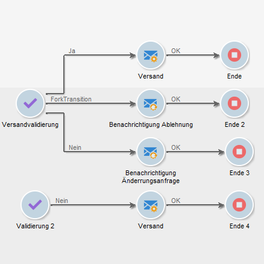
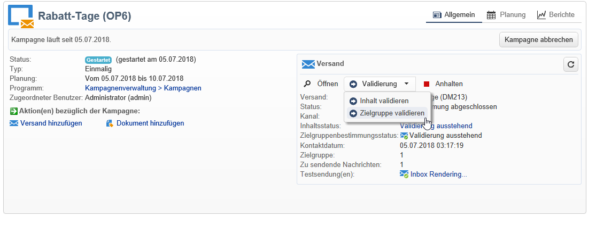
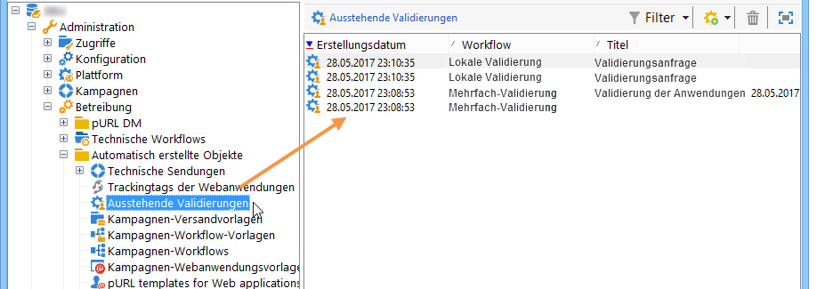
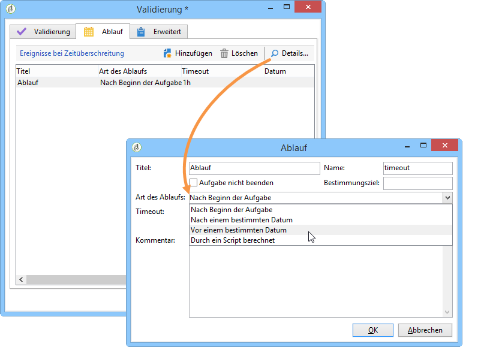

# Validierungen definieren {#defining-approvals}

Validierungen bieten Benutzern die Gelegenheit, an bestimmten Etappen des Workflows Entscheidungen zu treffen oder einen Vorgang zur Ausführung freizugeben.

Bei Verwendung von Validierungen erhält eine Gruppe von verantwortlichen Benutzern eine Benachrichtigung und die Ausführung der an die Validierung anschließenden Aktivität wird bis zum Erhalt der Antwort ausgesetzt. Der Workflow ist jedoch nicht blockiert und kann in der Zwischenzeit andere, nicht von der Validierung abhängige Vorgänge ausführen. So ist es beispielsweise möglich, dass parallel verschiedene Validierungen ausstehen.

Eine Validierung kann vom Benutzer die Auswahl einer Option aus mehreren Vorschlägen verlangen. Es ist ebenfalls möglich, dem Benutzer nur eine Möglichkeit anzubieten, um ihm z. B. eine Aufgabe zuzuweisen (Zielgruppenbestimmung, Inhaltserstellung etc.). In diesem Fall antwortet der Benutzer nach Erledigung der Aufgabe und der Workflow fährt mit der Ausführung der anschließenden Aktivitäten fort. Die folgende Abbildung verdeutlicht die beiden Validierungstypen:



In Kampagnen ist der Validierungsablauf für alle Aktivitäten identisch.



In diesem [Abschnitt](../../campaign/using/marketing-campaign-approval.md#checking-and-approving-deliveries) finden Sie weitere Beispiele zu Validierungen.

Zur Validierung können Benutzer entweder den Webzugriff mithilfe des in der Benachrichtigung enthaltenen Links nutzen oder aber die Clientkonsole.

>[!NOTE]
>
>Nach Speicherung der Antwort kann diese nicht mehr geändert werden.

## Benachrichtigungsversand {#sending-emails}

Benutzer werden durch den Versand einer E-Mail-Benachrichtigung zur Validierung der ihnen zugewiesenen Vorgänge aufgefordert. Die E-Mail enthält einen Link, der den Webzugriff auf die Plattform ermöglicht. Die E-Mail-Adresse des Benutzers muss in seinem Profil gespeichert werden. Bei fehlender Adresse hat der Benutzer trotz allem die Möglichkeit, direkt über die Clientkonsole zu antworten.

Die Benutzerverwaltung wird in diesem [Abschnitt](../../platform/using/access-management.md) beschrieben.

E-Mail-Benachrichtigen werden über eine fortlaufende Versandaktion gesteuert. Die Standardvorlage heißt **[!UICONTROL notifyAssignee]** und ist im Knoten **[!UICONTROL Administration > Kampagnenverwaltung > Vorlagen technischer Sendungen]** zugänglich. Es wird empfohlen, die Vorlage nicht zu ändern, sondern sie zu duplizieren und für jede Aktivität eine gesonderte Benachrichtigungsvorlage zu erstellen.

Auf der genannten Vorlage basierende Sendungen werden im Knoten **[!UICONTROL Administration > Betreibung > Automatisch erstellte Objekte > Technische Sendungen > Workflow-Benachrichtigungen]** gespeichert.

## Validierung in der Clientkonsole {#approval-via-the-console}

In Kampagnen sind die ausstehenden Validierungen im Dashboard ersichtlich.

Bei technischen Workflows können Benutzer auf zu validierenden Aufgaben im Knoten **[!UICONTROL Administration > Betreibung > Automatisch erstellte Objekte > Ausstehende Validierungen]** zugreifen.



## Gruppen {#groups}

Validierungen können einem einzelnen Benutzer, einer Benutzergruppe oder verschiedenen, durch eine Filterbedingung ermittelten Benutzern zugewiesen werden.

1. Bei einfachen Validierungen wird die Aufgabe als abgeschlossen angesehen, sobald ein Benutzer geantwortet hat. Sollte ein weiterer Benutzer antworten wollen, erhält er eine Benachrichtigung, dass die Aufgabe bereits abgeschlossen ist.
1. Für mehrfache Validierungen siehe Abschnitt [Mehrfach-Validierungen](#multiple-approval).

Validierungsverantwortliche Benutzergruppen sollten wie Rollen oder Funktionen konzipiert werden und nicht aus mit Namen bezeichneten Personen bestehen. So ist beispielsweise eine Gruppe &quot;Verantwortliche für Kampagnen-Budgets&quot; weitaus pertinenter als &quot;Team Hans Meyer&quot;. Des Weiteren wird empfohlen, dass eine Gruppe jeweils mindestens zwei Personen enthält, um im Falle einer Abwesenheit nicht den ganzen Ablauf zu blockieren.

## Ablauffristen {#expirations}

Ablauffristen sind besondere, vor allem bei Validierungsaktivitäten auftretende Transitionen. Eine Ablauf-Transition bietet die Möglichkeit, eine Dauer festzulegen, nach deren Verstreichen ein Workflow auch dann weiter ausgeführt wird, wenn niemand auf die Validierungszuweisung geantwortet hat. Die Validierung kann dann z. B. in der nächsten Aktivität einer anderen Gruppe zugewiesen werden.

Ablauffristen werden im zweiten Tab der Eigenschaften von Validierungsaktivitäten definiert. Es können verschiedene Ablauffristen konfiguriert werden.



Klicken Sie auf die Schaltfläche **[!UICONTROL Hinzufügen]**, um eine neue Ablauffrist zu konfigurieren. Für jede Frist wird eine Transition erstellt. Sie haben die Möglichkeit:

* die vorgeschlagenen Parameter direkt in der Liste zu ändern, indem Sie in die entsprechende Zelle klicken,
* oder das Ablauffenster zu öffnen, indem Sie auf die Schaltfläche **[!UICONTROL Detail...]** klicken.

>[!NOTE]
>
>Es ist nicht notwendig, die Ablauffristen zu ordnen, sie werden automatisch in chronologischer Reihenfolge verarbeitet.

Wenn die Option **[!UICONTROL Aufgabe nicht beenden]** angekreuzt wird, bleibt die Validierung auch nach Ablauf der Frist aktiv. Dies erlaubt beispielsweise den Versand von Erinnerungen mit der Möglichkeit, dass die Benutzer auch mit Verspätung antworten können. Standardmäßig ist diese Option nicht aktiviert, d. h. nach Ablauf der Frist wechselt die Aufgabe in den Status &quot;Abgeschlossen&quot; und die Benutzer können nicht mehr antworten.

Vier verschiedene Arten der Berechnung der Ablauffrist stehen zur Auswahl:

* **Nach Beginn der Aufgabe** - die Ablauffrist wird ausgehend vom Aktivierungsdatum der Validierung unter Hinzufügung der angegebenen Dauer berechnet;
* **Nach einem bestimmten Datum** - die Ablauffrist wird ausgehend vom angegebenen Datum unter Hinzufügung der angegebenen Dauer berechnet;
* **Vor einem bestimmten Datum** - die Ablauffrist wird ausgehend vom angegebenen Datum unter Abzug der angegebenen Dauer berechnet;
* **Durch ein Script berechnet** - die Ablauffrist wird mithilfe eines JavaScripts berechnet.

   Das folgende Script berechnet eine Ablauffrist von 24 Stunden vor Start eines Versands (identifiziert durch **vars.deliveryId**):

   ```
   var delivery = nms.delivery.get(vars.deliveryId)
   var expiration = delivery.scheduling.contactDate
   var oneDay = 1000*60*60*24
   expiration.setTime(expiration.getTime() - oneDay)
   return expiration
   ```

## Mehrfach-Validierungen {#multiple-approval}

Bei einer mehrfachen Validierung können alle validierungsverantwortlichen Benutzer antworten. Für jede Antwort wird eine separate Transition aktiviert.

Die Mehrfach-Validierung ist insbesondere für Abstimmungen oder Umfragen geeignet. Es besteht die Möglichkeit, die Antworten zu zählen und nach der definierten Ablauffrist das Ergebnis weiterzuverwenden.

## Erforderliche Rechte {#required-rights}

Um auf eine Validierungsanfrage antworten zu können, müssen Benutzer mindestens über die folgenden Berechtigungen verfügen:

* Lesen von Workflows,
* Lesen und Schreiben im Ordner der zu validierenden Aufgaben.

Die Benutzergruppe &#39;Workflow-Ausführung&#39; verfügt über diese Berechtigungen. Damit ein Benutzer Validierungen vornehmen kann, reicht es somit aus, ihn zu dieser Gruppe hinzuzufügen.
